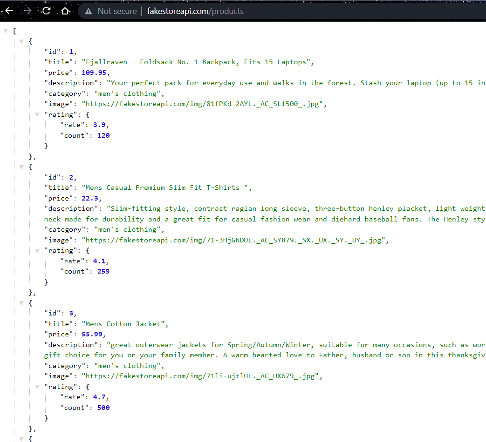
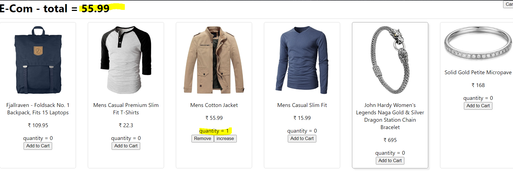

### Create Ecommerce App using react-redux 


> using https://fakestoreapi.com API 


- add to cart button 
- cart page, will have all items, quanity and total price 


#### Reducer 
reducers are functions which take current state and an action and return a 'new state'

#### why do reducers return a new state ?
because redux will pass the reference of the state and if that reference is same then the state update will not be reflected in our components (no rerenders) it check the new return obj reference with prev reference and if they are same, then no rerenders happen

#### Store 
They help to manage state of the entire application 
> State does not mean component state, instead it means data. DATA of the whole application. 

### Basic Flow:
1. Action - object which tells what to do. 
- it contains a key called as type.
- payload is optional 
2. Reducer - Function, which tells how to do. 
- takes 2 parameters: current state and action 
- Based on the type of the action, it will do something and return the new state 
3. store - object which contains state information
- we cannot directly get / set the state information 
```bash 
to set we use, getState()
to get we use, dispatch()
```
4. Component / view - The place where the data is shown 

#### To update data 
action -> reducer -> store 

#### To get data 
get the state directly from the store 

### Installation libraries:
- redux 
- react-redux (provides connect)

### context vs redux
 - context can be a bit complicated and is used for smaller applications, when app becomes huge, we should chose redux for simplicity and code readability

 ### Doubts?
 - why do we need mapDispatchToProps etc 
 - tutorial on it 
 - complete 26,27,01 lecture and keep log of assignments 
 - create a medium article 
 - what is peer dependency 
 - deep copy vs shallow copy 
 - lifecycle methods 
 - axios lec


- complete rest of the lectures 
- level up session lectures 
