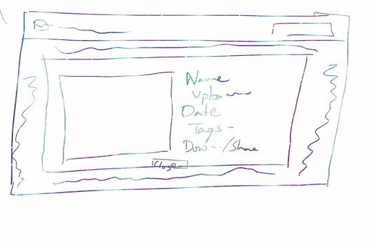
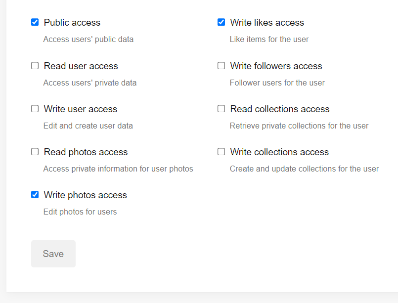
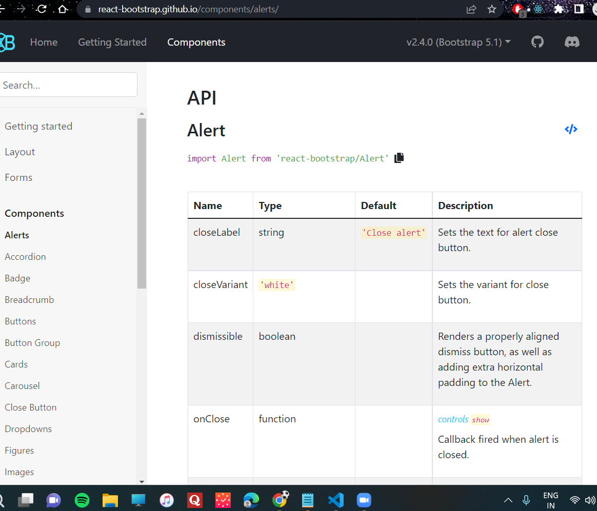

### Image Gallery in React 
### Features:
- When user loads, it should show some images
- We show images in grid format 
- search bar with suggestions if possible 
- search results 
- clicking on any image should open a popup 
- Thatpopup will contain the image in HD, title, uploadded by, tags, date 
- clicking outide of the popup will not close it 
- popup should have a close button 
- blurr in the background when popup is open 
- click on the image should give option to like, share and download. 
- when i like it should show red heart (otherwise transparent)

### Implemented the App in 3 parts
1. Created an image gallery and every time the user clicks on the card, we open a popup 
https://helpful-dasik-3ef1d1.netlify.app/
```bash
folder: 02-06/classcode 
```
2. Created an image gallery and every time the user clicks on the card, we open Details page. Also Note that: we have only added the path parameter whenever the image is clicked on, we havent integrated the feature where when user types something in the search bar those search results render, also we have yet to set the query parameters whenever the entered search result of the user is rendered. 
https://famous-buttercream-781d68.netlify.app/
```bash
folder: 02-06/app1 
```
3. Created an image gallery and every time the user searches something in the input field, changes are made in the query parameter of the main url and everytime user clicks on the card, a details page is opened and changes are made in the path parameter of the main url.
https://stunning-alfajores-c8dbc2.netlify.app/
```bash
folder: 09-06/geekgallery 
```
### Wireframe 
- entire webpage 


- when click on the image, popup pops up 


### Unsplash API 
Unsplash gives API, and you can use their data on your website.

> create an account, it returns these keys
Place this in `.env`
- Access Key 
```bash
G9Y8uhbH5ROeTVqLo8PqNkwuQVjXfN9f-nXaJAXdpvo
```
- Secret Key 
```bash
KLlpIh6BZf6gjinU6rLF4ZzlDdrMnAtW59ExZd6d5eg
```
```bash
IF ANYONE ACCESSES THE KEYS IT CAN CAUSE SECURITY ISSUES, and youll

#some companies assign different API keys for different stages for security issues 
- staging     (testers)
- development (developers)
- production  (production)
```
### Steps to keep app secure 
1. install env-cmd `npm install env-cmd`
2. create a file .env in root folder of your project (just outside src)
```bash
REACT_APP_API_KEY = G9Y8uhbH5ROeTVqLo8PqNkwuQVjXfN9f-nXaJAXdpvo
REACT_APP_API_SECRET = KLlpIh6BZf6gjinU6rLF4ZzlDdrMnAtW59ExZd6d5eg
```
3. In `package.json` add `env-cmd -f .env` in scripts
```bash
  "scripts": {
    "start": "env-cmd -f .env.staging react-scripts start",
    "build": "env-cmd -f .env.production react-scripts build",
    "test": "env-cmd -f .env.staging react-scripts test",
    "eject": "react-scripts eject"
  },
```
or (if you want to keep staging(testing) and production seperate)
2. create a file `.env.staging` and `.env.production` in root folder of your project (just outside src)
3. In `package.json` add `env-cmd -f .env` in scripts
```bash
  "scripts": {
    "start": "env-cmd -f .env production react-scripts start",
    "build": "env-cmd -f .env staging react-scripts build",
    "test": "env-cmd -f .env production react-scripts test",
    "eject": "env-cmd -f .env react-scripts eject"
  },
```

4. you can access your API keys in App.js or anywhere in the app with  `process.env.REACT_APP_API_KEY`
-----
#### next Steps:
1. select these functionalities and save it. 


2. Navigate to https://react-bootstrap.github.io/ and copy this command 
```bash
npm install react-bootstrap bootstrap
```
```bash
When 2 softwares wants to communicate (react-boostrap and our react app), we use API  

To communicate with each other we have API
```


7. import css from here ![https://react-bootstrap.netlify.app/getting-started/introduction/#css] in App.js 
```bash
import 'bootstrap/dist/css/bootstrap.min.css';
```
> App.js 
```bash
import Header from './components/Header';
import 'bootstrap/dist/css/bootstrap.min.css';

function App() {
  console.log(process.env.REACT_APP_API_KEY)

  return (
    <div className="App">
     <Header/>
    </div>
  );
}

export default App;
```

> Header.js 
```bash
import React from 'react'
import {
  Navbar,
  Container,
  Nav,
  NavDropdown,
  Form,
  FormControl,
  Button,
} from 'react-bootstrap'

const Header = () => {
  return (
    <>
      <Navbar bg="light" expand="lg">
        <Container fluid>
          <Navbar.Brand href="#">Navbar scroll</Navbar.Brand>
          <Navbar.Toggle aria-controls="navbarScroll" />
          <Navbar.Collapse id="navbarScroll">
            <Nav
              className="me-auto my-2 my-lg-0"
              style={{ maxHeight: '100px' }}
              navbarScroll>
              <Nav.Link href="#action1">Home</Nav.Link>
              <Nav.Link href="#action2">Link</Nav.Link>
              <NavDropdown title="Link" id="navbarScrollingDropdown">
                <NavDropdown.Item href="#action3">Action</NavDropdown.Item>
                <NavDropdown.Item href="#action4">
                  Another action
                </NavDropdown.Item>
                <NavDropdown.Divider />
                <NavDropdown.Item href="#action5">
                  Something else here
                </NavDropdown.Item>
              </NavDropdown>
              <Nav.Link href="#" disabled>
                Link
              </Nav.Link>
            </Nav>
            <Form className="d-flex">
              <FormControl
                type="search"
                placeholder="Search"
                className="me-2"
                aria-label="Search"
              />
              <Button variant="outline-success">Search</Button>
            </Form>
          </Navbar.Collapse>
        </Container>
      </Navbar>
    </>
  )
}

export default Header
```
> ImageList.js 
```bash
import React from 'react'
import {Container, Row, Col} from 'react-bootstrap'
import ImageCard from './ImageCard'

const ImageList = () => {
#4x3 grid
const arr = [true, true, true, true, true, true, true, true, true, true, true, true, true]
  return (
    #we placed imageCard component inside ImageList 
    <>
      #mt-4 to add margin between navbar and first grid row
      <Container fluid className='mt-4'>
        <Row>
             {arr.map((single_elem, idx) => {
                    return <Col sm={4} key={idx}>
                              <ImageCard/>
                            </Col>
                })}
        </Row>
      </Container>
    </>
  )
}

export default ImageList
```
> ImageCard.js 
```bash
import React from 'react'
import { Card } from 'react-bootstrap'
const ImageCard = () => {
  return (
    <>
      # mb-3 to add margin in between cards 
      <Card className="bg-dark text-white mb-3">
        <Card.Img src="https://images.unsplash.com/photo-1648737154547-b0dfd281c51e?ixlib=rb-1.2.1&ixid=MnwxMjA3fDF8MHxwaG90by1wYWdlfHx8fGVufDB8fHx8&auto=format&fit=crop&w=1470&q=80" alt="Card image" />
        <Card.ImgOverlay>
          <Card.Title>Card title</Card.Title>
          <Card.Text>
            This is a wider card with supporting text below as a natural lead-in
            to additional content. This content is a little bit longer.
          </Card.Text>
          <Card.Text>Last updated 3 mins ago</Card.Text>
        </Card.ImgOverlay>
      </Card>
    </>
  )
}

export default ImageCard
```
#### difference between container and container-fluid 
- container - has a maximum width and it stays in that much width only 
- container-fluid - stretches to the width of the page 

#### Breakpoints 
the point at which we break the previous css and we apply a new css for a new dimension

> So I was having an error (.env-cmd failed)
I fixed by fixing this path fixing package.json scripts 

#### Adding this Modal 
> Static backdrop
When backdrop is set to static, the modal will not close when clicking outside it. Click the button below to try it.

```bash
In pop.js we first pasted everything inside fragments  
and we added the state from this template in app.js 
```
- Popup.js 
```bash
import React from 'react'
import {Modal, Button} from 'react-bootstrap'

const Popup = (props) => {
  #1. first we pasted the modal code inside static-bootstrap 

  #2. we cut the button and state and paste it inside App.js since were handling states over there 

  #3. states are defined in app.js and passed as props to Pop.js 
  return (
    <>
    # show modal or hide modal depends on the props passed 
      <Modal
        show={props.showModal}
        onHide={props.closeModal}
        backdrop="static"
        keyboard={false}
      >
        <Modal.Header closeButton>
          <Modal.Title>Modal title</Modal.Title>
        </Modal.Header>
        <Modal.Body>
          I will not close if you click outside me. Don't even try to press
          escape key.
        </Modal.Body>
        <Modal.Footer>
          <Button variant="secondary" onClick={props.closeModal}>
            Close
          </Button>
          <Button variant="primary">Understood</Button>
        </Modal.Footer>
      </Modal>
    </>
  )
}

export default Popup
```
- App.js 
```bash
import './App.css';
import Header from './components/Header';
import ImageList from './components/ImageList';
import 'bootstrap/dist/css/bootstrap.min.css';
import { useState } from 'react'
import Popup from './components/Popup';
import {Button} from 'react-bootstrap'

# were opening the popup in app.js 
#were closing the popup in popup.js 
function App() {
  console.log(process.env.REACT_APP_API_KEY)

  # all the states will be inside App.js 
  const [showModal, setShowModal] = useState(false);

  const closeModal = () => setShowModal(false);
  const openModal = () => setShowModal(true);

  return (
    <div className="App">
     <Header/>

     # this button is from  static back drop 
     <Button variant="primary" onClick={openModal}>
        Launch static backdrop modal
      </Button>

     <ImageList/>
     # when you click on the button only then it will close, if you click anywhere out in the website it wont work 
     <Popup showModal={showModal} closeModal={closeModal}/>
    </div>
  );
}

export default App;
```

> Vertically centered
You can vertically center a modal by passing the centered prop.
```bash
#we want to add this prop to Popup.js 
centered 
```
- Popup.js 
```bash
import React from 'react'
import {Modal, Button} from 'react-bootstrap'

const Popup = (props) => {
  #1. first we pasted the modal code inside static-bootstrap 

  #2. we cut the button and state and paste it inside App.js since were handling states over there 

  #3. states are defined in app.js and passed as props to Pop.js 
  return (
    <>
    # show modal or hide modal depends on the props passed 
      <Modal
        show={props.showModal}
        onHide={props.closeModal}
        backdrop="static"
        keyboard={false}
        centered 
        #✅we got centered prop from vertically centered 
      >
        <Modal.Header closeButton>
          <Modal.Title>Modal title</Modal.Title>
        </Modal.Header>
        <Modal.Body>
          I will not close if you click outside me. Don't even try to press
          escape key.
        </Modal.Body>
        <Modal.Footer>
          <Button variant="secondary" onClick={props.closeModal}>
            Close
          </Button>
          <Button variant="primary">Understood</Button>
        </Modal.Footer>
      </Modal>
    </>
  )
}

export default Popup
```
> Sizing modals using custom CSS
You can apply custom css to the modal dialog div using the dialogClassName prop. Example is using a custom css class with width set to 90%.
```bash
#we want to add this prop inside Popup.js 
 dialogClassName="modal-90w"
```
- Popup.js 
```bash
import React from 'react'
import {Modal, Button} from 'react-bootstrap'

const Popup = (props) => {
  #1. first we pasted the modal code inside static-bootstrap 

  #2. we cut the button and state and paste it inside App.js since were handling states over there 

  #3. states are defined in app.js and passed as props to Pop.js 
  return (
    <>
    # show modal or hide modal depends on the props passed 
      <Modal
        show={props.showModal}
        onHide={props.closeModal}
        backdrop="static"
        keyboard={false}
        centered 
        dialogClassName="modal-90w"
        #✅We imported this prop from sizing modals using css
      >
        <Modal.Header closeButton>
          <Modal.Title>Modal title</Modal.Title>
        </Modal.Header>
        <Modal.Body>
          #I will not close if you click outside me. Don't even try to press escape key.
        </Modal.Body>
        <Modal.Footer>
          <Button variant="secondary" onClick={props.closeModal}>
            Close
          </Button>
          <Button variant="primary">Understood</Button>
        </Modal.Footer>
      </Modal>
    </>
  )
}

export default Popup
```
were applying custom properties from our `App.css` 
```bash
.modal-90w {
    width: 90% !important;
    max-width: initial !important;
}
```
#### Props send in this order 
```bash
App.js 
  | 
  v
ImageList.js 
  |
  v
ImageCard.js 
```
- App.js 
```bash 
import './App.css';
import Header from './components/Header';
import ImageList from './components/ImageList';
import 'bootstrap/dist/css/bootstrap.min.css';
import { useState } from 'react'
import Popup from './components/Popup';
import {Button} from 'react-bootstrap'

# were opening the popup in app.js 
#were closing the popup in popup.js 
function App() {
  console.log(process.env.REACT_APP_API_KEY)

  # all the states will be inside App.js 
  const [showModal, setShowModal] = useState(false);

  const closeModal = () => setShowModal(false);
  const openModal = () => setShowModal(true);

  return (
    <div className="App">
     <Header/>

     #we commented this 
     # this button is from  static back drop 
     # <Button variant="primary" onClick={openModal}>
        Launch static backdrop modal
      </Button> 

      #✅we added prop over here 
     <ImageList cardClick={openModal}/>
     # when you click on the button only then it will close, if you click anywhere out in the website it wont work 
     <Popup showModal={showModal} closeModal={closeModal}/>
    </div>
  );
}

export default App;
```
- ImageList.js 
```bash
import React from 'react'
import {Container, Row, Col} from 'react-bootstrap'
import ImageCard from './ImageCard'

const ImageList = (props) => {
# 4x3 grid
const arr = [true, true, true, true, true, true, true, true, true, true, true, true, true]
  return (
    # we placed imageCard component inside ImageList 
    <>
    # mt-4 to add margin between navbar and first grid row
      <Container fluid className='mt-4'>
        <Row>
             {arr.map((single_elem, idx) => {
                #xxl -2 (which means 6 columns) -12/2=6
               #xl -3 (which means 4 columns)   -12/3=4
              #lg -4 (which means 3 columns)    -12/4=3
             #sm- 6 (which means 2 columns)      -12/6=2
                    return <Col sm={6} xxl={2} xl={3} lg={4} key={idx}>
                              <ImageCard click={props.cardClick}/>
                                #✅we retreived prop from App.js  
                            </Col>
                })}
        </Row>
      </Container>
    </>
  )
}

export default ImageList
```
- ImageCard.js 
```bash
import React from 'react'
import { Card } from 'react-bootstrap'
const ImageCard = (props) => {
  return (
    <>
      # mb-3 to add margin in between cards 
      <Card className="bg-dark text-white mb-3" onClick={props.click}>
      #✅we retreived props from ImageList.js  
      #when user clicks on the button its retreived
        <Card.Img src="https://images.unsplash.com/photo-1648737154547-b0dfd281c51e?ixlib=rb-1.2.1&ixid=MnwxMjA3fDF8MHxwaG90by1wYWdlfHx8fGVufDB8fHx8&auto=format&fit=crop&w=1470&q=80" alt="Card image" />
        <Card.ImgOverlay>
          <Card.Title>Card title</Card.Title>
          <Card.Text>
            This is a wider card with supporting text below as a natural lead-in
            to additional content. This content is a little bit longer.
          </Card.Text>
          <Card.Text>Last updated 3 mins ago</Card.Text>
        </Card.ImgOverlay>
      </Card>
    </>
  )
}

export default ImageCard
```
#### Integrate Axios 
```bash 
npm install axios 
```
> App.js 
```bash
import './App.css';
import Header from './components/Header';
import ImageList from './components/ImageList';
import 'bootstrap/dist/css/bootstrap.min.css';
import { useEffect, useState } from 'react'
import Popup from './components/Popup';
import {Button} from 'react-bootstrap'
import axios from 'axios'

# were opening the popup in app.js 
#were closing the popup in popup.js 
function App() {
  console.log(process.env.REACT_APP_API_KEY)

  # all the states will be inside App.js 
  const [showModal, setShowModal] = useState(false);

  const closeModal = () => setShowModal(false);
  const openModal = () => setShowModal(true);

  const [imageList, setImageList] = useState([])

  # https://api.unsplash.com/photos/?client_id=YOUR_ACCESS_KEY

  #https://api.unsplash.com/photos/?client_id=${process.env.REACT_APP_API_KEY}
  useEffect(() => {
    axios.get(`https://api.unsplash.com/photos/?client_id=${process.env.REACT_APP_API_KEY}`)
    .then(response => setImageList(response.data))
  })

  return (
    <div className="App">
     <Header/>

     # this button is from  static back drop 
     # <Button variant="primary" onClick={openModal}>
        Launch static backdrop modal
      </Button> 

     <ImageList cardClick={openModal}
                images={imageList}   />
                #we added images prop here 
     # when you click on the button only then it will close, if you click anywhere out in the website it wont work 
     <Popup showModal={showModal} closeModal={closeModal}/>
    </div>
  );
}

export default App;

```
> ImageList.js 
```bash
import React from 'react'
import {Container, Row, Col} from 'react-bootstrap'
import ImageCard from './ImageCard'

const ImageList = (props) => {
# 4x3 grid
const arr = [true, true, true, true, true, true, true, true, true, true, true, true, true]
  return (
    # we placed imageCard component inside ImageList 
    <>
    # mt-4 to add margin between navbar and first grid row
      <Container fluid className='mt-4'>
        <Row>
             {props.images.map((single_elem, idx) => {
                #xxl -2 (which means 6 columns) -12/2=6
               #xl -3 (which means 4 columns)   -12/3=4
              #lg -4 (which means 3 columns)    -12/4=3
             #sm- 6 (which means 2 columns)      -12/6=2
                    return <Col sm={6} xxl={2} xl={3} lg={4} key={idx}>
                              <ImageCard click={props.cardClick}/>
                            </Col>
                })}
        </Row>
      </Container>
    </>
  )
}

export default ImageList

```
### masonry (Cascading grid Layout library)
Masonry works by placing elements in optimal position based on available vertical space, sort of like a mason fitting stones in a wall. You’ve probably seen it in use all over the Internet.

- We want the grid to be alligned so were installing another package called masonry 
```bash
npm install masonry-layout --save
#this didnt work so we use masonry-react-css instead 
```
> install react-masonry-css 
```bash
npm install react-masonry-css
```
#### Implementing masonry 
> App.css
```bash
.modal-90w {
    width: 90% !important;
    max-width: initial !important;
}

.my-masonry-grid {
    display: -webkit-box;
    display: -ms-flexbox;
    display: flex;
    margin-left: -30px;
    width: auto;
  }
  .my-masonry-grid_column {
    padding-left: 30px;
    background-clip: padding-box;
  }
  
  .my-masonry-grid_column > div {
    background: yellow;
    margin-bottom: 30px;
  }
```
> ImageList.js 
```bash
import { Container, Row, Col } from 'react-bootstrap';
import ImageCard from './ImageCard';
#we imported masonry to allign our grid properly 
import Masonry from "react-masonry-css";
#there are a certain steps to implement masonry 
#this article explains it all 
#https://thewebdev.info/2020/09/04/add-a-masonry-grid-to-a-react-app-with-the-react-masonry-css-library/


#1. we installed it: npm install react-masonry-css
#2. we added masonry-styles inside App.css
#3. import this object 
#4. define everything inside <Masonry></Masonry> tag
const breakpointColumnsObj = {
  default: 4,
  1100: 3,
  700: 2,
  500: 1
};

const ImageList = (props) => {
  #retreived props from App.js 
  return (
    <div style={{marginLeft: '20%'}}>
      <Container className='mt-4'>
        <Row>
          <Masonry
            breakpointCols={breakpointColumnsObj}
            className="my-masonry-grid"
            columnClassName="my-masonry-grid_column">
              # were mapping over every image inside imageList state and were returning onClick function as a prop further to ImageCard.js -> You see how were implementing prop drilling over here 
              
              were also sending the single image that is extracted from imageList state as a prop to ImageCard.js
            {props.images.map((single_image, idx) => {
              return <Col key={idx}>
                  <ImageCard 
                     click={props.cardClick} 
                     image_details={single_image} />

                     </Col>
            })}

            # Note that:
            before we added Masonry which lowkey fixes the image grid styling for us, we were using these 12 based gridding system and setting the number of images for every screen size, for example 

            when screen size is xxl, we want to render 6 image columns on the page 
            when screen size is xl, we want to render 4 image columns on the screen 
            
             {props.images.map((single_image, idx) => {
                #xxl-2 (which means 6 columns) -12/2=6
               #xl -3 (which means 4 columns)   -12/3=4
              #lg -4 (which means 3 columns)    -12/4=3
             #sm- 6 (which means 2 columns)     -12/6=2

                    return <Col sm={6} xxl={2} xl={3} lg={4} key={idx}>
                    # to integrate masonry breakpoints we need to remove   sm={6} xxl={2} xl={3} lg={4} , since masonry already has its default breakpoints
                 <ImageCard click={props.cardClick}
                                         imagedetails={single_image} />
                            </Col>
                })}
   
            
          </Masonry>
        </Row>
      </Container>
    </div>
  )
}

export default ImageList
```
#### Whenver user clicks on the image, a popup shows up with all the content properties of that image 
> App.js 
```bash
import Header from "./components/Header";
import ImageList from "./components/ImageList";
import Popup from "./components/Popup";
import 'bootstrap/dist/css/bootstrap.min.css';
import {useEffect, useState} from 'react';
import './App.css';
import axios from 'axios';

function App() {
  #All the states will be in App.JS

  #state which is responsible for setting the display of the popup 
  #if its false, it means popup is hidden 
  #if its true, it means popup shows up over your main website 
  const [showModal, setShowModal] = useState(false);

  #state which is responsible for storing an array of images which is fetched from unsplash API 
  const [imageList, setImageList] = useState([]);

  #state which is responsible for setting the data inside the popup 
  const [modalData, setModalData] = useState({});

  #state which logs in the data from the search bar that the user types
  const [searchKey, setSearchKey] = useState("");

  #when searchKey has any changes in it, this useEffect which takes searckey as a dependency is called 
  #inside this were making a call to the API endpoint to fetch the JSON data and update the imageList state with that data 
   useEffect(() => {
    if(searchKey !== "") {
      axios.get(`https://api.unsplash.com/search/photos/?query=${searchKey}&per_page=20&client_id=${process.env.REACT_APP_API_KEY}`)
      .then(response => setImageList(response.data.results));
    }
  }, [searchKey])

  #when closeModal is triggered this state which is responsible for displaying the popup on the website it switched to false 
  const closeModal = () => setShowModal(false);

  #when openModal is triggered 
  #the state which is responsible for displaying popup on the website is set to true 
  #the image inside the popup is updated to match the image of the image we clicked
  #how do we acheive that? 
  #well, there are a couple ways, 
  const openModal = id => {
    #we can make an API call to fetch the id of the image that we want to show up inside the popup 
    #axios.get(`https://api.unsplash.com/photos/${id}?client_id=${process.env.REACT_APP_API_KEY}`)
    # .then(response => setImageList(response.data))

    #or we can fetch the data based on this given condition
    #when the id that is passed matches the id present inside imageList then display it 
    const selected_image = imageList.find(single_elem => single_elem.id === id);
    setModalData(selected_image);
    setShowModal(true); 
  }

  #when the app is mounted for the first time an API call is made to fetch the images and update the state that is responsible for storing all the images fetched inside the state
  useEffect(() => {
    axios.get(`https://api.unsplash.com/photos/?per_page=20&client_id=${process.env.REACT_APP_API_KEY}`)
    .then(response => setImageList(response.data));
  }, []);

  return (
    <>
    # were passing these states as props 
      <Header setSearchKey={setSearchKey} />

      # when an image is clicked, openModal is invoked, which is responsible for setting the popup display to true and setting the image same as the image it was clicked on 
      <ImageList cardClick={openModal} images={imageList} />

      # when Popup is clicked closeModal is invoked, since within popup we'll have a button which is responsible for setting the popup display to false 
      <Popup showModal={showModal} closeModal={closeModal} modalData={modalData} />

    </>
  );
}

# app.js (parent)
# header.js (child)
# ImageList.js (child)
# Popup.js (child)

export default App;
```
> ImageList.js  
```bash
import { Container, Row, Col } from 'react-bootstrap';
import ImageCard from './ImageCard';
#we imported masonry to allign our grid properly 
import Masonry from "react-masonry-css";
#there are a certain steps to implement masonry 
#this article explains it all 
#https://thewebdev.info/2020/09/04/add-a-masonry-grid-to-a-react-app-with-the-react-masonry-css-library/


#1. we installed it: npm install react-masonry-css
#2. we added masonry-styles inside App.css
#3. import this object 
#4. define everything inside <Masonry></Masonry> tag
const breakpointColumnsObj = {
  default: 4,
  1100: 3,
  700: 2,
  500: 1
};

const ImageList = (props) => {
  #retreived props from App.js 
  return (
    <div style={{marginLeft: '20%'}}>
      <Container className='mt-4'>
        <Row>
          <Masonry
            breakpointCols={breakpointColumnsObj}
            className="my-masonry-grid"
            columnClassName="my-masonry-grid_column">
              # were mapping over every image inside imageList state and were returning onClick function as a prop further to ImageCard.js -> You see how were implementing prop drilling over here 
              
              were also sending the single image that is extracted from imageList state as a prop to ImageCard.js
            {props.images.map((single_image, idx) => {
              return <Col key={idx}>
                  <ImageCard 
                     click={props.cardClick} 
                     image_details={single_image} />

                     </Col>
            })}

            # Note that:
            before we added Masonry which lowkey fixes the image grid styling for us, we were using these 12 based gridding system and setting the number of images for every screen size, for example 

            when screen size is xxl, we want to render 6 image columns on the page 
            when screen size is xl, we want to render 4 image columns on the screen 
            
             {props.images.map((single_image, idx) => {
                #xxl-2 (which means 6 columns) -12/2=6
               #xl -3 (which means 4 columns)   -12/3=4
              #lg -4 (which means 3 columns)    -12/4=3
             #sm- 6 (which means 2 columns)     -12/6=2

                    return <Col sm={6} xxl={2} xl={3} lg={4} key={idx}>
                    # to integrate masonry breakpoints we need to remove   sm={6} xxl={2} xl={3} lg={4} , since masonry already has its default breakpoints
                 <ImageCard click={props.cardClick}
                                         imagedetails={single_image} />
                            </Col>
                })}
   
            
          </Masonry>
        </Row>
      </Container>
    </div>
  )
}

export default ImageList
```
> ImageCard.js 
```bash
import React from 'react'
import {Card} from 'react-bootstrap'


const ImageCard = (props) => {
# props send from imageCard as click(contains openModal function)and image_details(retreiving every image from the state imageList)

#when user clicks on an image, openModal function is called, image id of the image clicked is fetched and that id is passed as an argument 
  const click = () => {
    props.click(props.image_details.id);
  }

  return (
    <>
    # when card is clicked click function is called 
      <Card className="bg-dark text-white mb-4" onClick={click}
        style={{cursor: "pointer"}}>
        # inside the card all of this is rendered  
        <Card.Img src={props.image_details.urls.thumb} alt="Card image"  />
        <Card.ImgOverlay>
          <Card.Title>{props.image_details.user.name}</Card.Title>
          <Card.Text>{props.image_details.description}</Card.Text>
          <Card.Text>{props.image_details.created_at}</Card.Text>
        </Card.ImgOverlay>
      </Card>
    </>
  )
}

export default ImageCard
```
> Popup.js 
```bash 
import React from 'react'
import {Modal, Button, Container, Col, Row} from 'react-bootstrap';

const Popup = (props) => {
    #props send from App.js 
    #showModal (state which signifies whether the popup should be displayed or not), closeModal(set the showModal state to false), modalData (state which is responsible for setting data inside the popup)
  return (
    <>
      <Modal
        #show the popup based on showModal state, true or false?
        show={props.showModal}
        #close the popup 
        onHide={props.closeModal}
        backdrop="static"
        keyboard={false}
        centered
        dialogClassName="modal-60w"
        style={{backgroundColor: `${props.modalData?.color}77`}}>

        <Modal.Body>
          <Container>
            <Row>
            # the link of the image is passed inside src 
              <Col md={6}>
              
              </Col>
              <Col md={6}>
                # all the user data is rendered on the rhs of the popup 
                <h3>Uploaded By: {props.modalData?.user?.name} (@{props.modalData?.user?.id})</h3>
                <h4>Upload Date: {props.modalData?.created_at}</h4>
                <hr />
                # when there is something inside the description object render it else dont render anything 
                {props.modalData?.description ? (
                  <>
                  <h5>Description:</h5>
                  <h6>{props.modalData?.description}</h6>
                  <hr />
                  </>
                ) : false}
                <h6>Width: {props.modalData?.width}</h6>
                <h6>Height: {props.modalData?.height}</h6>
              </Col>
            </Row>
          </Container>
        </Modal.Body>
        <Modal.Footer>
        # when close button is clicked closeModal is invoked which sets the showModal state to false
          <Button variant="secondary" onClick={props.closeModal}>
            Close
          </Button>
          # When download button is clicked,
          all sub objects from modalData is called, to set the styling for the download button 
          
          href is basically the sub object of modalData, it contains the download link -> takes the user to a new page with the image reference, so if the user wants to download it, she can right click and save image
          <Button variant="primary" 
                  style={{backgroundColor: props.modalData?.color, borderColor: props.modalData?.color}} href={props.modalData?.links?.download} target="_blank">Download</Button>
        </Modal.Footer>
      </Modal>
    </>
  )
}

export default Popup
```
### Integrating react-router and infinite scroll
We want to integrate a functionality, when user clicks on an image it redirects them to a new page, using react router, also we implemented infinite scrolling through react-infinite-scroll, and when the user clicks on the website logo they are redirected to the homepage via Link. 

> installing react-router and react-infinite-scroll
```bash
npm i react-router-dom
npm i react-infinite-scroll
```
#### The code:
- Integrate app inside browserRouter component 
> index.js 
```bash
import React from 'react';
import ReactDOM from 'react-dom/client';
import './index.css';
import App from './App';
import reportWebVitals from './reportWebVitals';
import { BrowserRouter } from 'react-router-dom';

const root = ReactDOM.createRoot(document.getElementById('root'));
root.render(
  <React.StrictMode>
    <BrowserRouter>
      <App/>
    </BrowserRouter>
  </React.StrictMode>
);


reportWebVitals();
```
> App.js
```bash
import Header from "./components/Header";
import ImageList from "./components/ImageList";
import Popup from "./components/Popup";
import 'bootstrap/dist/css/bootstrap.min.css';
import {useEffect, useState} from 'react';
import './App.css';
import axios from 'axios';

import Detail from './components/Detail'
import Footer from './components/Footer'
import { Routes, Route } from 'react-router-dom';
import InfiniteScroll from 'react-infinite-scroller';

# were opening the popup in app.js 
#were closing the popup in popup.js 
function App() {
  console.log(process.env.REACT_APP_API_KEY)
  #All the states will be in App.JS

  ✅#commenting this state 
  #state which is responsible for setting the display of the popup 
  #if its false, it means popup is hidden 
  #if its true, it means popup shows up over your main website 
  #const [showModal, setShowModal] = useState(false);

  #state which is responsible for storing an array of images which is fetched from unsplash API 
  const [imageList, setImageList] = useState([]);

  ✅#commenting this state 
  #state which is responsible for setting the data inside the popup 
  #const [modalData, setModalData] = useState({});

  #state which logs in the data from the search bar that the user types
  const [searchKey, setSearchKey] = useState("");

  #when searchKey has any changes in it, this useEffect which takes searckey as a dependency is called 
  #inside this were making a call to the API endpoint to fetch the JSON data and update the imageList state with that data 
   useEffect(() => {
    if(searchKey !== "") {
      axios.get(`https://api.unsplash.com/search/photos/?query=${searchKey}&per_page=20&client_id=${process.env.REACT_APP_API_KEY}`)
      .then(response => setImageList(response.data.results));
    }
  }, [searchKey])

  ✅#since were not implementing the popup anymore, we commented these two functions
  #const closeModal = () => setShowModal(false);

  # const openModal = id => {
  #   const selected_image = imageList.find(single_elem => single_elem.id === id);
  #   setModalData(selected_image);
  #   setShowModal(true); 
  # }

  ✅#were commenting this useEffect since well be implementing infinite scroll using react-infinite-scroll

  #when the app is mounted for the first time an API call is made to fetch the images and update the state that is responsible for storing all the images fetched inside the state
  #note that: it only updates to about 20 images 
  # useEffect(() => {
  #   axios.get(`https://api.unsplash.com/photos/?per_page=20&client_id=${process.env.REACT_APP_API_KEY}`)
  #   .then(response => setImageList(response.data));
  # }, []);

  ✅#instead of the above function. we want to implement a functionality which takes the old array and everytime new data is added we want to add the new response.data below it
  # we got the page object from usplash documentation which sets the page number to infinite everytime the page loads 
  const loadFunc = (e) => {
    console.log(e);
    axios.get(`https://api.unsplash.com/photos/?page=${e}&per_page=20&client_id=${process.env.REACT_APP_API_KEY}`)
      .then(response => setImageList(old => [...old, ...response.data]));
  }

  return (
    <>
      # were passing these states as props 
      <Header setSearchKey={setSearchKey} />

      #✅we added this for infinite scroll
      <InfiniteScroll
        pageStart={0}
        loadMore={loadFunc}
        hasMore={true || false}
        loader={<div className="loader" key={0}>Loading ...</div>}>
        <Routes>
          # when user is on the home path, render the ImageList component and pass imageList as a prop to it 
          <Route path="/" element={<ImageList images={imageList} />} />
          # this is a query parameter 
          <Route path="/image/:id" element={<Detail />} />
        </Routes>
      </InfiniteScroll>

      ✅# we commented this out as well 
      # <ImageList cardClick={openModal} images={imageList} /> 

      ✅# Commenting out the Popup.js since we dont want the popup to be displayed when we click on the image 
      # <Popup showModal={showModal} closeModal={closeModal} modalData={modalData} /> 
      <Footer />
    </>
  );
}

# app.js (parent)
# header.js (child)
# ImageList.js (child)
# Popup.js (child)

export default App;
```
> ImageList.js (no changes in this component)
```bash
import { Container, Row, Col } from 'react-bootstrap';
import ImageCard from './ImageCard';
#we imported masonry to allign our grid properly 
import Masonry from "react-masonry-css";
#there are a certain steps to implement masonry 
#this article explains it all 
#https://thewebdev.info/2020/09/04/add-a-masonry-grid-to-a-react-app-with-the-react-masonry-css-library/


#1. we installed it: npm install react-masonry-css
#2. we added masonry-styles inside App.css
#3. import this object 
#4. define everything inside <Masonry></Masonry> tag
const breakpointColumnsObj = {
  default: 4,
  1100: 3,
  700: 2,
  500: 1
};

const ImageList = (props) => {
  #retreived props from App.js 
  return (
    <div style={{marginLeft: '20%'}}>
      <Container className='mt-4'>
        <Row>
          <Masonry
            breakpointCols={breakpointColumnsObj}
            className="my-masonry-grid"
            columnClassName="my-masonry-grid_column"
          >
              # were mapping over every image inside imageList state and were returning onClick function as a prop further to ImageCard.js -> You see how were implementing prop drilling over here 
              
              were also sending the single image that is extracted from imageList state as a prop to ImageCard.js
            {props.images.map((single_image, idx) => {
              return <Col key={idx}>
                  <ImageCard 
                     click={props.cardClick} 
                     image_details={single_image} />

                     </Col>
            })}

            # Note that:
            before we added Masonry which lowkey fixes the image grid styling for us, we were using these 12 based gridding system and setting the number of images for every screen size, for example 

            when screen size is xxl, we want to render 6 image columns on the page 
            when screen size is xl, we want to render 4 image columns on the screen 
            
             {props.images.map((single_image, idx) => {
                #xxl-2 (which means 6 columns) -12/2=6
               #xl -3 (which means 4 columns)   -12/3=4
              #lg -4 (which means 3 columns)    -12/4=3
             #sm- 6 (which means 2 columns)     -12/6=2

                    return <Col sm={6} xxl={2} xl={3} lg={4} key={idx}>
                    # to integrate masonry breakpoints we need to remove   sm={6} xxl={2} xl={3} lg={4} , since masonry already has its default breakpoints
                 <ImageCard click={props.cardClick}
                                         imagedetails={single_image} />
                            </Col>
                })}
   
            
          </Masonry>
        </Row>
      </Container>
    </div>
  )
}

export default ImageList
```
> ImageCard.js 
```bash
import React from 'react'
import {Card} from 'react-bootstrap'
import { useNavigate } from 'react-router-dom'

const ImageCard = (props) => {
  # props send from imageCard as click(contains openModal function)and image_details(retreiving every image from the state imageList)
  console.log(props.imagedetails)

✅#we created a Navigate object over here 
const navigate = useNavigate();

✅#when user clicks on an image, openModal function is called, image id of the image clicked is fetched and that id is passed as an argument 
  const click = () => {
    # props.click(props.image_details.id);

    #we commented the top line, since onClick it would call the onClick function, but we want to acheive a scenario where on click of the image we want it to be redirected to localhost:3000/image/id

    # note that: in App.js we set set the path: /image/id mapped to the component it should redirect to and i.e Detail.js 
    navigate(`/image/${props.image_details.id}`);
  }

  return (
    <>
      ✅# when card is clicked click function is called 
      <Card className="bg-dark text-white mb-4" onClick={click}
        style={{cursor: "pointer"}}>
        # inside the card all of this is rendered  
        <Card.Img src={props.image_details.urls.thumb} alt="Card image"  />
        <Card.ImgOverlay>
          <Card.Title>{props.image_details.user.name}</Card.Title>
          <Card.Text>{props.image_details.description}</Card.Text>
          <Card.Text>{props.image_details.created_at}</Card.Text>
        </Card.ImgOverlay>
      </Card>
    </>
  )
}

export default ImageCard
```
> Header.js 
```bash
import React, {useRef} from 'react'
import {
  Navbar,
  Container,
  Nav,
  NavDropdown,
  Form,
  FormControl,
  Button,
} from 'react-bootstrap'

✅#we imported these 2 components here 
import { Link } from 'react-router-dom';
import { useNavigate } from 'react-router-dom';

#ref allows to 
#when you want to pass ref to a component, then pass a ref inside it and it will forward to the actual red component 
const Header = (props) => {
  const inputRef = useRef()
  const navigate = useNavigate();

  # when user types something in the search bar this function is invoked 
  const formSubmitted = (e) => {
    console.log(e)
    e.preventDefault()
    # e.target.value is input change event 
    # tbis e is a form submit event 
    console.log(inputRef.current.value)

    props.setSearchKey(inputRef.current.value)
    ✅#whenever user clicks on the input field, we want to redirect them to the home page
    navigate("/");
  }
  return (
    <>
      <Navbar bg="light" expand="lg">
        <Container fluid>
          # go to home page when click on Navbar Scroll 
          # <Navbar.Brand href="./">Navbar scroll</Navbar.Brand> 

          ✅# implementing it in react-router 
          <Navbar.Brand ><Link to="/" style={{textDecoration: "none", color: "black"}}>GeekGallery</Link></Navbar.Brand>
       
          <Navbar.Toggle aria-controls="navbarScroll" />
          <Navbar.Collapse id="navbarScroll">
            <Nav
              className="me-auto my-2 my-lg-0"
              style={{ maxHeight: '100px' }}
              navbarScroll
            >
              <Nav.Link href="#action1">Home</Nav.Link>
              <Nav.Link href="#action2">Link</Nav.Link>
              <NavDropdown title="Link" id="navbarScrollingDropdown">
                <NavDropdown.Item href="#action3">Action</NavDropdown.Item>
                <NavDropdown.Item href="#action4">
                  Another action
                </NavDropdown.Item>
                <NavDropdown.Divider />
                <NavDropdown.Item href="#action5">
                  Something else here
                </NavDropdown.Item>
              </NavDropdown>
              <Nav.Link href="#" disabled>
                Link
              </Nav.Link>
            </Nav>
            <Form className="d-flex" onClick={formSubmitted} action='#'>
              <FormControl
                type="search"
                placeholder="Search"
                className="me-2"
                aria-label="Search"
                name="search"
                ref={inputRef}
              />
              <Button variant="outline-success">Search</Button>
            </Form>
          </Navbar.Collapse>
        </Container>
      </Navbar>
    </>
  )
}

export default Header
```
> Detail.js 
```bash
import React, { useEffect, useState } from 'react'
import { Container, Row, Col, Button } from 'react-bootstrap'
import { useParams } from 'react-router-dom'
import axios from 'axios'
✅# when user is on /image/id they get redirected to Detail component 
const Detail = () => {
  ✅# useParams state used to set the state for query parameters 
  const params = useParams();
  const [imageData, setImageData] = useState({});
  
  ✅#whenever params state is manipulated this useEffect is called
  useEffect(() =>{
    #Fetch the Detail and save in state
    axios.get(`https://api.unsplash.com/photos/${params.id}?per_page=20&client_id=${process.env.REACT_APP_API_KEY}`)
    .then(response => setImageData(response.data));
  }, [params])
  
  return (
    <>
    ✅# if there is something available in imageData display it, else display loading...
    
    #until the data is not fetched from unsplash API, it will display loading, infact you can even test this out by throttling the network 
      {imageData.id ? (
      <Container fluid style={{backgroundColor: `${imageData?.color}35`}} className="p-5">
        <Row>
          <Col md={6}>
            
          </Col>
          <Col md={6}>
            <h3>Uploaded By: {imageData?.user?.name} (@{imageData?.user?.id})</h3>
            <h4>Upload Date: {imageData?.created_at}</h4>
            <hr />
            {imageData?.description ? (
              <>
                <h5>Description:</h5>
                <h6>{imageData?.description}</h6>
                <hr />
              </>
            ) : false}
            <h6>Width: {imageData?.width}</h6>
            <h6>Height: {imageData?.height}</h6>
            <br />
            <hr />
            <Button variant="primary" style={{backgroundColor: imageData?.color, borderColor: imageData?.color}} href={imageData?.links?.download} target="_blank">Download</Button>
          </Col>
        </Row>
      </Container>
      ) : <h4>Loading...</h4>}
    </>
  )
}

export default Detail
```
#### The final deployed Link


