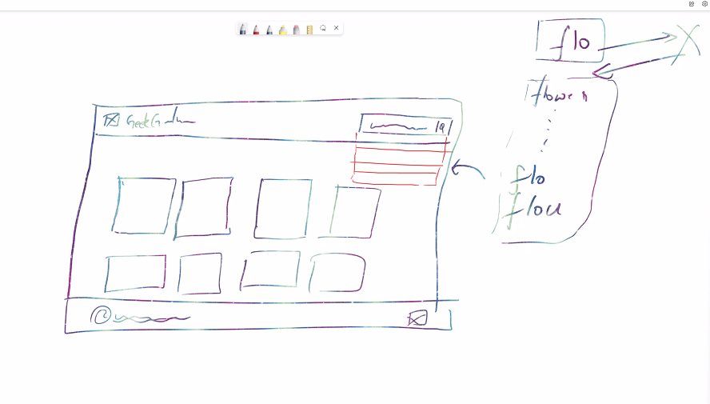

### Image Gallery in React 
### Features:
- When user loads, it should show some images
- We show images in grid format 
- search bar with suggestions if possible 
- search results 
- clicking on any image should open a popup 
- Thatpopup will contain the image in HD, title, uploadded by, tags, date 
- clicking outide of the popup will not close it 
- popup should have a close button 
- blurr in the background when popup is open 
- click on the image should give option to like, share and download. 
- when i like it should show red heart (otherwise transparent)

### Wireframe 
- entire webpage 


- when click on the image 


### Unsplash 
Unsplash gives API, and you can use their data on your website.

> create an account, it returns these keys
Place this in `.env`
- Access Key 
```bash
G9Y8uhbH5ROeTVqLo8PqNkwuQVjXfN9f-nXaJAXdpvo
```
- Secret Key 
```bash
KLlpIh6BZf6gjinU6rLF4ZzlDdrMnAtW59ExZd6d5eg
```
```bash
IF ANYONE ACCESSES THE KEYS IT CAN CAUSE SECURITY ISSUES, and youll

#some companies assign different API keys for different stages for security issues 
- staging     (testers)
- development (developers)
- production  (production)
```

### Steps to keep app secure 
1. install env-cmd `npm install env-cmd`
2. create a file .env in root folder of your project (just outside src)
```bash
REACT_APP_API_KEY = G9Y8uhbH5ROeTVqLo8PqNkwuQVjXfN9f-nXaJAXdpvo
REACT_APP_API_SECRET = KLlpIh6BZf6gjinU6rLF4ZzlDdrMnAtW59ExZd6d5eg
```
3. In package.json add `env-cmd -f .env` in scripts
```bash
  "scripts": {
    "start": "env-cmd -f .env react-scripts start",
    "build": "env-cmd -f .env react-scripts build",
    "test": "env-cmd -f .env react-scripts test",
    "eject": "env-cmd -f .env react-scripts eject"
  },
```
or (if you want to keep staging(testing) and production seperate)
2. create a file .env.staging and .env.production in root folder of your project (just outside src)
3. In package.json add `env-cmd -f .env` in scripts
```bash
  "scripts": {
    "start": "env-cmd -f .env production react-scripts start",
    "build": "env-cmd -f .env staging react-scripts build",
    "test": "env-cmd -f .env production react-scripts test",
    "eject": "env-cmd -f .env react-scripts eject"
  },
```

4. When you want to use it `process.env.<environmentname>` in our case its `process.env.REACT_APP_API_KEY`

5. select these functionalities and save it. 


6. Navigate to https://react-bootstrap.github.io/ and copy this command 
```bash
npm install react-bootstrap bootstrap
```
```bash
When 2 softwares wants to communicatee (react-boostrap and our react app), we use API  

To communicate with each other we have API
```


7. import css from here ![https://react-bootstrap.netlify.app/getting-started/introduction/#css] in App.js 
```bash
import 'bootstrap/dist/css/bootstrap.min.css';
```
> App.js 
```bash
import Header from './components/Header';
import 'bootstrap/dist/css/bootstrap.min.css';

function App() {
  console.log(process.env.REACT_APP_API_KEY)

  return (
    <div className="App">
     <Header/>
    </div>
  );
}

export default App;
```

> Header.js 
```bash
import React from 'react'
import {
  Navbar,
  Container,
  Nav,
  NavDropdown,
  Form,
  FormControl,
  Button,
} from 'react-bootstrap'

const Header = () => {
  return (
    <>
      <Navbar bg="light" expand="lg">
        <Container fluid>
          <Navbar.Brand href="#">Navbar scroll</Navbar.Brand>
          <Navbar.Toggle aria-controls="navbarScroll" />
          <Navbar.Collapse id="navbarScroll">
            <Nav
              className="me-auto my-2 my-lg-0"
              style={{ maxHeight: '100px' }}
              navbarScroll>
              <Nav.Link href="#action1">Home</Nav.Link>
              <Nav.Link href="#action2">Link</Nav.Link>
              <NavDropdown title="Link" id="navbarScrollingDropdown">
                <NavDropdown.Item href="#action3">Action</NavDropdown.Item>
                <NavDropdown.Item href="#action4">
                  Another action
                </NavDropdown.Item>
                <NavDropdown.Divider />
                <NavDropdown.Item href="#action5">
                  Something else here
                </NavDropdown.Item>
              </NavDropdown>
              <Nav.Link href="#" disabled>
                Link
              </Nav.Link>
            </Nav>
            <Form className="d-flex">
              <FormControl
                type="search"
                placeholder="Search"
                className="me-2"
                aria-label="Search"
              />
              <Button variant="outline-success">Search</Button>
            </Form>
          </Navbar.Collapse>
        </Container>
      </Navbar>
    </>
  )
}

export default Header
```
> ImageList.js 
```bash
import React from 'react'
import {Container, Row, Col} from 'react-bootstrap'
import ImageCard from './ImageCard'

const ImageList = () => {
#4x3 grid
const arr = [true, true, true, true, true, true, true, true, true, true, true, true, true]
  return (
    #we placed imageCard component inside ImageList 
    <>
      #mt-4 to add margin between navbar and first grid row
      <Container fluid className='mt-4'>
        <Row>
             {arr.map((single_elem, idx) => {
                    return <Col sm={4} key={idx}>
                              <ImageCard/>
                            </Col>
                })}
        </Row>
      </Container>
    </>
  )
}

export default ImageList
```
> ImageCard.js 
```bash
import React from 'react'
import { Card } from 'react-bootstrap'
const ImageCard = () => {
  return (
    <>
      # mb-3 to add margin in between cards 
      <Card className="bg-dark text-white mb-3">
        <Card.Img src="https://images.unsplash.com/photo-1648737154547-b0dfd281c51e?ixlib=rb-1.2.1&ixid=MnwxMjA3fDF8MHxwaG90by1wYWdlfHx8fGVufDB8fHx8&auto=format&fit=crop&w=1470&q=80" alt="Card image" />
        <Card.ImgOverlay>
          <Card.Title>Card title</Card.Title>
          <Card.Text>
            This is a wider card with supporting text below as a natural lead-in
            to additional content. This content is a little bit longer.
          </Card.Text>
          <Card.Text>Last updated 3 mins ago</Card.Text>
        </Card.ImgOverlay>
      </Card>
    </>
  )
}

export default ImageCard
```
#### difference between container and container-fluid 
```bash
container - has a maximum width and it stays in that much width only 

container-fluid - stretches to the width of the page 
```