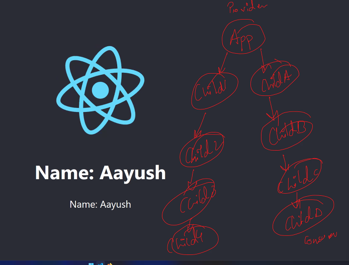
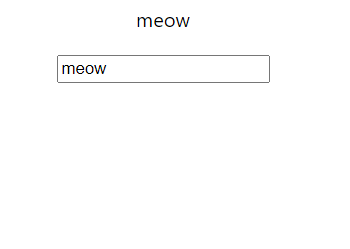
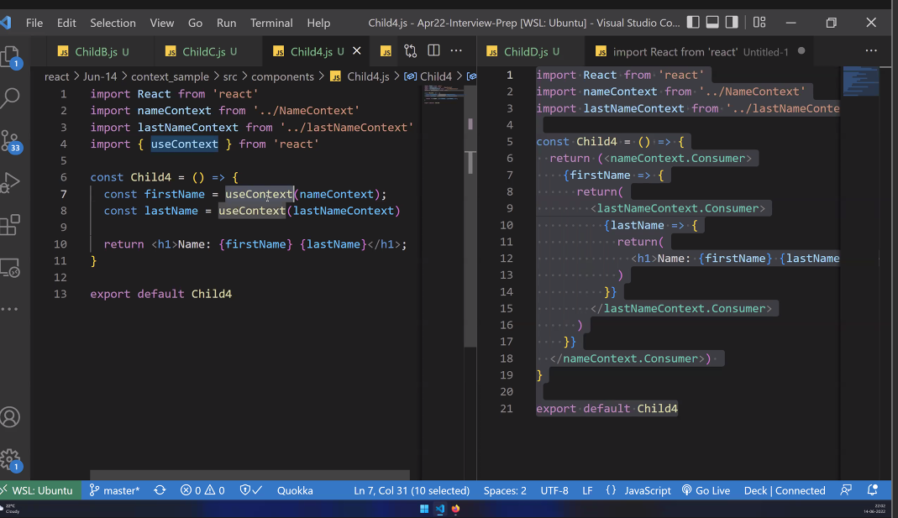
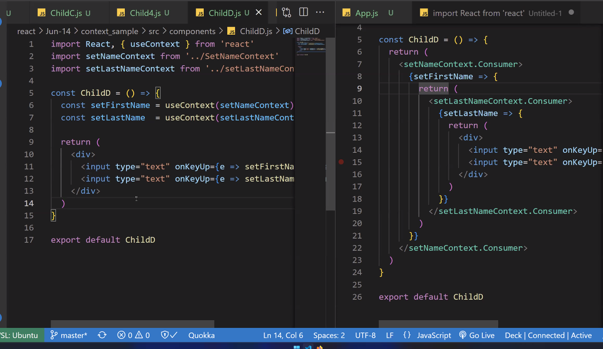

### Problems with prop drilling
--> Problems with Prop Drilling --> Readability --> Memory --> Not so efficient

--> Prop Drilling is bad because the readability/ semantics is bad, also it takes more memory which makes it not so efficient. If we have multiple children then we have to to acheive prop drilling on all those children, so the maintainance becomes easy.

By using contextAPI, we dont have to worry about prop-drilling or state lifting. 

> Why do we need state?
To manage data 

#### In prop drilling this is how the components would pass data 
> ChildA.js 
```bash
const ChildA = () => {
  var name = 'string'
  return (
    <div><ChildB name={name}/></div>
  )
}

export default ChildA
```
> ChildB.js 
```bash
const ChildB = (props) => {
  return (
    <div><ChildD name={props.name}/></div>
  )
}

export default ChildB
```
> ChildD.js 
```bash
const ChildD = (props) => {
  return (
    <div>{props.name}</div>
  )
}

export default ChildD
```
### Context API 
Instead of passing props via prop-drilling, we use context-API through which we can pass data from parent to the target component. 

- When were passing props from Ancestor to Descendent (when were going more than one level down ) we need to use contextAPI instead. 

--> Context allows us to pass data from ancestor to descendent without using prop drilling. 

--> Context says wheerever your source is create it as provideer, wherever your destination is create it as consumer. 
- Provider (This will provide the data)
- Consumer (This will consume the data)

Comparitively to prop-drilling consumer API is more secure. 

### Steps to implementing createContext()
```bash
1. Create a context using createContext()
2. Context that you created export it 
3. Where we have the data give the Provider 
4. Wherever we want to import it just import it within Consumer 
```
1. Create a context by running createContext() Context which we created export it, where we have the data give the provider
> App.js 
```bash
import logo from './logo.svg';
import './App.css';
import Child1 from './components/Child1';
import {useState, createContext} from 'react'

const context = createContext()
function App() {
  #if we have some state here 
  const [name, setName] = useState('reem')

  return (
    <div className="App">
      #anything inside the provider can access the data
      <context.Provider value={name}>
         <Child1/>
      </context.Provider>

    </div>
  );
}

#we need to export it
export {context}
export default App;
```
2. wherever we want to import it, just do import and use consumer
- consumer requires a function, and this function will be called everytime the data changes 
```bash
import React from 'react'
#importing context in child 
import {context} from '../App'

function Child4() {
  return (
    <context.Consumer>
      {data => {
        return (
            <div>Name: {data}</div>
        )
      }}
    </context.Consumer>
  )
}

export default Child4

# DOM:
Name: reem
```
### Within one Provider can we pass multiple data?
Well technically we can, but if were making change in one data and the other data is not changed, then it will be re-rendered as well (irrespective of whether it had any changes in it or not)

### what is babel, webpack ?
We type in JSX in react, we can give extension as .js or .jsx both will work.
- Conversion from JSX to JS - babel 
- bundling from react code to HTML/CSS/JS- webpack 

### Can we lift state using context?
state lifting - first we lift the state from child components and we transfer it to the parent component and then we send the prop to the child components either on every child level via prop drilling or directly via context api 


If we placed an input at ChildD, then we would lift it, then we would drill it. (this is discussed in passing more than 1 data in context API example)

### Passing one data via Context API 
> App.js 
```bash
import logo from './logo.svg';
import './App.css';
import Child1 from './components/Child1';
import {useState, createContext} from 'react'
import ChildA from './components/ChildA';

const context = createContext()

function App() {
  const [name, setName] = useState('reem')

  return (
    <div className="App">
      <context.Provider value={name}>
         <ChildA/>
      </context.Provider>

    </div>
  );
}

export {context}
export default App;
```
> ChildD.js 
In this example, were technically updating the state from child component and the results are rendered at the parent component.
```bash
import React from 'react'
import {context} from '../App'
const ChildD = () => {
  return (

  <context.Consumer>
    {data => {
      return (
        <div>
         <p>Name: {data} </p>
        </div>
      )
    }}
  </context.Consumer>
  )
}

export default ChildD

DOM:
name: reem
```
### Passing more than one data via Context API 
> You can have many contexts in one app. 

We can have one context inside another and pass more than one data from parent component to child component 
> App.js 
```bash
import './App.css';
import Child1 from './components/Child1';
import {useState, createContext} from 'react'
import ChildA from './components/ChildA';

const context = createContext()
const setContext = createContext()

function App() {
  #if we have some state here 
  const [name, setName] = useState("")

  return (
    <div className="App">
      <context.Provider value={name}>
        <setContext.Provider value={setName}>
          <Child1/>
          <ChildA/>
        </setContext.Provider>
      </context.Provider>
    </div>
  );
}

export {context, setContext}
export default App;
```
> ChildD.js 
In this example, were technically updating the state from child component and the results are rendered at the parent component.
```bash
import React from 'react'
import {setContext} from '../App'

const ChildD = () => {
  return (
  #we are sharing (function) data from any component to any other component, not necessarily from parent to child component 
  #Lifting state from ChildD to App.js and then the state is passed as props to Child4.js directly through context API 
  <setContext.Consumer>
    {param => {
      return (
        <div>
          <input type='text' onKeyUp={(e => param(e.target.value))} />
        </div>
      )
    }}
  </setContext.Consumer>
  )
}

export default ChildD
```
> Child4.js 
```bash
import React from 'react'
import {context} from '../App'

const Child4 = () => {
  return (
  <context.Consumer>
    {param => {
      return (
        <div>
          <p>{param}</p>
        </div>
      )
    }}
  </context.Consumer>
  )
}

export default Child4
```


> This is how were acheiving state lifting. 
Data is going from ChildD (where state is set) to App.js and then its send from App.js to Child4 (where state is printed)


### Advantage 
- even if we move the component's position and add additional components in between ancestor and descendent and if we passed props via context API its not going to make any difference. This allows us to maintain the code easily.

- In case of prop-drilling if we added components in between ancestor and descendent, then we'd have to individually change all the components in between to link to the very next child component which (therefore, propdrilling aint a practical option)

For example, if we already had 3 existing components i.e ChildA, ChildB and ChildD and if we were to add an existing component say ChildC in between ChildB and ChildD, then, we'd have to link ChildB to ChildC and further link ChildC to ChildD. If instead of having to send props down at every level, we wouldve used context API which ensures that props are passed directly from the parent/provider to the child/consumer component, then we wouldnt have to make any link changes in between.

> ChildA.js 
```bash
const ChildA = () => {
  var name = 'string'
  return (
    <div><ChildB name={name}/></div>
  )
}

export default ChildA
```
> ChildB.js 
```bash
const ChildB = (props) => {
  return (
    <div><ChildD name={props.name}/></div>
  )
}

export default ChildB
```
> ChildD.js 
```bash
const ChildD = (props) => {
  return (
    <div>{props.name}</div>
  )
}

export default ChildD
```
- Note: one provider can have two or more consumers
If we have 4 states, we need to make 4 providers and pass it as 4 values. 

### We can even seperate the contexts in seperate files 
We defined all the contexts in seperate files. 

> NameContext.js 
```bash
import { createContext } from "react";
const nameContext = createContext()
export default nameContext 
```
> setNameContext.js 
```bash
import { createContext } from "react";
const setNameContext = createContext()
export default setNameContext 
```
> lastNameContext.js 
```bash
import { createContext } from "react";
const lastNameContext = createContext()
export default lastNameContext 
```
> setLastNameContext.js 
```bash
import { createContext } from "react";
const setLastNameContext = createContext()
export default setLastNameContext 
```
### When you pass TWO values through Context API 
> App.js 
```bash
import './App.css';
import Child1 from './components/Child1';
import ChildA from './components/ChildA';
import { useState } from 'react';

import nameContext from './NameContext';
import setNameContext from './SetNameContext';

function App() {
  const [name, setName] = useState("");

  return (
    <nameContext.Provider value={name}>
        <setNameContext.Provider value={setName}>
                <Child1 />
                <ChildA />
        </setNameContext.Provider>
    </nameContext.Provider>
  );
}

export default App;
```
> ChildD.js 
```bash
import React from 'react'
import setNameContext from '../SetNameContext'

const ChildD = () => {
  return (
  //we are sharing (function) data from any component to any other component, not necessarily from parent to child component 
  //Lifting state from ChildD to App.js and then the state is passed as props to Child4.js directly through context API 
  <setNameContext.Consumer>
    {param => {
      return (
        <div>
          <input type='text' onKeyUp={(e => param(e.target.value))} />
        </div>
      )
    }}
  </setNameContext.Consumer>
  )
}

export default ChildD
```
> Child4.js 
```bash
import React from 'react'
import nameContext from '../NameContext'

// The Problem: callback hell 
const Child4 = () => {
  return (
    <nameContext.Consumer>
      {param => {
         return (
            <p>{param}</p>
         )
      }}
    </nameContext.Consumer>
  )
}

export default Child4
```

### When you pass more than TWO values through Context API 
### The Problem: Callback Hell: When you have more than a couple contexts, the readibility becomes confusing
import multiple imports in a nested format, but this becomes harder to manage and read and causes callback hell. 


> App.js 
```bash
import './App.css';
import Child1 from './components/Child1';
import ChildA from './components/ChildA';
import { useState } from 'react';

import nameContext from './NameContext';
import setNameContext from './SetNameContext';
import lastNameContext from './LastNameContext';
import setLastNameContext from './SetLastNameContext';

function App() {
  const [name, setName] = useState("");
  const [lastName, setLastName] = useState("");

  return (
    <nameContext.Provider value={name}>
        <lastNameContext.Provider value={lastName}>
        <setNameContext.Provider value={setName}>
          <setLastNameContext.Provider value={setLastName}>
                <Child1 />
                <ChildA />
          </setLastNameContext.Provider>
         </setNameContext.Provider>
        </lastNameContext.Provider>
    </nameContext.Provider>
  );
}

export default App;
```
> Child4.js 
```bash
import React from 'react'
import nameContext from '../NameContext'
import lastNameContext from '../LastNameContext'

// The Problem: callback hell 
const Child4 = () => {
  return (
    <nameContext.Consumer>
      {firstName => {
        return (
          <lastNameContext.Consumer>
            {lastName => {
              return(
                <h1>Name: {firstName} {lastName} </h1>
              )
            }}
          </lastNameContext.Consumer>
        )
      }}
    </nameContext.Consumer>
  )
}

export default Child4
```
> ChildD.js 
```bash
import React from 'react'
import setNameContext from '../SetNameContext'
import setLastNameContext from '../SetLastNameContext'
const ChildD = () => {
  return (
    <setNameContext.Consumer>
        {setFirstName => {
          return (
            <setLastNameContext.Consumer>
              {setLastName => {
                return (
                    <div>
                      <input type="text" onKeyUp={e => setFirstName(e.target.value)} />
                      <input type="text" onKeyUp={e => setLastName(e.target.value)} />
                    </div>
                )
              }}
            </setLastNameContext.Consumer>
          )
        }}
  </setNameContext.Consumer>
  )
}

export default ChildD
```


### useContext() to the rescue
- useContext Hook 

> LHS is useContext, RHS is callback hell 
- Child4 written in useContext VS Child4 written in callback hell


- ChildD written in useContext VS ChildD written in callback hell


### `useContext()` implementation  
> App.js 
```bash
import './App.css';
import Child1 from './components/Child1';
import ChildA from './components/ChildA';
import { useState } from 'react';

import nameContext from './NameContext';
import setNameContext from './SetNameContext';
import lastNameContext from './LastNameContext';
import setLastNameContext from './SetLastNameContext';

function App() {
  const [name, setName] = useState("");
  const [lastName, setLastName] = useState("");

  return (
    <nameContext.Provider value={name}>
        <lastNameContext.Provider value={lastName}>
        <setNameContext.Provider value={setName}>
          <setLastNameContext.Provider value={setLastName}>
                <Child1 />
                <ChildA />
          </setLastNameContext.Provider>
         </setNameContext.Provider>
        </lastNameContext.Provider>
    </nameContext.Provider>
  );
}

export default App;
```
> ChildD.js 
To use the context we defined in seperate files, we import it using the useContext() hook
```bash
import React, { useContext } from 'react'
#Both these contexts are defined outside src 
import setNameContext from '../SetNameContext'
import setLastNameContext from '../setLastNameContext'

const ChildD = () => {
  const setFirstName = useContext(setNameContext);
  const setLastName  = useContext(setLastNameContext);
  
  return (
    <div>
      <input type="text" onKeyUp={e => setFirstName(e.target.value)} />
      <input type="text" onKeyUp={e => setLastName(e.target.value)} />
    </div>
  )
}

export default ChildD
```
> Child4.js 
```bash
import React from 'react'
import nameContext from '../NameContext'
import lastNameContext from '../lastNameContext'
import { useContext } from 'react'

const Child4 = () => {
  const firstName = useContext(nameContext);
  const lastName = useContext(lastNameContext);

  return <h1>Name: {firstName} {lastName}</h1>;
}

export default Child4
```


