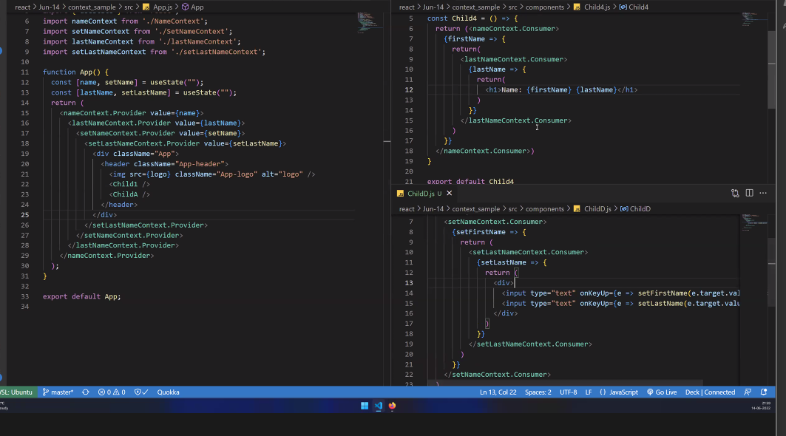

### Problems with prop drilling
--> Problems with Prop Drilling --> Readability --> Memory --> Not so efficient

--> Prop Drilling is bad because the readability/ semantics is bad, also it takes more memory which makes it not so efficient. If we have multiple children then we have to to acheive prop drilling on all those children, so the maintainance becomes easy.

By using contextAPI, we dont have to worry about prop-drilling or state lifting. 

> Why do we need state?
To manage data 

#### In prop drilling this is how the components would pass data 
> ChildA.js 
```bash
const ChildA = () => {
  var name = 'string'
  return (
    <div><ChildB name={name}/></div>
  )
}

export default ChildA
```
> ChildB.js 
```bash
const ChildB = (props) => {
  return (
    <div><ChildD name={props.name}/></div>
  )
}

export default ChildB
```
> ChildD.js 
```bash
const ChildD = (props) => {
  return (
    <div>{props.name}</div>
  )
}

export default ChildD
```
### Context API 
Instead of passing props via prop-drilling, we use context-API through which we can pass data from parent to the target component. 

- When were passing props from Ancestor to Descendent (when were going more than one level down ) we need to use contextAPI instead. 

--> Context allows us to pass data from ancestor to descendent without using prop drilling. 

--> Context says wheerever your source is create it as provideer, wherever your destination is create it as consumer. 
- Provider (This will provide the data)
- Consumer (This will consume the data)

Comparitively to prop-drilling consumer API is more secure. 

### Steps to implementing createContext()
1. Create a context by running createContext() Context which we created export it, where we have the data give the provider
> App.js 
```bash
import logo from './logo.svg';
import './App.css';
import Child1 from './components/Child1';
import {useState, createContext} from 'react'

const context = createContext()
function App() {
  //if we have some state here 
  const [name, setName] = useState('reem')

  return (
    <div className="App">
      {/* anything insdie the provider can access the data */}
      <context.Provider value={name}>
         <Child1/>
      </context.Provider>

      {/* the normal prop-drilling way */}
      {/* <Child1 name={name}/> */}
    </div>
  );
}

export {context}
export default App;
```
2. wherever we want to import it, just do import and use consumer
- consumer requires a function, and this function will be called verytime the data changes 
```bash
import React from 'react'
import {context} from '../App'

function Child4() {
  return (
    <context.Consumer>
      {data => {
        return (
            <div>Name: {data}</div>
        )
      }}
    </context.Consumer>

    //the propdrilling way 
    // <div>{props.name}</div>
  )
}

export default Child4
```
### what is babel, webpack ?
- Conversion from JSX to JS - babel 
- bundling from react code to HTML/CSS/JS- webpack 

### Can we lift state using context?
state lifting - first we lift the state from child components and we transfer it to the parent component and then we send the prop to the child components either on every child level via prop drilling or directly via context api 


### Passing more than one data via Context API 
We can have one context inside another and pass more than one data from parent component to child component 
> App.js 
```bash
import logo from './logo.svg';
import './App.css';
import Child1 from './components/Child1';
import {useState, createContext} from 'react'
import ChildA from './components/ChildA';

const context = createContext()
const setContext = createContext()
function App() {
  //if we have some state here 
  const [name, setName] = useState('reem')

  return (
    <div className="App">
      {/* anything inside the provider can access the data */}
      <context.Provider value={name}>
        <setContext.Provider value={setName}>
        <Child1/>
         <ChildA/>
        </setContext.Provider>
      </context.Provider>

    </div>
  );
}

export {context, setContext}
export default App;
```
> ChildD.js 
In this example, were technically updating the state from child component and the results are rendered at the parent component.
```bash
import React from 'react'
import {setContext} from '../App'
const ChildD = () => {
  return (
    // we are sharing data from any component to any other component, not necessarily from parent to child component 
  <setContext.Consumer>
    {data => {
      return (
        <div>
          <input type='text' onKeyUp={(e => data(e.target.value))} />
        </div>
      )
    }}
  </setContext.Consumer>
  )
}

export default ChildD
```
### Advantage 
- even if we move the component's position and add additional components in between ancestor and descendent and if we passed props via context API its not going to make any difference. This allows us to maintain the code easily.

- In case of prop-drilling if we added components in between ancestor and descendent, then we'd have to individually change all the components in between to link to the very next child component which (therefore, propdrilling aint a practical option)

For example, if we already had 3 existing components i.e ChildA, ChildB and ChildD and if we were to add an existing component say ChildC in between ChildB and ChildD, then, we'd have to link ChildB to ChildC and further link ChildC to ChildD. If instead of having to send props down at every level, we wouldve used context API which ensures that props are passed directly from the parent/provider to the child/consumer component, then we wouldnt have to make any link changes in between.
> ChildA.js 
```bash
const ChildA = () => {
  var name = 'string'
  return (
    <div><ChildB name={name}/></div>
  )
}

export default ChildA
```
> ChildB.js 
```bash
const ChildB = (props) => {
  return (
    <div><ChildD name={props.name}/></div>
  )
}

export default ChildB
```
> ChildD.js 
```bash
const ChildD = (props) => {
  return (
    <div>{props.name}</div>
  )
}

export default ChildD
```
- Note: one provider can have two or more consumers

### We can even seperate the contexts in seperate files 
and import multiple imports in a nested format, but this becomes harder to manage and read and causes callback hell. 


### useContext() to the rescue
- useContext Hook 
> lhs is useContext, rhs is callback hell 


> lhs is useContext, rhs is callback hell 


