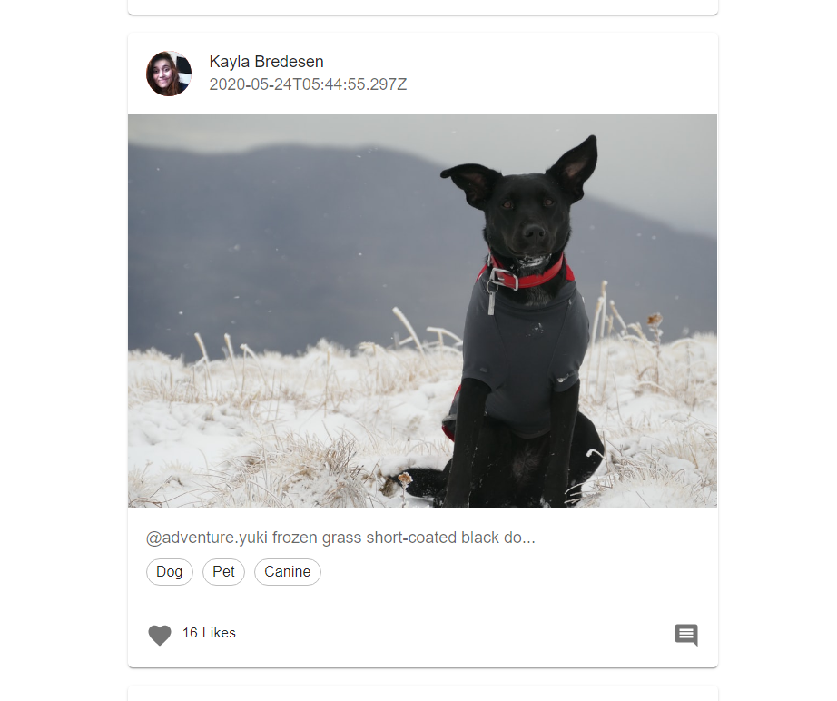

### MUI
MUI is a massive library of UI components designers and developers can use to build React applications. 
https://mui.com/

- react-bootstrap is made by twitter
- mui built by google 

#### install command 
```bash
npm install @mui/material @emotion/react @emotion/styled
npm install @mui/icons-material
```
> Does it make sites heavy?
Yes, but like a few kilobytes 

> MUI vs react-bootrap
MUI is a little better since react-bootstrap is newer with more additions. 

Bootstrap is very consistent and provides a simple, clear interface that, is easy to learn. And comparatively less customizable than Material UI. Material UI is highly customizable with which designers can create tons of designs. But it may produce inconsistency among components.

For MUI eevry component has a seperate file, so we dont need to import everything, so its more lightweight
https://cdnjs.com/libraries/mui

### Minification
min is a process of minifying a file, like compressing a file. 
> non minified file 
```bash
function abcd(){
    console.log('hello')
    console.log('world')
}
abcd()
#every space is a ch which is counted
```
> minified file removes spaces `https://www.toptal.com/developers/javascript-minifier`
- save file as `.min.js `

Build is optimized, so during it it removes fragments. 

### Resources to use  
- Flaticon (icons)
- LogosToUse (logos)

#### Social Media for Geeks 
### API 
- https://dummyapi.io/
- https://dummyapi.io/docs

> I generated my APP ID 
```bash
62a376a66d6f353f22286fcc
```
> Download env-cmd 
For hosting in netlify, they will ask seperately for secrets. thats why we dont need to specify staging and production files in package.json 

> package.json 
```bash
  "scripts": {
    "start": "env-cmd -f .env react-scripts start",
    "build": "react-scripts build",
    "test": "react-scripts test",
    "eject": "react-scripts eject"
  },
```

> API RULES:
1. It is necessary to calculate API usage statistic to avoid automatic scrapers.
2. Define a personal environment for each user. Where you can make CRUD operation on entities(user/post/comments etc.). This changes will be visible only for you.
3. Use App ID value to set app-id header for all request to API.

### the Code 
- cleanup index.js 
```bash
import React from 'react';
import ReactDOM from 'react-dom/client';
import './index.css';
import App from './App';

const root = ReactDOM.createRoot(document.getElementById('root'));
root.render(
  <React.StrictMode>
    <App />
  </React.StrictMode>
);
```
> App.js 
```bash
import logo from './logo.svg';
import './App.css';
import NavigationBar from './components/NavigationBar';
import Home from './pages/Home'
import Footer from './components/Footer';

function App() {
  return (
    <>
       <NavigationBar/>
       <Home/>
       <Footer/>
    </>
  );
}

export default App;
```
> NavigationBar.js
```bash
# imported from App Bar from responsibe menu 
import * as React from 'react';
import AppBar from '@mui/material/AppBar';
import Box from '@mui/material/Box';
import Toolbar from '@mui/material/Toolbar';
import IconButton from '@mui/material/IconButton';
import Typography from '@mui/material/Typography';
import Menu from '@mui/material/Menu';
import MenuIcon from '@mui/icons-material/Menu';
import Container from '@mui/material/Container';
import Avatar from '@mui/material/Avatar';
import Button from '@mui/material/Button';
import Tooltip from '@mui/material/Tooltip';
import MenuItem from '@mui/material/MenuItem';
import AdbIcon from '@mui/icons-material/Adb';

const pages = ['Products', 'Pricing', 'Blog'];
const settings = ['Profile', 'Account', 'Dashboard', 'Logout'];

const NavigationBar = () => {
  const [anchorElNav, setAnchorElNav] = React.useState(null);
  const [anchorElUser, setAnchorElUser] = React.useState(null);

  const handleOpenNavMenu = (event) => {
    setAnchorElNav(event.currentTarget);
  };
  const handleOpenUserMenu = (event) => {
    setAnchorElUser(event.currentTarget);
  };

  const handleCloseNavMenu = () => {
    setAnchorElNav(null);
  };

  const handleCloseUserMenu = () => {
    setAnchorElUser(null);
  };

  return (
    <AppBar position="static">
      <Container maxWidth="xl">
        <Toolbar disableGutters>
          <AdbIcon sx={{ display: { xs: 'none', md: 'flex' }, mr: 1 }} />
          <Typography
            variant="h6"
            noWrap
            component="a"
            href="/"
            sx={{
              mr: 2,
              display: { xs: 'none', md: 'flex' },
              fontFamily: 'monospace',
              fontWeight: 700,
              letterSpacing: '.3rem',
              color: 'inherit',
              textDecoration: 'none',
            }}
          >
            LOGO
          </Typography>

          <Box sx={{ flexGrow: 1, display: { xs: 'flex', md: 'none' } }}>
            <IconButton
              size="large"
              aria-label="account of current user"
              aria-controls="menu-appbar"
              aria-haspopup="true"
              onClick={handleOpenNavMenu}
              color="inherit"
            >
              <MenuIcon />
            </IconButton>
            <Menu
              id="menu-appbar"
              anchorEl={anchorElNav}
              anchorOrigin={{
                vertical: 'bottom',
                horizontal: 'left',
              }}
              keepMounted
              transformOrigin={{
                vertical: 'top',
                horizontal: 'left',
              }}
              open={Boolean(anchorElNav)}
              onClose={handleCloseNavMenu}
              sx={{
                display: { xs: 'block', md: 'none' },
              }}
            >
              {pages.map((page) => (
                <MenuItem key={page} onClick={handleCloseNavMenu}>
                  <Typography textAlign="center">{page}</Typography>
                </MenuItem>
              ))}
            </Menu>
          </Box>
          <AdbIcon sx={{ display: { xs: 'flex', md: 'none' }, mr: 1 }} />
          <Typography
            variant="h5"
            noWrap
            component="a"
            href=""
            sx={{
              mr: 2,
              display: { xs: 'flex', md: 'none' },
              flexGrow: 1,
              fontFamily: 'monospace',
              fontWeight: 700,
              letterSpacing: '.3rem',
              color: 'inherit',
              textDecoration: 'none',
            }}
          >
            LOGO
          </Typography>
          <Box sx={{ flexGrow: 1, display: { xs: 'none', md: 'flex' } }}>
            {pages.map((page) => (
              <Button
                key={page}
                onClick={handleCloseNavMenu}
                sx={{ my: 2, color: 'white', display: 'block' }}
              >
                {page}
              </Button>
            ))}
          </Box>

          <Box sx={{ flexGrow: 0 }}>
            <Tooltip title="Open settings">
              <IconButton onClick={handleOpenUserMenu} sx={{ p: 0 }}>
                <Avatar alt="Remy Sharp" src="/static/images/avatar/2.jpg" />
              </IconButton>
            </Tooltip>
            <Menu
              sx={{ mt: '45px' }}
              id="menu-appbar"
              anchorEl={anchorElUser}
              anchorOrigin={{
                vertical: 'top',
                horizontal: 'right',
              }}
              keepMounted
              transformOrigin={{
                vertical: 'top',
                horizontal: 'right',
              }}
              open={Boolean(anchorElUser)}
              onClose={handleCloseUserMenu}
            >
              {settings.map((setting) => (
                <MenuItem key={setting} onClick={handleCloseUserMenu}>
                  <Typography textAlign="center">{setting}</Typography>
                </MenuItem>
              ))}
            </Menu>
          </Box>
        </Toolbar>
      </Container>
    </AppBar>
  );
};
export default NavigationBar;
```
> Each screen will be a seperate Page component 
Create 3 `pages` 
- Home.js - Inside Home, we render PostList.js (the entire container inside which cards will be populated) which is responsible for mapping over the array and return it as props to PostCard.js (Inside the PostList component we integrated a button component, when we click on it it'll make an API call and render more cards on the PostList.js)
- Detail.js 
- Profile.js 

> Home.js 
```bash
import React from 'react'
import Container from '@mui/material/Container'
import PostList from '../components/PostList'

const Home = () => {
  return (
    <Container fixed>
      <PostList/>
    </Container>      
  )
}

export default Home 
```
> PostList.js 
```bash
import React from 'react'
import {Stack, Button} from '@mui/material'
import PostCard from './PostCard'

function PostList() {
const arr = [true, true, true, true, true]

  return (
    <>
    # justofy content works on main axis (y)
        alignitems works on cross axis (x) 
        <Stack spacing={2} mt={4} mb={4} alignItems="center">

           {arr.map((_, idx) => {
                return (
                    # <Item key='idx'>
                    #     <PostCard/>
                    # </Item>
                    <PostCard key='idx'/>
                )
            })}
        # <Item>Item 1</Item>
        <Item>Item 2</Item>
        <Item>Item 3</Item> 

       # imported button 
       # when we click on button it'll make API call and it'll fetch all the data 
       <Button variant="text">Load More...</Button>
        </Stack>
    </>
  )
}

export default PostList
```
> PostCard.js 
```bash
#imported from mui -> cards -> complex interaction
import * as React from 'react';
import { styled } from '@mui/material/styles';
import Card from '@mui/material/Card';
import CardHeader from '@mui/material/CardHeader';
import CardMedia from '@mui/material/CardMedia';
import CardContent from '@mui/material/CardContent';
import CardActions from '@mui/material/CardActions';
import Collapse from '@mui/material/Collapse';
import Avatar from '@mui/material/Avatar';
import IconButton from '@mui/material/IconButton';
import Typography from '@mui/material/Typography';
import { red } from '@mui/material/colors';
import FavoriteIcon from '@mui/icons-material/Favorite';
import ShareIcon from '@mui/icons-material/Share';
import ExpandMoreIcon from '@mui/icons-material/ExpandMore';
import MoreVertIcon from '@mui/icons-material/MoreVert';

const ExpandMore = styled((props) => {
  const { expand, ...other } = props;
  return <IconButton {...other} />;
})(({ theme, expand }) => ({
  transform: !expand ? 'rotate(0deg)' : 'rotate(180deg)',
  marginLeft: 'auto',
  transition: theme.transitions.create('transform', {
    duration: theme.transitions.duration.shortest,
  }),
}));

export default function PostCard() {
  const [expanded, setExpanded] = React.useState(false);

  const handleExpandClick = () => {
    setExpanded(!expanded);
  };

  return (
    <Card sx={{ maxWidth: 520 }}>
      <CardHeader
        avatar={
          <Avatar sx={{ bgcolor: red[500] }} aria-label="recipe">
            R
          </Avatar>
        }
        # action={
        #   <IconButton aria-label="settings">
        #     <MoreVertIcon />
        #   </IconButton>
        # }
        title="Shrimp and Chorizo Paella"
        subheader="September 14, 2016"
      />
      <CardMedia
        component="img"
        #height sets the height for the image 
        #height="194"
        #insert image over here 
        image="https://mui.com/static/images/cards/paella.jpg"
        alt="Paella dish"
      />
      <CardContent>
        <Typography variant="body2" color="text.secondary">
          This impressive paella is a perfect party dish and a fun meal to cook
          together with your guests. Add 1 cup of frozen peas along with the mussels,
          if you like.
        </Typography>
      </CardContent>
      <CardActions disableSpacing>
        <IconButton aria-label="add to favorites">
          <FavoriteIcon />
        </IconButton>
        <IconButton aria-label="share">
          <ShareIcon />
        </IconButton>
        <ExpandMore
          expand={expanded}
          onClick={handleExpandClick}
          aria-expanded={expanded}
          aria-label="show more"
        >
          <ExpandMoreIcon />
        </ExpandMore>
      </CardActions>
      <Collapse in={expanded} timeout="auto" unmountOnExit>
        <CardContent>
          <Typography paragraph>Method:</Typography>
        </CardContent>
      </Collapse>
    </Card>
  );
}
```
https://tubular-crisp-b53633.netlify.app/

#### Whats Happening in the code: An overview:
1. We start off with NavigationBar component on top, Home component beneath it (which contains all the main logic) and duh, the footer component 
> App.js 
```bash
import './App.css';
import NavigationBar from './components/NavigationBar';
import Home from './pages/Home'
import Footer from './components/Footer';

function App() {
  return (
    <>
       <NavigationBar/>
       <Home/>
       <Footer/>
    </>
  );
}

export default App;
```
2. In the NavigationBar.js component we imported a bunch of template from MUI -> App bar -> Responsive menu https://mui.com/material-ui/react-app-bar/#app-bar-with-responsive-menu
- we cleared a bunch of irrelevant code 
- we embedded the logo which we imported from material-icons https://mui.com/material-ui/material-icons/. We also downloaded a couple logos, one is white, the other one is black, we changed its color from registering onto flatIcon. Go to this location https://www.flaticon.com/free-icon/global-network_4207230?term=network&page=1&position=2&page=1&position=2&related_id=4207230&origin=search register to change the color of our icon from black to white, since we want to maintain both white and dark logos. and we also removed the default logo imports to prevent clashes.
- we changed the logo name to GeekConnect 
- through this snippet: products, pricing and blog is printed as menu items 
```bash
const pages = ['Products', 'Pricing', 'Blog'];
  {pages.map((page) => (
    <MenuItem key={page} onClick={handleCloseNavMenu}>
      <Typography textAlign="center">{page}</Typography>
    </MenuItem>
  ))}
```
- when the screen is minized the menu items are embedded within the small triple line button and when we click on it, menu items appear as menu items 
- When I click on my avatar, menu with these options pop up 
```bash
const settings = ['Profile', 'Account', 'Dashboard', 'Logout'];
  {settings.map((setting) => (
    <MenuItem key={setting} onClick={handleCloseUserMenu}>
        <Typography textAlign="center">{setting}</Typography>
    </MenuItem>
  ))}
```
- NavigationBar.js 
```bash
#imported from App Bar from responsive menu 
import * as React from 'react';
import AppBar from '@mui/material/AppBar';
import Box from '@mui/material/Box';
import Toolbar from '@mui/material/Toolbar';
import IconButton from '@mui/material/IconButton';
import Typography from '@mui/material/Typography';
import Menu from '@mui/material/Menu';
import MenuIcon from '@mui/icons-material/Menu';
import Container from '@mui/material/Container';
import Avatar from '@mui/material/Avatar';
import Button from '@mui/material/Button';
import Tooltip from '@mui/material/Tooltip';
import MenuItem from '@mui/material/MenuItem';
import AdbIcon from '@mui/icons-material/Adb';
import Logo from '../logo.png';

const pages = ['Products', 'Pricing', 'Blog'];
const settings = ['Profile', 'Account', 'Dashboard', 'Logout'];

const NavigationBar = () => {
  const [anchorElNav, setAnchorElNav] = React.useState(null);
  const [anchorElUser, setAnchorElUser] = React.useState(null);

  const handleOpenNavMenu = (event) => {
    setAnchorElNav(event.currentTarget);
  };
  const handleOpenUserMenu = (event) => {
    setAnchorElUser(event.currentTarget);
  };

  const handleCloseNavMenu = () => {
    setAnchorElNav(null);
  };

  const handleCloseUserMenu = () => {
    setAnchorElUser(null);
  };

  return (
    <AppBar position="static">
      <Container maxWidth="xl">
        <Toolbar disableGutters>
          
          <Typography
            variant="h6"
            noWrap
            component="a"
            href="/"
            sx={{
              mr: 2,
              display: { xs: 'none', md: 'flex' },
              fontFamily: 'monospace',
              fontWeight: 700,
              color: 'inherit',
              textDecoration: 'none',
            }}
          >
            GeekConnect
          </Typography>

          <Box sx={{ flexGrow: 1, display: { xs: 'flex', md: 'none' } }}>
            <IconButton
              size="large"
              aria-label="account of current user"
              aria-controls="menu-appbar"
              aria-haspopup="true"
              onClick={handleOpenNavMenu}
              color="inherit"
            >
              <MenuIcon />
            </IconButton>
            <Menu
              id="menu-appbar"
              anchorEl={anchorElNav}
              anchorOrigin={{
                vertical: 'bottom',
                horizontal: 'left',
              }}
              keepMounted
              transformOrigin={{
                vertical: 'top',
                horizontal: 'left',
              }}
              open={Boolean(anchorElNav)}
              onClose={handleCloseNavMenu}
              sx={{
                display: { xs: 'block', md: 'none' },
              }}
            >
              {pages.map((page) => (
                <MenuItem key={page} onClick={handleCloseNavMenu}>
                  <Typography textAlign="center">{page}</Typography>
                </MenuItem>
              ))}
            </Menu>
          </Box>
          <AdbIcon sx={{ display: { xs: 'flex', md: 'none' }, mr: 1 }} />
          <Typography
            variant="h5"
            noWrap
            component="a"
            href=""
            sx={{
              mr: 2,
              display: { xs: 'flex', md: 'none' },
              flexGrow: 1,
              fontFamily: 'monospace',
              fontWeight: 700,
              letterSpacing: '.3rem',
              color: 'inherit',
              textDecoration: 'none',
            }}
          >
            LOGO
          </Typography>
          <Box sx={{ flexGrow: 1, display: { xs: 'none', md: 'flex' } }}>
            {pages.map((page) => (
              <Button
                key={page}
                onClick={handleCloseNavMenu}
                sx={{ my: 2, color: 'white', display: 'block' }}
              >
                {page}
              </Button>
            ))}
          </Box>

          <Box sx={{ flexGrow: 0 }}>
            <Tooltip title="Open settings">
              <IconButton onClick={handleOpenUserMenu} sx={{ p: 0 }}>
                <Avatar alt="Remy Sharp" src="/static/images/avatar/2.jpg" />
              </IconButton>
            </Tooltip>
            <Menu
              sx={{ mt: '45px' }}
              id="menu-appbar"
              anchorEl={anchorElUser}
              anchorOrigin={{
                vertical: 'top',
                horizontal: 'right',
              }}
              keepMounted
              transformOrigin={{
                vertical: 'top',
                horizontal: 'right',
              }}
              open={Boolean(anchorElUser)}
              onClose={handleCloseUserMenu}
            >
              {settings.map((setting) => (
                <MenuItem key={setting} onClick={handleCloseUserMenu}>
                  <Typography textAlign="center">{setting}</Typography>
                </MenuItem>
              ))}
            </Menu>
          </Box>
        </Toolbar>
      </Container>
    </AppBar>
  );
};
export default NavigationBar;
```
3. We defined our API keys inside the .env file and we created a modular export for axios in util.js placed inside src, so how did we get this axios instance?
- search axios documentation on google 
- hover to the  axios npm package then click on the official homepage 
- read more about headers in API here https://dummyapi.io/docs
- hover over to axios API 
- Hover over to the Axios instance 
Axios says to define all common things at once
```bash
#define baseURL once 
#define headers once 
#define timers once 
const instance = axios.create({
  baseURL: 'https://some-domain.com/api/',
  timeout: 1000,
  headers: {'X-Custom-Header': 'foobar'}
});
```
> They want us to set the api key as a header 
Headers 
- it stores more information about the URL 
- its possible to set headers for both request and response. 
- we'll give Header as an App ID 

Axios says to define all common things at once, so instead of re-writting this code again and again, which violates the DRY principle we define it in another file called util.js 

> util.js 
```bash
import axios from 'axios'

# const dummyapi = axios.create({
#     baseURL: 'https://some-domain.com/api/',
#     timeout: 1000,
#     headers: {'X-Custom-Header': 'foobar'}
#   });

#   base url: https://dummyapi.io/data/v1/
const dummyapi = axios.create({
  baseURL: 'https://dummyapi.io/data/v1/',
  timeout: 10000,
  headers: {'app-id': process.env.REACT_APP_API_KEY}
});

export {dummyapi};
# named export 
```
4. We imported this axios call within Home.js 
- were maintaining a state posts for populating our page with api endpoint data 
- were maintaing another state pageNumber for acheieving endless pages of posts since we keep increementing its value 
- when the Home component is mounted for the first time, we make the axios call which is defined inside a function loadMore 
- we are passing posts state and loadMore function as props to PostList.js 
- were also defining the HomeBasicCard component to be rendered above the PostLists component 
```bash
import React, { useEffect, useState } from 'react'
import Container from '@mui/material/Container';
import PostList from '../components/PostList';
import { dummyapi } from '../util';
import HomeBasicCard from '../components/HomeBasicCard';

const Home = () => {
  const [posts, setPosts] = useState([]);
  # we need to load to next set of pages when we click on load more 
  # by default, it loads the 0'th page 
  const [pageNumber, setPageNumber] = useState(0);

  const loadPage = async() => {
    console.log(process.env.REACT_APP_API_KEY)

    # We can set the axios call using axios.get(base_url, headers) and then set the data 
    # but we'll need to re-write this axios snippet again and again
    # thats why we transfered this common code to util.js 

    # axios.get('https://dummyapi.io/data/v1/post', {headers: {'app-id': process.env.REACT_API_APP_KEY}})
    # .then(data => 
    #  console.log(data)
    #  )
    const response = await dummyapi.get(`/post?page=${pageNumber}`);  
    const postsArr = response?.data?.data ?? [];
    # were checking if its undefined or not 
    # if its undefined use an empty array as a fallback 
    # if its defined, it will show the value response?.data?.data

    # were implemneting null collasing to prevent crashes 
    #setPosts(postArr)
    setPosts(oldPosts => [...oldPosts, ...postsArr]);

    setPageNumber(page => page + 1);
    
    #     null collasing:
    #     const abcd = null 
    #     we can use optional chaining to give fallback 
    #     console.log(abcd ?? 'default value')
    #     console: default value 
    #     if abcd is null/undefined then display default value 

    #  dummyapi.get('/post').then(data => console.log(data))
  }

  useEffect(() => {
      loadPage()
  }, []);

  const loadMore = () => {
    loadPage();
  }
  
  return (
    <>
     # <PostList posts={posts} loadMore={loadMore}/> 
      <Container fixed>
        <HomeBasicCard />
        <PostList posts={posts} loadMore={loadMore} />
      </Container>
    </>
  )
}

export default Home
```
> HomeBasicCard.js 
Within this component we've imported this simple card from Mui https://mui.com/material-ui/react-card/#basic-card
```bash
import * as React from 'react';
import Card from '@mui/material/Card';
import CardContent from '@mui/material/CardContent';
import Typography from '@mui/material/Typography';

export default function HomeBasicCard() {
  return (
      <Card variant="outlined" sx={{maxWidth: 520, margin: "auto", marginTop: "2rem" }}>
        <CardContent>
          <Typography variant="h4" color="text.secondary" gutterBottom>
            Hi 👋🏻
          </Typography>
          <Typography variant="h5" component="div">
           Welcome to Geekconnect
          </Typography>
          <Typography variant="body2">
            Love Animals. ❣️
          </Typography>
        </CardContent>
    </Card>
  );
}
```
5. In PostList.js component 
- we retreive the posts state props over here and extract all its properties 


> PostList.js 
```bash
import React from 'react'
import { Stack, Button } from '@mui/material'
import PostCard from './PostCard';

const PostList = (props) => {
  console.log(props);
    #const arr = [true, true, true, true, true]

  return (
    <Stack spacing={2} mt={4} mb={4} alignItems="center">
    #we pass every single post as a prop to PostCard.js 
      {props.posts.map((singlePost, idx) => {
        return (
            # <Item key={idx}>
            #     <PostCard/>
            # </Item>
          <PostCard key={idx} singlePost={singlePost} />
        )
      })}
      
        # <Item>Item 1</Item>
        # <Item>Item 2</Item>
        # <Item>Item 3</Item> 

      # when we click on load more it makes an API call to fetch all the data from loadMore function defined inside Home component and load more posts 
      <Button variant="text" onClick={props.loadMore}>Load More...</Button>
    </Stack>
  )
}

export default PostList
```
> PostCard.js 
Inside PostCard were print all the card details 
- we imported this card from MUI https://mui.com/material-ui/react-card/#complex-interaction
- we imported the CommentIcon which is placed on the bottom rhs of the card https://mui.com/material-ui/material-icons/?query=comment
- we also imported Chip https://mui.com/material-ui/react-chip/#basic-chip and Stack https://mui.com/material-ui/react-stack/#direction over here where were showcasing all the tags in a chip format
```bash
import * as React from 'react';
#import { styled } from '@mui/material/styles';
import Card from '@mui/material/Card';
import CardHeader from '@mui/material/CardHeader';
import CardMedia from '@mui/material/CardMedia';
import CardContent from '@mui/material/CardContent';
import CardActions from '@mui/material/CardActions';
#import Collapse from '@mui/material/Collapse';
import Avatar from '@mui/material/Avatar';
import IconButton from '@mui/material/IconButton';
import Typography from '@mui/material/Typography';
import { red } from '@mui/material/colors';
import FavoriteIcon from '@mui/icons-material/Favorite'

#we imported the icon from here: https://mui.com/material-ui/material-icons/?query=Comment&selected=Comment
import CommentIcon from '@mui/icons-material/Comment';
import { Chip, Stack } from '@mui/material';

export default function PostCard(props) {
  #  const [expanded, setExpanded] = React.useState(false);

  #  const handleExpandClick = () => {
  #    setExpanded(!expanded);
  #  };

  return (
    <Card sx={{ maxWidth: 520 }}>
      <CardHeader
        avatar={
          <Avatar sx={{ bgcolor: red[500] }} aria-label="recipe" src={props.singlePost?.owner?.picture} />
        }
        title={`${props.singlePost?.owner?.firstName} ${props.singlePost?.owner?.lastName}`}
        subheader={props.singlePost?.publishDate}
        #  action={
        #      <IconButton aria-label="settings">
        #        <MoreVertIcon />
        #      </IconButton>
        #    }
  
        #    title="Shrimp and Chorizo Paella"
        #    subheader="September 14, 2016"
      />
      <CardMedia
        component="img"
        # height sets the height for the image 
        # height="194"
        # insert image over here 
        image={props.singlePost?.image}
        alt="Paella dish"
      />
      <CardContent>
      #imported from https://mui.com/material-ui/react-typography/main-content 
        <Typography variant="body2" color="text.secondary">
          {props.singlePost?.text}
        </Typography>

        <Stack direction="row" spacing={1} mt={1}>
          {props.singlePost?.tags?.map((singleTag, idx) => {
            return (
              <Chip label={`${singleTag}`} variant="outlined" key={idx} size="small" style={{textTransform: "capitalize"}} onClick={() => {}} />
            );
          })}
        </Stack>

      </CardContent>
      <CardActions disableSpacing>
        <IconButton aria-label="add to favorites">
          <FavoriteIcon />
        </IconButton>
        <Typography variant="caption" display="block" gutterBottom>
          {props.singlePost?.likes} Likes
        </Typography>
        <IconButton style={{ marginLeft: "auto" }}>
          <CommentIcon />
        </IconButton>
      </CardActions>
    </Card>
  );
}
```
https://grand-torte-98bc36.netlify.app/

> What does pagination mean? 
When we add load more option, and when we clcik on it, it loads and so on..


