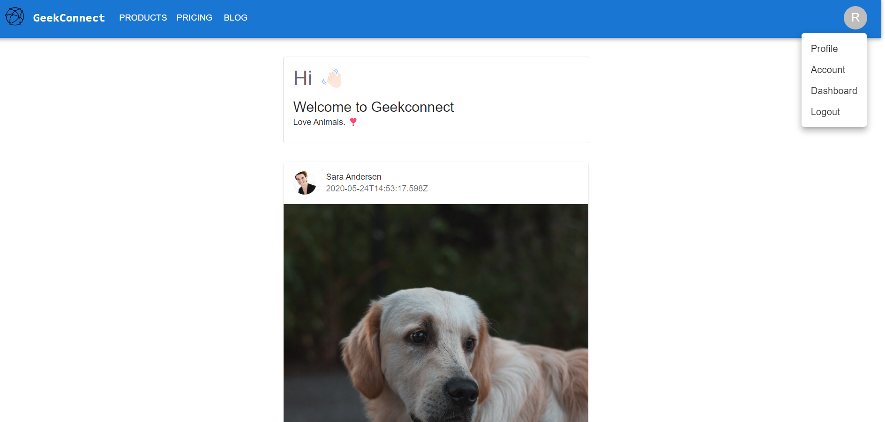
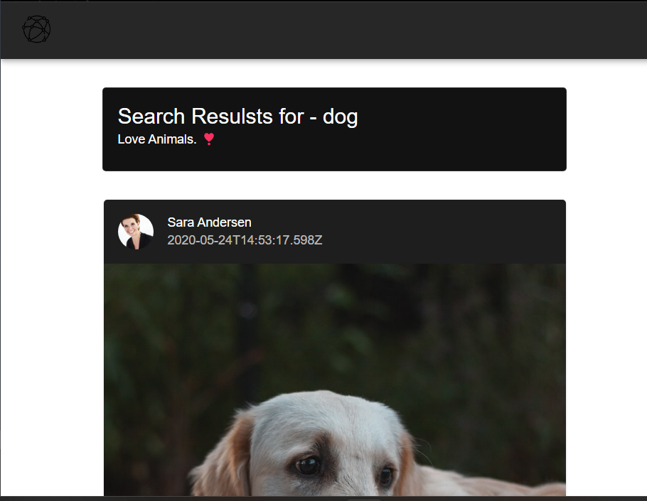
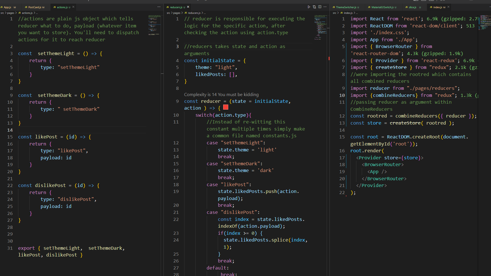
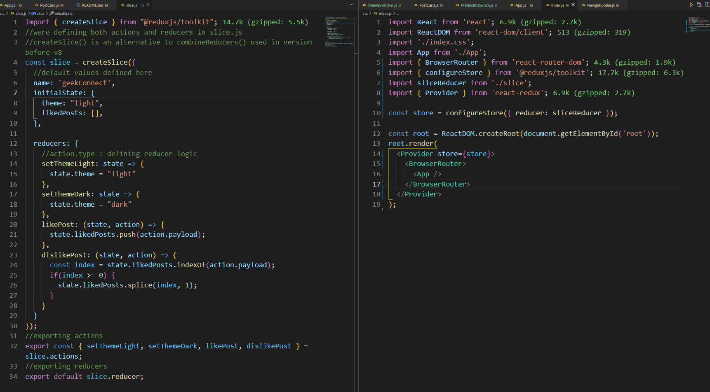

### MUI
MUI is a massive library of UI components designers and developers can use to build React applications. 
https://mui.com/

- react-bootstrap is made by twitter
- mui built by google 

#### install command 
```bash
npm install @mui/material @emotion/react @emotion/styled
npm install @mui/icons-material
```
> Does it make sites heavy?
Yes, but like a few kilobytes 

> MUI vs react-bootrap
MUI is a little better since react-bootstrap is newer with more additions. 

Bootstrap is very consistent and provides a simple, clear interface that, is easy to learn. And comparatively less customizable than Material UI. Material UI is highly customizable with which designers can create tons of designs. But it may produce inconsistency among components.

For MUI eevry component has a seperate file, so we dont need to import everything, so its more lightweight
https://cdnjs.com/libraries/mui

### Minification
min is a process of minifying a file, like compressing a file. 
> non minified file 
```bash
function abcd(){
    console.log('hello')
    console.log('world')
}
abcd()
#every space is a ch which is counted
```
> minified file removes spaces [](https://www.toptal.com/developers/javascript-minifier`)
- save file as `.min.js `

Build is optimized, so during it it removes fragments. 

### Resources to use  
- Flaticon (icons)
- LogosToUse (logos)

#### Social Media for Geeks 
### API 
- https://dummyapi.io/
- https://dummyapi.io/docs

> I generated my APP ID 
```bash
62a376a66d6f353f22286fcc
```
> Download env-cmd 
For hosting in netlify, they will ask seperately for secrets. thats why we dont need to specify staging and production files in package.json 

> package.json 
```bash
  "scripts": {
    "start": "env-cmd -f .env react-scripts start",
    "build": "react-scripts build",
    "test": "react-scripts test",
    "eject": "react-scripts eject"
  },
```

> API RULES:
1. It is necessary to calculate API usage statistic to avoid automatic scrapers.
2. Define a personal environment for each user. Where you can make CRUD operation on entities(user/post/comments etc.). This changes will be visible only for you.
3. Use App ID value to set app-id header for all request to API.

### the Code 
- cleanup index.js 
```bash
import React from 'react';
import ReactDOM from 'react-dom/client';
import './index.css';
import App from './App';

const root = ReactDOM.createRoot(document.getElementById('root'));
root.render(
  <React.StrictMode>
    <App />
  </React.StrictMode>
);
```
> App.js 
```bash
import logo from './logo.svg';
import './App.css';
import NavigationBar from './components/NavigationBar';
import Home from './pages/Home'
import Footer from './components/Footer';

function App() {
  return (
    <>
       <NavigationBar/>
       <Home/>
       <Footer/>
    </>
  );
}

export default App;
```
> NavigationBar.js
```bash
# imported from App Bar from responsibe menu 
import * as React from 'react';
import AppBar from '@mui/material/AppBar';
import Box from '@mui/material/Box';
import Toolbar from '@mui/material/Toolbar';
import IconButton from '@mui/material/IconButton';
import Typography from '@mui/material/Typography';
import Menu from '@mui/material/Menu';
import MenuIcon from '@mui/icons-material/Menu';
import Container from '@mui/material/Container';
import Avatar from '@mui/material/Avatar';
import Button from '@mui/material/Button';
import Tooltip from '@mui/material/Tooltip';
import MenuItem from '@mui/material/MenuItem';
import AdbIcon from '@mui/icons-material/Adb';

const pages = ['Products', 'Pricing', 'Blog'];
const settings = ['Profile', 'Account', 'Dashboard', 'Logout'];

const NavigationBar = () => {
  const [anchorElNav, setAnchorElNav] = React.useState(null);
  const [anchorElUser, setAnchorElUser] = React.useState(null);

  const handleOpenNavMenu = (event) => {
    setAnchorElNav(event.currentTarget);
  };
  const handleOpenUserMenu = (event) => {
    setAnchorElUser(event.currentTarget);
  };

  const handleCloseNavMenu = () => {
    setAnchorElNav(null);
  };

  const handleCloseUserMenu = () => {
    setAnchorElUser(null);
  };

  return (
    <AppBar position="static">
      <Container maxWidth="xl">
        <Toolbar disableGutters>
          <AdbIcon sx={{ display: { xs: 'none', md: 'flex' }, mr: 1 }} />
          <Typography
            variant="h6"
            noWrap
            component="a"
            href="/"
            sx={{
              mr: 2,
              display: { xs: 'none', md: 'flex' },
              fontFamily: 'monospace',
              fontWeight: 700,
              letterSpacing: '.3rem',
              color: 'inherit',
              textDecoration: 'none',
            }}
          >
            LOGO
          </Typography>

          <Box sx={{ flexGrow: 1, display: { xs: 'flex', md: 'none' } }}>
            <IconButton
              size="large"
              aria-label="account of current user"
              aria-controls="menu-appbar"
              aria-haspopup="true"
              onClick={handleOpenNavMenu}
              color="inherit"
            >
              <MenuIcon />
            </IconButton>
            <Menu
              id="menu-appbar"
              anchorEl={anchorElNav}
              anchorOrigin={{
                vertical: 'bottom',
                horizontal: 'left',
              }}
              keepMounted
              transformOrigin={{
                vertical: 'top',
                horizontal: 'left',
              }}
              open={Boolean(anchorElNav)}
              onClose={handleCloseNavMenu}
              sx={{
                display: { xs: 'block', md: 'none' },
              }}
            >
              {pages.map((page) => (
                <MenuItem key={page} onClick={handleCloseNavMenu}>
                  <Typography textAlign="center">{page}</Typography>
                </MenuItem>
              ))}
            </Menu>
          </Box>
          <AdbIcon sx={{ display: { xs: 'flex', md: 'none' }, mr: 1 }} />
          <Typography
            variant="h5"
            noWrap
            component="a"
            href=""
            sx={{
              mr: 2,
              display: { xs: 'flex', md: 'none' },
              flexGrow: 1,
              fontFamily: 'monospace',
              fontWeight: 700,
              letterSpacing: '.3rem',
              color: 'inherit',
              textDecoration: 'none',
            }}
          >
            LOGO
          </Typography>
          <Box sx={{ flexGrow: 1, display: { xs: 'none', md: 'flex' } }}>
            {pages.map((page) => (
              <Button
                key={page}
                onClick={handleCloseNavMenu}
                sx={{ my: 2, color: 'white', display: 'block' }}
              >
                {page}
              </Button>
            ))}
          </Box>

          <Box sx={{ flexGrow: 0 }}>
            <Tooltip title="Open settings">
              <IconButton onClick={handleOpenUserMenu} sx={{ p: 0 }}>
                <Avatar alt="Remy Sharp" src="/static/images/avatar/2.jpg" />
              </IconButton>
            </Tooltip>
            <Menu
              sx={{ mt: '45px' }}
              id="menu-appbar"
              anchorEl={anchorElUser}
              anchorOrigin={{
                vertical: 'top',
                horizontal: 'right',
              }}
              keepMounted
              transformOrigin={{
                vertical: 'top',
                horizontal: 'right',
              }}
              open={Boolean(anchorElUser)}
              onClose={handleCloseUserMenu}
            >
              {settings.map((setting) => (
                <MenuItem key={setting} onClick={handleCloseUserMenu}>
                  <Typography textAlign="center">{setting}</Typography>
                </MenuItem>
              ))}
            </Menu>
          </Box>
        </Toolbar>
      </Container>
    </AppBar>
  );
};
export default NavigationBar;
```
> Each screen will be a seperate Page component 
Create 3 `pages` 
- Home.js - Inside Home, we render PostList.js (the entire container inside which cards will be populated) which is responsible for mapping over the array and return it as props to PostCard.js (Inside the PostList component we integrated a button component, when we click on it it'll make an API call and render more cards on the PostList.js)
- Detail.js 
- Profile.js 

> Home.js 
```bash
import React from 'react'
import Container from '@mui/material/Container'
import PostList from '../components/PostList'

const Home = () => {
  return (
    <Container fixed>
      <PostList/>
    </Container>      
  )
}

export default Home 
```
> PostList.js 
```bash
import React from 'react'
import {Stack, Button} from '@mui/material'
import PostCard from './PostCard'

function PostList() {
const arr = [true, true, true, true, true]

  return (
    <>
    # justofy content works on main axis (y)
        alignitems works on cross axis (x) 
        <Stack spacing={2} mt={4} mb={4} alignItems="center">

           {arr.map((_, idx) => {
                return (
                    # <Item key='idx'>
                    #     <PostCard/>
                    # </Item>
                    <PostCard key='idx'/>
                )
            })}
        # <Item>Item 1</Item>
        <Item>Item 2</Item>
        <Item>Item 3</Item> 

       # imported button 
       # when we click on button it'll make API call and it'll fetch all the data 
       <Button variant="text">Load More...</Button>
        </Stack>
    </>
  )
}

export default PostList
```
> PostCard.js 
```bash
#imported from mui -> cards -> complex interaction
import * as React from 'react';
import { styled } from '@mui/material/styles';
import Card from '@mui/material/Card';
import CardHeader from '@mui/material/CardHeader';
import CardMedia from '@mui/material/CardMedia';
import CardContent from '@mui/material/CardContent';
import CardActions from '@mui/material/CardActions';
import Collapse from '@mui/material/Collapse';
import Avatar from '@mui/material/Avatar';
import IconButton from '@mui/material/IconButton';
import Typography from '@mui/material/Typography';
import { red } from '@mui/material/colors';
import FavoriteIcon from '@mui/icons-material/Favorite';
import ShareIcon from '@mui/icons-material/Share';
import ExpandMoreIcon from '@mui/icons-material/ExpandMore';
import MoreVertIcon from '@mui/icons-material/MoreVert';

const ExpandMore = styled((props) => {
  const { expand, ...other } = props;
  return <IconButton {...other} />;
})(({ theme, expand }) => ({
  transform: !expand ? 'rotate(0deg)' : 'rotate(180deg)',
  marginLeft: 'auto',
  transition: theme.transitions.create('transform', {
    duration: theme.transitions.duration.shortest,
  }),
}));

export default function PostCard() {
  const [expanded, setExpanded] = React.useState(false);

  const handleExpandClick = () => {
    setExpanded(!expanded);
  };

  return (
    <Card sx={{ maxWidth: 520 }}>
      <CardHeader
        avatar={
          <Avatar sx={{ bgcolor: red[500] }} aria-label="recipe">
            R
          </Avatar>
        }
        # action={
        #   <IconButton aria-label="settings">
        #     <MoreVertIcon />
        #   </IconButton>
        # }
        title="Shrimp and Chorizo Paella"
        subheader="September 14, 2016"
      />
      <CardMedia
        component="img"
        #height sets the height for the image 
        #height="194"
        #insert image over here 
        image="https://mui.com/static/images/cards/paella.jpg"
        alt="Paella dish"
      />
      <CardContent>
        <Typography variant="body2" color="text.secondary">
          This impressive paella is a perfect party dish and a fun meal to cook
          together with your guests. Add 1 cup of frozen peas along with the mussels,
          if you like.
        </Typography>
      </CardContent>
      <CardActions disableSpacing>
        <IconButton aria-label="add to favorites">
          <FavoriteIcon />
        </IconButton>
        <IconButton aria-label="share">
          <ShareIcon />
        </IconButton>
        <ExpandMore
          expand={expanded}
          onClick={handleExpandClick}
          aria-expanded={expanded}
          aria-label="show more"
        >
          <ExpandMoreIcon />
        </ExpandMore>
      </CardActions>
      <Collapse in={expanded} timeout="auto" unmountOnExit>
        <CardContent>
          <Typography paragraph>Method:</Typography>
        </CardContent>
      </Collapse>
    </Card>
  );
}
```
https://tubular-crisp-b53633.netlify.app/

#### Whats Happening in the code: An overview:
1. We start off with NavigationBar component on top, Home component beneath it (which contains all the main logic) and duh, the footer component 
> App.js 
```bash
import './App.css';
import NavigationBar from './components/NavigationBar';
import Home from './pages/Home'
import Footer from './components/Footer';

function App() {
  return (
    <>
       <NavigationBar/>
       <Home/>
       <Footer/>
    </>
  );
}

export default App;
```
2. In the NavigationBar.js component we imported a bunch of template from MUI -> App bar -> Responsive menu https://mui.com/material-ui/react-app-bar/#app-bar-with-responsive-menu
- we cleared a bunch of irrelevant code 
- we embedded the logo which we imported from material-icons https://mui.com/material-ui/material-icons/. We also downloaded a couple logos, one is white, the other one is black, we changed its color from registering onto flatIcon. Go to this location https://www.flaticon.com/free-icon/global-network_4207230?term=network&page=1&position=2&page=1&position=2&related_id=4207230&origin=search register to change the color of our icon from black to white, since we want to maintain both white and dark logos. and we also removed the default logo imports to prevent clashes.
- we changed the logo name to GeekConnect 
- through this snippet: products, pricing and blog is printed as menu items 
```bash
const pages = ['Products', 'Pricing', 'Blog'];
  {pages.map((page) => (
    <MenuItem key={page} onClick={handleCloseNavMenu}>
      <Typography textAlign="center">{page}</Typography>
    </MenuItem>
  ))}
```
- when the screen is minized the menu items are embedded within the small triple line button and when we click on it, menu items appear as menu items 
- When I click on my avatar, menu with these options pop up 
```bash
const settings = ['Profile', 'Account', 'Dashboard', 'Logout'];
  {settings.map((setting) => (
    <MenuItem key={setting} onClick={handleCloseUserMenu}>
        <Typography textAlign="center">{setting}</Typography>
    </MenuItem>
  ))}
```
- NavigationBar.js 
```bash
#imported from App Bar from responsive menu 
import * as React from 'react';
import AppBar from '@mui/material/AppBar';
import Box from '@mui/material/Box';
import Toolbar from '@mui/material/Toolbar';
import IconButton from '@mui/material/IconButton';
import Typography from '@mui/material/Typography';
import Menu from '@mui/material/Menu';
import MenuIcon from '@mui/icons-material/Menu';
import Container from '@mui/material/Container';
import Avatar from '@mui/material/Avatar';
import Button from '@mui/material/Button';
import Tooltip from '@mui/material/Tooltip';
import MenuItem from '@mui/material/MenuItem';
import AdbIcon from '@mui/icons-material/Adb';
import Logo from '../logo.png';

const pages = ['Products', 'Pricing', 'Blog'];
const settings = ['Profile', 'Account', 'Dashboard', 'Logout'];

const NavigationBar = () => {
  const [anchorElNav, setAnchorElNav] = React.useState(null);
  const [anchorElUser, setAnchorElUser] = React.useState(null);

  const handleOpenNavMenu = (event) => {
    setAnchorElNav(event.currentTarget);
  };
  const handleOpenUserMenu = (event) => {
    setAnchorElUser(event.currentTarget);
  };

  const handleCloseNavMenu = () => {
    setAnchorElNav(null);
  };

  const handleCloseUserMenu = () => {
    setAnchorElUser(null);
  };

  return (
    <AppBar position="static">
      <Container maxWidth="xl">
        <Toolbar disableGutters>
          
          <Typography
            variant="h6"
            noWrap
            component="a"
            href="/"
            sx={{
              mr: 2,
              display: { xs: 'none', md: 'flex' },
              fontFamily: 'monospace',
              fontWeight: 700,
              color: 'inherit',
              textDecoration: 'none',
            }}
          >
            GeekConnect
          </Typography>

          <Box sx={{ flexGrow: 1, display: { xs: 'flex', md: 'none' } }}>
            <IconButton
              size="large"
              aria-label="account of current user"
              aria-controls="menu-appbar"
              aria-haspopup="true"
              onClick={handleOpenNavMenu}
              color="inherit"
            >
              <MenuIcon />
            </IconButton>
            <Menu
              id="menu-appbar"
              anchorEl={anchorElNav}
              anchorOrigin={{
                vertical: 'bottom',
                horizontal: 'left',
              }}
              keepMounted
              transformOrigin={{
                vertical: 'top',
                horizontal: 'left',
              }}
              open={Boolean(anchorElNav)}
              onClose={handleCloseNavMenu}
              sx={{
                display: { xs: 'block', md: 'none' },
              }}
            >
              {pages.map((page) => (
                <MenuItem key={page} onClick={handleCloseNavMenu}>
                  <Typography textAlign="center">{page}</Typography>
                </MenuItem>
              ))}
            </Menu>
          </Box>
          <AdbIcon sx={{ display: { xs: 'flex', md: 'none' }, mr: 1 }} />
          <Typography
            variant="h5"
            noWrap
            component="a"
            href=""
            sx={{
              mr: 2,
              display: { xs: 'flex', md: 'none' },
              flexGrow: 1,
              fontFamily: 'monospace',
              fontWeight: 700,
              letterSpacing: '.3rem',
              color: 'inherit',
              textDecoration: 'none',
            }}
          >
            LOGO
          </Typography>
          <Box sx={{ flexGrow: 1, display: { xs: 'none', md: 'flex' } }}>
            {pages.map((page) => (
              <Button
                key={page}
                onClick={handleCloseNavMenu}
                sx={{ my: 2, color: 'white', display: 'block' }}
              >
                {page}
              </Button>
            ))}
          </Box>

          <Box sx={{ flexGrow: 0 }}>
            <Tooltip title="Open settings">
              <IconButton onClick={handleOpenUserMenu} sx={{ p: 0 }}>
                <Avatar alt="Remy Sharp" src="/static/images/avatar/2.jpg" />
              </IconButton>
            </Tooltip>
            <Menu
              sx={{ mt: '45px' }}
              id="menu-appbar"
              anchorEl={anchorElUser}
              anchorOrigin={{
                vertical: 'top',
                horizontal: 'right',
              }}
              keepMounted
              transformOrigin={{
                vertical: 'top',
                horizontal: 'right',
              }}
              open={Boolean(anchorElUser)}
              onClose={handleCloseUserMenu}
            >
              {settings.map((setting) => (
                <MenuItem key={setting} onClick={handleCloseUserMenu}>
                  <Typography textAlign="center">{setting}</Typography>
                </MenuItem>
              ))}
            </Menu>
          </Box>
        </Toolbar>
      </Container>
    </AppBar>
  );
};
export default NavigationBar;
```
3. We defined our API keys inside the .env file and we created a modular export for axios in util.js placed inside src, so how did we get this axios instance?
- search axios documentation on google 
- hover to the  axios npm package then click on the official homepage 
- read more about headers in API here https://dummyapi.io/docs
- hover over to axios API 
- Hover over to the Axios instance 
Axios says to define all common things at once
```bash
#define baseURL once 
#define headers once 
#define timers once 
const instance = axios.create({
  baseURL: 'https://some-domain.com/api/',
  timeout: 1000,
  headers: {'X-Custom-Header': 'foobar'}
});
```
> They want us to set the api key as a header 
Headers 
- it stores more information about the URL 
- its possible to set headers for both request and response. 
- we'll give Header as an App ID 

Axios says to define all common things at once, so instead of re-writting this code again and again, which violates the DRY principle we define it in another file called util.js 

> util.js 
```bash
import axios from 'axios'

# const dummyapi = axios.create({
#     baseURL: 'https://some-domain.com/api/',
#     timeout: 1000,
#     headers: {'X-Custom-Header': 'foobar'}
#   });

#   base url: https://dummyapi.io/data/v1/
const dummyapi = axios.create({
  baseURL: 'https://dummyapi.io/data/v1/',
  timeout: 10000,
  headers: {'app-id': process.env.REACT_APP_API_KEY}
});

export {dummyapi};
# named export 
```
4. We imported this axios call within Home.js 
- were maintaining a state posts for populating our page with api endpoint data 
- were maintaing another state pageNumber for acheieving endless pages of posts since we keep increementing its value 
- when the Home component is mounted for the first time, we make the axios call which is defined inside a function loadMore 
- we are passing posts state and loadMore function as props to PostList.js 
- were also defining the HomeBasicCard component to be rendered above the PostLists component 
```bash
import React, { useEffect, useState } from 'react'
import Container from '@mui/material/Container';
import PostList from '../components/PostList';
import { dummyapi } from '../util';
import HomeBasicCard from '../components/HomeBasicCard';

const Home = () => {
  const [posts, setPosts] = useState([]);
  # we need to load to next set of pages when we click on load more 
  # by default, it loads the 0'th page 
  const [pageNumber, setPageNumber] = useState(0);

  const loadPage = async() => {
    console.log(process.env.REACT_APP_API_KEY)

    # We can set the axios call using axios.get(base_url, headers) and then set the data 
    # but we'll need to re-write this axios snippet again and again
    # thats why we transfered this common code to util.js 

    # axios.get('https://dummyapi.io/data/v1/post', {headers: {'app-id': process.env.REACT_API_APP_KEY}})
    # .then(data => 
    #  console.log(data)
    #  )
    const response = await dummyapi.get(`/post?page=${pageNumber}`);  
    const postsArr = response?.data?.data ?? [];
    # were checking if its undefined or not 
    # if its undefined use an empty array as a fallback 
    # if its defined, it will show the value response?.data?.data

    # were implemneting null collasing to prevent crashes 
    #setPosts(postArr)
    setPosts(oldPosts => [...oldPosts, ...postsArr]);

    setPageNumber(page => page + 1);
    
    #     null collasing:
    #     const abcd = null 
    #     we can use optional chaining to give fallback 
    #     console.log(abcd ?? 'default value')
    #     console: default value 
    #     if abcd is null/undefined then display default value 

    #  dummyapi.get('/post').then(data => console.log(data))
  }

  useEffect(() => {
      loadPage()
  }, []);

  const loadMore = () => {
    loadPage();
  }
  
  return (
    <>
     # <PostList posts={posts} loadMore={loadMore}/> 
      <Container fixed>
        <HomeBasicCard />
        <PostList posts={posts} loadMore={loadMore} />
      </Container>
    </>
  )
}

export default Home
```
> HomeBasicCard.js 
Within this component we've imported this simple card from Mui https://mui.com/material-ui/react-card/#basic-card
```bash
import * as React from 'react';
import Card from '@mui/material/Card';
import CardContent from '@mui/material/CardContent';
import Typography from '@mui/material/Typography';

export default function HomeBasicCard() {
  return (
      <Card variant="outlined" sx={{maxWidth: 520, margin: "auto", marginTop: "2rem" }}>
        <CardContent>
          <Typography variant="h4" color="text.secondary" gutterBottom>
            Hi 👋🏻
          </Typography>
          <Typography variant="h5" component="div">
           Welcome to Geekconnect
          </Typography>
          <Typography variant="body2">
            Love Animals. ❣️
          </Typography>
        </CardContent>
    </Card>
  );
}
```
5. In PostList.js component 
- we retreive the posts state props over here and extract all its properties 


> PostList.js 
```bash
import React from 'react'
import { Stack, Button } from '@mui/material'
import PostCard from './PostCard';

const PostList = (props) => {
  console.log(props);
    #const arr = [true, true, true, true, true]

  return (
    <Stack spacing={2} mt={4} mb={4} alignItems="center">
    #we pass every single post as a prop to PostCard.js 
      {props.posts.map((singlePost, idx) => {
        return (
            # <Item key={idx}>
            #     <PostCard/>
            # </Item>
          <PostCard key={idx} singlePost={singlePost} />
        )
      })}
      
        # <Item>Item 1</Item>
        # <Item>Item 2</Item>
        # <Item>Item 3</Item> 

      # when we click on load more it makes an API call to fetch all the data from loadMore function defined inside Home component and load more posts 
      <Button variant="text" onClick={props.loadMore}>Load More...</Button>
    </Stack>
  )
}

export default PostList
```
> PostCard.js 
Inside PostCard were print all the card details 
- we imported this card from MUI https://mui.com/material-ui/react-card/#complex-interaction
- we imported the CommentIcon which is placed on the bottom rhs of the card https://mui.com/material-ui/material-icons/?query=comment
- we also imported Chip https://mui.com/material-ui/react-chip/#basic-chip and Stack https://mui.com/material-ui/react-stack/#direction over here where were showcasing all the tags in a chip format
```bash
import * as React from 'react';
#import { styled } from '@mui/material/styles';
import Card from '@mui/material/Card';
import CardHeader from '@mui/material/CardHeader';
import CardMedia from '@mui/material/CardMedia';
import CardContent from '@mui/material/CardContent';
import CardActions from '@mui/material/CardActions';
#import Collapse from '@mui/material/Collapse';
import Avatar from '@mui/material/Avatar';
import IconButton from '@mui/material/IconButton';
import Typography from '@mui/material/Typography';
import { red } from '@mui/material/colors';
import FavoriteIcon from '@mui/icons-material/Favorite'

#we imported the icon from here: https://mui.com/material-ui/material-icons/?query=Comment&selected=Comment
import CommentIcon from '@mui/icons-material/Comment';
import { Chip, Stack } from '@mui/material';

export default function PostCard(props) {
  #  const [expanded, setExpanded] = React.useState(false);

  #  const handleExpandClick = () => {
  #    setExpanded(!expanded);
  #  };

  return (
    <Card sx={{ maxWidth: 520 }}>
      <CardHeader
        avatar={
          <Avatar sx={{ bgcolor: red[500] }} aria-label="recipe" src={props.singlePost?.owner?.picture} />
        }
        title={`${props.singlePost?.owner?.firstName} ${props.singlePost?.owner?.lastName}`}
        subheader={props.singlePost?.publishDate}
        #  action={
        #      <IconButton aria-label="settings">
        #        <MoreVertIcon />
        #      </IconButton>
        #    }
  
        #    title="Shrimp and Chorizo Paella"
        #    subheader="September 14, 2016"
      />
      <CardMedia
        component="img"
        # height sets the height for the image 
        # height="194"
        # insert image over here 
        image={props.singlePost?.image}
        alt="Paella dish"
      />
      <CardContent>
      #imported from https://mui.com/material-ui/react-typography/main-content 
        <Typography variant="body2" color="text.secondary">
          {props.singlePost?.text}
        </Typography>

        <Stack direction="row" spacing={1} mt={1}>
          {props.singlePost?.tags?.map((singleTag, idx) => {
            return (
              <Chip label={`${singleTag}`} variant="outlined" key={idx} size="small" style={{textTransform: "capitalize"}} onClick={() => {}} />
            );
          })}
        </Stack>

      </CardContent>
      <CardActions disableSpacing>
        <IconButton aria-label="add to favorites">
          <FavoriteIcon />
        </IconButton>
        <Typography variant="caption" display="block" gutterBottom>
          {props.singlePost?.likes} Likes
        </Typography>
        <IconButton style={{ marginLeft: "auto" }}>
          <CommentIcon />
        </IconButton>
      </CardActions>
    </Card>
  );
}
```
https://grand-torte-98bc36.netlify.app/

> What does pagination mean? 
When we add load more option, and when we click on it, it loads and so on..

#### Implementing Routing 
1. In app component were rendering a `NavigationBar` at Top, then a bunch of Routes which specify which path would redirect to which component, at the end were rendering the footer component 
```bash
       <NavigationBar/>
       <Routes>
        <Route path='/' element={<Home/>} />
        <Route path='/profile/:id' element={<Profile/>} />
        <Route path='/posts/:id' element={<Detail/>}/>
       </Routes>
      <Footer/>
```
2. In the `home` component, were making an API call to get the list of profile user data from the API endpoint. They say to get the data you'll need to use `/post`, were also setting the pageNumber which allows us to integrate pagination (when a user clicks on load more it loads more pages). initially the page Number is set to 0, but in the loop were increementing the count after the profile users json data is updated in our `posts` state (Note that: were ensuring that previous data persists (is not lost) and the new data is added below it)
```bash
  const [posts, setPosts] = useState([]);
  # we need to load to next set of pages when we click on load more 
  # by default, it loads the 0th page 
  const [pageNumber, setPageNumber] = useState(0);

const loadPage = async() => {
    console.log(process.env.REACT_APP_API_KEY)

    # Get List
    # Get list of posts sorted by creation date.
    # - Pagination query params available.
    # - Created query params available.
    # GET
    # /post
    const response = await dummyapi.get(`/post?page=${pageNumber}`);  

    const postsArr = response?.data?.data ?? [];
    # were checking if its undefined or not - null collasing
    # if its undefined use an empty array as a fallback 
    # if its defined, it will show the value response?.data?.data

    setPosts(oldPosts => [...oldPosts, ...postsArr]);

    setPageNumber(page => page + 1);

  }
```
- we've added another function with almost same functionality on useEffect within an IIFE, whenever the component is mounted for the first time, we want to retreive the data from the API endpoint (were not passing page number as an argument here we've also updated the `pageNumber `state to 1)
```bash
  useEffect(() => {
    (async() => {
      const response = await dummyapi.get(`/post`);  
      const data = response.data.data;
      setPosts(data);
      setPageNumber(1);
    })();
  }, []);
```
> Doubt: Why didnt we pass `loadPage()` as a prop to` PostList` component? why did we have to encapsulate `loadpage()` inside l`oadMore()` ?
We didnt we were actually getting an error because of this 
```bash
#we changed function name from loadPage to loadMore 
  const loadMore = async() => {
    console.log(process.env.REACT_APP_API_KEY)

    # Get List
    # Get list of posts sorted by creation date.
    # - Pagination query params available.
    # - Created query params available.
    # GET
    # /post
    const response = await dummyapi.get(`/post?page=${pageNumber}`);  
    const postsArr = response?.data?.data ?? [];
    setPosts(oldPosts => [...oldPosts, ...postsArr]);

    setPageNumber(page => page + 1);

  }

```

- and finally we passed posts which contains a list of profile user data props to `postList `
```bash
    <>
      <Container fixed>
        <HomeBasicCard />
        <PostList posts={posts} loadMore={loadMore} />
      </Container>
    </>
```
1. While `PostList` is retreiving the props send by `Home.js` and extractng each element present inside `props.post` via map and passing each user properties as props to `PostCard.js`
- When user clicks on the button, it executes the `loadMore` functionality which is responsible for loading more user data when user clicks on load more button 
```bash
const PostList = (props) => {
  console.log(props);
    #const arr = [true, true, true, true, true]

  # justify content works on main axis (y)
        alignitems works on cross axis (x) 
  return (
    <Stack spacing={2} mt={4} mb={4} alignItems="center">
      {props.posts.map((singlePost, idx) => {
        return (
            # <Item key={idx}>
            #     <PostCard/>
            # </Item>
          <PostCard key={idx} singlePost={singlePost} />
        )
      })}

       # when we click on button it'll make API call and it'll fetch all the data 
      <Button variant="text" onClick={props.loadMore}>Load More...</Button>
    </Stack>
  )
}
```
4. The props passed from `postList.js` is finally fetched at `PostCard.js `
- when user clicks on the avatar  in the card he is then redirected to `/profile/id`. we've retreived this id from the props passed to this component. which will redirect user to the profile component.
```bash
  <Link to={`/profile/${props.singlePost?.owner?.id}`}>
    <Avatar sx={{ bgcolor: red[500] }} aria-label="recipe" src={props.singlePost?.owner?.picture} />
  </Link>
```
-  when user clicks on the title in the card he is then redirected to `/profile/id`. we've retreived this id from the props passed to this component. which will redirect user to the profile component.
```bash
  <Link to={`/profile/${props.singlePost?.owner?.id}`}>
     {props.singlePost?.owner?.firstName} {props.singlePost?.owner?.lastName}
   </Link>
```
-  below the image in the card were rendering chips, the styling all imported through MUI. 
```bash
        <Stack direction="row" spacing={1} mt={1}>
          {props.singlePost?.tags?.map((singleTag, idx) => {
            console.log(singleTag)
            return (  
              # search for query parameter path 
              <Link key={idx} to={`/search?q=${singleTag}`}>
                <Chip label={`#${singleTag}`} variant="outlined" size="small" style={{ textTransform: "capitalize" }} onClick={() => { }} />
              </Link>
            );
          })}
        </Stack>
```
-  When user clicks on comment icon, set the url to `/posts/id`, which will redirect the user to the Detail component. 
```bash
    <Link to={`/post/:${props.singlePost?.id}`} style={{ marginLeft: "auto" }}>
          <IconButton>
            <CommentIcon />
          </IconButton>
    </Link>
```
5. In the `NavigationBar.js` we rendered the pages component (to show up as menu items) and settings component (to show up in the dropdown)


6. `HomeBasicCard.js` is like rendered before all the posts on page 
```bash
export default function HomeBasicCard() {
  return (
      <Card variant="outlined" sx={{maxWidth: 520, margin: "auto", marginTop: "2rem" }}>
        <CardContent>
          <Typography variant="h4" color="text.secondary" gutterBottom>
            Hi 👋🏻
          </Typography>
          <Typography variant="h5" component="div">
           Welcome to Geekconnect
          </Typography>
          <Typography variant="body2">
            Love Animals. ❣️
          </Typography>
        </CardContent>
    </Card>
  );
}
```
7. When user clicks on title or avatar from the card, he will be redirected to the Profile component. and when user clicks on the comment icon he will be redirected to the the Detail component. 
> But, what really happens in the Profile component?
- So technically when user is redirected to this url `/profile/${props.singlePost?.owner?.id} `he will be taken to Profile component. Now within Profile component, we are rendering all the user specific full data from the API endpoint using `/user/id`. Also were getting all the posts that particular user posted using `/user/id/post`
- were logging the data within the post state and updating it also were passing these are props to `PostList.js`, `PostList.js` is responsible for retreiving each element within the posts prop via map and further pass it to `ProfileCard.js` where were printing cards.
- furthermore, props are send to ProfileDetail component as well, which is responsible for rendering the top intro section of the user
[](https://brilliant-custard-021928.netlify.app/)

### Error troubleshoot
- id is assigned but never used 
```bash
we'll remove imports having that particular id from the page mentioned in the error message 
```
### 💡Tips
- if you want to move code backwrds: tab + shift
- when you quickly want to navigate to the component without openning the side bar-> control + click 
- justify content works on main axis (y), alignitems works on cross axis (x) 

#### The code structure:
> Pages 
Were creating a different page for home, user profile page, when user clicks on tag -> search result page, comment for post page. 
- Home (how would the home page look like?)
```bash
      <HomeBasicCard />
      <PostList posts={posts} loadMore={loadMore} />
```
- Profile (load the profile page for each user, this is loaded when you click on the users avatar / title from the card)
```bash
  #sending detail props to ProfileDetail which would contain the basic intro of the user 
  <ProfileDetail detail={detail} />
        <Typography variant="h6" align="center" mt={4}>All Posts</Typography>
        <PostList posts={posts} loadMore={loadMore} />
```
- Search (when user clicks on the tag, we need to display results of that tag search). Note that the path for the tag is defined in PostCard.js where you'll notice we set search params. 
```bash
    <SearchBasicCard query={searchParams.get('q')} />
    <PostList posts={posts} loadMore={loadMore} />
```
- Detail (When user clicked on comments, this component would be rendered)
```bash
#PostDetail would load the comments
 <PostDetail detail={detail} />
 #commentlist sends data to comment.js where it finally gets rendered
 <CommentList commentList={comments} />
```
### How are the sub components connected?
These are the main components for providing routes when user clicks on avatar / title / comment icon etc 
- App.js 
- PostCard.js 

> For the home page these are the key components 
- NavigationBar.js 
- HomeBasicCard.js 
- PostList.js 
- PostCard.js
> For the Profile page these are the key components 
- Profile.js
- ProfileDetail.js
- PostList.js
- PostCard.js 
> For the Tags these are the key components
- Search.js 
- SearchBasicCard.js 
- PostList.js
- PostCard.js 
> For the comments these the key components 
- Detail.js 
- PostDetail.js 
- CommentList.js 
- Comment.js 

> Note that: `PostList.js`, `PostCard.js`, has been reused thrice. 

### When user clicks on the tag we want to render the search results 
> Search.js 
Note that: The path for the tag is set inside `PostCard.js` and the final routing for the `Search `component is set inside `App` component. 
- were implementing `loadMore()` with pageNumber state incrementing by 1, since we'll be sending this as props to `PostList.js `to implement pagination
- Within useEffect were simply retreiving the q value via the` /tag/:id/post` and updating the posts state 
```bash
import React, { useEffect, useState } from 'react'
import { useSearchParams, useNavigate } from 'react-router-dom'
import { dummyapi } from '../util';
import { Container } from '@mui/material';
import PostList from '../components/PostList';
import SearchBasicCard from '../components/SearchBasicCard';
const Search = () => {
  const [searchParams] = useSearchParams();
  const navigate = useNavigate();
  const [posts, setPosts] = useState([]);
  const [pageNumber, setPageNumber] = useState(0);

  #create useEffect make api call from that
  useEffect(() => {
    #everytime user clicks on the tag, first Posts state is set to empty, and then the search results based on the tag is displayed. 

    setPosts([]);
    #get list by tag
     (async() => {
        if(searchParams.has('q')){

        # const response = dummyapi.get(`
        # /tag/dog/post`)
        const response = await dummyapi.get(`/tag/${searchParams.get('q')}/post`);
        console.log(response.data.data);
        setPosts(response.data.data);
        setPageNumber(1);

        }else{
            #if dont have q parameter then 
            navigate('/')
        }
     })()
  }, [searchParams])

  const loadMore = async() => {
    const response = await dummyapi.get(`/tag/${searchParams.get('q')}/post?page=${pageNumber}`);  
    const postsArr = response?.data?.data ?? [];
    setPosts(oldPosts => [...oldPosts, ...postsArr]);
    setPageNumber(page => page + 1);
  }

  return (
    <>
      <Container fixed>
        <SearchBasicCard query={searchParams.get('q')} />
        <PostList posts={posts} loadMore={loadMore} />
      </Container>
    </>
  )
}

export default Search
```
> SearchBasicCard.js 
The top page of the searched posts results we want to display this card 
```bash
import * as React from 'react';
import Card from '@mui/material/Card';
import CardContent from '@mui/material/CardContent';
import Typography from '@mui/material/Typography';

export default function SearchBasicCard({query}) {
  return (
    # when user clicks on the tag, this is the component that will replace the HomeBasicCard component on the main page 
      <Card variant="outlined" sx={{maxWidth: 520, margin: "auto", marginTop: "2rem" }}>
        <CardContent>
          <Typography variant="h5" component="div">
           Search Resulsts for - {query}
          </Typography>
          <Typography variant="body2">
            Love Animals. ❣️
          </Typography>
        </CardContent>
    </Card>
  );
}
```
### When user clicks on comment icon we want to render 

> Detail.js 
Note that: The path for the comment icon is set inside `PostCard.js` and the final routing for the` Search` component is set inside` App` component. 
- were getting the individual post id via `useParams()`
- then were extracting all the `post` data for the data via `post/id` endpoint. were also extracting the comment data for that particular post via `/post/id/comment `
- were setting up the comments in a stack format. Were first rendering the `Postdetails` in this component by sending the detail prop to it, which is responsible for posting the image that we clicked on and were rendering the `CommentList` component below it which is responsible for mapping over the comments state, retreiving each comment within it, and passing it as props to `Comment` component. 
```bash
import { Container, Stack, Typography } from '@mui/material';
import React, { useEffect, useState } from 'react';
import { useParams } from 'react-router-dom';
import CommentList from '../components/CommentList';
import PostDetail from '../components/PostDetail';
import { dummyapi } from '../util';
import { Link } from 'react-router-dom';

const Detail = () => {
  const { id } = useParams()
  const [detail, setDetail] = useState()
  const [comments, setComments] = useState()

  useEffect(() => {
    #Get Post by id
    # Get post full data by post id
    # GET
    # /post/:id

    #dummyapi returns a promise, Ill wait and take the response 
    (async() => {
      const response = await dummyapi.get(`post/${id}`);
      console.log(response.data);
      setDetail(response.data);
    })();

    #get comment data 
    # Get List By Post
    # Get list of comments for specific post sorted by creation date.
    # - Pagination query params available.
    # - Created query params available.
    # GET
    # /post/:id/comment
    # Response: List(Comment 
    (async() => {
      const response = await dummyapi.get(`/post/${id}/comment`);
      console.log(response.data.data);
      setComments(response.data.data);
    })()
  }, [id])

  return (
    <>
      <Container style={{ maxWidth: "520px" }}>
        <Stack mt={4} gap={4}>
          <PostDetail detail={detail} />
          <Typography variant='h6'>{detail?.text}
            <Typography variant="caption">
              {' '}-{' '}
              <Link to={`/profile/${detail?.owner?.id}`}>
                {detail?.owner?.firstName} {detail?.owner?.lastName}
              </Link>

            </Typography>

          </Typography>

          <CommentList commentList={comments} />
        </Stack>
      </Container>
    </>
    # Prop Drilling:
    # detail -> commentList -> comment 

    #we can use context API since we have only list of comments to share (1 state), if we had more than 1 state, we could've used redux. 

    #commentList will run a map of comments 
  )
}

export default Detail
```
We created a stack, and create image card via Paper 
```bash
- stack is LIFO
- A standard queue strictly follows the FIFO (First-In-Last-Out) principle. 
- A priority queue does not follow the FIFO principle. 
```
> CommentList.js 
```bash
#list of all comments 
import React from 'react'
import Comment from './Comment'

const CommentList = ({commentList}) => {
  return (
    <>
      {commentList?.map((singleComment, idx) => {
        return (
          <Comment singleComment={singleComment} key={idx}/>
        );
      })}
    </>
  )
}

export default CommentList
```
> Comment.js 
Were integrating Moment.js here [](https://momentjs.com/)
In comment.js we hardcoded the time, we need to extract that particular time from json object 
```bash
npm install moment --save 
```
```bash
#actual comments rendered here 
import React from 'react'
import {Link} from 'react-router-dom'
import {Stack, Typography, Avatar, Paper} from '@mui/material'
import moment from 'moment'
const Comment = ({singleComment}) => {
  console.log(singleComment)
  return (
    <>
    <Paper>
        <Stack my={1} mx={2}>
          <Stack direction="row" gap={2}>
            <Link to={`/profile/${singleComment?.owner?.id}`}>
              <Avatar alt="Comment Profile Picture" src={singleComment?.owner?.picture} />
            </Link>
            <Stack>
              <Link to={`/profile/${singleComment?.owner?.id}`}>
                <Typography variant="body1">{singleComment?.owner?.firstName} {singleComment?.owner?.lastName}</Typography>
              </Link>
              <Typography variant="caption">{moment(singleComment?.publishDate).fromNow()}</Typography>
            </Stack>
          </Stack>
          <Typography variant="h6">{singleComment?.message}</Typography>
        </Stack>
      </Paper>
    </>
  )
}

export default Comment
```
[Deployed Link](https://gregarious-fenglisu-362c62.netlify.app/)

#### Integrating dark theme
> App.js 
```bash
#import logo from './logo.svg';
import './App.css';
import NavigationBar from './components/NavigationBar';
import Home from './pages/Home'
import Search from './pages/Search'
import Footer from './components/Footer';
import { Routes, Route } from 'react-router-dom'
import Profile from './pages/Profile'
import Detail from './pages/Detail'
import { ThemeProvider, createTheme } from '@mui/material/styles';

#converting from light to dark theme 
const darkTheme = createTheme({
  palette: {
    #when we change it to mode: 'light' it changes to light theme
    mode: 'dark',
  },
});
function App() {
  return (
    <>
    # we've integrated dark theme from MUI: https://mui.com/material-ui/customization/dark-mode/#dark-mode-by-default 
       <ThemeProvider theme={darkTheme}>
        <NavigationBar/>
        # these are all the pages, that would be rendered when the url path matches 
        <Routes>
          <Route path='/' element={<Home/>} />
          <Route path='/profile/:id' element={<Profile/>} />
          <Route path='/post/:id' element={<Detail/>}/>
          <Route path='/search' element={<Search/>}/>
        </Routes>
        <Footer/>
       </ThemeProvider>
    </>
  );
}

export default App;
```


> System Preference [](https://mui.com/material-ui/customization/dark-mode/#system-preference)
checks whether your default theme is light or dark, on basis of that set the theme 

#### Changing background of body 
> cssBaseline 
```bash
import './App.css';
import NavigationBar from './components/NavigationBar';
import Home from './pages/Home'
import Search from './pages/Search'
import Footer from './components/Footer';
import { Routes, Route } from 'react-router-dom'
import Profile from './pages/Profile'
import Detail from './pages/Detail'
import { ThemeProvider, createTheme } from '@mui/material/styles';
import { CssBaseline } from '@mui/material';

#converting from light to dark theme 
const darkTheme = createTheme({
  palette: {
    #when we change it to mode: 'light' it changes to light theme
    mode: 'dark',
    background: {
      default: 'red',
    },
  },
});

function App() {
  return (
    <>
       <ThemeProvider theme={darkTheme}>
       <CssBaseline />
        <NavigationBar/>
        # these are all the pages, that would be rendered when the url path matches 
        <Routes>
          <Route path='/' element={<Home/>} />
          <Route path='/profile/:id' element={<Profile/>} />
          <Route path='/post/:id' element={<Detail/>}/>
          <Route path='/search' element={<Search/>}/>
        </Routes>
        <Footer/>
       </ThemeProvider>
    </>
  );
}

export default App;
```
### Redux 
```bash
npm i react redux
```
> old form of defining redux 


> createStore is deprecated (it still works, after a few years they will completely stop the support), they say to use reduxToolkit instead which uses configureSTore 
[](https://redux-toolkit.js.org/api/configureStore)

> install redux tollkit 
```bash
npm install @reduxjs/toolkit
```
> Do we need to use new redux method?
Use the new one. But know how the old one works.changing infrastructure expensive. that's why some companies would still prefer to use old redux 

> How to implement this?
- we've implemented actions within reducer directly 

> create a slice.js, instead of creating actions.js and reducers.js (some actions were objects, some were callback functions which needed to be send as payload) 
- in old approach we created reducers and actions, to combine reducers we use combinereducers(), over here they renamed it as createSlice(), 
- we encapsulated actions within reducer, state is an object, object are pass by reference, you dont need to return the state in reducers 
- exporting as action and exporting as reducer
- we'll still use useSelector to retreive the object and useDispatch to dispatch the actions 


> slice.js 
```bash
import { createSlice } from "@reduxjs/toolkit";
#were defining both actions and reducers in slice.js 
#createSlice() is an alternative to combineReducers() used in version before v8 
const slice = createSlice({
  #default values defined here 
  name: 'geekConnect',
  initialState: {
    theme: "light",
    likedPosts: [],
  },

  reducers: {
    #action.type : defining reducer logic 
    setThemeLight: state => {
      state.theme = "light"
    },
    setThemeDark: state => {
      state.theme = "dark"
    },
    likePost: (state, action) => {
      state.likedPosts.push(action.payload);
    },
    dislikePost: (state, action) => {
      const index = state.likedPosts.indexOf(action.payload);
      if(index >= 0) {
        state.likedPosts.splice(index, 1);
      }
    }
  }
});
#exporting actions 
export const { setThemeLight, setThemeDark, likePost, dislikePost } = slice.actions;
#exporting reducers 
export default slice.reducer;
```
> index.js 
```bash
import React from 'react';
import ReactDOM from 'react-dom/client';
import './index.css';
import App from './App';
import { BrowserRouter } from 'react-router-dom';
import { configureStore } from '@reduxjs/toolkit';
import sliceReducer from './slice';
import { Provider } from 'react-redux';

const store = configureStore({ reducer: sliceReducer });

const root = ReactDOM.createRoot(document.getElementById('root'));
root.render(
  <Provider store={store}>
    <BrowserRouter>
      <App />
    </BrowserRouter>
  </Provider>
);
```
### Adding theme switcher 
- we defined the actions and reducers with the iniital state inside slice.js, all the reducers combined within createSlice() and both actions and reducers are returned 
- at index.js we defined the configureStore object and passed our reducer to it, then we passed our store object to the provider component 
- Within App.js we've passed a toggle switch functionality through ThemeProvider and CssBaseline MUI API and we set the theme of the page via createTheme() which takes in the theme state retreived from the redux store via useSelector()
```bash
import './App.css';
import Home from './pages/Home';
import Profile from './pages/Profile';
import Detail from './pages/Detail';
import Search from './pages/Search';
import NavigationBar from './components/NavigationBar';
import Footer from './components/Footer';
import { Routes, Route } from 'react-router-dom';
import { ThemeProvider, createTheme } from '@mui/material/styles';
import { CssBaseline } from '@mui/material';
import { useSelector } from 'react-redux';

function App() {
  #were retreiving the theme state over here 
  const theme = useSelector(state => state.theme);

  const themeObject = createTheme({
    palette: {
      #mode: 'dark' or mode: 'light'
      mode: theme,
    },
  });

  return (
    <>
    # we integrated CssBaseline API to change the background color on toggle 
      <ThemeProvider theme={themeObject}>
        <CssBaseline >
          <NavigationBar />
          <Routes>
            <Route path='/' element={<Home />} />
            <Route path='/profile/:id' element={<Profile />} />
            <Route path='/post/:id' element={<Detail />} />
            <Route path='/search' element={<Search />} />
          </Routes>
          <Footer />
        </CssBaseline>
      </ThemeProvider>
    </>
  );
}

export default App;
```
- ThemeSwitcher.js within which we'll retreive the state from the redux store is defined in NavigationBar.js 
- Within ThemeSwitcher.js were retreiving the state from useSelector hook and calling it theme and we integrated the toggle button (all code defined inside MaterialUISwitch.js) and we pass 2 props to it, theme object and another function). Within this function were checking if the toggleswitch is checked or not, if its checked, then dispatch setThemeDark actions, otherwise dispatch setThemeLight actions. 
```bash
#import ThemeSwitcher.js inside NavigationBar.
import React from 'react';
import { useDispatch, useSelector } from 'react-redux';
import { setThemeDark, setThemeLight } from '../slice';
import MaterialUISwitch from './MaterialUISwitch';

const ThemeSwitcher = () => {
  const dispatch = useDispatch();
  const theme = useSelector(state => state.theme);

  #actions are dispatched here 
  const changeTheme = e => {
    if(e.target.checked) {
      dispatch(setThemeDark());
    } else {
      dispatch(setThemeLight());
    }
  }

  return (
    <>
      <MaterialUISwitch onChange={changeTheme} theme={theme} />
    </>
  )
}

export default ThemeSwitcher
```
### adding like when clicking on favoriteIcon from PostCard.js, incrementing the like counter, adding like functionality on double click of the image, dislike on clciking on favouriteIcon again
- add likedposts[] state in slice.js and define likePost and dislikePost action.type 
> slice.js 
```bash
import { createSlice } from "@reduxjs/toolkit";
#were defining both actions and reducers in slice.js 
#createSlice() is an alternative to combineReducers() used in version before v8 
const slice = createSlice({
  #default values defined here 
  name: 'geekConnect',
  initialState: {
    theme: "light",
    likedPosts: [],
  },

  reducers: {
    #action.type : defining reducer logic 
    setThemeLight: state => {
      state.theme = "light"
    },
    setThemeDark: state => {
      state.theme = "dark"
    },
    #were pushing the id of the image clicked on in likedPosts[]
    likePost: (state, action) => {
      state.likedPosts.push(action.payload);
    },
    dislikePost: (state, action) => {
      #were fetching the index of the card id user clicked on, and checking whether that index is present in likedPosts[]
      const index = state.likedPosts.indexOf(action.payload);
      #if its present then the index will be more than 0
      if(index >= 0) {
        #then we remove the card id from likedPosts[]
        state.likedPosts.splice(index, 1);
      }
    }
  }
});

#exporting actions 
export const { setThemeLight, setThemeDark, likePost, dislikePost } = slice.actions;
#exporting reducers 
export default slice.reducer;
```
- Inside PostCard.js we've retreived the state via useSelector() hook and we've also imported useDispatch() to dispatch either likePost or dislikePost based on the isLiked state
```bash

export default function PostCard(props) {
  #dispatching actions 
  const dispatch = useDispatch();
  #retreiving state from redux store 
  # well check if the imageid is present inside the likedPosts state we retreieved from redux store. 
  const isLiked = useSelector(state => state.likedPosts.some(e => e === props.singlePost?.id));

  #some() is a callback function and checks if atleast one element pssing that exists. Is there any one element having that image ID. then it means that post is liked. 
  
  const likeDislikePost = _ => {
    if(isLiked) {
      dispatch(dislikePost(props.singlePost?.id));
    } else {
      dispatch(likePost(props.singlePost?.id));
    }
  }

  #we acheived 3 Routes in this component 
  #when user clicks on the avatar image 
  #when user clicks on the title
  #when user clicks on the comment Icon 
  return (
    <Card sx={{ maxWidth: 520 }}>
      <CardHeader
        avatar={
          #wrapped out avatar photo inside the link, the image avatr is anchor tag, when you click on the image it takes us to the profile page 
          #when were navigated to profile/id then through App.js Route takes us to the profile component 
          <Link to={`/profile/${props.singlePost?.owner?.id}`}>
            <Avatar sx={{ bgcolor: red[500] }} aria-label="recipe" src={props.singlePost?.owner?.picture} />
        </Link>
        }
        #when user clicks on title we redirect them to profile component 
        title={
          <Link to={`/profile/${props.singlePost?.owner?.id}`}>
            {props.singlePost?.owner?.firstName} {props.singlePost?.owner?.lastName}
        </Link>
        }
        subheader={props.singlePost?.publishDate}
        #  action={
        #      <IconButton aria-label="settings">
        #        <MoreVertIcon />
        #      </IconButton>
        #    }
  
        #    title="Shrimp and Chorizo Paella"
        #    subheader="September 14, 2016"
      />
      <CardMedia
        component="img"
        # insert image over here 
        image={props.singlePost?.image}
        alt="Paella dish"
        #add onDoubleClick attribute to integrate double tap like 
        onDoubleClick={likeDislikePost}
      />
      <CardContent>
        # imported from https://mui.com/material-ui/react-typography/main-content 
        <Typography variant="body2" color="text.secondary">
          {props.singlePost?.text}
        </Typography>

        <Stack direction="row" spacing={1} mt={1}>
          {props.singlePost?.tags?.map((singleTag, idx) => {
            console.log(singleTag)
            return (  
              # search for query parameter path 
              <Link key={idx} to={`/search?q=${singleTag}`}>
                <Chip label={`#${singleTag}`} variant="outlined" size="small" style={{ textTransform: "capitalize" }} onClick={() => { }} />
              </Link>
              # <Chip label={`${singleTag}`} variant="outlined" key={idx} size="small" style={{textTransform: "capitalize"}} onClick={() => {}} />
            );
          })}
        </Stack>

      </CardContent>
      <CardActions disableSpacing>
      # <IconButton aria-label="add to favorites">
          <FavoriteIcon />
        </IconButton> 
        # <Typography variant="caption" display="block" gutterBottom>
          {props.singlePost?.likes} Likes
        </Typography> 

        # ✅when user clicks on the heart button, likeDislikePost is called which is responsible for dispatching like and dislike actions based on the cureent isLiked state  
          <IconButton aria-label="add to favorites" onClick={likeDislikePost}>

          # ✅inside FavoriteIcon we'll add style via ternary condition when IconButton is clicked were invoking a function which would check if post is liked or not. if its liked, dispatch dislike post, else dispatch like post 
          <FavoriteIcon style={{color: isLiked? "red": "inherit"}} />
        </IconButton>
        # ✅when isLiked state is true then increase the like count by 1 
        <Typography variant="caption" display="block" gutterBottom>
          {props.singlePost?.likes + (isLiked ? 1 : 0)} Likes
        </Typography>

        # adding link for comments 
        # when user clicks on commentIcon redirect them to Detail component 
        <Link to={`/post/${props.singlePost?.id}`} style={{ marginLeft: "auto" }}>
          # http:#localhost:3000/post/60d21b4667d0d8992e610c85 
          <IconButton>
            <CommentIcon />
          </IconButton>
        </Link>
      </CardActions>
    </Card>
  );
}
```
[](https://stellular-hummingbird-250de5.netlify.app/)


