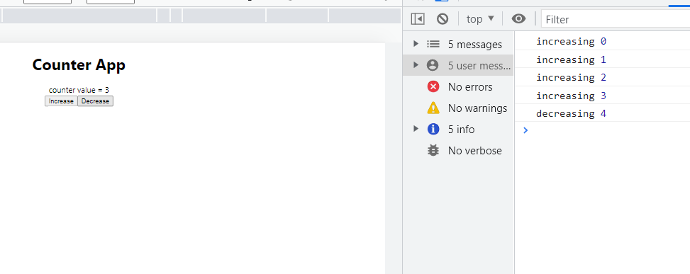

### Counter App 
> Counter.js 
```bash 
import React, { Component } from 'react';

class Counter extends Component {
    constructor(props){
        super(props)

        this.state = {
            count: 0
        }

        //were binding both functions, to access their values 
        this.increase = this.increase.bind(this)
        this.decrease = this.decrease.bind(this)
    }

    //we cannot access state variable inside the function, to get access inside the function, we need to bind it, which we do inside the constructor 
    increase(){
      console.log('increasing', this.state.count)
      const newCount = this.state.count + 1
      //whenever you want to update the state, you use inbiult function in react called as this.setState()
      //this.setState({ count : 10})

      this.setState({count: newCount})
    }

    decrease(){
        console.log('decreasing', this.state.count)
        const newCount = this.state.count - 1

        this.setState({count: newCount})
    }

  render() {
    return (
       <>
        <div className='counter'>counter value = {this.state.count}</div>
        <button onClick={this.increase}>Increase</button>
        <button onClick={this.decrease}>Decrease</button>
       </>
    );
  }
}

export default Counter;
```
> App.js 
```bash 
import logo from './logo.svg';
import './App.css';
import Counter from './Counter/Counter';

function App() {
  return (
    <div className="App">
      <h1>Counter App</h1>
      <Counter></Counter>
    </div>
  );
}

export default App;
```



