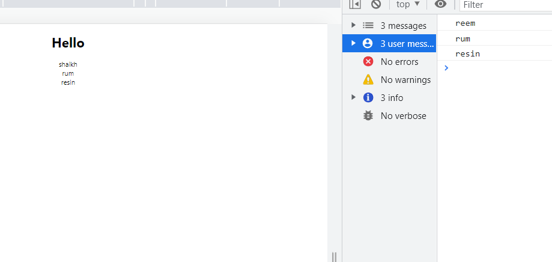

#### Reusing card components
> App.js 
```bash 
import logo from './logo.svg';
import './App.css';
import Card from './Component/Card'

//app component is rendering the card component (it has 3 child components)
//all child components are seperate, but they share the same blueprint, which is rendered 3 times 
function App() {
  return (
    // everything inside return is JSX 
    <div className="App">
     <h1>Hello</h1>
     {/* when display is false for any card component dont display geek, rather display false, to acheive this we'll be using conditional rendering */}
     <Card geek="reem" second="shaikh" display={false}></Card>
     <Card geek="rum"></Card>
     <Card geek="resin"></Card>
    </div>
  );
}

export default App;
```
##### were hardcoding the props in the card component 
> src/components/Card.js (we created custom card component)
```bash 
import React, { Component } from 'react';
✅component is a class in the 'react' library 

//child component extends component class (created by react) - inheritance 
class Card extends Component {

✅To recieve props - call the constructor 
//constructor accepts props object 
  constructor(props){
      //super calls constructor method of parent class: component 
      //super will go to the parent constructor and create an object of the parent constructors component, and we can use that object inside the child component 

      super(props)
  }

  //we can even create functions and call them inside JSX (inside the return statement, in render)
  someFunc(){
      console.log(this.props.geek)
  }

  //we cant write normal if statement in JSX (like the one below), instead we can use conditional rendering (which is basically like ternary operators inside curly braces)
  //const val = if(this.props.display === false) { render display{false}}

  ✅props is just an object with a key:value pair
  render() {
    return <div>

        ✅Conditional Rendering
        // if display=false then print second prop otherwise print first prop 
        {this.props.display === false ? this.props.second : this.props.geek}

        {/* calling function inside return */}
        {this.someFunc()}
    </div>;
  }
}

export default Card;
```


#### State 
- each component in react accepts props (passed to it by its parent)
- each component can also have its own data (which is called state) apart from the props that are passed to it by its parent 

***State is the data of the component itself**
> src/component/Card.js 
```bash 
import React, { Component } from 'react';

class Card extends Component {
  constructor(props){
      super(props)

      ✅to store state inside Card component 
      //create a state object inside constructor 
      this.state = {
          cardHeading : "card heading"
      }

      //storing data inside the component using state 
      //state variables are key:value pairs 
  }


  //props is just an object with a key:value pair
  render() {
    return <div>
        {/* this data is coming from the prop */}
        {this.props.display === false ? this.props.second : this.props.geek}

        ✅this data is not coming from the prop - state; its the data of the Card component */}
        <h3>{this.state.cardHeading}</h3>
    </div>;
  }
}

export default Card;
```
> App.js 
```bash 
import logo from './logo.svg';
import './App.css';
import Card from './Component/Card'

//app component is rendering the card component (it has 3 child components)
//all child components are seperate, but they share the same blueprint, which is rendered 3 times 
function App() {
  return (
    // everything inside return is JSX 
    <div className="App">
     <h1>Hello</h1>
     {/* when display is false for any card component dont display geek, rather display false, to acheive this we'll be using conditional rendering */}
     <Card geek="reem" second="shaikh" display={false}></Card>
     <Card geek="rum"></Card>
     <Card geek="resin"></Card>
    </div>
  );
}

export default App;
```


#### Creating state for App component 
> App.js 
```bash 
import logo from './logo.svg';
import './App.css';
import Card from './Component/Card'
import React, {Component} from 'react'

class App extends Component {
  //adding state to App component as well 

  //since its not taking props from anywhere, were not mentioning props 
  constructor(){
    super();

    this.state = {
      name: "bill gates"
    };  
  }

  render() {
  return (
    <div className="App">
     <h1>Hello</h1>
     {/* displaying state of the App.js */}
     <h2>{this.state.name}</h2>

    {/* reusing card components and passing props to child component */}
     <Card geek="reem" second="shaikh" display={false}></Card>
     <Card geek="rum"></Card>
     <Card geek="resin"></Card>
    </div>
  );
}
}

export default App;
```
> Card.js 
```bash 
import React, { Component } from 'react';

class Card extends Component {
  constructor(props){
      super(props)

      //to store state inside Card component 
      //create a state object inside constructor 
      this.state = {
          cardHeading : "card heading"
      }
      //storing data inside the component using state 
      //state variables are key:value pairs 
  }

  someFunc(){
      console.log(this.props.geek)
  }

  //props is just an object with a key:value pair
  render() {
    return <div>
        {/* this data is coming from the prop */}
        {this.props.display === false ? this.props.second : this.props.geek}
        {this.someFunc()}

        {/* this data is not coming from the prop - state; its the data of the Card component */}
        <h3>{this.state.cardHeading}</h3>
    </div>;
  }
}

export default Card;
```


#### We can also have more than one state defined in one component 
```bash 
import logo from './logo.svg';
import './App.css';
import Card from './Component/Card'
import React, {Component} from 'react'

class App extends Component {
//adding state to App component as well 

//since its not taking props from anywhere, were not mentioning props 
  constructor(){
    super();

    ✅here we have more than one state object, but usually we only define one 
    this.state = {
      ✅state variable 
      name: "bill gates"
    };  

    this.something = {
      name: "steve Jobs"
    }
  }

  render() {
  return (
    <div className="App">
     <h1>Hello</h1>
     {/* displaying state of the App.js */}
     <h2>{this.state.name}</h2>
     <h2>{this.something.name}</h2>

    {/* reusing card components and passing props to child component */}
     <Card geek="reem" second="shaikh" display={false}></Card>
     <Card geek="rum"></Card>
     <Card geek="resin"></Card>
    </div>
  );
}
}

export default App;
```


#### We can even pass the state of the Parent component inside the props of the child component 
> passing state of the App.js component inside the props of the Card.js component 
```bash 
import logo from './logo.svg';
import './App.css';
import Card from './Component/Card'
import React, {Component} from 'react'

class App extends Component {
  //adding state to App component as well 

  //since its not taking props from anywhere, were not mentioning props 
  constructor(){
    super();

    ✅you can give any name to the state variable name 
    ✅for instance, state variable over here is state 
    this.state = {
      name: "bill gates"
    };  

    ✅state variable over here is called something
    this.something = {
      name: "steve Jobs"
    }
  }

  render() {
  return (
    <div className="App">
     {/* displaying state of the App.js */}
     <h2>{this.state.name}</h2>
     <h2>{this.something.name}</h2>

    {/* reusing card components and passing props to child component */}
     <Card name="" geek="reem" second="shaikh" display={false}></Card>

     ✅passing state of the app component inside child components props
     ✅the state  of the app component is now passed to the child component through props
     <Card name={this.state.name} geek="rum"></Card>
     <Card name={this.something.name} geek="resin"></Card>
    </div>
  );
}
}

export default App;
```
> Card.js 
```bash
import React, { Component } from 'react';

class Card extends Component {
  constructor(props){
      super(props)
  }

  //props is just an object with a key:value pair
  render() {
    return <div>
        ✅accessing state of app component that we passed 
        <h2>{this.props.name} : {this.props.geek}</h2>

    </div>;
  }
}

export default Card;
```


#### Accessing the state in a function 
> App.js (when you click on the button, the state of App component is shown on the console)
```bash 
import logo from './logo.svg';
import './App.css';
import Card from './Component/Card'
import React, {Component} from 'react'

class App extends Component {
  //adding state to App component as well 

  //since its not taking props from anywhere, were not mentioning props 
  constructor(){
    super();

    this.state = {
      name: "bill gates"
    };  

    ✅we binded the function over here 
    this.changeState = this.changeState.bind(this)
  }

  ✅we cannot use the state of App.js in a function (because it is outside the render)
  changeState(){
    console.log(this.state.name)

    //so this will throw error 
    //in order to use {this.state.name} inside function, we need to bind that function 
  }

  render() {
  return (
    <div className="App">
     {/* displaying state of the App.js */}
     <h2>{this.state.name}</h2>

    {/* reusing card components and passing props to child component */}
     <Card name="" geek="reem" second="shaikh" display={false}></Card>
     {/* passing state of the app component */}
     <Card name={this.state.name} geek="rum"></Card>

     <button onClick={this.changeState}>click me</button>
    </div>
  );
}
}

export default App;
```


