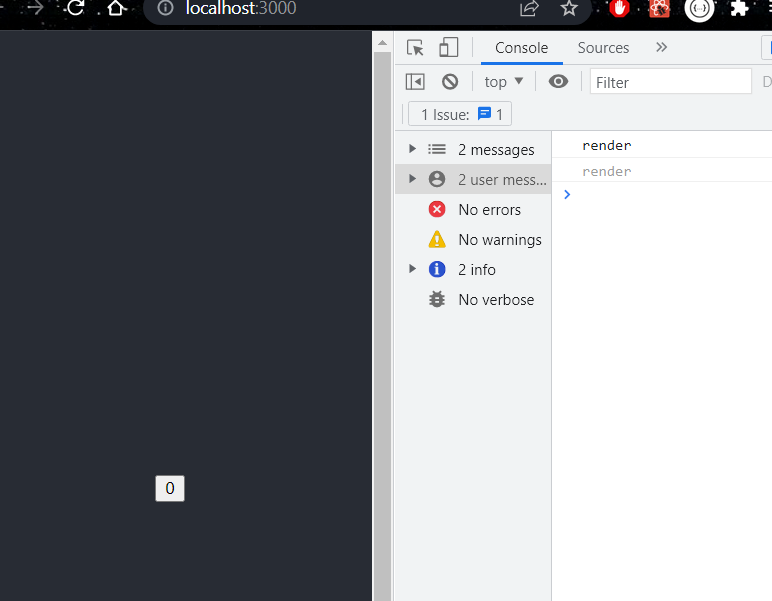
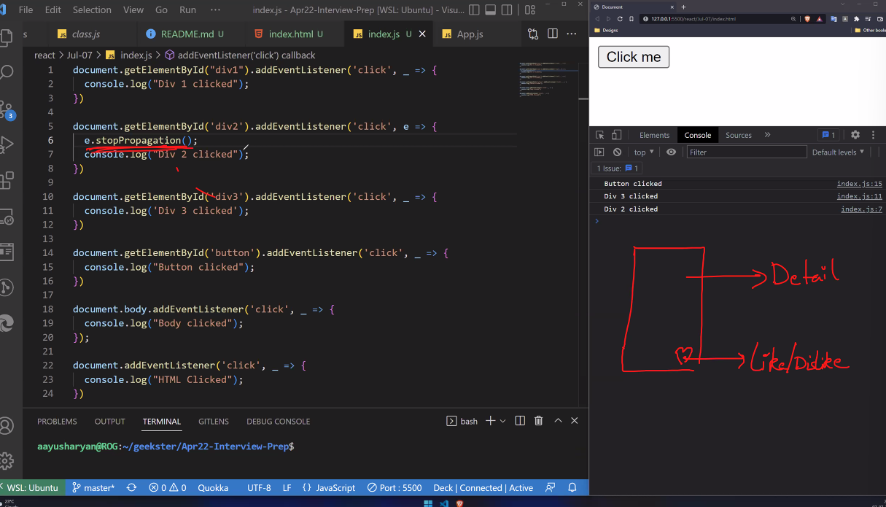

## Class Based Components 
- In your whole React app, you can have a few functional components and a few class components 

#### 2 ways of defining components in class based components 
> step 1
```bash
import React from 'react'

export default class Classcom extends React.Component {
  render() {
    return (
      <div>Classcom</div>
    )
  }
}
```
> step 2
```bash
import React, { Component } from 'react'

export default class Classcom extends Component {
  render() {
    return (
      <div>Classcom</div>
    )
  }
}
```
### Lifecycle Methods
> Phases:
1. Initialization: first page is initialized
2. Mounting: then methods or functions are mounted 
3. Updation: states are updated 
4. Unmounted: then the method is unmounted. 

> First, constructor initialized, then render is printed, only then the component is mounted 
> Mounting.js 
```bash
import React, { Component } from 'react'
import Nav from './Nav'

export default class Mounting extends Component {

    //first constructor is initialized
  constructor(props) {
    super(props)
    console.log('constructor')

    this.state= {
        show: true
    }
  }

  //third componentdidmount is mounted 
  componentDidMount(){
    console.log('mounted')
  }

  //second render is iniitialized 
  render() {
    console.log('render')
    return (
      <>
      <h1>lifecycle methods</h1>
      {this.state.show ? <Nav/> : null}
      <button onClick={() => {this.setState({show: !this.state.show})}}>toggle nav</button>
      </>
    )
  }
}
```
> Nav.js 
```bash
import React, { Component } from 'react'

export default class Nav extends Component {

  componentWillUnmount(){
    console.log('unmounted')
    }

  render() {
    return (
      <div>Nav</div>
    )
  }
}
```
> Before Toggling 


> after toggling 


### Mounting 

1. constructor 
2. componentWillMount 
3. render 
4. when constructor and html dom is ready -> componentDidMount is called (you can define API calls in this method)
```bash
import React, { Component } from 'react'

export default class ComponentDidMount extends Component {
  constructor(props) {
    super(props)
    console.log('constructor')

    this.state = {
        data: 'false'
    }
  }

  componentDidMount(){
    console.log('componentDidMount')
    this.setState({data: 'true'})
  }

  render() {
    console.log('render')
    return (
      <>
       <h1>ComponentDidMount Life Cycle</h1>
      </>
    )
  }
}

//console:
constructor 
render 
componentDidMount 
componentDidMount 
render 
```
> componentDidMount is same as useEffect with no dependency 

### ComponentWillUnmount 
its a lifecycle method which will be called when component will unmount from the Dom. 
> ComponentWillUnmount.js 
```bash
import React, { Component } from 'react'

export default class ComponentDidMount extends Component {
  constructor(props) {
    super(props)
    console.log('constructor')

    this.state = {
        data: 'false'
    }
  }

  componentDidMount(){
    console.log('componentDidMount')
    this.setState({data: 'true'})
  }

  render() {
    console.log('render')
    return (
      <>
       <h1>ComponentDidMount Life Cycle</h1>
      </>
    )
  }
}
```
> Child.js 
```bash 
import React, { Component } from 'react'

export default class Child extends Component {
  componentWillUnmount(){
    console.log('componentWillUnmount - component is unmounted')
  }

  render() {
    return (
      <div>Child</div>
    )
  }
}
```
> initially 


> after clicking on toggle 


### ComponentDidUpdate 

- when do we use componentDidUpdate?
When state is changed, this lifecycle mthod will be automatically called. 
- componentDidUpdate with state 
- componentDidUpdate with props 
- componentDidUpdate with condition and update state 

> componentDidUpdate.js 
```bash
import React, { Component } from 'react'
import Child2 from './Child2'
export default class ComponentDidUpdate extends Component {

  constructor(props) {
    super(props)
  
    this.state = {
       counter: 0
    }
  }
  
  # it specifies whether the component should update or not
  shouldComponentUpdate(){
    return true 
  }

  componentDidUpdate(prevProps, prevState, snapShot){
    console.log('component updated')

    //specifies the previous state 
    console.log('prev state', prevState)
    //specifies the current state 
    console.log('current state', this.state)

    // if(prevState.counter === this.state.counter) {
    //     console.log('matched')
    // }

    // do not use setState in this method without any condition, if thats done it will go in an infinite loop condition 

    //this runs around 0,1,2 times updating the state till 3 
    // if(prevState.counter < 3){
    //     this.setState({counter: this.state.counter+1})}
    }

  render() {
    console.log('render')
    return (
      <>
      {/* but the button also has another setState attached to it, so it updates the state by 1 here */}
       <button onClick={() => {this.setState({counter: this.state.counter+1})}}>{this.state.counter}</button>
      </>
    )
  }
}

```



### shouldComponentUpdate()
- This lifecycle method will always be invoked before the render(
). If you return false, render() wont occur, and it wont update, if we return true, render() will occur and it will update 

> when return is set to false 


> when return is set to true


### Difference between both the render methods?
- if you want to track before rendering you used shouldComponentUpdate where we get nextProps and nextState 
- then render() occurs 
- if your want to track after rendering you get componentDidUpdate where we get prevProps a prevState, 

### getSnapshotBeforeUpdate()
getSnapshotBeforeUpdate() is invoked right before the most recently rendered output is committed to e.g. the DOM. It enables your component to capture some information from the DOM (e.g. scroll position) before it is potentially changed. Any value returned by this lifecycle method will be passed as a parameter to componentDidUpdate().

This use case is not common, but it may occur in UIs like a chat thread that need to handle scroll position in a special way.
```bash
import React, { Component } from 'react'

export default class ComponentDidUpdate extends Component {

  constructor(props) {
    super(props)

    console.log('props', props.name)
  
    this.state = {
       counter: 0
    }
  }
  
  shouldComponentUpdate(){
    return true
  }

  // youll need to use getSnapshot method with componentdidupdate method
  //in this method you can manipulate the counter state and the changes are shown in the snapshot 
  //in this function were typically just updating the snapshot 
  //changes for snapshot can be seen in the console 
  getSnapshotBeforeUpdate(prevProps, prevState){
    console.log('prevprop snapshot', prevProps.name)
    console.log('propname', this.props.name)
    console.log('snapshot prevstate', prevState)
    return prevState.counter*10
  }

  componentDidUpdate(prevProps, prevState, snapShot){
    console.log('component updated')

    //specifies the previous state 
    console.log('prev state', prevState)
    //specifies the current state 
    console.log('current state', this.state)
    //prevProps specifies what prop is passed 
    console.log('prevprops', prevProps)
    console.log('snapshot', snapShot)

    // if(prevState.counter === this.state.counter) {
    //     console.log('matched')
    // }

    // do not use setState in this method without any condition, if thats done it will go in an infinite loop condition 

    //this runs around 0,1,2 times updating the state till 3 
    // if(prevState.counter < 3){
    //     this.setState({counter: this.state.counter+1})}
    }

  render() {
    console.log('render')
    return (
      <>
      {/* but the button also has another setState attached to it, so it updates the state by 1 here */}
       <button onClick={() => {this.setState({counter: this.state.counter+1})}}>{this.state.counter}</button>
      </>
    )
  }
}
```


### 06-07
In class, there are some added lifecyle methods, for mounting, updating and unmounting. 

1. Mounting phase methods 
- constructor() - Initializion - Dont set network calls here (this.state=fetch calls) because the component is not ready yet. can set the default state here though
- render() - This is JSX which we return 
- componentDidMount() or useEffect(() => {}. []) - Here component is ready, we can do network fetching and initial loading of data and changing of state. Creation of ref, etc. 
2. Update phase methods 
- shouldComponentUpdate() - happens before render(). It specifies whether component should render or not, by returning either true or false 
- render()
- componentDidUpdate() - happens after render(). It returns previousstate of the component 
3. Unmount 
- componentWillUnmount() - write cleanup code 

## Context API 
### How to create context? 
1. we created a component for Context and encapsulated components with it in App.js 
2. created Context.js which is an HOC, we create a context state within the constructor, we define component functions which act as a reducer. we provide an object through AppContext.Provider and provide it to children (you see how its Hoc now). We imported a createContext() object (provides an object)
3. in the component we want to consume the object, we import the createContext Object and we toggle the dark and light theme over here. 

## How to detect internet connection if its offline ? 
Navigator.onLine  

### Event Bubbling and Capturing 
#### Event Bubbling 
```bash
div 1 
  div 2 
    div 3 
      button 
```
> What is Event bubbling 
when were bubbling, it starts from element and the same event bubbles outwards 
```bash
console:
button 
div 3 
div 2 
div 1 
```
> However, when we do we want to stop propogation, we use e.stopPropogation()
```bash
console:
button 
div 3 
div 2 
#we stopped propogation at div 2 
```
> When do we use this stop propogation?
```bash
div contains another functionality to redirect to another page 
  like button 
```
Now we attached the bubbling on like button, so when we click on like button, it would propogate to div, but then the functionality attached to div would not be executed, so to ensure they get executed we simply add stop propogation in like button phase. 


> capturing carries out first, then bubbling happens 

#### Event Capturing 

send third argument as true, which says, this needs to be used in the capturing phase. 


