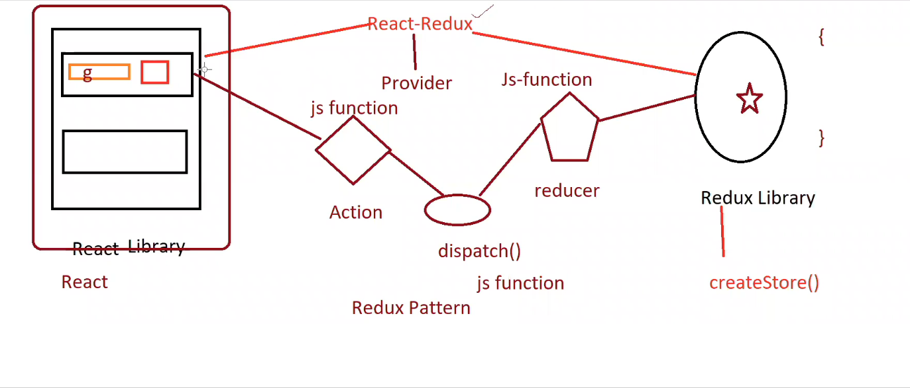

# Redux
state management tool, third party library; you can manage the state of the entire application. 

- State refers to data / information. Managing state means managing data. To manage data for entire application we use redux. 

#### react application at client-side, 
- home component 
When app loads first time home component will be loaded. 

- user component 
When user clicks on user link, show user component, show user info in table format (personal details), info of these users is in a database (store data of bussiness requirment)

when use component loads, from this component a request will be send to the server, server connect to the database and send the all the table in it to the component where data/ state will be updated.

the user component contains table and a button which will redirect to user profile component, to do this you need to pass ID of user from user component to use profile component. 

A request will be made to the server to connect to the database to connect with that ID, based on that ID it fetches some specific data we requested from the table and sends it to the user profile component. 

Note that: were making 2 requests to the server, which is unnecessary. 
1. first request to the dtaabse fetches all data from the table 
2. second request to the dtaabse fetches specific data from the same table

We could find a way where, the when we fetch the first request from the databse, we save it somewhere like a store, so we dont need to send a request to the databse yet once again, it will filter the data based on the ID from the saved store and display it on the user profile component

```bash 
Redux store created in browser, getting data from browser is faster than getting data from database.
```

- user profile component
contains additional table information. 
(professional, educational, address details)

any number of components can now connect to the redux store to store / fetch the data. This way we are manaaging the data.

#### Implementation of redux
- One component wants to store data in redux (How to store the data in redux)
- other component wants to fetch data from redux (How to take data from redux)

> Home Component (parent)
- name component 
```bash
  - text box
  - button- whenever type something in the type field take data from text field and store that data in redux. 
```
- details component 
```bash
  - fetch data from reduxstore and print it on this component. 
``` 

## Redux Pattern
> To Connect Store with react component you need a redux store  

whenever use clicks on the button in home.js you need to store that data to the reduxstore 

// create redux store using redux library 
// createStore is a predefined method - create store and return reference of that store 

// were providing this store to the app component through index.js to pass the data to the entire app component, 
// react-redux has a predefined component called provider using which we can provide redux store to our react component 

//provider component take one prop - were providing store value to the store 

//Provider connects store with the app component 
//key of the prop is store - were providing our store as a value "myStore"


### How do we store data from component to redux?
> Can we store data directly into store using component?
No, To acheive this, a redux pattern is created, to store any data into redux store, you need to follow a redux pattern

##### Redux store 
A reducer is registered with redux store, redux store says in order to connect with react component, the component can pass data to reducer. 

##### React Component 
React component passes its data to action, and action will communicate with the reducer, and store can take the data from the reducer. 

> How can we pass data from action to reducer?
Redux provides a mediator called dispatch, action gives data to dispatch and dispatch gives data to reducer, reducer passes the data to the redux store, where its then stored. 

> Technically, redux is a JS object
- redux store is a global object 
- reducer is a js function
- dispatch is a js function
- action is a js function 
- components are JS function / classes.



#### How reducer works?
> reducer example
```bash 
//reducer takes 2 argumnets 
const nameReducer = (state, action) => {


 return state
 //when dispatch(action) calls this reducer, it will return the state 
}

//component gives data to action
//action passes data to reducer through dispatch
//after dispatch reciebes data from action
//it will be given to reducer 

//dispatch gives data to reducer and store it inside action object 
//action will take that data and give it to the 'state'
//state is stored in the reduxstore 
```

### How to connect reducer with redux store?
import reducer in the redux store and register it inside the store, 

- store gives a method called combineReducers, which combines all the reducers that the app creates.
- pass reducer as a property inside the combineReducer which takes value as an object 
```bash 
// importing reducer in store.js 

// combining reducers 
const CombinedReducers = combineReducers({
  nameReducer, // nameReducer:nameReducer
  cityReducer,
});
```
#### Registering Reducer with store
> pass cominereducers to the createstore a the first argument 
```bash 
const myStore = createStore(CombinedReducers)
```

### Creating Reducers
> The state object passed at the reducer, will be passed to the reduxStore via dispatch(actions)
> reducers/cityReducer.js
```bash 
// state can be stored as a string or an object 
// its recommended to store it as an object 

// over here, state is stored a string, in the nameReducer state is stored as an object 
const cityReducer = (state = "My city Reducer", action) => {
    return state;
  };
  
  export default cityReducer;
```
> reducers/nameReducer.js 
```bash 
const nameReducer = (
  //state stored as an object 
    state = {
      name: "",
      eamil: "",
    },
    action) => {
    switch (action.type) {
      case "NAME":
        state = {
          ...state, //name: "",
                   // eamil: "",
          name: action.payload,

        };
        break;
    }
    return state;
  };
  
  export default nameReducer;
```
> What is action.type?
```bash 
action = {
  //inside object, we have a mandatory value, type
  type: "NAME",
  payload: data,

  //optional property; payload,this is where we will pass the data 
}

action.type means matching case with the type declared inside action
```
> what is the significance of spread operator?
```bash 
Copies all the properties from state object, 

In the above example the properties of state object are name and email 

state = {
  name: "",
  email:"",
}

It copies these properties and pastes it inside the state object (...state)
```

> The state object is returned at the store inside combinedReducers which then dispatches these states to the store

> store.js
```bash 
const CombinedReducers = combineReducers({
  nameReducer, // nameReducer:nameReducer
  cityReducer,

  //key: value or 
  //property: state 
});
```
### Number of reducers you create, those many number of properties are created. 
> reducername: state 
```bash 
//keyname = reducername
//value = state which is an object inside which we will maintain the data inside the redux store 

const CombinedReducers = combineReducers({
  // this is one reducer 
  nameReducer: {
    name: ""
  }

  // this is another reducer 
  cityReducer: {
    name: "",
    email: "",
  }

});
```
#### Creating Action
> Name.js 
```bash 
import React, { Component } from "react";
import nameAction from "../../Actions/nameAction";
import { connect } from "react-redux";

class Name extends Component {
  constructor(props) {
    super(props);
    this.state = {
      username: "",
    };
  }

  sendDataToAction = () => {
    // alert(this.state.username);

    //calling the action in this function
    //action will be embedded inside dispatch 
    //action will be send to reducer 
    //reducers will be combined under combineReducers
    //combinereducers is stored inside store.js where that state can be accesed to the entire app 

    nameAction(this.state.username);
  };
  render() {
    return (
      <div className="container">
        <div className="row">
          <div className="col-6">
            <div className="card">
              <div className="card-header bg-dark text-white">
                <h2>Name Component</h2>
              </div>

              <div className="card-body">
                <input
                  type="text"
                  placeholder="Enter Name"
                  className="form-control"
                  onChange={(e) => {
                    //capturring dtaa user enters inside the state 
                    this.setState({
                      username: e.target.value,
                    });
                  }}
                />
                {/* when user clicks on this button, invoke this function */}
                <button
                  className="btn btn-primary mt-2"
                  onClick={this.sendDataToAction}
                >
                  Send Data to Redux
                </button>
              </div>
            </div>
          </div>
        </div>
      </div>
    );
  }
}

export default connect(null, (dispatch) => {
  return {
    dispatch,
  };
})(Name);
```
#### How can we get dispatch() function ?
1. connect method using react-redux library 
2. using store 

> In this this example, we'll be discussing with store, using myStore.dispatch()
Actions/Nameaction.js
```bash 
import myStore from "../ReduxStore/MyStore";
const nameAction = (data) => {

  // store provides a dispatch method 
  //dispatch is a function which takes an argument which is an object type.
  //everything defined isnide dispatch is an action 

  //   myStore.dispatch({
  //     type: "NAME",
  //     payload: data,
  //   });

  //dispatch calls the reducer function, and the object passed at the dispatch (which we got from the name.js component ), is stored inside action (the argument in nameReducer.js)

  dispatch({
    type: "NAME",
    payload: data,
  });
};
export default nameAction;
```

At the reducer function, it will try to match type of the action with the cases.
> 
```bash 
const nameReducer = (
    state = {
      name: "",
      eamil: "",
    },
    action) => {
    switch (action.type) {
      case "NAME":
        state = {
          ...state, //name: "",
                   // eamil: "",
          name: action.payload,

          //action.payload is the data were getting from nameAction.js which stores payload: data
          //action is getting the data from the name.js component, which takes the input entered by the user and when the user clicks on the button it passes the data to the Action function
        };
        break;
    }
    return state;
  };
export default nameReducer;
```
### How to see state of the redux?
> There are many ways, one of the ways is reduxLogger, for this install redux logger library 
```bash 
npm i redux-logger
```
> How data is stored in the redux store is shown in the redux logger.

To import reduxLogger into the Mystore.js, import these 
```bash 
import { createStore, combineReducers, applyMiddleware } from "redux";
import logger from "redux-logger";
```
> MyStore.js 
```bash 
import { createStore, combineReducers, applyMiddleware } from "redux";
import logger from "redux-logger";
import nameReducer from "../Reducers/nameReducer";
import cityReducer from "../Reducers/CityReducer";

const CombinedReducers = combineReducers({
  nameReducer, // nameReducer:nameReducer
  cityReducer, // cityReduer:cityReducer 
});

// pass applyMiddleWare as a second argumnet to myStore object 
const myStore = createStore(CombinedReducers, applyMiddleware(logger));

// pass logger as a first argumnent in applyMiddleware function


export default myStore;
```
> Now, we've stored the data in redux store from the react component 


