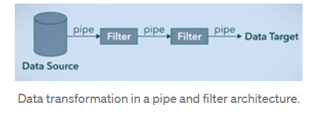
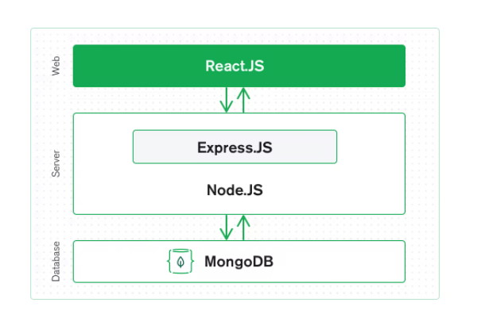
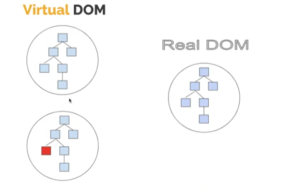
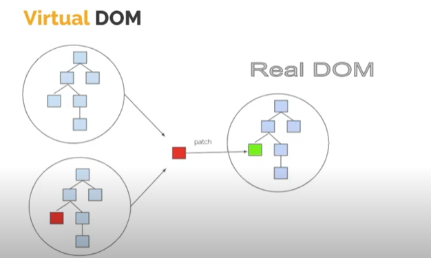

#### Some Architecture patterns in enterprise software dev
An architectural pattern is a general, reusable solution to a commonly occurring problem in software architecture

1. Layered pattern / 3 tier architecture 
software divided into units called layers, used for biulding relatively simple web app. 
- presentation layer 
- application layer 
- data access layer 

A 3-tier architecture is an architecture pattern used in applications as a specific type of client-server system. It divides the architecture into three tiers: data layer, application layer, and presentation layer. 

The 3-tier architecture refers to the logical 3-tier system rather than the physical ones. It adds a “middle tier” between the client and the database. The main functions and business logic of the system are processed in the middle layer, which is the application layer.


2. Pipe-filter pattern 
divides larger tasks into individual filters whih are connected by pipes; used for biulding compilers 

 It starts at a data source, arrives at a filter’s input port(s) where processing is done at the component, and then, is passed via its output port(s) through a pipe to the next filter, and then eventually ends at the data target.
 

3. client-server pattern 
The Client-server model is a distributed application structure that partitions task or workload between the providers of a resource or service, called servers, and service requesters called clients. In the client-server architecture, when the client computer sends a request for data to the server through the internet, the server accepts the requested process and deliver the data packets requested back to the client.

### 4. MVC pattern 
Model View controller is a design pattern to write and manage code. MVC helps you to better organize your code, makes code independent of each other, thus enhance the scalability of code.

This is a software architecture that separates program logic into three interconnected components i.e. the Model, View, and Controller components. The reason for this separation is to create an individual representation of data from user input to presentation of data to users. What this means is that the MVC architecture allows developers to separate the way data is collected from users from how data is presented to users.
```bash 
M - Model 
V - View 
C - Controller
```

The Model-View-Controller (MVC) is an architectural pattern that separates an application into three basic components: the model, the view, and the controller. Each of these components are built to handle specific development aspects of an application. 

1. user makes a request 
2. based on url requested server will send the entire information to the controller 
3. The controller handles the request flow 
4. Controller acts as an intermediatory between model and view 
5. Controller tells the model what to do, also the controller handles the failure and request 
6. Model is responsible for handling all data request logic
7. model interacts with the database
8. After interacting with the model, controller interacts with the view to render the data to the user 
9. The view is responsible for the presentation of the data on the view layer
10. view sends the final presentation to the controller, and the controller sends the response to the user 

### React is the view layer of MVC 
when React is combined with a javascript backend, then it is MVC. React serves as the “V” in the MVC

#### Model
The Model is the component that manages the data of the application. This is the central part of the MVC architecture, it receives commands from the Controller and executes the input of the user. This component doesn’t rely on the user interface as it gets commands directly from the Controller. 

> Some inputs from users don’t need to be sent to the Model as they don’t require data management.

For instance, data from user input (APIs, JSON objects, etc.) are sent to the Model. The Model then manages this data and sends it to the controller which then sends it to the view. 

#### Controller
The Controller component is the connector between the Model and View components. 

This component is the brain of your application, it is in charge of converting input from View into commands. These commands determine how information is displayed in the View or processed in the Model.

#### View
The View component is in charge of the final information that will be represented in the user interface.

This component receives input from the user and also displays information from the Controller to the user.

### Which stack does MERN follow?
The MERN architecture allows you to easily construct a 3-tier architecture (frontend, backend, database)

#### Mern Stack


### React.js Front End
The top tier of the MERN stack is React.js, the declarative JavaScript framework for creating dynamic client-side applications in HTML. **React lets you build up complex interfaces through simple Components, connect them to data on your backend server, and render them as HTML.**

React’s strong suit is handling stateful, data-driven interfaces with minimal code and minimal pain, and it has all the bells and whistles you’d expect from a modern web framework: great support for forms, error handling, events, lists, and more.

### Express.js and Node.js Server Tier
The next level down is the Express.js server-side framework, running inside a Node.js server. Express.js bills itself as a “fast, unopinionated, minimalist web framework for Node.js,” and that is indeed exactly what it is.

 Express.js has powerful models for URL routing (matching an incoming URL with a server function), and handling HTTP requests and responses.

By making XML HTTP Requests (XHRs) or GETs or POSTs from your React.js front-end, you can connect to Express.js functions that power your application. Those functions in turn use MongoDB’s Node.js drivers, either via callbacks for using Promises, to access and update data in your MongoDB database.

Node. js® is a JavaScript runtime built on Chrome's V8 JavaScript engine.
Node.js is an open-source and cross-platform runtime environment for executing JavaScript code outside a browser.

### MongoDB Database Tier
If your application stores any data (user profiles, content, comments, uploads, events, etc.), then you’re going to want a database that’s just as easy to work with as React, Express, and Node.

That’s where MongoDB comes in: JSON documents created in your React.js front end can be sent to the Express.js server, where they can be processed and (assuming they’re valid) stored directly in MongoDB for later retrieval. 

MongoDB was designed to store JSON data natively (it technically uses a binary version of JSON called BSON), and everything from its command line interface to its query language (MQL, or MongoDB Query Language) is built on JSON and JavaScript.

MongoDB works extremely well with Node.js, and makes storing, manipulating, and representing JSON data at every tier of your application incredibly easy. For cloud-native applications, MongoDB Atlas makes it even easier, by giving you an auto-scaling MongoDB cluster on the cloud provider of your choice, as easy as a few button clicks.

#### How does the MERN stack work together?
> lets understand through an example 

- Now, a customer visits the web app to shop for a t-shirt. So from the link provided on the web page, the user reaches the t-shirt page. But how we will get data from the backend?

- User visits our react based landing page.

- The user clicks on the link to buy a t-shirt. And the t-shirt page is rendered without reloading the page as it is a single-page application.

- But at this point, we do not have any data on the t-shirt, that is, the state is empty. So, we will make an API call to fetch the data from the backend.

- As the data fetching process is asynchronous it will take more time. In the meantime, we will show a loading GIF to the user.

- While at the backend, the ExpressJS looks the endpoint that has been hit and execute the related controller function to retrieve the data.

- In the controller, we can use mongoose to query the database, get the data and return it in JSON format.

- JSON data is then sent back to React where the state is updated with the fetched data.

- WIth the updated state, React will re-render the component and replace loading GIF with the t-shirt information.

So, that’s how MongoDB, React, Express and node work together.
-----

### DOM VS Virtual DOM 


#### DOM
Browser converts web document to DOM, so it can manipulated / modified. Reading and writing to the DOM is slower than doing CRUD operation on the JS object 

#### Virtual DOM 
virtual DOM is a JS object. virtual representation of the real DOM.

1. React makes a virtual copy of DOM which will be a virtual representation of current DOM
2. whenever we make any changes in the app,  it gets re-rendered to one of the virtual representation of the DOM. which basically means, react makes another virtual copy of the DOM, which includes the changes we made in it
3. comparison is then done between both the virtual DOM copies, by the diffing algorithm
3. the change is then isolated from both the virtual DOM copies and added it to the Real DOM. Reconciliation is the process through which React updates the Browser DOM. 


#### What makes React so fast?
React interacts with the virtual DOM and when it sees a change it updates it to the actual DOM. 

### Why use react?
1. updates and renders only the elements that update in the DOM, hence quick rendering. 
2. through react we can biuld encapsuated components that can manager their own state 
3. React can also render on the server using Node, react can also render powerful mobile apps using react native. 
```bash 
ReactJS is a JavaScript library, supporting both front-end web and being run on a server, for building user interfaces and web applications. It follows the concept of reusable components.

React Native is a mobile framework that makes use of the JavaScript engine available on the host, allowing you to build mobile applications for different platforms (iOS, Android, and Windows Mobile) in JavaScript that allows you to use ReactJS to build reusable components and communicate with native components further explanation

Both follow the JSX syntax extension of JavaScript. Which compiles to React.createElement calls under the hood. 

Both are open-sourced by Facebook.
```
#### History of React 
1. created by Jordan Walke, soft eng. at facebook 
2. first deployed on facebook in 2011 and on instagram in 2012 
3. open sourced at JS Conference US in 2013 

