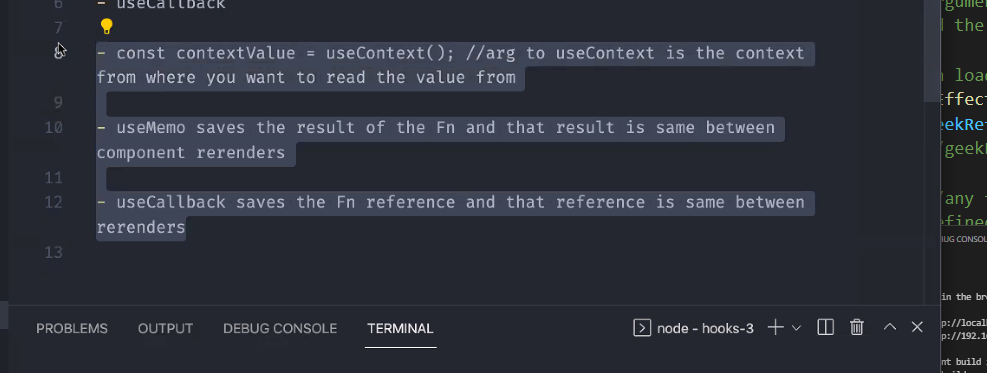
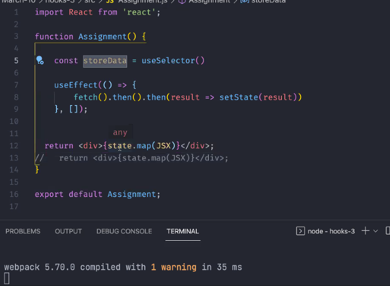

#### Memoization (useMemo hook)
- remembering some value and not doing the calculation again and again instead store the value, so you dont need to run it again 

> for example, this function will take time to run 
```bash 
const expensiveFn = () => {
  let num = 0
  for(let i=0; i<10000000000000; i++){
    num= num + i 
  }
  return num
}
```
> What's the use of useMemo?
> App.js
```bash 
import logo from './logo.svg';
import './App.css';
import {React, useState, useMemo} from 'react';
import Todos from './Todos';

function App() {

  const [count, setCount] = useState(4)
  const [todos, setTodos] = useState([])

  // instead of re-running this function, the value of it is stored inside resultofExFn
  //const resultofExFn = expensiveFn()

  //Evertime component is re-rendered, it keeps re-rendering

  //we need to implement some feature known as usememo hook, where it stores the data of the function thats already called

  //it takes a callback and dependency array (even if anything change inside the array)
  const resultofExFn = useMemo(() => expensiveFn(count), [count])
  //function depends on count variable 
  //run this useMemo function everytime the count variable is changing 

  //note that count value increases rapidly, because this function is run once and value is stored, it not run again and again 

  //therefor performance increases drastically 

  //expensiveFn(count) is depended on the value of count 

  //what can we do when count changes a new expensive function will be run and a new value will be stored based on the new count, to acheive this pass count inside dependency array 

  //however, count will still take some time to increase its value 

  //so this is a compromise were making, addtodo works completely fine time interval
  //count is taking time every time we click on the button cs the value we pased is huge its like 1000000000000000

  const increase = () => {
    setCount(count + 1)
  }

  const addTodo = () => {
    setTodos((prevTodos) => [...prevTodos, "some new task"])
    //return array with previostodos and some new task

    //setTodos(todos.push('some new task"))
    //above statement is same as this code, its pushing a new element to the existing array 
  }

  return (
    <div className="App">
      <header className="App-header">
        {/* were printing the result that is stored inside resultToExFn */}
        geekster = {resultofExFn}

        <Todos todos={todos} addtodo={addTodo}/>

        <p>count: {count}</p>
        <button onClick={increase}>count</button>
      </header>
    </div>
  );
}

const expensiveFn = (num) => {
  // let num = 0
  for(let i=0; i<100000000000000; i++){
    num= num + i 
  }
  return num
}

export default App;
```
> Todos.js 
```bash 
import React from 'react'

const Todos = (props) => {
  //const todos = props.todos 
  //const addTodo = props.addTodo

  //in array, we could namee them whatever 
  const {todos, addTodo} = props

  return <div>
      {/* display the list using map */}
      {todos.map((item, index) => {
          return (
              <div key={index}>
                  <p>{item}</p> 
              </div>
          )
      })}
      {/*
         take item as an argumnet, whee item is each eleemnt of an array
         return an array of JSX

         every item should have a unique key 
         map gives index along with the item you can set it as the key 
       */}
       <button onClick={addTodo}>add todo</button>
  </div>
}

export default Todos 
```
### UseRef
The useRef Hook allows you to persist values between renders. It can be used to store a mutable value that does not cause a re-render when updated. It can be used to access a DOM element directly.

Obect which has current property which has some property 
when your attaching it to some element 

> App.js 
```bash 
import logo from './logo.svg';
import './App.css';
import {React, useState, useMemo, useRef, useEffect} from 'react';
import Todos from './Todos';

function App() {

  const [count, setCount] = useState(4)
  const [todos, setTodos] = useState([])
  const resultofExFn = useMemo(() => expensiveFn(count), [count])
 
  //create ref
  const geekRef = useRef(0)
  //useref can take an argumnent 

  //on loading of page, focus on input field 
  useEffect(() => {
    geekRef.current.focus()
    //geekRef is an object which has current property
  }, [])

  const increase = () => {
    setCount(count + 1)
  }

  const addTodo = () => {
    setTodos((prevTodos) => [...prevTodos, "some new task"])
  }

  return (
    <div className="App">
      <header className="App-header">
        {/* were printing the result that is stored inside resultToExFn */}
        geekster = {resultofExFn}

        {/* NOTE THAT: ref is an attribute */}
        <input ref={geekRef}/>

        <Todos todos={todos} addtodo={addTodo}/>

        <p>count: {count}</p>
        <button onClick={increase}>count</button>
      </header>
    </div>
  );
}

const expensiveFn = (num) => {
  // let num = 0
  for(let i=0; i<100000000000000; i++){
    num= num + i 
  }
  return num
}

export default App;
```
### useCallback 
in useMemo it saves result of the function and that result is same between component re-renders. 
- use callback saves the fn reference and that reference is same between re-renders 

> What happens when app is re-rendered?
every time component re-rendered increase function is updated again and again 
```bash 

  const increase = () => {
    setCount(count + 1)
  }

```
we want to keep the reference of increase functionn same between re-renders for which we use useCallback. 

were not saving the value like usememo saves. 


> assignment:
- fetch and store it inside store and display it in return by reading it from redux store using useSelector()



