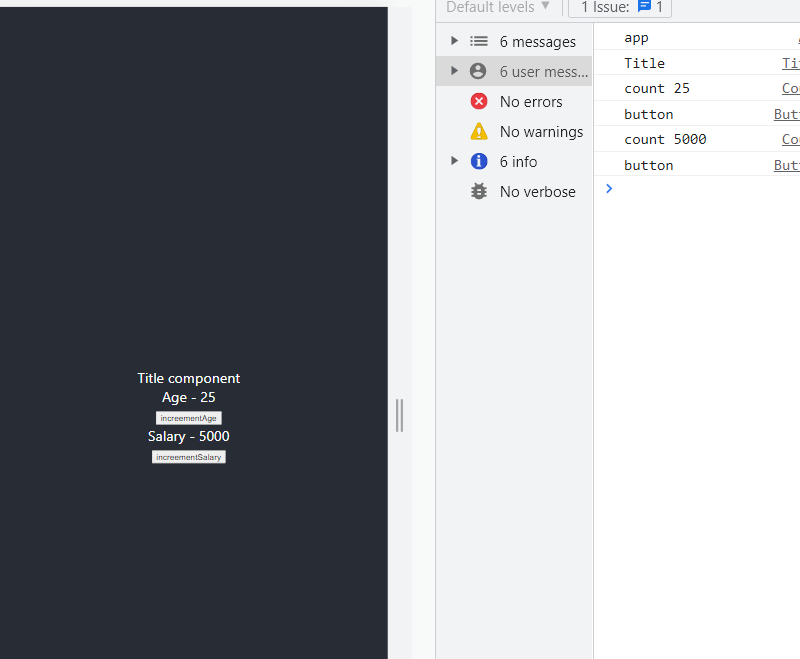
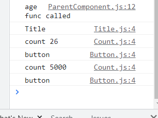
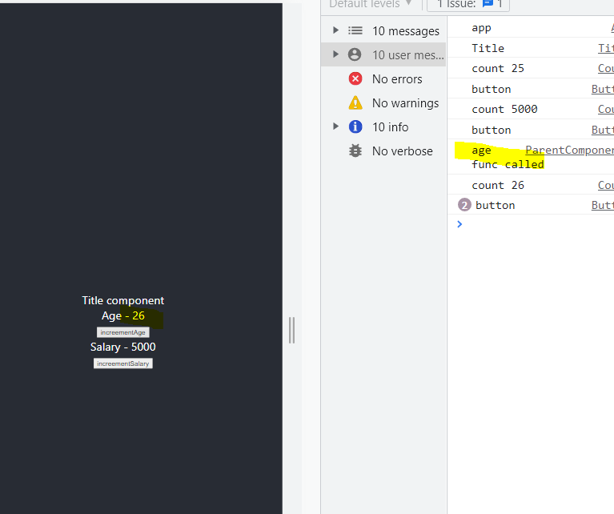
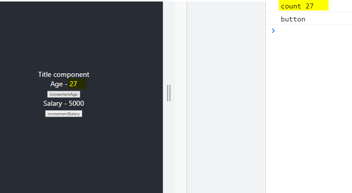

### useCallback hook 

> Understanding Performance optimization:
- we created one parent component: ParentComponent
- we created 3 child components: title, count and button
- inside the count component, we pass 2 different states defined inside ParentComponent.js 

> App.js
```bash 
import logo from './logo.svg';
import './App.css';
import ParentComponent from './components/ParentComponent'

function App() {
  console.log('app')
  return (
    <div className="App">
      <header className="App-header">
        <ParentComponent/>
      </header>
    </div>
  );
}

export default App;
```

> ParentComponent.js 
```bash 
import React, {useState} from 'react'
import Count from './Count'
import Button from './Button'
import Title from './Title'

function ParentComponent() {
  const [age, setAge] = useState(25)
  const [salary, setSalary] = useState(5000)

  const increementAge = () => {
      setAge(age + 1)
      console.log('age func called')
  }

  const increementSalary = () => {
      setSalary(salary + 1000)
      console.log('sal func called')
  }

  return (
    <div>
        <Title/>
        <Count text='Age' count={age} />
        <Button handleClick={increementAge}>increementAge</Button>
        <Count text='Salary' count={salary} />
        <Button handleClick={increementSalary}>increementSalary</Button>
    </div>
  )
}

export default ParentComponent
```

> Count.js 
```bash 
import React from 'react'

function Count({text, count}) {
  console.log(`count ${count}`)
  return (
    <div>{text} - {count}</div>
  )
}

export default Count
```

> Button.js 
```bash 
import React from 'react'

function Button({handleClick, children}) {
  console.log('button')
  return (
    //props.children refers to whats defined between the button tags in ParentComponent.js 
    <div>
        <button onClick={handleClick}>
            {children}
        </button>
    </div>
  )
}

export default Button
```

> Title.js 
```bash 
import React from 'react'

function Title() {
  console.log('Title')
  return (
    <div>Title component</div>
  )
}

export default Title
```
> Initially this is on the console.


Notice that: everytime use clicks on increement Age, the entire page is re-rendered and increement salary is also re-rendered. 


However, this would beecome a problem if we have alot of components and if every time we click on a single component all the components are rendered, this would cause performance issues, 

### How do we increase the performance then?
By restricting re-renders of the component that is not updated, and only updating the component that needs to be re-rendered.

#### React.memo (Higher Order Component)
Through memo we can prevent a functional component from being re-rendered if its prop / state dont change.

> To acheive this we wrap our component inside React.memo (Note that: React.memo is not a hook, its a feature inbuilt from react v6)

#### This is the only change we added to the following components
> Title.js 
```bash 
export default React.memo(Title)
```

> Button.js 
```bash 
export default React.memo(Button)
```

> Count.js 
```bash 
export default React.memo(Count)
```

> Note that: only age component is called. However the button for increement salary also re-renders.

### How do we fix this problem? 
> useCallback hook to the rescue.

### useCallback hook 
useCallback is a hook that will return a memoized version of the callback function that only changes if one of the dependencies has changed.

> In the above example, useCallback hook will cache the increementSalary button and return that if salary is not incremented. 
> If salary is increemented, i.e the dependency has changed, only then the new function will be returned.

### Why do we need useCallback hook?
It's useful when passing callbacks to optimized child components that rely on reference equality to prevent unnecesary renders. 

- its useful when passing callbacks (like increementAge and increementSalary) from the above example 
- optimized child components are those components wrapped inside React.memo to prevent uneccesary re-renders.
- reference equality - checking if the functions are equal.

#### useCallback syntax 
- Takes callback function as first parameter and array of dependencies as a second parameter.
```bash 
const increementAge = useCallback(() => {
   setAge(age + 1)
}, [age]) 
```

> To acheive useCallback, we've only made these changes in our parent component. 
```bash 
# importing useCallback hook
import React, {useState, useCallback} from 'react'
import Count from './Count'
import Button from './Button'
import Title from './Title'

function ParentComponent() {
  const [age, setAge] = useState(25)
  const [salary, setSalary] = useState(5000)

  // const increementAge = () => {
  //     setAge(age + 1)
  // }

  # embedding state inside a callback and passed as the first parameter inside usecallback hook, by mentioning age inside array delimeter 
  const increementAge = useCallback(() => {
      setAge(age + 1)
  }, [age]) 
      
  // const increementSalary = () => {
  //     setSalary(salary + 1000)
  // }

# These cached functions are passed as a prop to the child components
  const increementSalary = useCallback(() => {
    setSalary(salary + 1000)
  }, [salary]) 

  return (
    <div>
        <Title/>
        <Count text='Age' count={age} />
        <Button handleClick={increementAge}>increementAge</Button>
        <Count text='Salary' count={salary} />
        <Button handleClick={increementSalary}>increementSalary</Button>
    </div>
  )
}

export default ParentComponent
```



