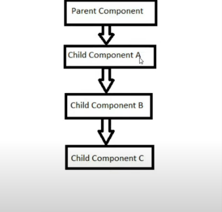

### useContext hook 
Note that Context API is used in class based components and context hook is used in function based components 

#### Discussing Context API 
When we want to pass data to a specific child from the parent vcomponent .

Usually props were passed at every level of the component from top to bottom


React Context API allows you to easily access data at different levels of the component tree without passing props to every level. 

1. createContext() - creates context object 
2. Provider component - used for providing data 
3. Consumer component - used for consuming data 

> App.js
```bash 
import React, { Component, createContext } from 'react'
import ComA from './CompA'

const FirstName = createContext()

const App = () => {
  return (
    <>
    {/* provider has a fixed prop keyname called "value" , through provider were passing this value to all its child components*/}
    <FirstName.Provider value={"reem"}> 
        <ComA />
    </FirstName.Provider>
    </>
  )
}

export default App  
export {FirstName}
```
> ComC.jsx 
```bash 
#imrc
import React from 'react'
import { FirstName } from './App'

const ComC = () => {
return ( 
<> 
<FirstName.Consumer> 
    {(fname) => {
        return <h1>name is {fname}</h1>
    }}
</FirstName.Consumer>
</>
)
}

export default ComC
```
> ComA.jsx
```bash 
import React from 'react'
import ComB from './CompB'

const ComA = () => {
 return <div>
     <ComB />
 </div>

}

export default ComA
```

> ComB.jsx 
```bash 
#imrc
import React from 'react'
import ComC from './ComC'

const ComB = () => {
 return <div>
     <ComC />
 </div>

}

export default ComB
```
> DOM: name is reem 

### Lets pass another value through context API 
> App.js 
```bash 
import React, { Component, createContext } from 'react'
import ComA from './CompA'

const FirstName = createContext()
const LastName = createContext()

const App = () => {
  return (
    <>
    {/* provider has a fixed prop keyname called "value" , through provider were passing this value to all its child components*/}
    <FirstName.Provider value={"reem"}> 
        <LastName.Provider value={"shaikh"}>
          <ComA />
        </LastName.Provider>
    </FirstName.Provider>
    </>
  )
}

export default App  
export {FirstName, LastName}
```
> ComC.js 
```bash 
#imrc
import React from 'react'
import { FirstName, LastName } from './App'

const ComC = () => {
return ( 
<> 
<FirstName.Consumer> 
    {(fname) => {
        # before we added the LastName component, there was <h1>my name is {fname} passed beside return </h1>

        # now to pass our lastname component were placing another fat arrow function inside ( )
        return (
            <LastName.Consumer>
                {(lname) => {
                    return <h1>my name is {fname} {lname} </h1>
                }}
            </LastName.Consumer>
        # however this causes callback hell, since for every new component added, we would need to create a new consumer component inside the return statemnent 

        # this problem is solved using useContext hook 
        )
        
    }}
</FirstName.Consumer>
</>
)
}

export default ComC
```
> ComB.jsx 
```bash 
#imrc
import React from 'react'
import ComC from './ComC'

const ComB = () => {
 return <div>
     <ComC />
 </div>

}

export default ComB
```

> ComA.jsx 
```bash 
import React from 'react'
import ComB from './CompB'

const ComA = () => {
 return <div>
     <ComB />
 </div>

}

export default ComA
```
> DOM: my name is reem shaikh 

Since this approach is causing callback hell, were trying to resolve it using useContext hook.

#### useContext Hook 
> App.js (contents the same)
```bash 
import React, { Component, createContext } from 'react'
import ComA from './CompA'

const FirstName = createContext()
const LastName = createContext()

const App = () => {
  return (
    <>
    {/* provider has a fixed prop keyname called "value" , through provider were passing this value to all its child components*/}
    <FirstName.Provider value={"reem"}> 
        <LastName.Provider value={"shaikh"}>
          <ComA />
        </LastName.Provider>
    </FirstName.Provider>
    </>
  )
}

export default App  
export {FirstName, LastName}
```
> ComC.jsx 
```bash 
#imrc
import React, { useContext } from 'react'
import { FirstName, LastName } from './App'

const ComC = () => {
const fname = useContext(FirstName)
const lname = useContext(LastName)

return ( 
<> 
<h1>name is {fname} {lname}</h1>
</>
)
}

export default ComC
```
> ComB.jsx 
```bash 
import React from 'react'
import ComC from './ComC'

const ComB = () => {
 return <div>
     <ComC />
 </div>

}

export default ComB
```

> ComA.jsx
```bash 
import React from 'react'
import ComB from './CompB'

const ComA = () => {
 return <div>
     <ComB />
 </div>

}

export default ComA
```
DOM: name is reem shaikh
