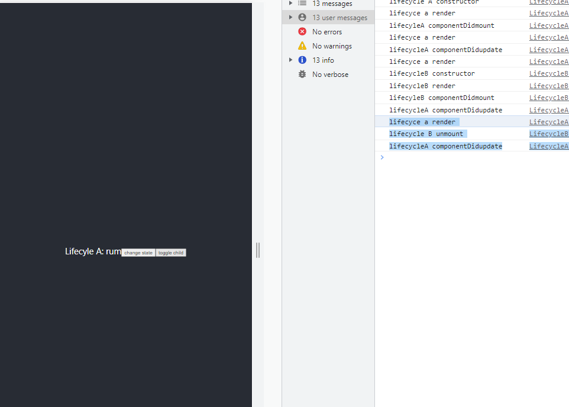

### useEffect Hook
Allows to perform side-effects on a functional component.

> First lets understand `Lifecycle methods` used in class based components. 

#### Lifecyle methods
> Methods for react v16 and above.
1. Mounting - When an instance of a component is being created and inserted into DOM
```bash 
Methods during Mounting phase:

- constructor 
- static 
- getDerivedStateFromProps
- render 
- componentDidMount
```
2. Updating - When a component is being re-rendered as a result of changes to either its props or state 
```bash 
Methods during Updating phase:

- static 
- getDerivedStateFromProps
- shouldComponentUpdate
- render 
- getSnapShotBeforeUpdate
- componentDidUpdate
```
3. Unmounting - When a component is being removed from the DOM.
```bash 
Methods during Unmounting phase:

- componentWillUnmount
```

#### Mounting Lifecycle Methods 
> Discussing the methods:


> LifecyleA.js
```bash 
import React, { Component } from 'react'

class LifecycleA extends Component {
  //rconst
  constructor(props) {
    super(props)
    # ✅1.
    # constructor used for initializing state 
    # Do not pass side-effects (like making AJAX calls) over here 
    this.state = {
       name: 'reem'
    }
    console.log('lifecycle A constructor')
  }

  # ✅2.
  # state of the component depends on changes of props over time   
  static getDerivedStateFromProps(props, state) {
      console.log('lifecyleA getderivedsttaefromprops')
      return null
      # you can set state here 
      # do not pass side effects over here  
  }

  # ✅4.  
  # invoked immediately after a component and all its children components have been rendered to the DOM
  # You can add side-effects over here (i.e you can perform AJAX calls to load data from here)
  componentDidMount(){
      console.log('lifecyleA componentDidmount')
  }

  # ✅3.  
  render() {
    # Read props, state and return JSX 
    # child components are executed inside div tags - if the child components has lifecycle methods, it will be executed over here 
    console.log('lifecyce a render')
    return (
      <div>
          Lifecyle A
      </div>
    )
  }
}

export default LifecycleA
```


#### Adding Parent and child component
> LifecycleB.js
```bash 
import React, { Component } from 'react'

class LifecycleB extends Component {
  //rconst
  constructor(props) {
    super(props)
  
    this.state = {
       name: 'reem'
    }
    console.log('lifecycleB constructor')
  }

  static getDerivedStateFromProps(props, state) {
      console.log('lifecyleB getderivedsttaefromprops')
      return null
  }

  componentDidMount(){
      console.log('lifecyleB componentDidmount')
  }

  render() {
    console.log('lifecycleB render')
    return (
      <div>
          Lifecyle B
      </div>
    )
  }
}

export default LifecycleB
```
> LifecycleA.js 
```bash 
import React, { Component } from 'react'
import LifecycleB from '../LifecycleB'

class LifecycleA extends Component {
  //rconst
  constructor(props) {
    super(props)
    
    this.state = {
       name: 'reem'
    }
    console.log('lifecycle A constructor')
  }

  static getDerivedStateFromProps(props, state) {
      console.log('lifecyleA getderivedsttaefromprops')
      return null
  }

  componentDidMount(){
      console.log('lifecyleA componentDidmount')
  }

  render() {
    console.log('lifecyce a render')
    return (
      <div>
          Lifecyle A
          <LifecycleB />
      </div>
    )
  }
}

export default LifecycleA
```


> What's happening in the code? 
```bash
- A constructor called 
- A getDerivedStateFromProps called
- A render method called 
(A encounters the child component)

- B constructor called 
- B getDerivedStateFromProps called
- B render method called 

- B componentDidMount called - B is mounted on A
- A componentDidMount called - A component is declared inside App.js
```
#### Updating lifecycle Methods:
Methods that are called when components are being re-rendered due to changes in props / changes. 


1. static getDerivedStateFromProps(props, state)
- static method which recieves props and state as parameter and has to return null / updated state of the component.
- called everytime a component is re-rendered.
- its used to set the state 
- do not cause any side effects in this phase.
2. shouldComponentUpdate(nextprops, nextState)
- recieves updated prop / state 
- this method will either return `null` or return `value`, which will be passed down to the render method.
- it dictates whether the component should re-render or not
because by default, all class components will re-render when their state changes or when they recieve props. To remove this render we can set shouldComponentUpdate to return false.
- This method is for performance optimization
- do not cause any side effects in this method 
- rarely used method 
3. render()
- reads this.props and this.state and returns the JSX 
- do not make any side effects over here. Try not to change state over here as well.
4. getSnapshotBeforeUpdate(prevProps, prevState)
- called right before the changes from the virtual DOM are to be reflected in the DOM. 
- this method will either return `null` or return `value`, which will be passed as a third parameter to the next method.
- rarely used method
5. componentDidUpdate(prevProps, prevState, snapshot)
- it takes 3 params: prevProps, prevState and snapshot returned from getSnapShotBeforeUpdate() method.
- this method is called after render on the parent and child components has beeing properly executed after the update.
- you can cause side-effects over here.

> LifecycleA.js - Every time we click on the button. the following methods are executed in this order
```bash 
import React, { Component } from 'react'
import LifecycleB from '../LifecycleB'

class LifecycleA extends Component {
  //rconst
  constructor(props) {
    super(props)
  
    this.state = {
       name: 'reem'
    }
    console.log('lifecycle A constructor')
  }
 
  # ✅1. Everytime an update happens 
  static getDerivedStateFromProps(props, state) {
      console.log('lifecyleA getderivedsttaefromprops')
      return null
  }

  componentDidMount(){
      console.log('lifecyleA componentDidmount')
  }

  # ✅2. 
  shouldComponentUpdate(){
      console.log('lifecyleA shouldcomponentUPDATE')
      return true 
  }

  # ✅4.  
  getSnapshotBeforeUpdate(prevProps, prevState) {
      console.log('lifecycleA getsnapshotbeforeupdate')
      return null
  }

  # ✅5. 
  componentDidUpdate(){
      console.log('lifecycleA componentDidupdate')
  }

  changeState = () => {
      this.setState({
          name: 'rum'
      })
  }

  # ✅3.
  render() {
    console.log('lifecyce a render')
    return (
      <div>
          Lifecyle A: {this.state.name}
          <button onClick={this.changeState}>change state</button>
          <LifecycleB />
      </div>
    )
  }
}

export default LifecycleA
```
> LifecycleB.js
```bash
import React, { Component } from 'react'

class LifecycleB extends Component {
  //rconst
  constructor(props) {
    super(props)
  
    this.state = {
       name: 'reem'
    }
    console.log('lifecycleB constructor')
  }

  static getDerivedStateFromProps(props, state) {
      console.log('lifecyleB getderivedsttaefromprops')
      return null
  }

componentDidMount(){
    console.log('lifecyleB componentDidmount')
}


shouldComponentUpdate(){
    console.log('lifecyleB shouldcomponentUPDATE')
    return true 
}

getSnapshotBeforeUpdate(prevProps, prevState) {
    console.log('lifecycleB getsnapshotbeforeupdate')

    return null
}

componentDidUpdate(){
    console.log('lifecycleB componentDidupdate')
}


  render() {
    console.log('lifecycleB render')
    return (
      <div>
          Lifecyle B
      </div>
    )
  }
}

export default LifecycleB
```


- first the component B is mounted on component A
- as soon as we click on the button, everything highlighted in the blue (image) is consoled, in this order. 
```bash
1. getDerivedStateFromProps A
2. shouldComponentUpdate A
3. render A

4. getDerivedStateFromProps B 
5. shouldComponentUpdate B 
6. render B 

7. getSnapshotBeforeUpdate A

8. componentDidUpdate B 
9. componentDidUpdate A
```
#### Unmounting phase
- componentWillUnmount()
Method is called imeediately before a component is unmounted and destroyed.
- cancel any network requests over here 
- do not call setstate method here 

> We added a new state and were going to toggle its value from false to true using a button, when its set to true LifecycleB component is mounted, when its set to false its unmounted

> LifecycleB.js 
```bash 
import React, { Component } from 'react'

class LifecycleB extends Component {
  constructor(props) {
    super(props)
  
    this.state = {
       name: 'reem'
    }
    console.log('lifecycleB constructor')
  }

componentDidMount(){
    console.log('lifecyleB componentDidmount')
}

componentDidUpdate(){
    console.log('lifecycleB componentDidupdate')
}

componentWillUnmount(){
    console.log('lifecycle B unmount')
}


  render() {
    console.log('lifecycleB render')
    return (
      <div>
          Lifecyle B
      </div>
    )
  }
}

export default LifecycleB
```

> LifecycleA.js 
```bash 
import React, { Component } from 'react'
import LifecycleB from '../LifecycleB'

class LifecycleA extends Component {
  //rconst
  constructor(props) {
    super(props)
  
    # adding a new state 
    this.state = {
       name: 'reem',
       show: false,
    }
    console.log('lifecycle A constructor')
  }

  componentDidMount(){
      console.log('lifecyleA componentDidmount')
  }

  componentDidUpdate(){
      console.log('lifecycleA componentDidupdate')
  }

  
componentWillUnmount(){
    console.log('lifecycle A unmount')
}

  changeState = () => {
      this.setState({
          name: 'rum'
      })
  }

  render() {
    console.log('lifecyce a render')
    return (
      <div>
          Lifecyle A: {this.state.name}
          <button onClick={this.changeState}>change state</button>
          <button onClick={() => {
              this.setState({
                show: !this.state.show
              })
          }}>toggle child</button>
          {this.state.show? <LifecycleB/> : null}
      </div>
    )
  }
}

export default LifecycleA
```
> Initially when we dont click on anything, these methods are consoled


> When `change state` button is clicked


> When `toggle child` button is clicked, `show` state toggled to true


> When `toggle child` button is clicked, `show` state toggled to false


#### useEffect Hook 
- replacement of lifecycle methods from class based components, useeffect hook is componentDidMount, componentDidUpdate and componentWillUnmount combined.

> Note that: In App.js, we can easily change the state though the callback.
```bash 
import './App.css';
import {useState} from 'react'

const App = () => {
  const [num, setNum] = useState(0)

  return 
  <h1>
    <button onClick={() => {
      setNum(num + 1)
    }}>click me {num} </button>
  </h1>
}

export default App;
```
> What if we want to add another functionality, which prints alert onClick?
```bash 
import './App.css';
import {useState, useEffect} from 'react'

const App = () => {
  const [num, setNum] = useState(0)

  return <h1>
    <button onClick={() => {
      setNum(num + 1)
    }, () => {
      alert('clicked')
    }}>click me {num} </button>
  </h1>
}

export default App;
# In this example when we click on the button, only the alert is shown, and the state is ot updated
```


> To acheive both functions we use, useEffect hook
```bash 

import './App.css';
import {useState, useEffect} from 'react'

const App = () => {
  const [num, setNum] = useState(0)
  const [nums, setNums] = useState(0)

  # executes on every render 
  useEffect(() => {
     alert('i am clicked')
  })

  return (
  <>
    <button onClick={() => {
      setNum(num + 1)
    }}>click me {num} </button>

    <br></br>

    <button onClick={() => {
      setNums(nums + 1)
    }}>click me {nums} </button>

  </>
  )}

export default App;

# DOM 
# when we click on either of the button it updates the state and then prints the prompt
```
> When the page loads, prompt is printed once because we added a second parameter to the useEffect (i.e the empty array delimeter - when page rendered first time, then only run this useEffect hook)
```bash 
import './App.css';
import {useState, useEffect} from 'react'

const App = () => {
  const [num, setNum] = useState(0)
  const [nums, setNums] = useState(0)

  # executes on first mount / render only - same as componentDidMount()  
  useEffect(() => {
     alert('i am clicked')
  }, [])

  return (
  <>
    <button onClick={() => {
      setNum(num + 1)
    }}>click me {num} </button>

    <br></br>

    <button onClick={() => {
      setNums(nums + 1)
    }}>click me {nums} </button>

  </>
  )}

export default App;
```
> If you want the callback defined inside useEffect to run only when first button is clicked 
```bash 
import './App.css';
import {useState, useEffect} from 'react'

const App = () => {
  const [num, setNum] = useState(0)
  const [nums, setNums] = useState(0)

  # executes on first render, and whenever the value inside dependency array changes4
  # alternative to componentDidUpdate 
  useEffect(() => {
     alert('i am clicked')
  }, [num])

  return (
  <>
    <button onClick={() => {
      setNum(num + 1)
    }}>click me {num} </button>

    <br></br>

    <button onClick={() => {
      setNums(nums + 1)
    }}>click me {nums} </button>

  </>
  )}

export default App;
```
> alternative to componentWillUnmount()
```bash 
  useEffect(() => {
  console.log('we unmounted')
    //useffect provides a cleanup function 
    return () => {

    }
  }, [])
```


