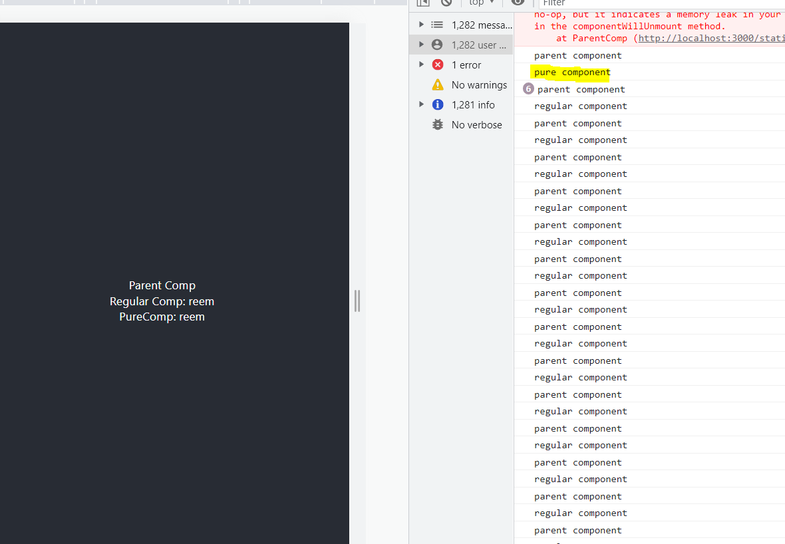

### pure components 
> Difference between pure components and impure components 
When parent component re-renders, since props are passed through the parent (ParentComp.js) to the child components, therefore, child components also re-renders.

> App.js 
```bash 
import './App.css';
import ParentComp from './ParentComp';

function App() {
  console.log('parent')
  return (
    <div className="App">
      <header className="App-header">
        <ParentComp/>
      </header>
    </div>
  );
}

export default App;
```
> ParentComp.js 
```bash 
#rce
import React, { Component } from 'react'
import PureComp from './PureComp'
import RegularComp from './RegularComp'

class ParentComp extends Component {
  constructor(props){
      super(props)

      this.state = {
          name: 'reem'
      }
  }

  componentDidMount(){
      setInterval(() => {
        #setting state inside the setinterval 
        this.setState({
            name: 'reem'
        })
      }, 2000)
  }
  render() {
    console.log('********parent comp render**********')
    return (
    <div>
      <div>Parent Comp</div>
      <RegularComp name={this.state.name}></RegularComp>
      <PureComp name={this.state.name}></PureComp>
    </div>
    )
  }
}

export default ParentComp
```

> RegularComp.js 
```bash 
#rce
import React, { Component } from 'react'

export class RegularComp extends Component {
  render() {
    console.log('reg comp render')
    return (
      <div>Regular Comp: {this.props.name}</div>
    )
  }
}

export default RegularComp
```

> PureComp.js - Inreact we can create pure component by extending the pure component class 
```bash 
import React, { PureComponent } from 'react'
#rpce

export class PureComp extends PureComponent {
  render() {
    console.log('pure comp render')
    return (
      <div>PureComp: {this.props.name}</div>
    )
  }
}

export default PureComp
```
> When you look at the console, you'll find that the pure component is only rendered once and the parent and the regular component keeps re-rendering.


> Pure components avoid unecesary re-renders which gives performance boost 

### First Order function & Higher Order function
theorotical concept

#### Higher Order functions
- functions that take another function as its argument
- functions that return another function as an output

#### First order functions
- functions does not deal with functions as argument or return. 
- this type of function will not take another function as argument, and will not return a function as output

#### High order function
takes function as an argument
```bash
    <script>
    ✅higher order function 
    it takes or returns another function 
    #eg: array.foreach/ .then

    ✔ this is higher order function
    
    ✅function cb passed as an argument 
    function fn(name, cb){
        console.log(name)
        cb() 
    }

    ✅function passed as an argument 
    fn("geeks", function(){
        console.log("this is from callback")
    } )
    </script>

geeks
index.html:21 this is from callback
returns function as an output
```
kareeng is also a higher order function, because it returns function as an output
```bash
    function fn2(){
        function f(){
            console.log("inner function")
            ✅higher order function can also be a pure function
        }
        return f;
    }

    fn2()()
    ✅returning function as output 
```  
> Conditions required for a function to be pure?
```bash 
1. its not use any of the data (variable outside of its inner scope )
2. its should not have any side effect (leaking), function should not edit any data outside of its inner scope
3. if I run my function n number of times with the same input, it should give the same output everytime 
```
> there is no definitive connection btw pure & impure | first & higher order function

#### First order function
- does not take any function as argument
- does not return any function as output
```bash
function sum(a, b){
    return a + b
}

let s = sum(2, 3)
console.log(s)
```

### Higher order component
> Why is there a need for higher order component? let's answer this question after discussing this code structure 

#### Discussing the code:
> App.js 
```bash 

import './App.css';
import ClickCounter from './ClickCounter';
import HoverCounter from './HoverCounter';


function App() {
  return (
    <div className="App">
       <ClickCounter/>
       <HoverCounter/>
    </div>
  );
}

export default App;
```
> ClickCounter.js 
```bash 
import React, { Component } from 'react'

export class ClickCounter extends Component {
✅everything defined inside this is repeating even inside HoverCounter
constructor(props) {
    #rconst
  super(props)

  this.state = {
     count: 0
  }
}

increementCount = () => {
    this.setState( prevState => {
        return {count: prevState.count + 1}
    })
}
✅

  render() {
   
    return (
      <div>
          <button onClick={this.increementCount}>click {this.state.count} times</button>
      </div>
    )
  }
}

export default ClickCounter
```
> HoverCounter.js
```bash 
#rce
import React, { Component } from 'react'

class HoverCounter extends Component {
    ✅everything defined inside this is repeating in ChildCounter.js
    constructor(props) {
        #rconst
      super(props)
    
      this.state = {
         count: 0
      }
    }
    
    increementCount = () => {
        this.setState( prevState => {
            return {count: prevState.count + 1}
        })
    }
    ✅

  render() {
    return (
    <div >
      <h1 onMouseOver={this.increementCount}>Hover {this.state.count} times</h1>
    </div>
    )
  }
}

export default HoverCounter
```

> I've clicked on the button 7 times and mouse over the HoverCounter component 3 times.

#### Components are repeating...
When do you need so many components, which use the same functionality? instead of duplicating code, you could embed the repeating code in a single file and reuse it,

#### When child components are directly under the parent component.
> To acheive this we can lift the `counter` state defined in both HoverCounter.js and ChildCounter.js and define it inside parent instead. 


However, lifting the state from the parent component and passing it as props to children is not possible, **when the child components are scattered.**

#### When child components are scattered under the parent component 
To create a functionality such that repeating code can be reused from a single place and used by the child components, higher order functions are used. 


### Why Higher order components?
To share common functionality between components.

### What is a higher order component?
A pattern where a function takes a component as an argument and returns a new argument.

```bash 
const NewComponent = higherOrderComponent( originalComponent )
```
> HOC (Higher order component) adds aditional functionality to the `original component` so the NewComponent can also be called as the EnhancedComponent 

> React takes an original component, adds additonal functionalities to it and returns an enhanced component.
```bash 
const EnhancedCompoentn = higherOrderComponent( originalComponent )
```
> for a more personalized example, The suit provides tony stark with some additonal superpowers / functionality, which enhances his overall performance. 
```bash 
const IronMan = withSuit( TonyStark )
```

#### How to implement a basic HOC?
1. HOC naming conventions 
> we created a file named withCounter.js 

2. Creating HOC compoennt and exporting it 
> withCounter.js 
```bash 
# This is HOC component 
import React, { Component } from 'react'

# HIGHER ORDER FUNCTION 
# HOC accepts an original component as a parameter and returns a new component

# HOC takes the originalComponent as its parameter 
const UpdatedComponent = (OriginalComponent) => {
    # HOC returns a new component 
    class NewComponent extends React.Component {
        render(){
            # render the original component 
            # were passing the name props through the OriginalComponent
            return <OriginalComponent name="reem"/>
        }
    }
    # and return the new component 
    return NewComponent
}

export default UpdatedComponent
```
> ClickCounter.js
```bash 
import React, { Component } from 'react'
# importing the higher order function
import UpdatedComponent from './withCounter'

export class ClickCounter extends Component {
constructor(props) {
  # rconst
  super(props)

  this.state = {
     count: 0
  }
}

increementCount = () => {
    this.setState( prevState => {
        return {count: prevState.count + 1}
    })
}
  render() {
   
    return (
      <div>
         # we can access the props passed from the orginalCompont over here 
         {this.props.name}
          <button onClick={this.increementCount}>click {this.state.count} times</button>
      </div>
    )
  }
}

# passing the component through the HOC function 
export default UpdatedComponent(ClickCounter)
```
> HoverCounter.js 
```bash 
#rce
import React, { Component } from 'react'
import UpdatedComponent from './withCounter'

class HoverCounter extends Component {
    constructor(props) {
        #rconst
      super(props)
    
      this.state = {
         count: 0
      }
    }
    
    increementCount = () => {
        this.setState( prevState => {
            return {count: prevState.count + 1}
        })
    }

  render() {
    return (
    <div >
      # HOC injects the "name" prop passed from the originalComponent
      {this.props.name}
      <h1 onMouseOver={this.increementCount}>Hover {this.state.count} times</h1>
    </div>
    )
  }
}

export default UpdatedComponent(HoverCounter)
```

> HOC shared the 'name' as prop, however we want to pass `counter` state as props, lets implement that.

> withCounter.js 
```bash 
# This is HOC component 
import React, { Component } from 'react'

# HIGHER ORDER FUNCTION 
# HOC accepts an original component as a parameter and returns a new component

# HOC takes the originalComponent as its parameter 
const UpdatedComponent = (OriginalComponent) => {
    # HOC returns a new component 
    class NewComponent extends React.Component {
        #adding the reusable code
        constructor(props) {
            #rconst
          super(props)
        
          this.state = {
             count: 0
          }
        }
        
        increementCount = () => {
            this.setState( prevState => {
                return {count: prevState.count + 1}
            })
        }

        render(){
            #render the original component 
            return <OriginalComponent 
            count={this.state.count}
            increementCount={this.increementCount} />
        }
    }
    # and return the new component 
    return NewComponent
}

export default UpdatedComponent
```
> ClickCounter.js 
```bash 
import React, { Component } from 'react'
# importing the higher order function
import UpdatedComponent from './withCounter'

export class ClickCounter extends Component {
# constructor(props) {
#     #rconst
#   super(props)

#   this.state = {
#      count: 0
#   }
# }

# increementCount = () => {
#     this.setState( prevState => {
#         return {count: prevState.count + 1}
#     })
# }
  render() {
    return (
      <div>
          <button onClick={this.props.increementCount}>click {this.props.count} times</button>
      </div>
    )
  }
}

# passing the component through the HOC function 
export default UpdatedComponent(ClickCounter)
```
> HoverCounter.js 
```bash 
#rce
import React, { Component } from 'react'
import UpdatedComponent from './withCounter'

class HoverCounter extends Component {
    # constructor(props) {
    #     #rconst
    #   super(props)
    
    #   this.state = {
    #      count: 0
    #   }
    # }
    
    # increementCount = () => {
    #     this.setState( prevState => {
    #         return {count: prevState.count + 1}
    #     })
    # }

  render() {
    return (
    <div >
      <h1 onMouseOver={this.props.increementCount}>Hover {this.props.count} times</h1>
    </div>
    )
  }
}

export default UpdatedComponent(HoverCounter)
```


#### Lets fix the name of the HOC function to match the component name
> withCounter.js 
```bash 
import React, { Component } from 'react'

const withCounter = (OriginalComponent) => {
    class NewComponent extends React.Component {
        constructor(props) {
          super(props)
        
          this.state = {
             count: 0
          }
        }
        
        increementCount = () => {
            this.setState( prevState => {
                return {count: prevState.count + 1}
            })
        }

        render(){
            return <OriginalComponent 
            count={this.state.count}
            increementCount={this.increementCount} />
        }
    }
    return NewComponent
}

export default withCounter
```

> ClickCounter.js 
```bash 
import React, { Component } from 'react'
import withCounter from './withCounter'

export class ClickCounter extends Component {
  render() {
    return (
      <div>
          <button onClick={this.props.increementCount}>click {this.props.count} times</button>
      </div>
    )
  }
}

export default withCounter(ClickCounter)
```

> HoverCounter.js
```bash 
import React, { Component } from 'react'
import withCounter from './withCounter'

class HoverCounter extends Component {
  render() {
    return (
    <div >
      <h1 onMouseOver={this.props.increementCount}>Hover {this.props.count} times</h1>
    </div>
    )
  }
}

export default withCounter(HoverCounter)
```

### useMemo Hook 
caching a value so you dont need to recompute it everytime.

> why do we need useMemo hook?
```bash 
#rfce
import React from 'react'
import {useState} from 'react'

function Counter() {
const [counterOne, setCounterOne] = useState(0)
const [counterTwo, setCounterTwo] = useState(0)

const increementOne = () => {
 setCounterOne(counterOne + 1)
}

const increementTwo = () => {
    setCounterTwo(counterTwo + 1)
}

const isEven = () => {
    # after we add this for loop which iterates over a large value, it slows down and the isEven() function displays 'even' or 'odd' even slowly. 
    for (let i=0; i<900000000000000000000000000000000000; i++) 
    {
      return counterOne % 2 == 0
    }
}

  return (
    <div>
      <div>
          <button onClick={increementOne}>count one = {counterOne}</button>
          <span>{isEven() ? 'Even' : 'Odd'} </span>
          <button onClick={increementTwo}>count two = {counterTwo}</button>
      </div>
    </div>
  )
}

export default Counter

DOM:
When user clicks on `count one` button, the isEven() is executed below it, however since its embedded inside a big for loop it takes alot of time to execute 

When user clicks on `count two` button, this is also delayed since, both the previous button as well as the span tags are executed (and calculated everytime). This causes performance issues and delayed response.
```
> To fix this issue: we need to implement a way where we tell react not to calculate `count one` button and isEven() when were changing `count two` button values.

### useMemo Hook 
useMemo hook will cache isEven(), and it will only recalculate the cached value when only one of the dependencies have changed.

> Counter.js 
```bash 
#rfce
import React from 'react'
import {useState, useMemo} from 'react'

function Counter() {
const [counterOne, setCounterOne] = useState(0)
const [counterTwo, setCounterTwo] = useState(0)

const increementOne = () => {
 setCounterOne(counterOne + 1)
}

const increementTwo = () => {
    setCounterTwo(counterTwo + 1)
}

# const isEven = () => {
    # for (let i=0; i<900000000000000000000000000000000000; i++) 
    # {
    #   return counterOne % 2 == 0
    # }
# }

# By specifying counterOne inside dependencyArray
# Whenever counterOne value changes were telling react to recompute values and not use the cached values
const isEven = useMemo(() => {
    for (let i=0; i<900000000000000000000000000000000000; i++) 
    {
      return counterOne % 2 == 0
    }
}, [counterOne])

  return (
    <div>
      <div>
          <button onClick={increementOne}>count one = {counterOne}</button>
          # isEven is not going to be a function call because it now stores a value 
          <span>{isEven ? 'Even' : 'Odd'} </span>
          <button onClick={increementTwo}>count two = {counterTwo}</button>
      </div>
    </div>
  )
}

export default Counter
```

### Difference between useCallback and useMemo hook?
> useCallback - caches the reference of the provided function / callback - Cache a function
> useMemo - Invokes the provided function and caches its result - Cache result of the function