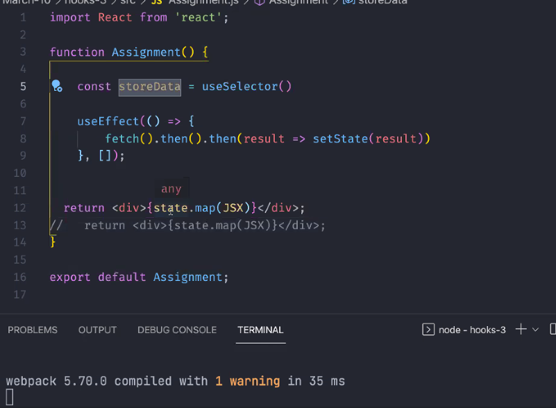
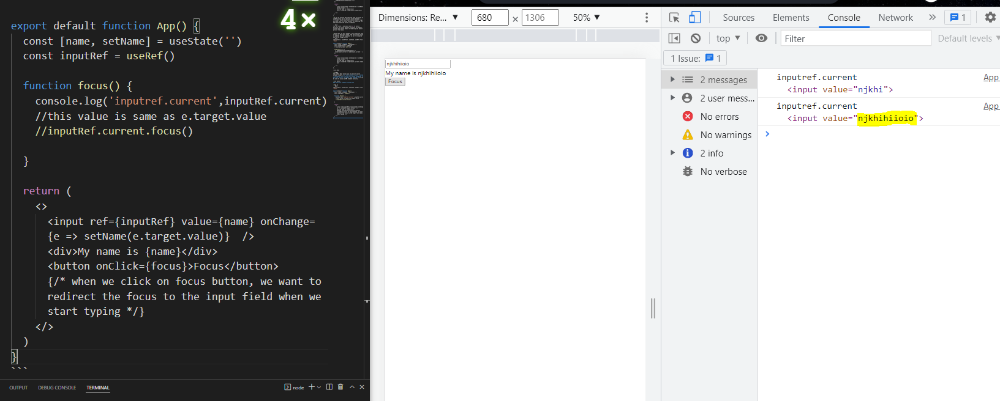
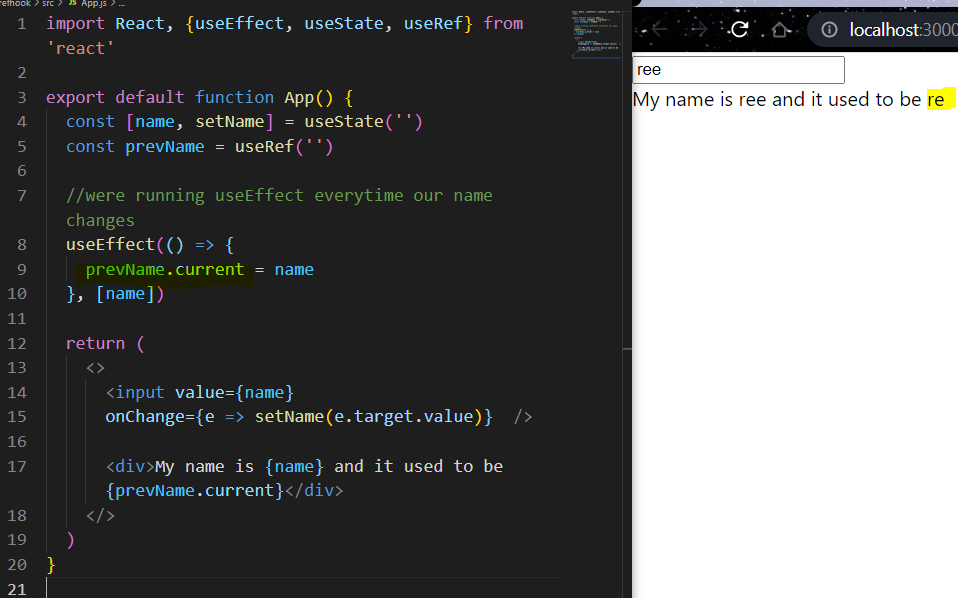
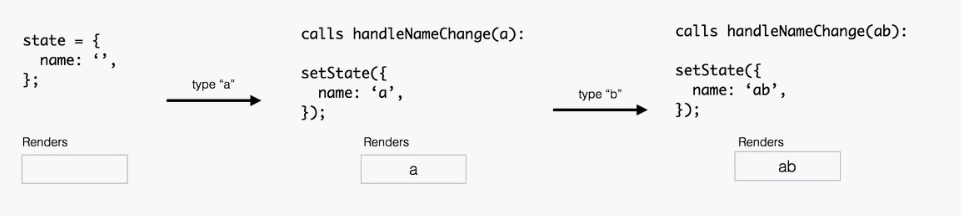
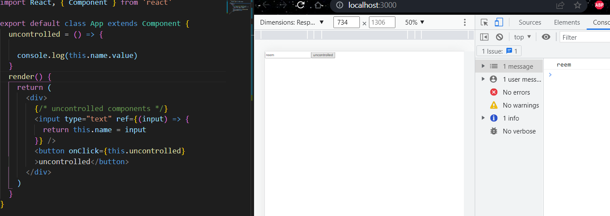
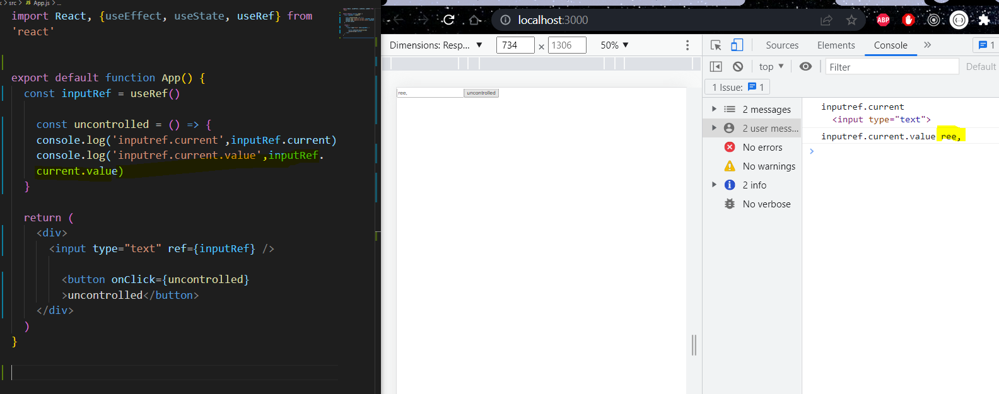

### useRef hook
Used for 
- storing values / persist values without causing a re-render.

> When your using useState it causes you to end up in an infinite loop
```bash 
import React, {useEffect, useState, useRef} from 'react'

export default function App() {
  const [name, setName] = useState('')
  const [renderCount, setRenderCount] = useState(0)

  #this function throws an infinite loop, state cause you get into an infinite loop 
  useEffect(() => {
    setRenderCount(renderCount + 1)
  })

  return (
    <>
      <input value={name} onChange={e => setName(e.target.value)}  />
      <div>My name is {name}</div>
      <div>I rendered {renderCount} times</div> 

    </>
  )
}
```
> A way to resolve the infinite loop, by using ref, useRef allows you to persist values between re-renders which means everytime we need to log a data and save its value without re-rendering the page everytime the value is updated. 

```bash 
You can store a previous value in it and it persists the value between different re-renders, unlike state which keeps re-rendering and doesnt persist the value.
```

> Note that: In this example, every time you enter a value in the input field, the ref.current value is updated but the component is not re-rendered when a new change occurs
```bash 
import React, {useEffect, useState, useRef} from 'react'

export default function App() {
  const [name, setName] = useState('')
  const renderCount = useRef(0)
  # initially count set to 0

  useEffect(() => {
   # setRenderCount(renderCount + 1)
   renderCount.current = renderCount.current + 1
  })

  return (
    <>
      <input value={name} onChange={e => setName(e.target.value)}  />
      <div>My name is {name}</div>
      <div>I rendered {renderCount.current} times</div> 

    </>
  )
}
```


> useRef 
The useRef Hook allows you to persist values between renders.**It can be used to store a mutable / changable value (value which keeps changing) that does not cause a re-render when updated.** It can be used to access a DOM element directly.

> use cases:
## What shouldd you handle with ref?

### Used to Reference input elements onto our page  
> App.js 
```bash 
import React, {useEffect, useState, useRef} from 'react'

export default function App() {
  const [name, setName] = useState('')
  const inputRef = useRef()

  function focus() {
    console.log('inputref.current',inputRef.current)
    #this value is same as e.target.value 
    #inputRef.current.focus()

  }

  return (
    <>
      <input ref={inputRef} value={name} onChange={e => setName(e.target.value)}  />
      <div>My name is {name}</div>
      <button onClick={focus}>Focus</button>
      {/* when we click on focus button, we want to redirect the focus to the input field when we start typing */}
    </>
  )
}

DOM:
when we type in the input field and click on the focus button the input value is updated to match the value the user entered. 
```


> App.js 
```bash 
import React, {useEffect, useState, useRef} from 'react'

export default function App() {
  const [name, setName] = useState('')
  const inputRef = useRef()

  function focus() {
    console.log('inputref.current',inputRef.current)
    #when user clicks on the focus button, the cursor is automatically highlighted in the inut field 
    inputRef.current.focus()


  }

  return (
    <>
      <input ref={inputRef} value={name} onChange={e => setName(e.target.value)}  />
      <div>My name is {name}</div>
      <button onClick={focus}>Focus</button>
      {/* when we click on focus button, we want to redirect the focus to the input field when we start typing */}
    </>
  )
}

DOM:
When the user clicked on the focus button, the cursor points to the input field 
```

### Store previos value of state 
```bash 
import React, {useEffect, useState, useRef} from 'react'

export default function App() {
  const [name, setName] = useState('')
  const prevName = useRef('')

  #were running useEffect everytime our name changes 
  useEffect(() => {
    prevName.current = name
  }, [name])

  return (
    <>
      <input value={name} 
      onChange={e => setName(e.target.value)}  />

      <div>My name is {name} and it used to be {prevName.current}</div>
    </>
  )
}
```


#### What should you not handle with ref?
> App.js - do not manually set the value using ref. 
```bash 
import React, {useEffect, useState, useRef} from 'react'

export default function App() {
  const [name, setName] = useState('')
  const inputRef = useRef()

  function focus() {
    console.log('inputref.current',inputRef.current)

    # if you want to define a default value in the input field when the user clicks on the focus buttom. use the .value attribute 
    inputRef.current.value = 'some value'

  }

  return (
    <>
      <input ref={inputRef} value={name} onChange={e => setName(e.target.value)}  />
      <div>My name is {name}</div>
      <button onClick={focus}>Focus</button>
      {/* when we click on focus button, we want to redirect the focus to the input field when we start typing */}
    </>
  )
}

DOM:
When user clicks on the focus button the value "some value" is automatically logged inside the input field 
```
### Controlled and uncontrolled Form inputs in React 
A controlled input accepts its current value as a prop, as well as a callback to change that value.

> Controlled form inputs have a `value` field 
```bash 
class Form extends Component {
  constructor() {
    super();
    this.state = {
      name: "",
    };
  }

  handleNameChange = (event) => {
    this.setState({ name: event.target.value });
  };

  render() {
    return (
      <div>
        <input type="text" value={this.state.name} onChange={this.handleNameChange} />
      </div>
    );
  }
}
```
Every time you type a new character, handleNameChange is called. It takes in the new value of the input and sets it in the state.


> Uncontrolled form inputs do not have a `value` field 
- in class based components 
```bash 
import React, { Component } from 'react'

export default class App extends Component {
  uncontrolled = () => {
    console.log(this.name.value)
  }

  render() {
    return (
      <div>
        {/* uncontrolled components */}
        <input type="text" ref={(input) => {
          return this.name = input 
        }} />
        <button onClick={this.uncontrolled}>uncontrolled</button>
      </div>
    )
  }
}

DOM:
when user enters a value and click on the button, this value is updated 
```


- in function based components 
```bash 
import React, { useRef} from 'react'

export default function App() {
  const inputRef = useRef()
  #same as 
  #const inputRef = useRef(null)

    const uncontrolled = () => {
    console.log('inputref.current',inputRef.current)
    console.log('inputref.current.value',inputRef.current.value)
  }

  return (
    <div>
      <input type="text" ref={inputRef} />

        <button onClick={uncontrolled}>uncontrolled</button>
    </div>
  )
}
```


#### What is the hook used in uncontrolled components?
> useRef
