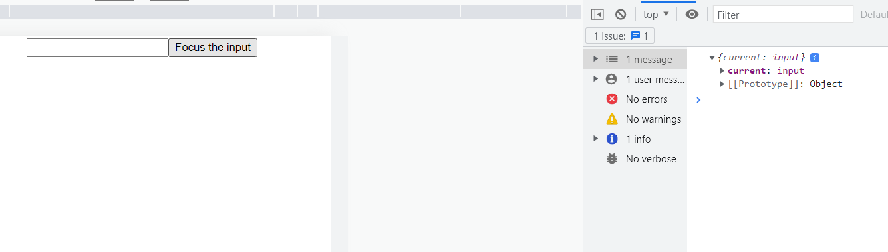

### useRef Vs useState
Dont compare useState and useRef, since their kind of opposites. 

### useRef
- Before react, Js would use Dom elements to manipulate items on webpage, which would re-render the entire DOM page 
- In react, we cannot directly use DOM reference 
- useRef is used to store the reference of the element 
- No matter how many changes you make in useRef it doesnt cause any changes 
- useRef returns a mutable reference object, which has one property in it `.current` (its an object, which contains .current object which can be manipulated)
```bash
function Focus(){
    const inputEl = useRef(null)

    const onButtonClick = () => {
        console.log(inputEl)
        inputEl.current.focus()
    }

    return (
        <>
         #When you clcik on Focus the input button it focuses on the input text field 
         <input ref={inputEl} type='text' />
         <button onClick={onButtonClick}>Focus the input</button>
    )
}
```


### useState 
- useState hook is used for re-rendering DOM element
- In useState hook you can create any value 
- useState is used for doing manipulations on the state 

