# Spotify Clone 

Note: The napster API doesnt work sometimes, I'm attaching pictures of my interface for reference.

> Technology used:
- Material UI, node-SASS, Tailwind CSS for styling 
- axios 
- react-router
- react-redux

> Features:
- Mobile Responsive 
- Search for artists, tracks and artists on typing artist / track / artist name, integrated on Tailwind CSS via tab navigation. 
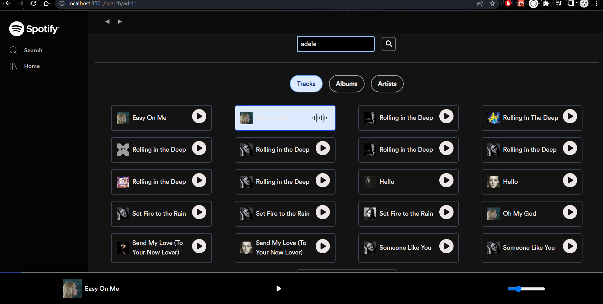
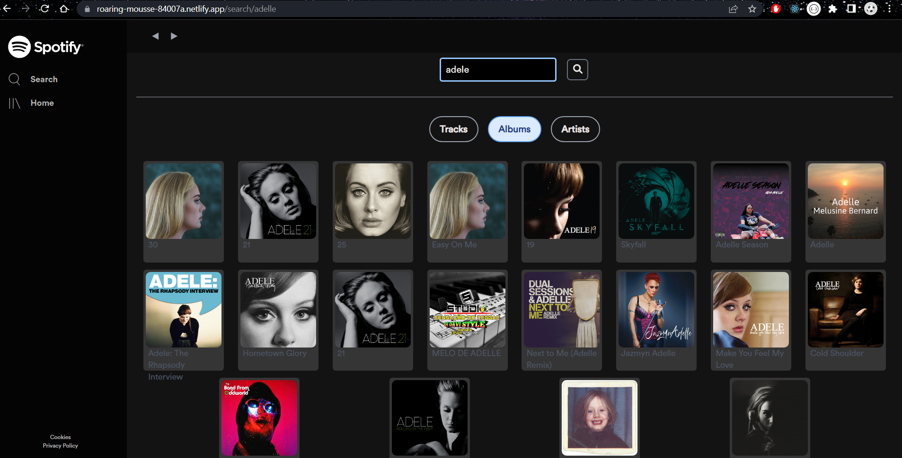
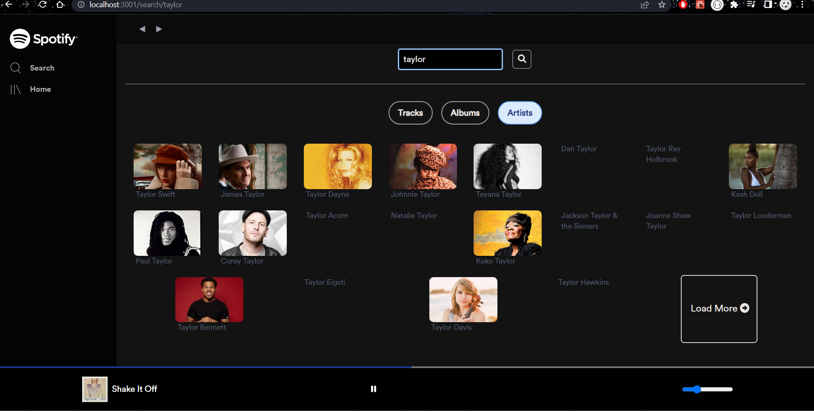
- Home page consists of top artists, top albums and top songs, rendered in a horizontal pattern, I've set the horizontal scrollbar to hidden, scroll to see more elements by clicking on the right scroll key from keyboard 
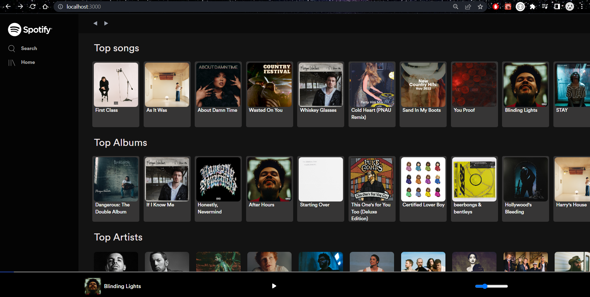
- When user clicks on top songs music, the player starts playing
- when user clicks on top albums, the user is then redirected to user/albumid url i.e the album page, where you can view all individual songs for the particular album 
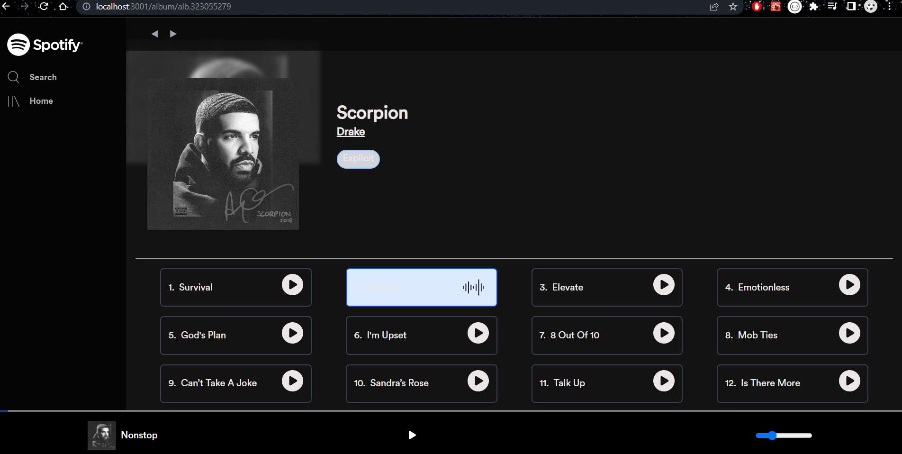
- when user clicks on top artists music the user is then redirected to user/artistid i.e the artist page, when you can view the particular artist page based on the artist id 
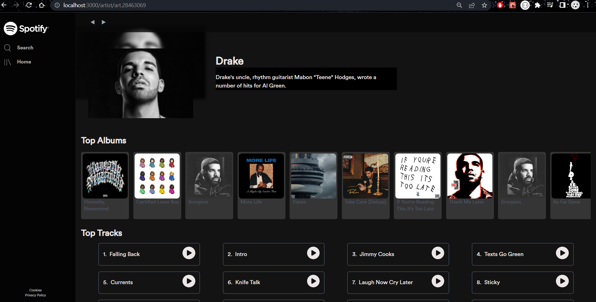
- Light & Dark Mode 

### The code workflow

#### Search Component 
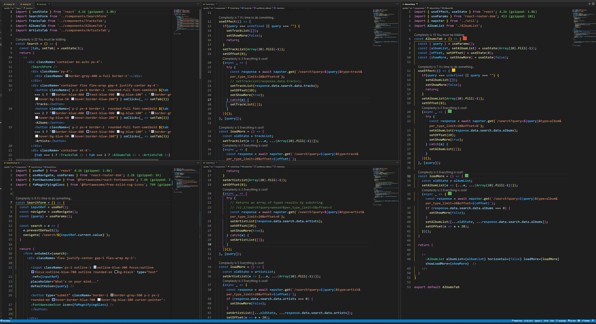

- Tracks Tab 
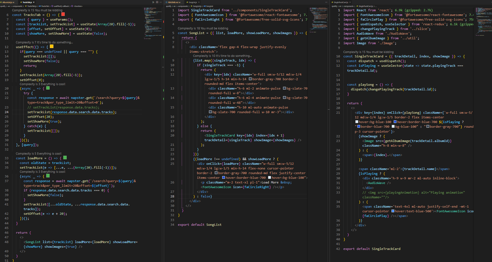

- Artists Tab 
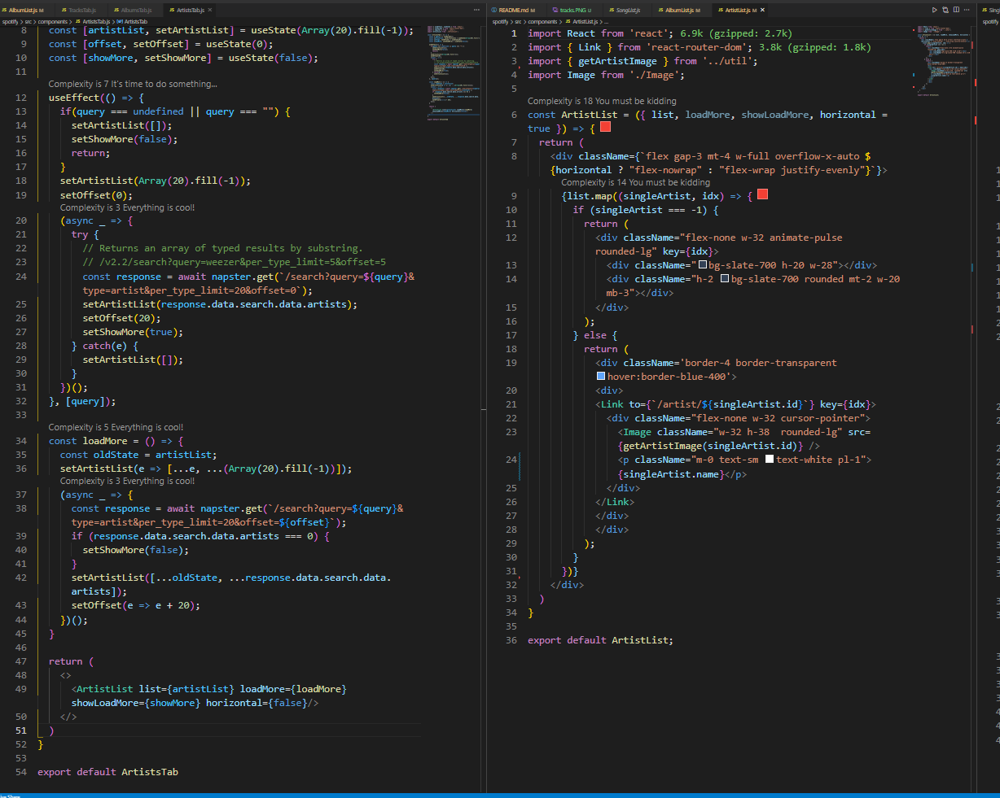

- Albums Tab 
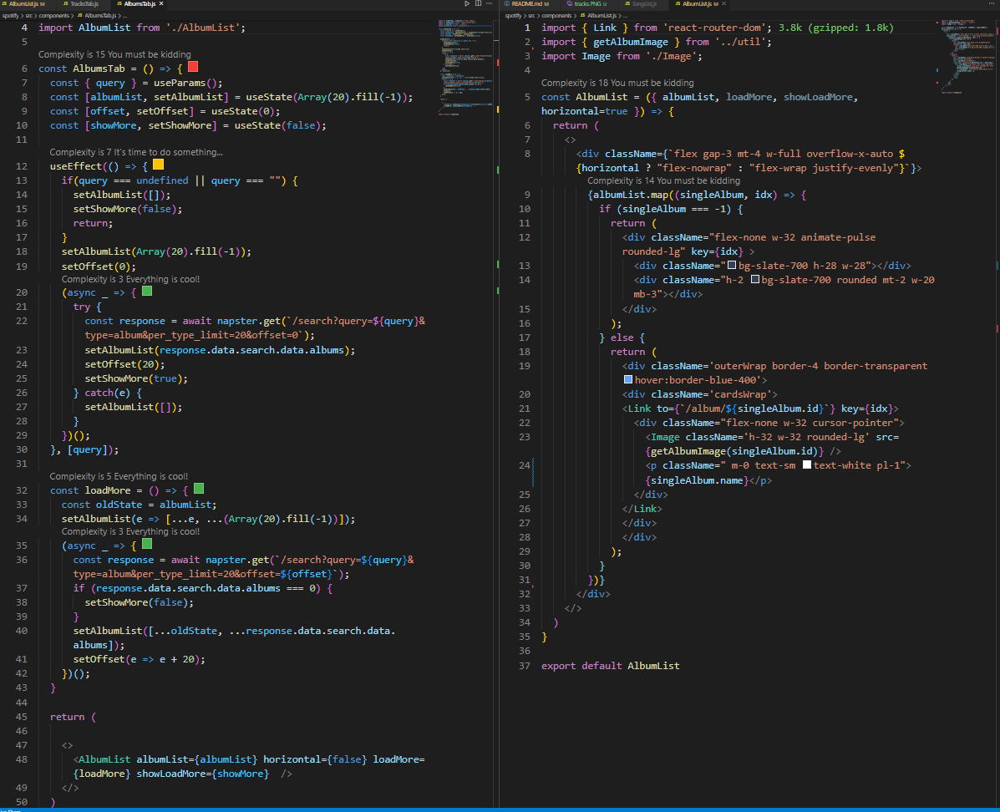

#### Main Components 
> Navbar 
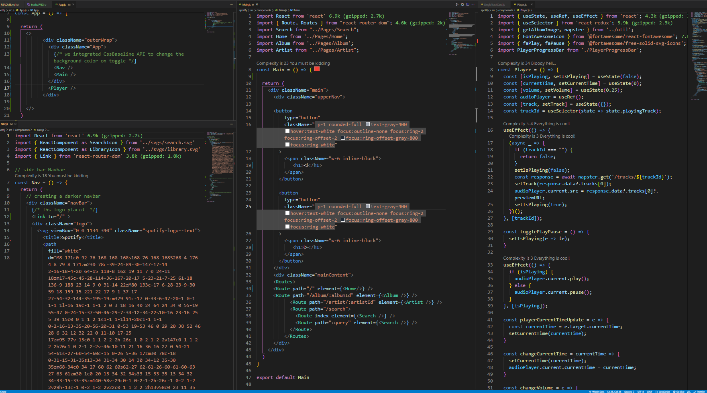

> Home components 
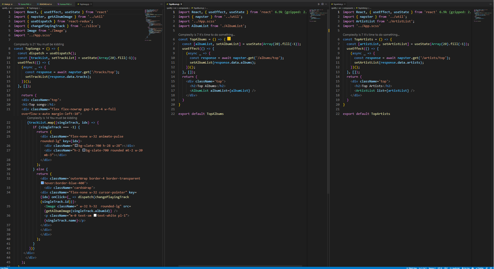

> Artist 
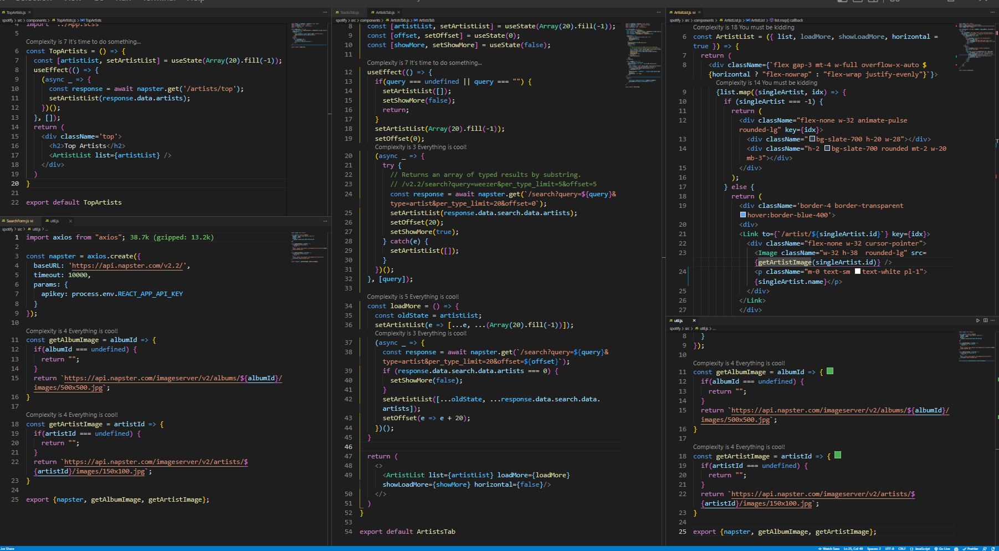

> Album 
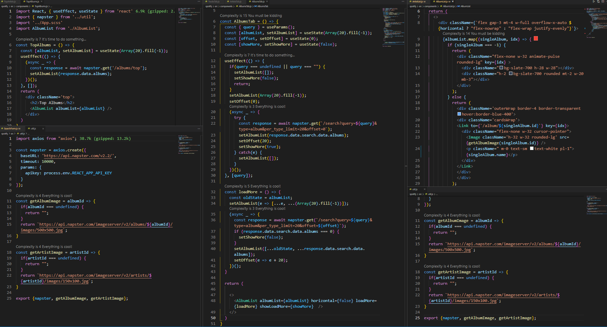

#### Axios 
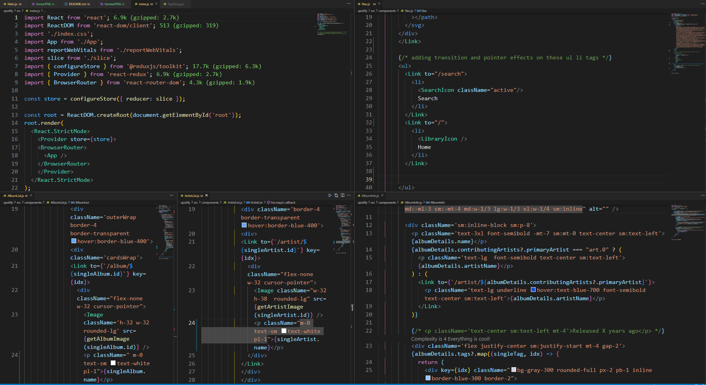

#### Redux 
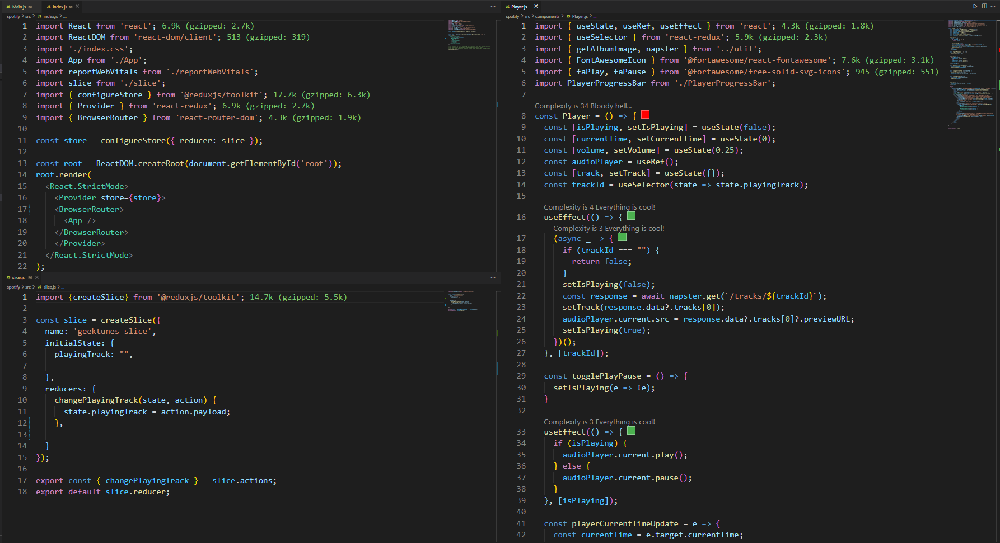

> Player Component 
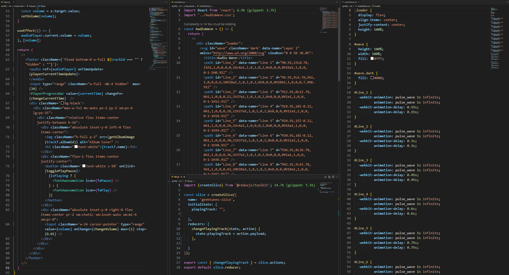

