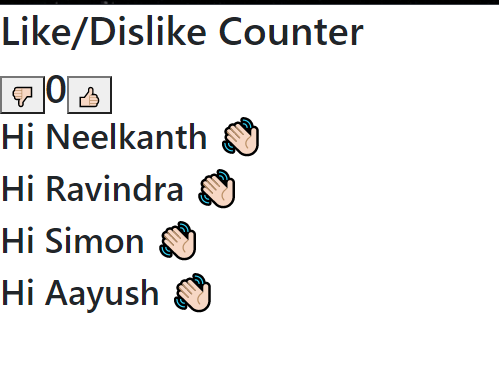

#### JSX
- it gives added benefit of writing HTML code in JS file in a neated fashion
- we can do react without JSX 
- its only used because it makes the coding experience easier 

#### Props 
> passing custom properties to a component 

Properties we set in parent component (App component) as an attribute for the child component which is handled by react automatically 

#### State 
the collection of data which is observed by React for changes which are most of the times passed as props. 
> A set of observable properties that control the behavior of the component 

#### Creating a simple counter App using CDN links 
> index.html
```bash 
<!DOCTYPE html>
<html lang="en">
<head>
    <meta charset="UTF-8">
    <meta http-equiv="X-UA-Compatible" content="IE=edge">
    <meta name="viewport" content="width=device-width, initial-scale=1.0">
    <link rel="stylesheet" href="https://stackpath.bootstrapcdn.com/bootstrap/4.2.1/css/bootstrap.min.css" integrity="sha384-GJzZqFGwb1QTTN6wy59ffF1BuGJpLSa9DkKMp0DgiMDm4iYMj70gZWKYbI706tWS" crossorigin="anonymous">
    
    <link rel="stylesheet" href="./index.css">

    <title>Document</title>
</head>
<body>
    <div id="app"></div>

    ✅src is coming from a CDN (external network), but what if the website go down, in that case its more reliable to download the script, with this we can run this offline while development 
    
    if they update changes, then it wont be compatible with our app,
    so its better to save it as a local package 

    <!-- instead of giving CDN links, we can download the CDN links and store them as a package-->
    <!-- we can download these links and store it in package -->
    <!-- <script src="./packages/react.development.js"></script>
    <script src="./packages/react-dom.development.js"></script>
    <script src="./packages/babel.min.js"></script>
    -->

    ✅for this project, were using CDN links 
    <!-- react.development.js -->
    <script crossorigin src="https://unpkg.com/react@17/umd/react.development.js"></script>

    <!-- react-dom.development.js -->
    <script crossorigin src="https://unpkg.com/react-dom@17/umd/react-dom.development.js"></script>

    <!-- babel.min.js -->
    <script src="https://unpkg.com/@babel/standalone/babel.min.js"></script>


    <script type="text/babel" src="./src/LikeDislikeButton.js"></script>
    <script type="text/babel" src="./src/ShowCounter.js"></script>
    <script type="text/babel" src="./src/GreetPerson.js"></script>
    <script type="text/babel" src="./src/App.js"></script>
    <script type="text/babel" src="./index.js"></script>

</body>
</html>
```
> index.js 
```bash 
ReactDOM.render(
    <App />,
    document.getElementById('app')
)
```
> App.js
```bash 
class App extends React.Component {
    constructor() {
        super();
        this.state = {
            counter: 0,
            names: [
                "Neelkanth",
                "Ravindra",
                "Simon",
                "Aayush",
            ]
        }

        //state is asynchronous in function, so as soon as you set it, sometimes it wont update immediately but after some time it will update 
    }

    increaseCounter = () => {
        // This is incorrect way to set state.
        // this.setState({counter: this.state.counter + 1});
        // this.setState({counter: this.state.counter + 1});
        // this.setState({counter: this.state.counter + 1});

    //this approach seems right
    //however there is no gaurantee that this is the correct value because there is the possibility that the states current value isnt really the previous value (it could be the previos previos value) because state is asynchronous in nature 

    //react will try its best to update state as soon as possible, but it does not promise it will update immediately 

    ✅the better approach:
    //since our new counter is dependent on the previous most updated state, this appraoch is much better 

    //prevState is an object 
    //this is correct way to set state   
    // this method ensures the previos most updated state is taken into account 
    ✅since our new counter is dependent on the previous most updated state, this appraoch is much better 

        this.setState((previousState) => {
            return {
                counter: previousState.counter + 1,
                names: previousState.names,
            }
        });
        
        // this.setState((previousState) => {
        //     return {
        //         counter: previousState.counter + 1,
        //         names: previousState.names,
        //     }
        // });
        // this.setState((previousState) => {
        //     return {
        //         counter: previousState.counter + 1,
        //         names: previousState.names,
        //     }
        // });
    }

    decreaseCounter = () => {
        this.setState((prev) => {
            return {
                counter: prev.counter - 1,
                names: prev.names,
            }
        });
    }

    render() {
        // console.log(this.state.names);
        return(
            <div>
                <h2>Like/Dislike Counter</h2>
                
                <LikeDislikeButton func={this.decreaseCounter} purpose="dislike" />

                <ShowCounter counterValue={this.state.counter} />

                <LikeDislikeButton func={this.increaseCounter} purpose="like" />

                ✅Why do we use map() instead of forEach?
                 //foreach loops, loops array but doesnt return a new array which contains JSX element 

                 //map loops the array and all the elements that satisfy the condition are placed into a new array and the elements inside that array are returned as JSX element 
                 // map returns an array which contains JSX element 

                {this.state.names.map((single_name) => {
                    return(
                        <GreetPerson name={single_name} />
                    )
                })}

            </div>
        )
    }
}
```
> showCounter.js 
```bash 
class ShowCounter extends React.Component {
    render() {
        return(
            ✅showing the count value
            <h2 className="d-inline">{this.props.counterValue}</h2>
        )
    }
}
```
> GreetPerson.js 
```bash 
class GreetPerson extends React.Component {
    render() {
        return (
            ✅displaying the names in the names state defined in App.js
            <h3>Hi {this.props.name} 👋🏻</h3>
        )
    }
}
```
>LikeDislikeButton.js 
```bash 
class LikeDislikeButton extends React.Component {
    render() {
        // toggling using conditional rendering / teranary operator 
        
        // console.log(this.props.purpose);
        // () ? true : false
        return (
            this.props.purpose == "dislike" ? 
            //were calling the function defined inside the child component from the parent component 

            //passing props from parent component to child component 
            //changing props from child component in the parent component 
                <button onClick={this.props.func}>👎🏻</button> 
            : 
                <button onClick={this.props.func}>👍🏻</button>
            
            // React.createElement('button', {}, "👎🏻")
        )
    }
}
```
