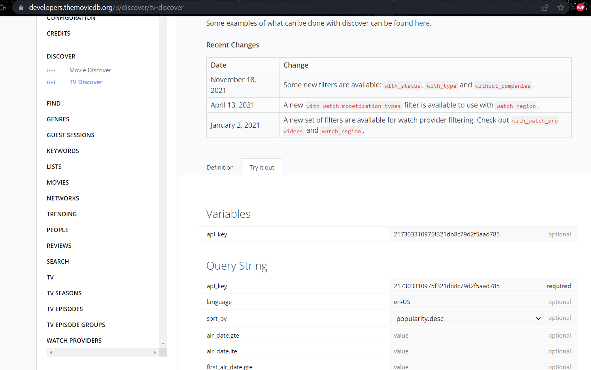

# Imports for the project
1. Axios Library
```bash 
npm i axios 
```
2. materialUI: https://mui.com/getting-started/installation/
> core 
```bash
npm i @material-ui/core
```
> MU icons 
```bash 
npm install @mui/icons-material
```
```bash
npm install @mui/material @emotion/react @emotion/styled
```
```bash
npm i @material-ui/lab
```
```bash 
npm i react-alice-carousel
```
> navigate to `package.json` to confirm the installation

#### MUI Icons Library:
https://mui.com/components/material-icons/?query=whatshot

3. React Router DOM: https://reactrouter.com/docs/en/v6/getting-started/overview
Navigate in react App using 'react-router-dom`
```bash 
npm install react-router-dom@6
```
4. Google fonts: import Montserrat in src/index.css

#### Starting off with Material UI 
> Bottom navigation
https://mui.com/components/bottom-navigation/#main-content

> we add this code from MUI to MainNav.js 
```bash 
import * as React from 'react';
import Box from '@mui/material/Box';
import BottomNavigation from '@mui/material/BottomNavigation';
import BottomNavigationAction from '@mui/material/BottomNavigationAction';
import RestoreIcon from '@mui/icons-material/Restore';
import FavoriteIcon from '@mui/icons-material/Favorite';
import LocationOnIcon from '@mui/icons-material/LocationOn';

export default function SimpleBottomNavigation() {
  const [value, setValue] = React.useState(0);

  return (
    <Box sx={{ width: 500 }}>
      <BottomNavigation
        showLabels
        value={value}
        onChange={(event, newValue) => {
          setValue(newValue);
        }}
      >
        <BottomNavigationAction label="Recents" icon={<RestoreIcon />} />
        <BottomNavigationAction label="Favorites" icon={<FavoriteIcon />} />
        <BottomNavigationAction label="Nearby" icon={<LocationOnIcon />} />
      </BottomNavigation>
    </Box>
  );
}
```
> we add MUI icons


> and we paste this import inside MainNav.js 


### TMDB API 
> themoviedb.org

- were adding our API key we fetched from `https://www.themoviedb.org/settings/api`inside .env, this file wont get pushed on public repo, cs its present in the .gitignore file. 

> hover over to this website `https://developers.themoviedb.org/3/trending/get-trending`

- https://api.themoviedb.org/3/trending/all/day?api_key=217303310975f321db8c79d2f5aad785

#### Trending component
> enter your API key over here and `send request` to fetch data for `trending` component.


> copy paste this URL in the search bar and you will retrive all of this data to work with 


#### Movies component 
> enter your API key over here and click on `send request` to fetch the data for `Movies` component

- https://api.themoviedb.org/3/discover/movie?api_key=217303310975f321db8c79d2f5aad785&language=en-US&sort_by=popularity.desc&include_adult=false&include_video=false&page=1&with_watch_monetization_types=flatrate

#### Genres component 
>  enter your API key over here and click on `send request` to fetch the data for `Genres` component

- https://api.themoviedb.org/3/genre/movie/list?api_key=217303310975f321db8c79d2f5aad785&language=en-US

> This is the JSON data 


#### Series component 
> hover over to this website `https://developers.themoviedb.org/3/discover/tv-discover`


- https://api.themoviedb.org/3/discover/tv?api_key=217303310975f321db8c79d2f5aad785&language=en-US&sort_by=popularity.desc&page=1&timezone=America%2FNew_York&include_null_first_air_dates=false&with_watch_monetization_types=flatrate&with_status=0&with_type=0


#### Creating a custom hook 
Function with some logic, which were going to use repeatedly.

> hooks/useGenre.js 
```bash 
were creaing a custom hook to take selectedGenre[] values  and return it in a string format, comma seperated values
```

