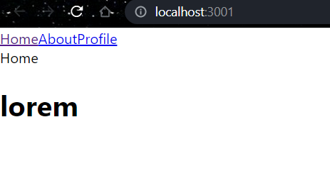
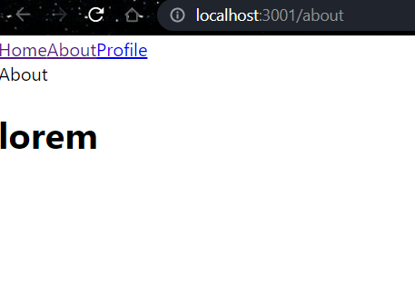
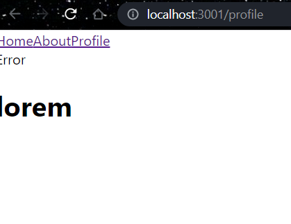
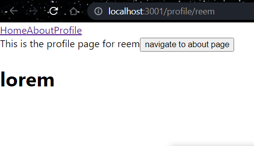
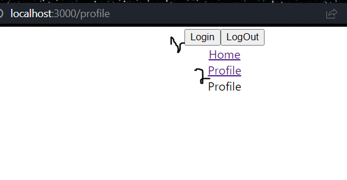

# Installating react-router-dom API
```bash
npm i react-router-dom@6
```
### public route 
Anyone can navigate to the route without any restrictions.

> App.js 
```bash 
import logo from './logo.svg';
import './App.css';
import { BrowserRouter as Router, Routes, Route, Link } from 'react-router-dom';
import Home from './pages/Home';
import About from './pages/About';
import Profile from './pages/Profile';
import Error from './pages/Error';

function App() {
  return (
    <Router>
      <nav>
        <Link to="/">Home</Link>
        <Link to="/about">About</Link>
        <Link to="/profile">Profile</Link>
      </nav>
      <Routes>
         # main page of the website path 
         <Route path="/" element={<Home/>} />
         <Route path="/about" element={<About/>} />

        # If you want to provide a route inside a component, such that when a user types this in the URL localhost:3000/profile/reem, then it will print this username on the Profile component 
         <Route path="/profile/:username" element={<Profile/>} />
         <Route path="*" element={<Error />}/>
         #  <a href='/home'>Go to home page</a> 
      </Routes>
      <h1>lorem</h1>
    </Router>
  );
}

export default App;
```
> Profile.js 
```bash 
import React from 'react'
import { useNavigate, useParams } from 'react-router-dom'

function Profile() {
  let navigate = useNavigate();
  # when this function is called it navigates to a certain route
  let {username} = useParams()

  return (
    <div>This is the profile page for {username}
        <button onClick={() => {
            navigate('/about')
        }}>navigate to about page</button>
    </div>
  )
}

export default Profile
```

> By default, "/" indicates the root path of the page, thats why `home` is printed 


> when you click on about link, '/about' file is loaded, and `about` is printed.


> When you click on profile, it navigates you to the error page, because in our App.js we can call profile.js only with the `username` extension


> when you type profile with its username extension, you can view the profile page, when you click on `navigate to about page` it takes you to `about` component.

### Protected/Private route 
- Protected route is used to protect a particular component
> For example, if user is logged in, only then he can view the <Profile /> component.

```bash 
import './App.css';
import {BrowserRouter as Router, Routes, Route, Link} from 'react-router-dom';
import Home from './pages/Home';
import Profile from './pages/Profile';
import Error from './pages/Error';
import PrivateRoute from './pages/PrivateRoute';
import { useState } from 'react';


function App() {
  # we created a state to toggle between true and false   
  const [isLogged, setIsLogged] = useState(false)

  return (
  <div className='App'>
  # when state is true, and you click on the Login button and then the Profile component it will redirect you to the profile component  
  <button onClick={() => setIsLogged(true)}>Login</button>
    
  # when state is false, and you click on the LogOut button and then the Profile component it will redirect you to the home page. 
  <button onClick={() => setIsLogged(false)}>LogOut</button>

    <Router>
      <nav>
        <Link to="/">Home</Link> <br></br>
        <Link to="/profile">Profile</Link>
      </nav>
      <Routes>
         <Route path="/" element={<Home/>} />
        # were passing along with its state private route component inside the <Route> 
         <Route element={<PrivateRoute isLogged={isLogged}/>} >
           <Route path='/profile' element={<Profile/>} />
         </Route>

         <Route path="*" element={<Error />}/>
      </Routes>
    </Router>
  </div>
  );
}

export default App;
```
> PrivateRoute.js 
```bash 
import React from 'react'
import { Navigate, Outlet } from 'react-router-dom'

const PrivateRoute = ({ isLogged }) => {
  # when islogged is true move to Outlet otherwise to the home page 
  return isLogged ? <Outlet/> : <Navigate to="/"/>
}

export default PrivateRoute
```

> when we click on the profile link just like that, it does not route us to that component
> when we click on `Login` and then click on `profile` component, then it routes us to the `profile` component.
> when we click on `Logout` and then click on `profile` component, then it routes us to the `home` component

### Difference between BrowserRouter and HashRouter

