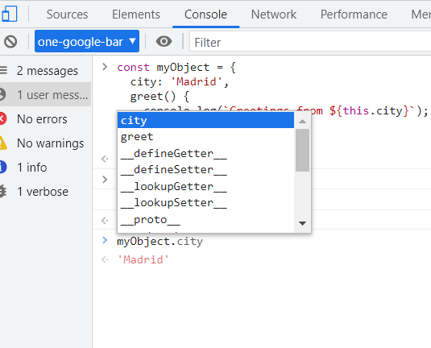
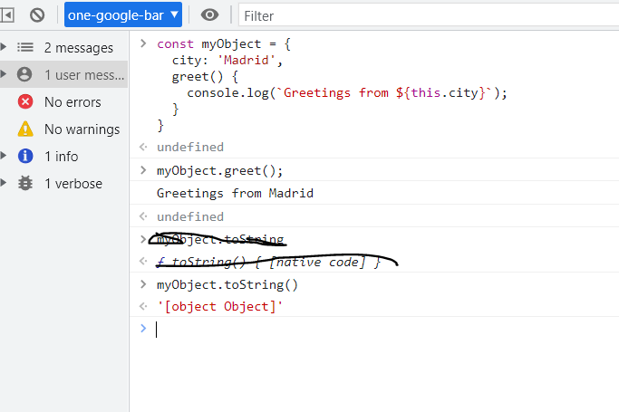
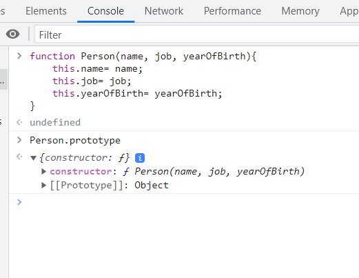
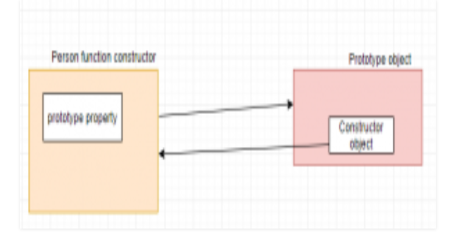
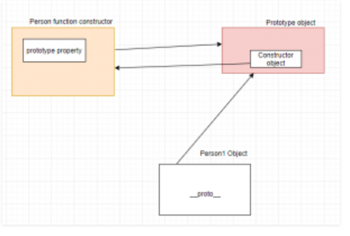
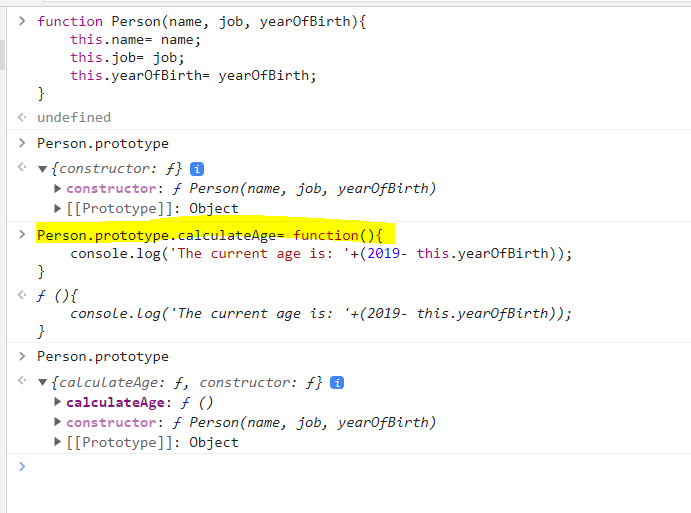
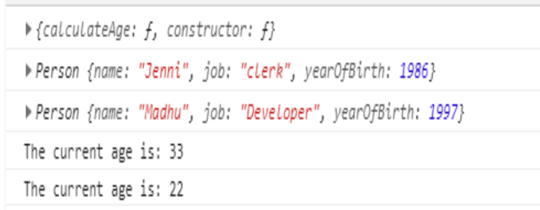
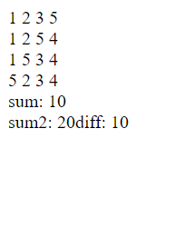
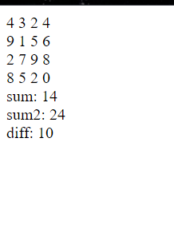

#### OOPS 
JavaScript is not a class-based object-oriented language. But it still has ways of using object oriented programming (OOP).
```bash
// JS by nature is not object oriented 
// OOPS is syntantical sugar 
// Under the hood, JS creates an object 
// there are properties of that object 

//instead of writing objects a 1000 times, we create a class, where we define how we want the object to look 
// const obj = {

// }

// class helps you create a blueprint of an object 
// you can call this class n number of times 
class Person {
    constructor(age, name){
        console.log('constructor', age, name)

        // inside constructor you should have access to that object we defined outside the class so we can define changes in it 
        // by using this keyword you can get access to the object that was created 

        // this keyword points to the object 
        // this creates an empty object, everytime the constructor is run 
        // you can make changes to the object by using the this keyword 

        // this will point to the object that was created inside the class 

        // initially this was an empty object 
        // this = {}

        // now this = {yolo: "geekster"}
        this.yolo = 'geekster'
        
        // this keyword is returned to the object with this property this = {yolo: "geekster"}

    }
}

// class creates a person object and return it 
// we can create objects using the new keyword 

// using the new keyword it will create and return an object (using this keyword)
const obj = new Person(25, 'abhishek')
// when we create a new object obj, first constructor will be called 
const obj1 = new Person(24, 'virat')


console.log('obj', obj)
console.log('obj1', obj1)

// each time you call the class, it creates a new object of the class and returns it 

console:
constructor 25 abhishek
index.js:17 constructor 24 virat
index.js:47 obj Person {yolo: 'geekster'}
index.js:48 obj1 Person {yolo: 'geekster'}
```
> constructor is used to make the bluePrint of the object and add properties to that object
```bash 
class Person {
    constructor(age, name){
        console.log('constructor', age, name)

        this.yolo = 'geekster'
        this.geek = age 
        ✅this keyword returns the properties it stores to the object 

    }
}

// class creates a person object and return it 
// we can create objects using the new keyword 
const obj = new Person(25, 'abhishek')
// when we create a new object obj, first constructor will be called 
const obj1 = new Person(24, 'virat')


console.log('obj', obj)
console.log('obj1', obj1)

// each time you call the class, it creates a new object of the class and returns it 

console:
constructor 25 abhishek
index.js:17 constructor 24 virat
index.js:33 obj Person {yolo: 'geekster', geek: 25}
index.js:34 obj1 Person {yolo: 'geekster', geek: 24}
```
> How does new keyword work?
```bash 
class Person {
    //constructor returns the values we passed in the object 
    constructor(age, name){
        // this={}
        console.log('constructor', age, name)

        // all these properties are added in the this object 
        this.yolo = 'geekster'
        this.gettingage = age 
        this.gettingname = name
        // return this 
        // the whole object is returned through the this keyword 
    }
}

const obj = new Person(25, 'abhishek')
//whatever you pass in the object can be accessed in the constructor 
const obj1 = new Person(24, 'virat')
✅new keyword creates empty this keyword at the beginning 
✅new keyword is also responsible for returning the this 

console.log('obj', obj)
console.log('obj1', obj1)

console:
constructor 25 abhishek
index.js:17 constructor 24 virat
index.js:31 obj Person {yolo: 'geekster', gettingage: 25, gettingname: 'abhishek'}
index.js:32 obj1 Person {yolo: 'geekster', gettingage: 24, gettingname: 'virat'}
```
> Adding prototype to objects 
```bash 
// Under the hood, class is an object 

class Person {
    // whatever you define inside the class goes inside the object protoype 
    constructor(age, name){
        console.log('constructor', age, name)

        this.gettingage = age 
        this.gettingname = name
    }

    someFunction(){
        console.log('some function')
        // add functionality to the object 

    }
}

const obj = new Person(25, 'abhishek')
//whatever you pass in the object can be accessed in the constructor 
const obj1 = new Person(24, 'virat')
// objects are prototype, each prototype contains every function we defined inside the class 


console.log('obj', obj)
console.log('obj1', obj1)

// creating custom protoypes that you can use in your project 
Array.prototype.rum = 'rum'
// creating a prototype - you can add functionalities to your object using prototypes 
const arr = []

console.log('creating protoype: ',arr.rum)

console:
constructor 25 abhishek
index.js:19 constructor 24 virat
index.js:38 obj Person {gettingage: 25,
gettingname: 'abhishek'}
gettingage: 25
gettingname: "abhishek"
[[Prototype]]: Object

index.js:39 obj1 Person {gettingage: 24, 
gettingname: 'virat'}
gettingage: 24
gettingname: "virat"
✅[[Prototype]]: Object


index.js:46 creating protoype:  rum
```
### Prototype 
Prototypes are the mechanism by which JavaScript objects inherit features from one another

```bash 
// creating an object literal 
const myObject = {
  city: 'Madrid',
  greet() {
    console.log(`Greetings from ${this.city}`);
  }
}

myObject.greet(); 

console:
Greetings from Madrid
```
This is an object with one data property, city, and one method, greet(). If you type the object's name followed by a period into the console, like myObject., then the console will pop up a list of all the properties available to this object. You'll see that as well as city and greet, there are lots of other properties!

```bash 
__defineGetter__
__defineSetter__
__lookupGetter__
__lookupSetter__
__proto__
city
constructor
greet
hasOwnProperty
isPrototypeOf
propertyIsEnumerable
toLocaleString
toString
toValueOf

```
we'll try accesing one of these properties 


#### What is a prototype?
Every object in JavaScript has a built-in property, which is called its prototype. The prototype is itself an object, so the prototype will have its own prototype, making what's called a prototype chain. The chain ends when we reach a prototype that has null for its own prototype.

#### What is prototype chaining?
When you try to access a property of an object: if the property can't be found in the object itself, the prototype is searched for the property. If the property still can't be found, then the prototype's prototype is searched, and so on until either the property is found, or the end of the chain is reached, in which case undefined is returned.

```bash 

class Person {
    // whatever you define inside the class goes inside the object protoype 
    constructor(age, name){
        console.log('constructor', age, name)

        this.gettingage = age 
        this.gettingname = name
    }

    someFunc(){
        console.log('some function')
        // add functionality to the object 

    }
}

class Coder extends Person {
    // create an empty object 
    // this={}
    constructor(age, name, skill){
        console.log('cder')
        //must call super() in derived class 
        super(age, name)

        //this.key = value 
        this.skill = skill

    // return this 
    }

    someFunc(){
        console.log('some function 2')
        // add functionality to the object 

    }

}

const y = new Coder(33, 'dhoni','react')
console.log('y', y)

// ⛓️PROTOTYPE CHAINING
// if obejct doesnt find the function on its own it goes to the prototype and try to find it - prototype chaining 
y.someFunc()

console:
cder
index.js:4 constructor 33 dhoni
index.js:28 y Coder {age: 33, name: 'dhoni', skill: 'react'}
some function 2
```
#### Creating custom prototypes 
JavaScript is a prototype based language, so, whenever we create a function using JavaScript, JavaScript engine adds a prototype property inside a function, Prototype property is basically an object (also known as Prototype object), where we can attach methods and properties in a prototype object, which enables all the other objects to inherit these methods and properties.

> Creating an object using function constructor 
```bash 

<script>
// function constructor
function Person(name, job, yearOfBirth){   
    this.name= name;
    this.job= job;
    this.yearOfBirth= yearOfBirth;
}
// this will show Persons prototype property.
console.log(Person.prototype);
</script> 
```


In above image, you can see Person has a prototype property and that prototype property has a constructor object which again points to the Person constructor function


When we create an object using the above function constructor, JavaScript Engine will add dunder proto or __proto__ in the object which will point to the prototype’s constructor object.


> Now, we will add a method calculateAge() to the Prototype property in a Person function constructor


> Accessing the custom prototype function 
```bash 
function Person(name, job, yearOfBirth){  
    this.name= name;
    this.job= job;
    this.yearOfBirth= yearOfBirth;
}
// adding calculateAge() method to the Prototype property
Person.prototype.calculateAge= function(){ 
    console.log('The current age is: '+(2019- this.yearOfBirth));
}
console.log(Person.prototype);
  
// creating Object Person1
let Person1= new Person('Jenni', 'clerk', 1986); 
console.log(Person1)
let Person2= new Person('Madhu', 'Developer', 1997);
console.log(Person2)
  
Person1.calculateAge();
Person2.calculateAge();
  
</script>
```
we created two Objects Person1 and Person2 using constructor function Person, when we called Person1.calculateAge() and Person2.calculateAge(), First it will check whether it is present inside Person1 and Person2 object, if it is not present, it will move Person’s Prototype object and prints the current age,



### Inheritance 
```bash 
class Person {
    constructor(age, name){
        console.log('constructor', age, name)

        this.age = age 
        this.name = name
    }

    someFunction(){
        console.log('some function')
        // add functionality to the object 
    }
}

class Coder extends Person {
    // create an empty object 
    // this={}
    constructor(age, name, skill){
        console.log('cder')
        //must call super() in derived class 
        super(age, name)

        //this.key = value 
        this.skill = skill

    // return this 
    }
}

//const x = new Person(25, 'abhishek')
const y = new Coder(33, 'dhoni','react')
console.log('y', y)

console:
cder
index.js:4 constructor 33 dhoni
index.js:28 y Coder {age: 33, name: 'dhoni', skill: 'react'}
```
> use case of inheritance, objects and constructors: React
```bash 
//lets suppose this is a react component 
class Component {
    constructor(){

    }
    render(){

    }
}
class Coder extends React.Component{
//were overwritting the react component - polymorphism 

    //create an empty object this={}
    constructor(props){
        //deriving props from the parent component React.compoennt
        super(props)
        this.skill = skill
        // return this 
    }
    // render() is a compulsary component in any rwact component 
    render(){

    }
}
```
> why react?
- its composable- we can add many components and resuse it 
- it follows declarative coding - we define what should happen and react under the hood will accomplish it 
```bash 
// we can write 
ReactDOM.render(<Something/>,  document.getElementById('root'))
// shorher appraoch 
```
> instead of 
```bash 
// const x = new Something
// ReactDOM.render(x.render(), document.getElementById('root'))
```
> how does declarative coding look in the code?
```bash 
// creating a react component 
class Something extends React.Component {
    //overriding the method of the parent class React.component - polymorphism 
    constructor(){
        super()
        this.geek = 'ster';
        //react state 
        this.state = {key: 'value'};
    }

    render(){
        return(
            //returns JSX 
            <div>
                <h1>hello</h1>
            </div>
        )
    }

    someFunc(){
        return (
            <div>
                <h1>someFunc</h1>
            </div>
        )
    }
}

ReactDOM.render(<Something />, document.getElementById('root'))
```
> This is an example of imperative coding 
```bash 
const h1 = document.createElement("h1")
h1.innerText = 'this is not JSX'
console.log('h1', h1)

//telling the machine to add the html element as a child of the root element 

// imperative coding - were specifying each step 
document.getElementById('root').appendChild("h1")
```
> how does imperative coding look in the code?
```bash 
// creating a react component 
class Something extends React.Component {
    //overriding the method of the parent class React.component - polymorphism 
    constructor(){
        super()
        this.geek = 'ster';
        //react state 
        this.state = {key: 'value'};
    }

    render(){
        return(
            //returns JSX 
            <div>
                <h1>hello</h1>
            </div>
        )
    }

    someFunc(){
        return (
            <div>
                <h1>someFunc</h1>
            </div>
        )
    }
}

const h1 = document.createElement("h1")
h1.innerText = 'this is not JSX'
//telling the machine to add the html element as a child of the root element 

// imperative coding - were specifying each step 
document.getElementById('root').appendChild("h1")
```
A prototype-based language has the notion of a prototypical object, an object used as a template from which to get the initial properties for a new object.


### Assignment 
> Print the difference of addition of first diagonal with the second diagonal 
```bash 
const matrixOne = [
     [4,3,2,4], 
     [9,1,5,6], 
     [2,7,9,8], 
     [8,5,2,0]
];

print the difference between the sum of left and right diagonal // (4+1+9+0) - (4+5+7+8)
```
- first try brute force (2 for loops), then try to solve using 1 for loop 

#### Using 2 for loops 
```bash 
    <script>
    // difference of the sum of two diagonals using two for loops 
      var sum = 0 
      var sum2 = 0 

      var arr = [
        [1,2,3,5],
        [1,2,5,4],
        [1,5,3,4],
        [5,2,3,4]
      ]

      // This loop is for outer array
      for (var i = 0; i < 4;  i++) {
        // This loop is for inner-arrays
        for (var j = 0; j < 4; j++) {
          // Accessing each elements of inner-array
          document.write(arr[i][j] + ' ')
          if (i==j)
          {
            sum = sum + arr[i][j]
          }

    for(var k=3; k>i; k--) {
        if((i+k) == 3)
        {
        console.log(arr[i][k])
        sum2 = sum2 + arr[i][k]
        }
        break;
       }
    }

        document.write('<br>')
        diff = sum2 - sum
      }

      document.write('sum: ', sum, "<br>")
      document.write('sum2: ', sum2)
      document.write('diff: ', diff)
    </script>
```


#### Using one for loop 
```bash 
    <script>
    // difference of the sum of two diagonals using one for loops 
      var sum = 0
      var sum2 = 0
      var diff = 0

      var arr = [
        [4, 3, 2, 4],
        [9, 1, 5, 6],
        [2, 7, 9, 8],
        [8, 5, 2, 0],
      ]

      // This loop is for outer array
      for (var i = 0; i < 4; i++) {
        // This loop is for inner-arrays
        for (var j = 0; j < 4; j++) {
          // Accessing each elements of inner-array
          document.write(arr[i][j] + ' ')

          if (i == j) {
            sum = sum + arr[i][j]
          }

          if((i+j) == 3)
            sum2 = sum2 + arr[i][j];
        }
        document.write('<br>')
        diff = sum2 - sum
    }

      document.write('sum: ', sum, '<br>')
      document.write('sum2: ', sum2, '<br>')
      document.write('diff: ', diff)
    </script>

```
