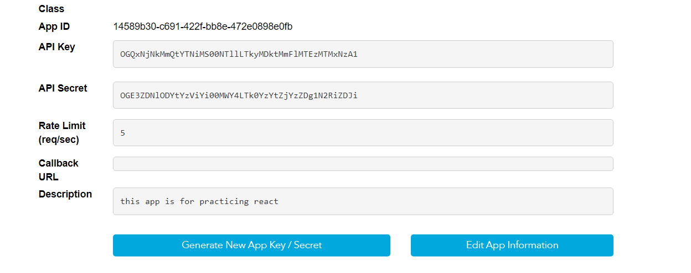

### Audio App
> API were using: https://developer.napster.com/

> signup and get the API keys:
```bash
Api Key: OGQxNjNkMmQtYTNiMS00NTllLTkyMDktMmFlMTEzMTMxNzA1
```


Features:
- streaming 
- search 
- Favourite 

1. Babel (Transpiler)- convert modern code (JSX) to non modern, so browsers can intrepret it, older browsers dont support ES6+ versions.
2. Webpack (bundler) - Used to bundle packages together
---
Developed by Reem [Musify](https://www.google.com) and team.