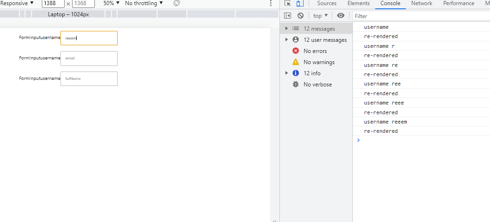
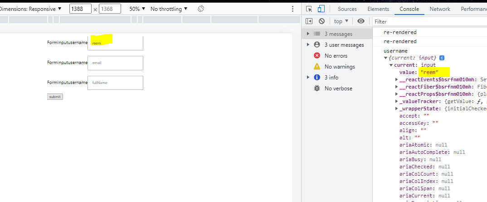
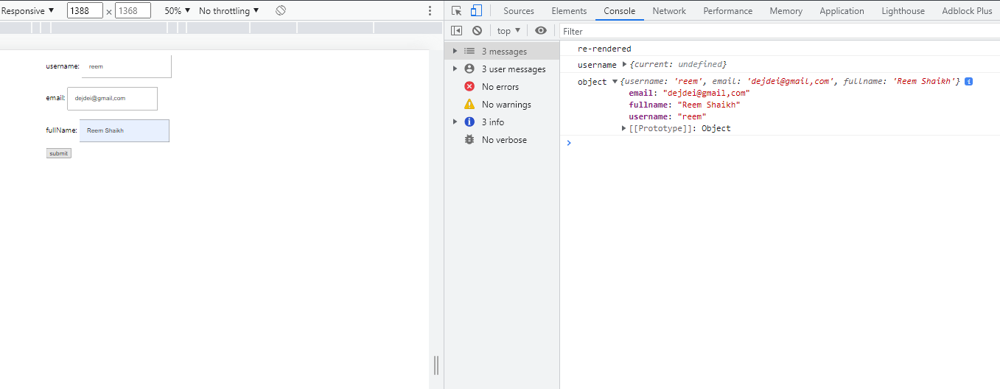
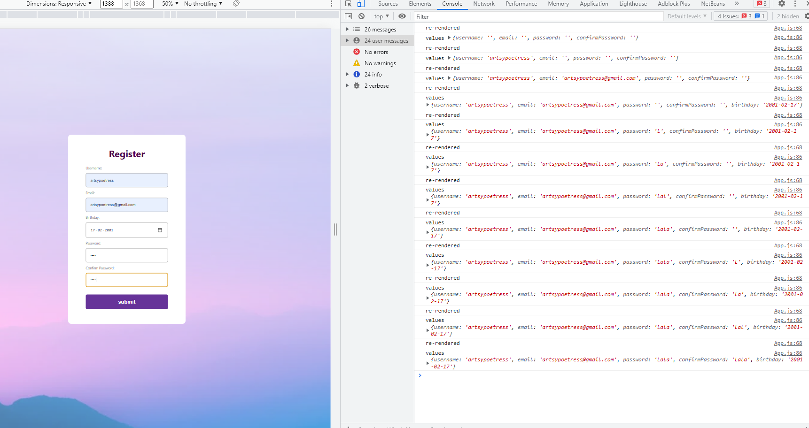
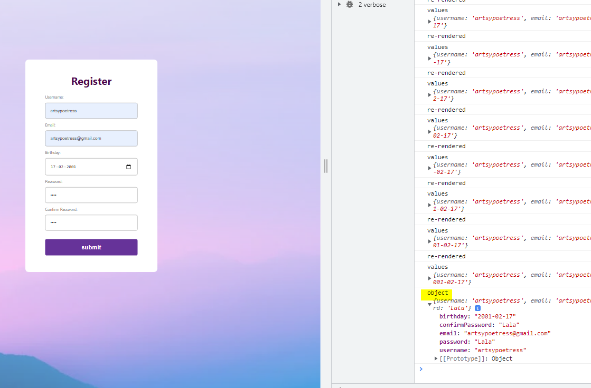

### Handle and Validate React Forms without a library:
- how to handle forms 
- how to prevent re-rendering

#### Were fetching values from input field and printing on console 

> App.js 
```bash
import {useState, react} from 'react';
import './components/FormInput.css';
import FormInput from './components/FormInput';

function App() {
  #were passing this state to the child component
  const [username, setUsername] = useState("")
  console.log('username', username)

  console.log('re-rendered')

  return (
    <div className="App">
      <header className="app">
        <form>
          <FormInput placeholder='username' setUsername={setUsername}/>
          <FormInput placeholder='email'/>
          <FormInput placeholder='fullName'/>
        </form>
      </header>
    </div>
  );
}

export default App;
```
> FormInput.js
```bash 
import React from 'react'
import './FormInput.css'

const FormInput = (props) => {
  return (
    <div className='formInput'>FormInput
        <label>username</label>
        <input placeholder={props.placeholder} onChange={(e) => props.setUsername(e.target.value)}></input>
    </div>
  )
}

export default FormInput
```


- Note that: everytime we enter a new value in the input field, its re-rendered. To fix this, were using the `useRef` hook.

> App.js 
```bash 
import {useState, useRef, react} from 'react';
import './components/FormInput.css';
import FormInput from './components/FormInput';

function App() {
# were passing this state to the child component
# const [username, setUsername] = useState("")
  const usernameRef = useRef()

  console.log('re-rendered')

  const handleSubmit = (e) => {
    e.preventDefault();
    console.log('username', usernameRef)
  }

  return (
    <div className="App">
      <header className="app">
        <form onSubmit={handleSubmit}>
          <FormInput placeholder='username' refer={usernameRef}/>
          <FormInput placeholder='email'/>
          <FormInput placeholder='fullName'/>
          <button>submit</button>
        </form>
      </header>
    </div>
  );
}

export default App;
```
> FormInput.js 
```bash 
import React from 'react'
import './FormInput.css'

const FormInput = (props) => {
  return (
    <div className='formInput'>FormInput
        <label>username</label>
        # <input placeholder={props.placeholder} onChange={(e) => props.setUsername(e.target.value)}></input> 
        <input placeholder={props.placeholder} 
        ref={props.refer}
        />
    </div>
  )
}

export default FormInput
```


#### How do we acheive this without re-rendering for all the labels?

> App.js 
```bash 
import logo from './logo.svg';
import {useState, useRef, react} from 'react';
import './components/FormInput.css';
import FormInput from './components/FormInput';

function App() {

  console.log('re-rendered')

  const handleSubmit = (e) => {
    e.preventDefault();
    console.log('username', usernameRef)
    const data = new FormData(e.target)
    #were going to be targetting name attribute through this data
    
    #this line of code gets each value from the input field based on their name attribute
    console.log('object', Object.fromEntries(data.entries()))
  }

  return (
    <div className="App">
      <header className="app">
        <form onSubmit={handleSubmit}>
          <FormInput name='username' placeholder='username' refer={usernameRef}/>
          <FormInput name='email' placeholder='email'/>
          <FormInput name='fullname' placeholder='fullName'/>
          <button>submit</button>
        </form>
      </header>
    </div>
  );
}

export default App;
```

> FormInput.js 
```bash 
import React from 'react'
import './FormInput.css'

const FormInput = (props) => {
  return (
    <div className='formInput'>
        <label>{props.placeholder}</label>
        # <input placeholder={props.placeholder} onChange={(e) => props.setUsername(e.target.value)}></input>
        <input placeholder={props.placeholder} 
        name={props.name}
        />
    </div>
  )
}

export default FormInput
```


#### Were fetching values for 4 different fields and printing it on console 
> App.js 
```bash 
import {useState, useRef, react} from 'react';
import './components/FormInput.css';
import FormInput from './components/FormInput';

function App() {
  #instead of creating a seperate state for each label, were initializing all the object of the input field, inside the current value of state, which initialises the values each input field will take to an empty string
   const [values, setValues] = useState({
     username: "",
     email:"",
     password:"",
     confirmPassword:"",
   })

   #array of objects 
 const inputs = [
      {
        id: 1,
        name: "username",
        type: "text",
        placeholder: "Username",
        errorMessage:
          "Username should be 3-16 characters and shouldn't include any special character!",
        label: "Username",
        pattern: "^[A-Za-z0-9]{3,16}$",
        required: true,
      },
      {
        id: 2,
        name: "email",
        type: "email",
        placeholder: "Email",
        errorMessage: "It should be a valid email address!",
        label: "Email",
        required: true,
      },
      {
        id: 3,
        name: "birthday",
        type: "date",
        placeholder: "Birthday",
        label: "Birthday",
      },
      {
        id: 4,
        name: "password",
        type: "password",
        placeholder: "Password",
        errorMessage:
          "Password should be 8-20 characters and include at least 1 letter, 1 number and 1 special character!",
        label: "Password",
        pattern: `^(?=.*[0-9])(?=.*[a-zA-Z])(?=.*[!@#$%^&*])[a-zA-Z0-9!@#$%^&*]{8,20}$`,
        required: true,
      },
      {
        id: 5,
        name: "confirmPassword",
        type: "password",
        placeholder: "Confirm Password",
        errorMessage: "Passwords don't match!",
        label: "Confirm Password",
        pattern: values.password,
        required: true,
      },
    ];
  
  console.log('re-rendered')

  const handleSubmit = (e) => {
    e.preventDefault();
    const data = new FormData(e.target)
    #were going to be targetting name attribute through this data object
    
    #this line of code gets each value from the input field based on their name attribute
    #it returns the final object with all the key-value pairs we entered in the form fields 
    console.log('object', Object.fromEntries(data.entries()))
  }

  #everytime this function is called
  #in the already existing values[], were making a change in the value attribute
  const onChange = (e) => {
    setValues({...values, [e.target.name]: e.target.value})
  }
  
  console.log('values', values)
  return (
    <div className="App">
      <header className="app">
        <form onSubmit={handleSubmit}>
          #initially it gets the placeholder from the values name attribute, onchange values are logged into the input field 
        {inputs.map((input) => (
          <FormInput key={input.id} {...input} value={values[inputs.name]} onChange={onChange}/>
        ))}

        #instead of creating a seperate input for all these elements, were running the map function and passing props to the child component 
        # <FormInput name='username' placeholder='username' refer={usernameRef}/>
        # <FormInput name='email' placeholder='email'/>
        # <FormInput name='confirmPassword' placeholder='password'/>
        # <FormInput name='confirmPassword' placeholder='password'/> 
          <button>submit</button>
        </form>
      </header>
    </div>
  );
}

export default App;
```
> FormInput.js 
```bash 
import React from 'react'
import './FormInput.css'

const FormInput = (props) => {
  const {label, errorMessage, onChange, id, ...inputProps} = props

  return (
    <div className='formInput'>
        <label>{props.placeholder}: </label>
        # <input placeholder={props.placeholder} onChange={(e) => props.setUsername(e.target.value)}></input> 
        # <input placeholder={props.placeholder} name={props.name} /> 
        
        <input {...inputProps}
        onChange={onChange} required></input> 
        # internally it creates an input field for each element from the input[] 

    </div>
  )
}

export default FormInput
```
> before we enter anything in the form 


> after we enter in form 


> after we hit submit 


