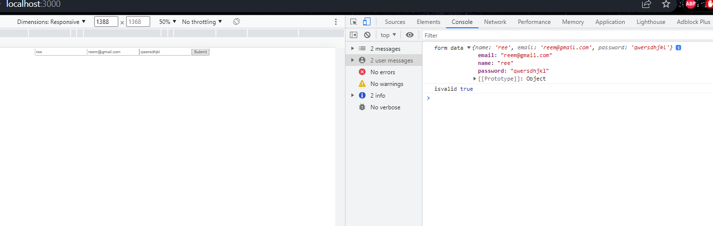

# Form Validation with Libraries
- Create form using `formik` library:  / `react-hook-form` library.
```bash 
These are open source libraries for React and React Native
- We create form using Formik or react-hook-form Library
```
> Installation for `formik`
```bash 
npm i formik
```

> Installation for `react-hook-form`
```bash 
npm i react-hook-form @hookform/resolvers
```

- Apply validation using `yup` library: 
```bash 
Yup is used for value validation, for example, what a particular input will accept.
```
> Installation:
```bash 
npm i yup
```
##### React Folder Structure: An overview:
```bash
- Package-lock.json - contains dependencies that node_modules use.
- Package.json - contains all dependencies that application uses.
- gitignore - whatever you dont want to log onto your public git profile 
- public/index.html - contains root div which is called in src/index.js 
- src/index.js - contains the App component and tells to map the component data into the #root
```
### Form validation with Yup 
> vaidation/UserValidation.js
```bash 
import * as yup from 'yup';

# to validate data we need to create a schema, were defining validation using all the properties inside Yup library 
# were exporting this validation to App.js
export const userSchema = yup.object().shape({
    name: yup.string().required(),
    email: yup.string().email().required(),
    password: yup.string().min(4).max(10).required(),
})
```
> App.js 
```bash 
import './App.css';
import {userSchema} from './Validation/UserValidation'

function App() {
    const createUser = async (event) => {
        event.preventDefault();
        let formData = {
            name: event.target[0].value,
            email: event.target[1].value,
            password:event.target[2].value,
        }
        # this console command fetches values from the input field and displays it in console, when user hits submit 
        console.log('form data', formData)

        # it returns true or false if the input user entered enters matches the validation we set in userSchema or not 
        const isValid = await userSchema.isValid(formData)
        console.log('isvalid', isValid)

    }
    return (
        <div className='App'>
            <form onSubmit={createUser}>
                <input type='text' placeholder='name'/>
                <input type='text' placeholder='email' />
                <input type='text' placeholder='password' />
                <input type='submit' />
            </form>
        </div>
    )
}

export default App;
```


#### Form Validation with react-hook-form and Yup
> were setting validation through `yup`
> were setting the error messages through `react-hook-form`

> App.js
```bash 
import "./App.css";
import Form from "./Components/Form.js";
function App() {
  return (
    <div className="App">
      <Form />
    </div>
  );
}

export default App;
```
> Form.js
```bash 
import React from "react";
import "../App.css";
import { useForm } from "react-hook-form";
import { yupResolver } from "@hookform/resolvers/yup";
import * as yup from "yup";

#creating a schema 
const schema = yup.object().shape({
  firstName: yup.string().required("First Name should be required please"),
  lastName: yup.string().required(),
  email: yup.string().email().required(),
  age: yup.number().positive().integer().required(),
  password: yup.string().min(4).max(15).required(),
  #built in methods of yup- oneOf 
  #ref - to make reference to another field in the schema 
  confirmPassword: yup.string().oneOf([yup.ref("password"), null]),
});

#yupresolver helps connecting react-hook-form and yup
function Form() {
  #destructuring useForm hook
  #error object contains all the object send from the schema 
  const { register, handleSubmit, errors } = useForm({
    resolver: yupResolver(schema),
  });

  const submitForm = (data) => {
    console.log(data);
  };
  return (
    <div className="Form">
      <div className="title">Sign Up</div>
      <div className="inputs">
        <form onSubmit={handleSubmit(submitForm)}>
          <input
            type="text"
            name="firstName"
            ref={register}
            placeholder="First Name..."
          />
          <p> {errors.firstName?.message} </p>

          <input
            type="text"
            name="lastName"
            placeholder="Last Name..."
            ref={register}
          />
          <p> {errors.lastName?.message} </p>

          <input
            type="text"
            name="email"
            placeholder="Email..."
            ref={register}
          />
          <p> {errors.email?.message} </p>

          <input 
          type="text"
          name="age" 
          placeholder="Age..." 
          ref={register} />
          <p> {errors.age?.message} </p>

          <input
            type="password"
            name="password"
            placeholder="Password..."
            ref={register}
          />
          <p> {errors.password?.message} </p>

          <input
            type="password"
            name="confirmPassword"
            placeholder="Confirm Password..."
            ref={register}
          />
          <p> {errors.confirmPassword && "Passwords Should Match!"} </p>
          
          <input type="submit" id="submit" />
        </form>
      </div>
    </div>
  );
}

export default Form;
```
> To learn about Form validation with formik and Yup, head over to the formik folder.