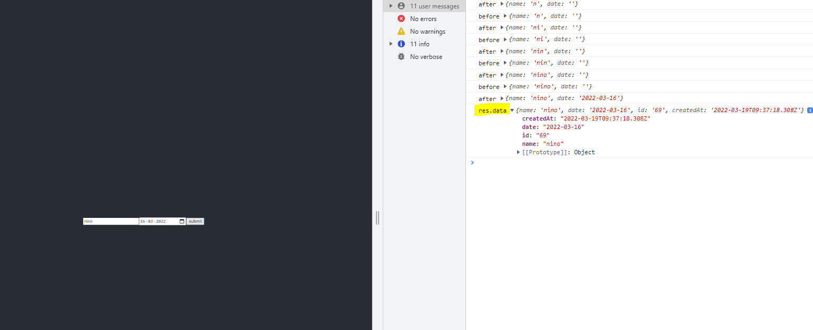

#### Post Form data to API

> PostForm.js 
```bash 
import React, {useState} from 'react';
import Axios from 'axios';

function PostForm() {
 const url='https://reqres.in/api/posts'
 const [data, setData] = useState({
    name: "",
    date: "",
 })

 function submit(e){
    e.preventDefault();
    Axios.post(url, {
        name: data.name,
        date: data.date,
    }).then(res => {
        console.log('res.data', res.data)
    })
 }

 function handle(e){
    const newdata = {...data};
    console.log('before', newdata)
    newdata[e.target.id] = e.target.value;
    setData(newdata);
    console.log('after', newdata)
 }
  return (
    <div>
        <form onSubmit={(e) => submit(e)}>
            <input placeholder='name' type='text'
            onChange={(e) => handle(e)} value={data.name} id='name'></input>
            <input placeholder='date' type='date'
            onChange={(e) => handle(e)} value={data.date} id='date'></input>
            <button>submit</button>
        </form>
    </div>
  )
}

export default PostForm
```

> App.js 
```bash 
import logo from './logo.svg';
import './App.css';
import PostForm from './components/PostForm';

function App() {
  return (
    <div className="App">
      <header className="App-header">
       <PostForm />
      </header>
    </div>
  );
}

export default App;
```
