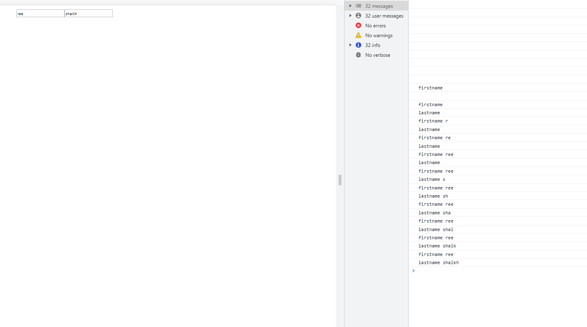
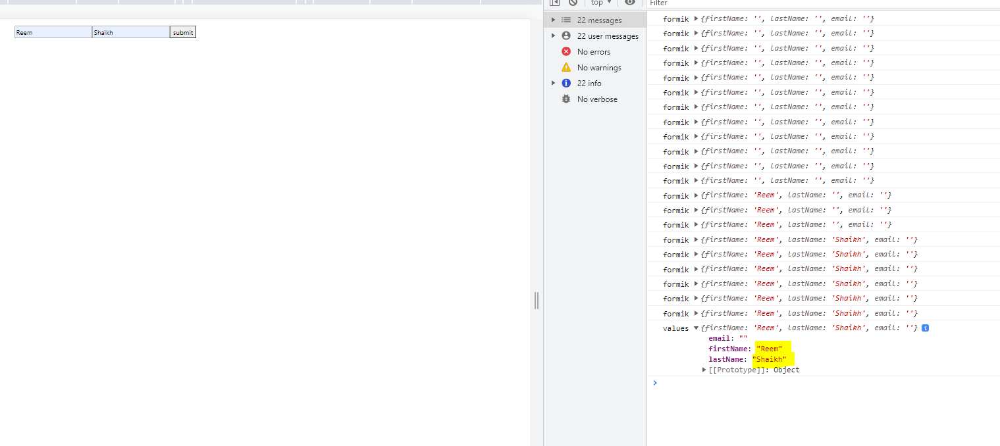
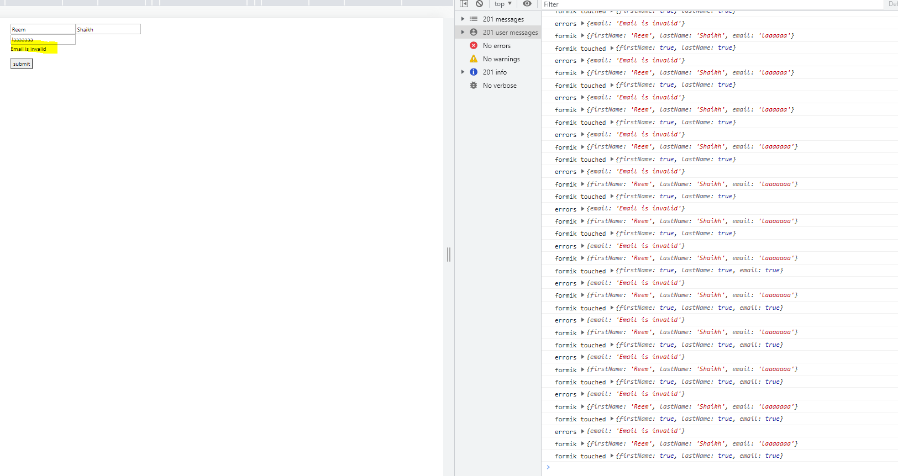
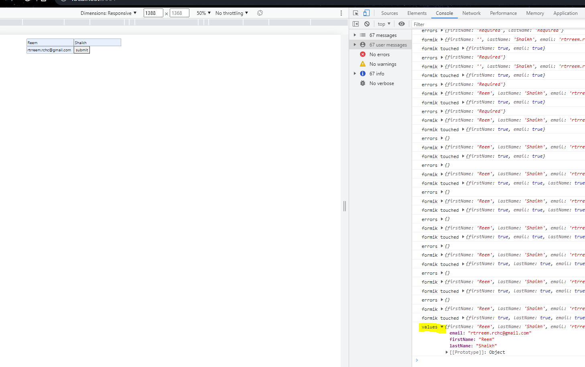
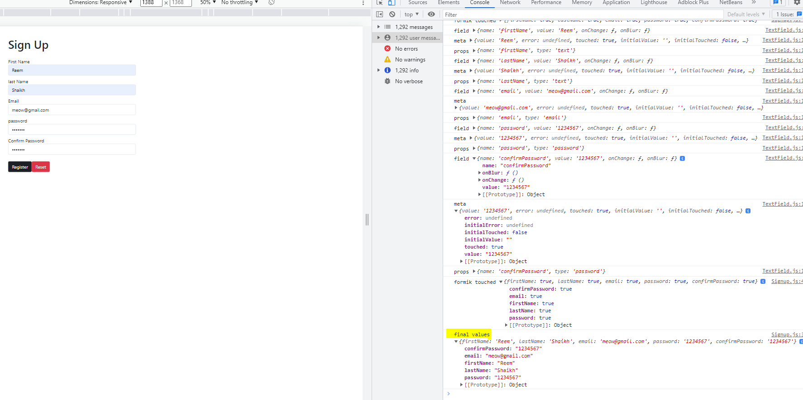

#### An overview of handling form without any libraries.
> Login.js 
```bash 
import React, {useState} from 'react'

function Login() {
//to store data in local state 
const [firstName, setFirstName] = useState("")
console.log(firstName)
  return (
    //to implement two way binding, we need to add the value attribute 
    <div className='input-container'>
        <input 
        id='firstName'
        name='firstName'
        type='text'
        placeholder='First Name'
        onChange={(e) => {
            setFirstName(e.target.value)
        }} 
        value={firstName}>
            
        </input>
    </div>
  )
}

export default Login
```
> App.js 
```bash 

import React from 'react'
import Login from './components/Login'

function App() {
  return (
    <div>
    <div className="container mt-3">
     <div className="row">
        <div className="col-md-5">
          <Login />
        </div>
       <div className="col-md-7 my-auto">
      </div>
   </div>
 </div>  
    </div>
  )
}

export default App
```

> When you handling alot of form input fields, you'll have to individually create all their input field with props and an onChange function for each field, along with a new state for every input field

> Login.js 
```bash 
import React, {useState} from 'react'

function Login() {
# creating multiple states 
const [firstName, setFirstName] = useState("")
console.log('firstname',firstName)

const [lastName, setLastName] = useState("")
console.log('lastname',lastName)

  return (
    # creating multiple input fields with multiple onChange functions 
    <div className='input-container'>
        <input 
        id='firstName'
        name='firstName'
        type='text'
        placeholder='First Name'
        onChange={(e) => {
            setFirstName(e.target.value)
        }} 
        value={firstName}>
        </input>
        <input 
        id='lastName'
        name='lastName'
        type='text'
        placeholder='Last Name'
        onChange={(e) => {
            setLastName(e.target.value)
        }} 
        value={lastName}>
        </input>
    </div>
  )
}

export default Login
```


> to ease the form handling, we use formik.
 
#### Adding Formik for form handing
> Login.js 
```bash 
import { useFormik } from 'formik'
import React, {useState} from 'react'

function Login() {
const formik = useFormik({
    initialValues: {
        firstName: "",
        lastName: ""
    },
    onSubmit: (values) => {
        console.log('values',values)
    }
})

  return (
# two way bind data using value field 
<form onSubmit={formik.handleSubmit}>
    <div className='input-container'>
    {console.log('formik', formik.values)}

    <input 
        id='firstName'
        name='firstName'
        type='text'
        placeholder='First Name'
        onChange={formik.handleChange} 
        value={formik.values.firstName}>
        </input>
        <input 
        id='lastName'
        name='lastName'
        type='text'
        placeholder='Last Name'
        onChange={formik.handleChange} 
        value={formik.values.lastName}>
        </input>
        <button type='submit'>submit</button>
    </div>
</form>
  )
}

export default Login
```

> App.js 
```bash 

import React from 'react'
import Login from './components/Login'

function App() {
  return (
    <div>
    <div className="container mt-3">
     <div className="row">
        <div className="col-md-5">
          <Login />
        </div>
       <div className="col-md-7 my-auto">
        {/*  */}
      </div>
   </div>
 </div>  
    </div>
  )
}

export default App
```


#### Adding Yup for form validation 
> Login.js 
```bash 
import { useFormik } from 'formik';
import * as Yup from 'yup';
import React, {useState} from 'react'

function Login() {
const formik = useFormik({
    initialValues: {
        firstName: "",
        lastName: "",
        email: ""
    },
    validationSchema: Yup.object({
        firstName: Yup.string()
        .max(15, 'Must be 15 characters or less')
        .required('Required'),
      lastName: Yup.string()
        .max(20, 'Must be 20 characters or less')
        .required('Required'),
      email: Yup.string()
        .email('Email is invalid')
        .required('Email is required'),
    }),

    onSubmit: (values) => {
        console.log('values',values)
    }
})

# to view the errors 
console.log('errors', formik.errors)

  return (
# two way bind data using value field 
<form onSubmit={formik.handleSubmit}>
    <div className='input-container'>
    {console.log('formik', formik.values)}

    {/* this console statement returns a boolean value which indicates whether the user has touched the input field or not */}
   {console.log('formik touched', formik.touched)}

    <input 
        id='firstName'
        name='firstName'
        type='text'
        placeholder='First Name'
        onChange={formik.handleChange} 
        value={formik.values.firstName}
        onBlur={formik.handleBlur}>
        {/* handleblurr property is directly linked to formik.touched, when we click on the input field this onblurr function is fired and formik.touched logs true  */}
    </input>
    {formik.touched.firstName && formik.errors.firstName? <p>{formik.errors.firstName}</p> : null}
        <input 
        id='lastName'
        name='lastName'
        type='text'
        placeholder='Last Name'
        onChange={formik.handleChange} 
        value={formik.values.lastName}
        onBlur={formik.handleBlur}>
        </input>
    {formik.touched.lastName && formik.errors.lastName? <p>{formik.errors.lastName}</p> : null}
        <input 
        id='email'
        name='email'
        type='email'
        placeholder='Email'
        onChange={formik.handleChange} 
        value={formik.values.email}
        onBlur={formik.handleBlur}>
        </input>
    {formik.touched.email && formik.errors.email? <p>{formik.errors.email}</p> : null}
        <button type='submit'>submit</button>
    </div>
</form>
  )
}

export default Login
```
> When we didnt follow the validation requirments, it throws an error, before we hit submit, p.s you cannot submit if the input you entered has an error


> When we followed the validation requirments and click on submit, the updated values are been logged in the console.


#### Instead of writing the input fields and error messages seperately we can pass it as props which can be recieved by useField hook defined in formik library 
> App.js 
```bash 
import './App.css';
//import rocketImg from './assets/rocket.jpg';
import { Signup } from './components/Signup';

function App() {
  return (
    <div className="container mt-3">
      <div className="row">
        <div className="col-md-5">
          <Signup />
        </div>
        <div className="col-md-7 my-auto">
          {/*  */}
        </div>
      </div>
    </div>
  );
}

export default App;
```
> Signup.js 
```bash 
import React from 'react';
import { Formik, Form } from 'formik';
import { TextField } from './TextField';
import * as Yup from 'yup';

export const Signup = () => {
# inside the required field were adding the error message 
  const validate = Yup.object({
    firstName: Yup.string()
      .max(15, 'Must be 15 characters or less')
      .required('Required'),
    lastName: Yup.string()
      .max(20, 'Must be 20 characters or less')
      .required('Required'),
    email: Yup.string()
      .email('Email is invalid')
      .required('Email is required'),
    password: Yup.string()
      .min(6, 'Password must be at least 6 charaters')
      .required('Password is required'),
    confirmPassword: Yup.string()
      .oneOf([Yup.ref('password'), null], 'Password must match')
      .required('Confirm password is required'),
  })
  return (
    # wrap form inside Formik component 
    <Formik
      initialValues={{
        firstName: '',
        lastName: '',
        email: '',
        password: '',
        confirmPassword: ''
      }}

      validationSchema={validate}
      onSubmit={values => {
        console.log('final values',values)
      }} >
      {formik => (
        <div>
          <h1 className="my-4 font-weight-bold .display-4">Sign Up</h1>
          {console.log('formik touched',formik.touched)}
          
          <Form>
            <TextField label="First Name" name="firstName" type="text" />
            <TextField label="last Name" name="lastName" type="text" />
            <TextField label="Email" name="email" type="email" />
            <TextField label="password" name="password" type="password" />
            <TextField label="Confirm Password" name="confirmPassword" type="password" />
            <button className="btn btn-dark mt-3" type="submit">Register</button>
            <button className="btn btn-danger mt-3 ml-3" type="reset">Reset</button>
          </Form>
        </div>
      )}
    </Formik>
  )
}
```
> TextField.js
```bash 
import React from 'react';
import { ErrorMessage, useField } from 'formik';
import '../App.css'

# grabbing all props from parent 
export const TextField = ({ label, ...props }) => {
  const [field, meta] = useField(props);
  # field contains all the name attributes and its values 
  console.log('field',field);
  console.log('meta', meta);
  console.log('props', props);

  return (
    <div className="mb-2">
      <label htmlFor={field.name}>{label}</label>
      {/* if input field is touched (i.e touched = true) and input field has error, then run a class called is-invalid */}
      <input
        className={`form-control shadow-none ${meta.touched && meta.error && 'is-invalid'}`}
        {...field} {...props}
        autoComplete="off"
      />
      <ErrorMessage component="div" name={field.name} className="error" />
    </div>
  )
}
```
> after filling form correctly following validation guidelines and clicking on `register` all the values are logged.

