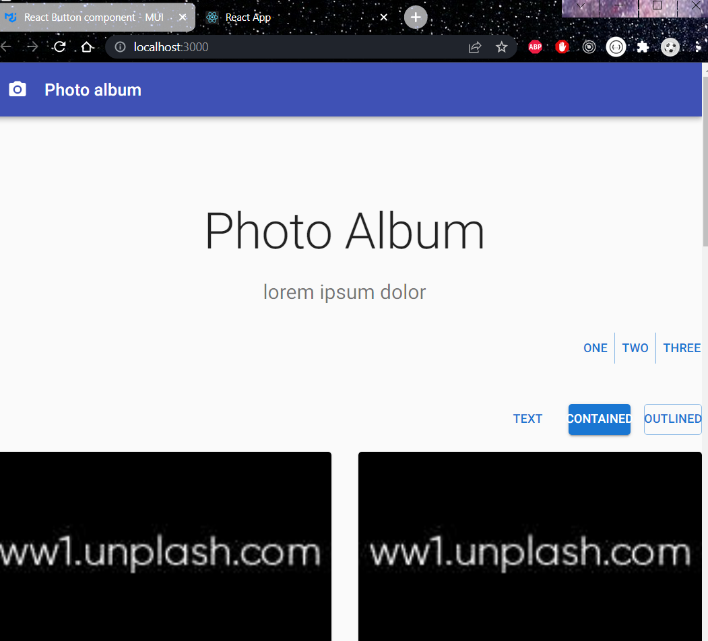
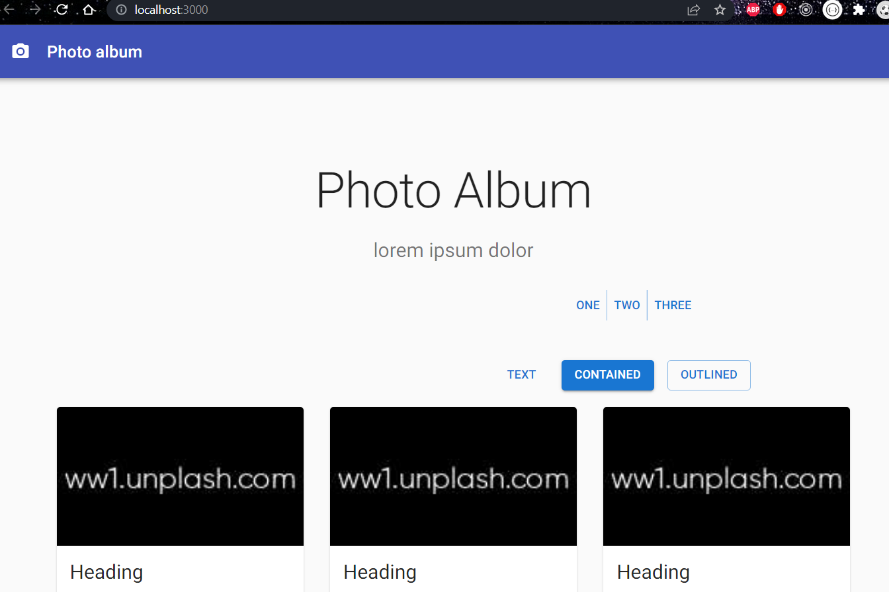
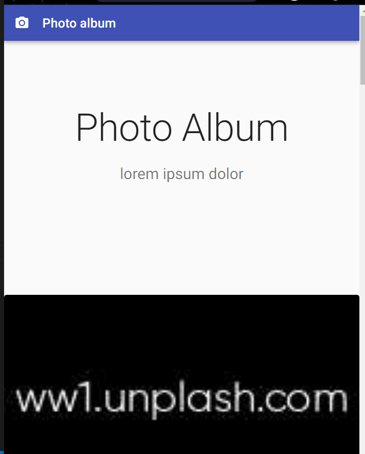

# Material UI 
> React Component UI library 

- creating app in the particular folder
```bash 
npx create-react-app ./
```
Installing MUI dependencies:
```bash
npm install @material-ui/core @material-ui/icons
```
```bash
npm install @mui/material @emotion/react @emotion/styled
```
> Components API - contains list of props that you can use with the components from the components section. 

#### How to style MUI components?
1. inline styles
2. inpage style
> App.js
```bash 
import {PhotoCamera} from '@material-ui/icons';
import Stack from '@mui/material/Stack';
# named import 
import { Typography, AppBar, Card, CardAction, CardContent, CardMedia, CssBaseline, Grid, Toolbar, Container } from '@material-ui/core';
import * as React from 'react';
import Button from '@mui/material/Button';
import ButtonGroup from '@mui/material/ButtonGroup';
import Box from '@mui/material/Box';
import {makeStyles} from '@material-ui/core/styles'

const useStyles = makeStyles((theme) => ({
  #creating a custom hook called useStyles 
  container: {
    padding: theme.spacing(10, 0, 6)
  }
}))

function App() {
  const classes = useStyles()

  return (
    <>
      <CssBaseline/>
      <AppBar position='relative'>
          <Toolbar>
            <PhotoCamera />
             <Typography variant='h6'>
                Photo album
              </Typography>
          </Toolbar>
      </AppBar>
      <main>
        <div>
            # inline style 
            <Container style={{ marginTop: '100px'}}>
                <Typography variant='h2' align='center' color='textPrimary' gutterBottom >
                     Photo Album 
                </Typography>
                <Typography variant='h5' color='textSecondary' align='center' paragraph>
                  lorem ipsum dolor 
                </Typography>
            </Container>
        </div>
        <div className={classes.container}>
        <Box>
        <ButtonGroup variant="text" aria-label="text button group">
        <Button>One</Button>
        <Button>Two</Button>
        <Button>Three</Button>
        </ButtonGroup>
        </Box>
        <Stack spacing={2} direction="row" style={{ marginLeft: '600px'}}>
         <Button variant="text">Text</Button>
         <Button variant="contained">Contained</Button>
         <Button variant="outlined">Outlined</Button>
       </Stack>
       </div>
      </main>
    </>
  );
}

export default App;
```

3. new file for the styles 
> styles.js 
```bash 
import {makeStyles} from '@material-ui/core/styles'

const useStyles = makeStyles((theme) => ({
  #creating a custom hook called useStyles 
  container: {
    #lhs- camelcase: rhs- strin
    padding: theme.spacing(2, 0, 6),
    marginLeft: '700px',
  },
  icon: {
    marginRight: '20px',
  },
  cardGrid: {
    padding: '20px 0',
    # display: 'flex',
    # flexDirection: 'row',
    # flexWrap: 'wrap',
  },
  card: {
    height: '100%',
    display: 'flex',
    flexDirection: 'column',
  },
  cardMedia: {
    paddingTop: '56.25%',
  },
  cardContent: {
    flexGrow: '1',
  }
}))

export default useStyles
```

> App.js 
```bash 
import './App.css'
import { PhotoCamera } from '@material-ui/icons'
import Stack from '@mui/material/Stack'
# named import
import {
  Typography,
  AppBar,
  Card,
  CardActions,
  CardContent,
  CardMedia,
  CssBaseline,
  Grid,
  Toolbar,
  Container,
} from '@material-ui/core'
import * as React from 'react'
import Button from '@mui/material/Button'
import ButtonGroup from '@mui/material/ButtonGroup'
import Box from '@mui/material/Box'
import useStyles from './styles'
const cards = [1, 2, 3, 4, 5, 6, 7, 8, 9]

function App() {
  const classes = useStyles()

  return (
    <>
      <CssBaseline />
      <AppBar position="relative">
        <Toolbar>
          <PhotoCamera className={classes.icon} />
          <Typography variant="h6">Photo album</Typography>
        </Toolbar>
      </AppBar>
      <main>
        <div>
          <Container style={{ marginTop: '100px' }}>
            <Typography
              variant="h2"
              align="center"
              color="textPrimary"
              gutterBottom
            >
              Photo Album
            </Typography>
            <Typography
              variant="h5"
              color="textSecondary"
              align="center"
              paragraph
            >
              lorem ipsum dolor
            </Typography>
          </Container>
        </div>
        <div className={classes.container}>
          <Box>
            <ButtonGroup variant="text" aria-label="text button group">
              <Button>One</Button>
              <Button>Two</Button>
              <Button>Three</Button>
            </ButtonGroup>
          </Box>
        </div>
        <div>
          <Stack spacing={2} direction="row" style={{ marginLeft: '610px' }}>
            <Button variant="text">Text</Button>
            <Button variant="contained">Contained</Button>
            <Button variant="outlined">Outlined</Button>
          </Stack>
        </div>
        <Container className={classes.cardGrid} maxWidth="md">
          <Grid container spacing={4}>
            {cards.map((card) => (

              #were setting the size of the card on different views:
              #xs- mobile devices- xs={12} means full width, means one card in the width 
              #smaller devices - sm={6} which means 2 cards in the width 
              #medium devices- md={4} which means 3 cards in the width 
              <Grid item key={card} xs={12} sm={6} md={4}>
                <Card className={classes.card}>
                  <CardMedia
                    className={classes.cardMedia}
                    image="https:#source.unplash.com/random"
                    title="image title"
                  />
                  <CardContent className={classes.cardContent}>
                    <Typography gutterBottom variant="h5">
                      Heading
                    </Typography>
                    <Typography>
                      this is amedia card, you can use this sectio to describe
                      the content
                    </Typography>
                  </CardContent>
                  <CardActions>
                    <Button size="small" color="primary">
                      View
                    </Button>
                    <Button size="small" color="primary">
                      Edit
                    </Button>
                  </CardActions>
                </Card>
              </Grid>
            ))}
          </Grid>
        </Container>
      </main>
    </>
  )
}

export default App
```

> this is for smaller devices 


> this is for medium devices 


> this is for mobile devices 

> were setting the size of the card on different views:
```bash
#xs- mobile devices- xs={12} means full width, means one card in the width 
#smaller devices - sm={6} which means 2 cards in the width 
#medium devices- md={4} which means 3 cards in the width 
<Grid item key={card} xs={12} sm={6} md={4}>
```