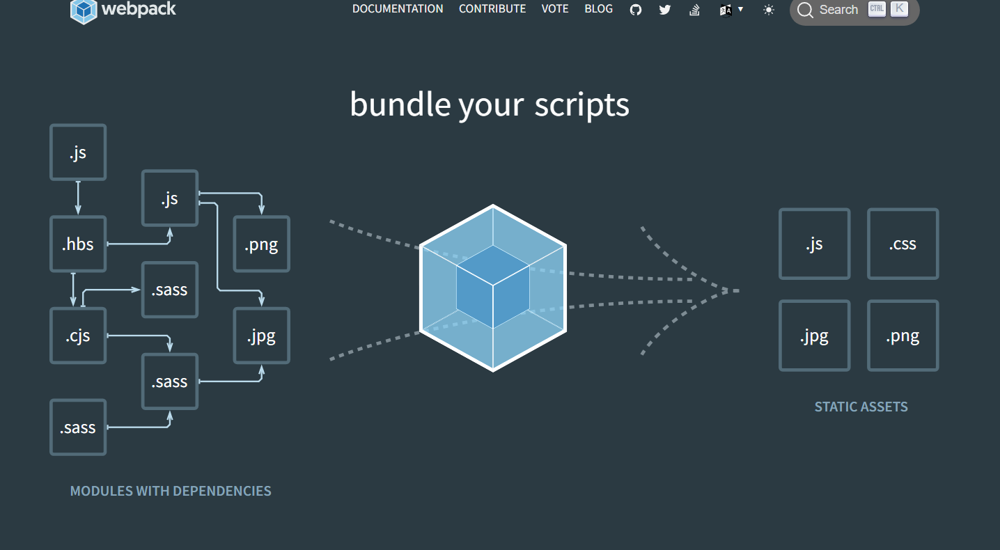
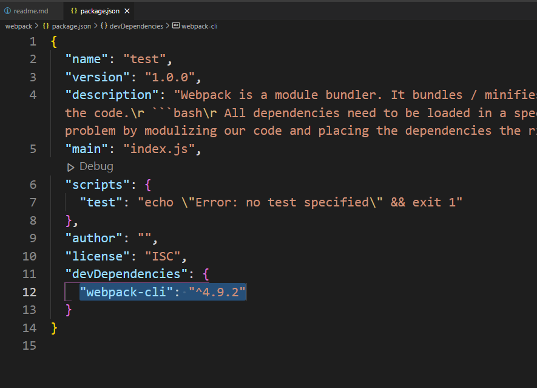
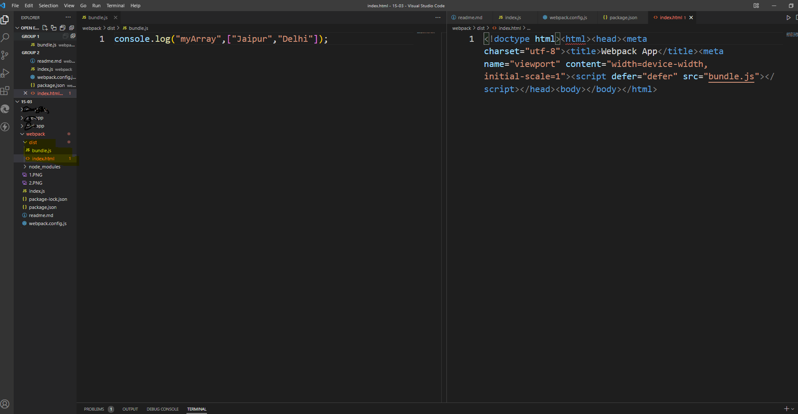

### Webpack 
Webpack is a module bundler. It bundles / minifies / compresses JS & HTML files into a bundle. It modulizes the code.

> Why webpack?
```bash
All dependencies need to be loaded in a specific order, in order to be executed, (for example the script tags need to be written in a specific order) webpack solves this problem by modulizing our code and placing the dependencies the right order
```


> Refer 

> Webpack History:
- before webpack, `grunt` was used 
- webpack was released in march 10, 2012, initial release. Latest release is webpack 5.
- webpack is written in Javascript 

#### Configuring webpack
1. run `npm init` on terminal 
2. run `npm i webpack webpack-cli --save-dev` on terminal 


> create a `webpack.config.js` file
3. Importing Loader and Plugins
> There are two things in webpack: Loaders and Plugins
- Loaders 
Before the bundle `output` is created, all the configuration that needs to be done before that, is done in the loaders
```bash 
When you want to add additional things to your app like:
- loading stylesheets
- loading svg's
```
- Plugins
After the bundle `output` is created, the configuration that needs to be done then, is done at the plugins

##### 3.1 Loader
- navigate to this site `https:www.npmjs.com/` to import `svg` , type `svg-inline-loader` in the search bar and read the docs.
> [Docs](https:#www.npmjs.com/package/svg-inline-loader)
```bash 
npm install svg-inline-loader --save-dev
```
- navigate to this site `https:www.npmjs.com/` to import `style` , type `css-loader` in the search bar and read the docs.
> [Docs](https:#www.npmjs.com/package/css-loader)
```bash 
npm install --save-dev css-loader style-loader
```
#### 3.2 Plugins
> install `Html Webpack Plugin`
```bash
npm i --save-dev html-webpack-plugin
```

#### Babel Configuration
- navigate to this site `https:www.npmjs.com/` to import `babel` , type `babel-loader` in the search bar and read the docs.
> [Docs](https:#www.npmjs.com/package/babel-loader)
```bash 
npm install --save-dev babel-loader 
```
> Note that: index.js is your entry point, all the code that your writting gets bundled and goes back to index.js, this is mentioned in the webpack.config.js file.

#### The configuration
> webpack.config.js - All configurations for the libraries we installed is done inside this file we created.

- In a nutshell, this code handles the configuration for Cs, Js and Svg files. Create a bundled file and place it inside `output` object which then goes to the plugin and stores it in an `index.html` file.
```bash
#this is for the plugin 
const HtmlWebpackPlugin = require('html-webpack-plugin')

#path is for output object 
const path = require("path")

#module.exports is an object 
#in module.exports object we'll be adding an entry point and a module object which consists an object rules which contains an array of objects 
#In this were defining
#what are the entry points of this project?
#is it a production or dev mode?
#we imported an svg library 
#we imported css-loader and style-loader library 
module.exports = {
    entry: './index.js',
    module: {
        rules: [
            #whenever JS witnesses an SVG , since JS cannot load SVG directly, it uses a an external svg library 
            {
                test: /\.svg$/,
                use: 'svg-inline-loader'
                #through use you can load up either a single library or multiple libraries
                #we could even place, module in place of use
            },
            #first css-loader will be loaded, followed by style-loader
            #css-loader - allows you to import all css properties into the JS file 
            #style-loader- allows to inject this bundled (css+js file) into the stylesheet 
            {
                test: /\.css$/i,
                use: ["style-loader", "css-loader"],
            },
            {
                #this test case says to convert JS ES6+ to browser compatible version
                #this is JS REGEX
                test: /\.(js)$/,
                use: 'babel-loader',
            },
        ]
    },
    output: {
        #After the file is bundled in the index.js, keep the same current name (dir name), i.e we want final bundled file in the same directory as we are in rn 
        #dist is the distribution folder. 
        path: path.resolve(__dirname, "dist"),
        #the filename we set for the output file is bundle.js 
        #WOOHOO
        filename: "bundle.js",
    },
    plugins: [
        #this plugin takes bundle.js from the output object and inject it inside index.html
        new HtmlWebpackPlugin()
     ],

     #mode can be development / production 
     #development - is a more lineant mode 
     #production is more strict mode, all files are compressed, minifies the files 
     mode: "development"

     #instead of directly mentioning development or production, we could even define in an environment variable 
     #mode: process.env.NODE_ENV === 'production' ? 'production' : 'development'

     #if we defined it inside NODE_ENV variable, then in package.json inside build you'd have to define it as such
     #"build": "NODE_ENV='production' webpack",
     #Instead of "build": "webpack"
}
```
#### Webpack-dev-server 
While your writting the code, the updates are rendered at the same time on the view, this is where webpack-dev-server helps us out.
```bash 
npm install webpack-dev-server --save-dev
```
> you dont need to configure webpack-dev-server in the webpack.config.js file, its automatically done inside package.json file.

> package.json
```bash 
{
  "name": "webpack",
  "version": "1.0.0",
  "description": "Webpack is a module bundler. It bundles / minifies / compresses JS & HTML files into a bundle. It modulizes the code.\r ```bash\r All dependencies need to be loaded in a specific order, in order to be executed, webpack solves this problem by modulizing our code and placing the dependencies the right order, \r ```\r ",
  "main": "webpack.config.js",
  "scripts": {
    #we wrote these 2 lines  
    ✅"start": "webpack-dev-server",
    ✅"build": "webpack",
    "test": "echo \"Error: no test specified\" && exit 1"
  },
  "author": "",
  "license": "ISC",
  "devDependencies": {
    "babel-loader": "^8.2.3",
    "css-loader": "^6.7.1",
    "html-webpack-plugin": "^5.5.0",
    "style-loader": "^3.3.1",
    "svg-inline-loader": "^0.8.2",
    "webpack": "^5.70.0",
    "webpack-cli": "^4.9.2",
    "webpack-dev-server": "^4.7.4"
  }
}
```
### Running Commands
#### npm run build
Now we'll type `npm run build` on terminal, our webpack will be run, all the files will be bundled and be ready for production deployment. After we run this command, `dist` folder is generated in our repo, which contains 2 files `index.html` and `index.js`


#### npm run start 
> let's try to run `npm run start`, in order to prevent any errors just change `"start":"webpack-dev-server"` to `"start":"webpack serve"` in package.json.

> package.json
```bash 
{
  "name": "webpack",
  "version": "1.0.0",
  "description": "Webpack is a module bundler. It bundles / minifies / compresses JS & HTML files into a bundle. It modulizes the code.\r ```bash\r All dependencies need to be loaded in a specific order, in order to be executed, webpack solves this problem by modulizing our code and placing the dependencies the right order, \r ```\r ",
  "main": "webpack.config.js",
  "scripts": {
    "start": "webpack serve",
    "build": "webpack",
    "test": "echo \"Error: no test specified\" && exit 1"
  },
  "author": "",
  "license": "ISC",
  "devDependencies": {
    "babel-loader": "^8.2.3",
    "css-loader": "^6.7.1",
    "html-webpack-plugin": "^5.5.0",
    "style-loader": "^3.3.1",
    "svg-inline-loader": "^0.8.2",
    "webpack": "^5.70.0",
    "webpack-cli": "^4.9.2",
    "webpack-dev-server": "^4.7.4"
  }
}
```
Note that: `npm run start` doesn't yeild the output file.


