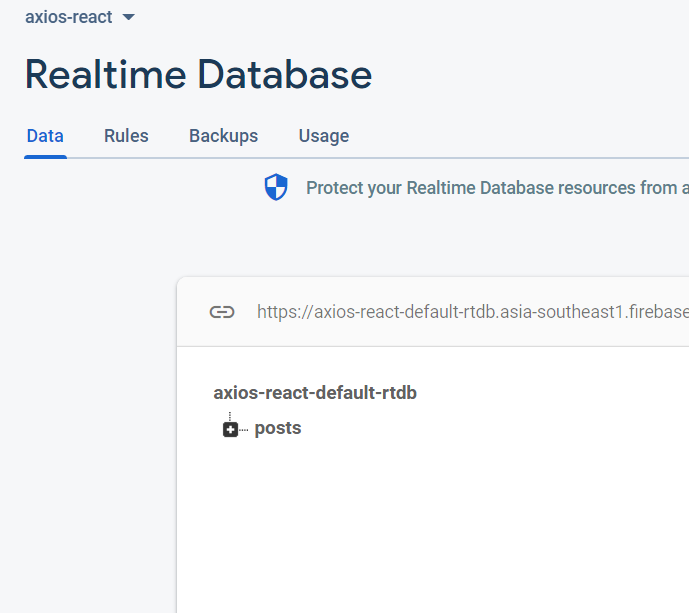
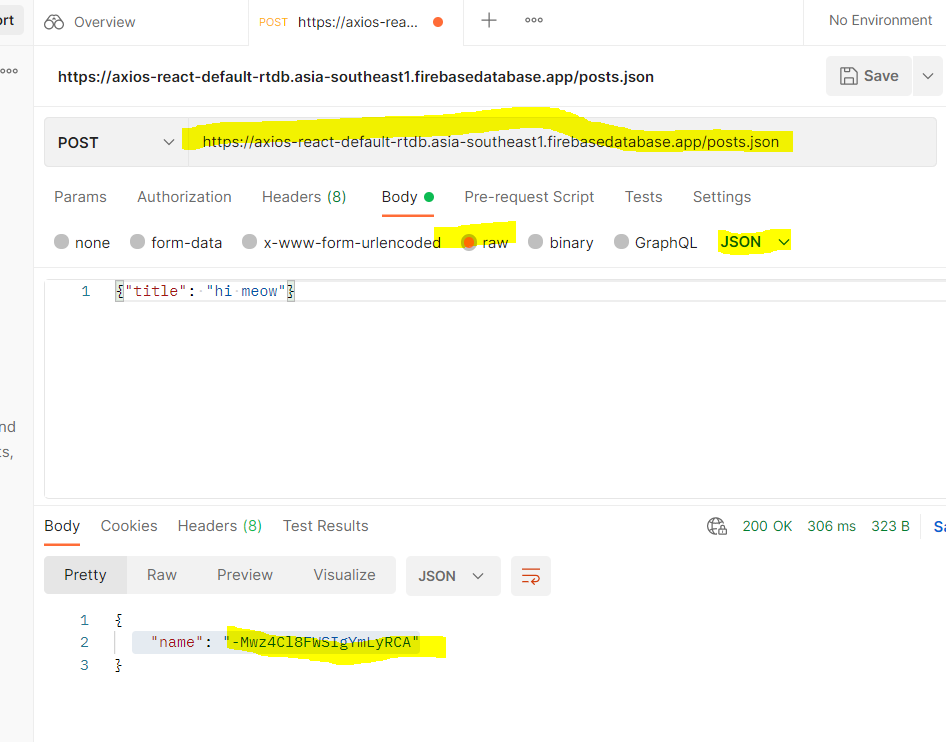
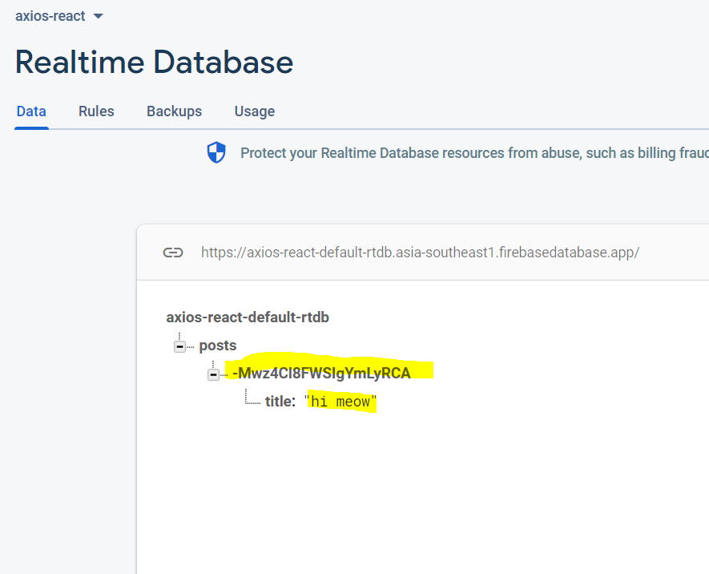
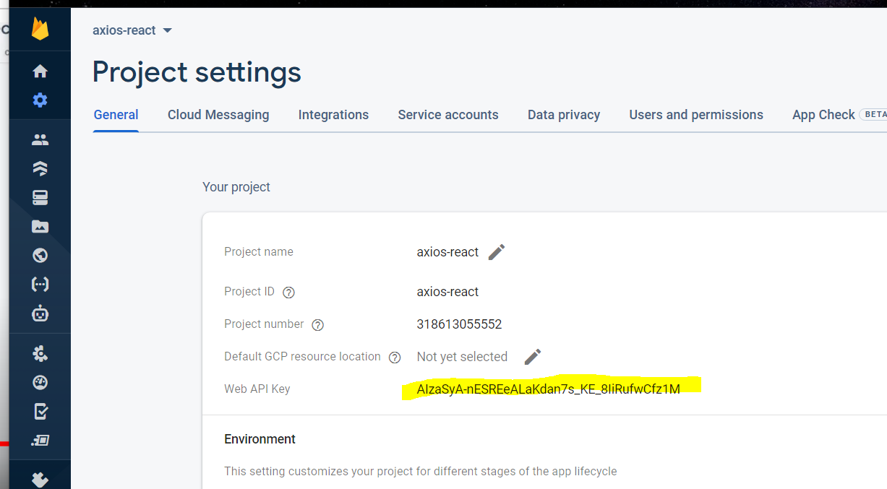

### Documentation 
> https://reactjs.org/docs/faq-ajax.html

### How can I make an AJAX call?
You can use any AJAX library you like with React. Some popular ones are **Axios, jQuery AJAX, and the browser built-in window.fetch**.

> axios is used to make promise based HTTP calls to the API 

### Setup Firebase real-time database to make HTTP API calls 
> Firebase for backend - make rest api call with API (provided by firebase)

> Steps to configure firebase console 
### Creating data in a real time database using Firebase 
1. firebase.com -> get started -> add a project -> create project -> real time database (maintains no-sql db; data stored in JSON structure) - set up database - start in test mode (anybody can take url and change data)

> endpoint REST API URL (given to us by firebase)
```bash 
https://axios-react-default-rtdb.asia-southeast1.firebasedatabase.app/
```


2. create a POSTMAN account log into it and insert the URL here and also add posts.json towardds the end of the url 
> were using POSTMAN to enter data inside our URL 

> POSTMAN - note that it returns a unique primary key ID


> We recieve this ID (cryptographically signed message) in firebase 


3. to get the API key for this particular API, navigate to project settings 


- to get the auth token, you need to pass the API key 
#### Just a lil basics for headsup:
> How is the token generated?
```bash 
1. client makes a request to the server by passing the API key in the request object, server creates and passes a token created using a private key and passes it to the browser where its stored in the local storage of the user.

2. everytime the user makes an API request to the server again, token will be added to the authorization header and send to the server
`Authorization: Bearer <token>`

3. the server validates the token by validating the signature. the signature used to prove that the message hasn’t been jeopardized in transit.
```
There are two types of tokens that are related to identity: ID tokens and access tokens.

#### ID Tokens 
ID tokens are JSON web tokens (JWTs is a token format) meant for use by the application only. For example, if there's an app that uses Google to log in users and to sync their calendars, Google sends an ID token to the app that includes information about the user. The app then parses the token's contents and uses the information (including details like name and profile picture) to customize the user experience. 

Do not use ID tokens to gain access to an API. `unless you maintain control over both the application and the API, sending an ID token to an API will generally not work. `

#### Access Tokens 
Access tokens (which aren't always JWTs) are used to inform an API that the bearer of the token has been authorized to access the API and perform a predetermined set of actions (specified by the scopes granted).

In the Google example above, Google sends an access token to the app after the user logs in and provides consent for the app to read or write to their Google Calendar. Whenever the app wants to write to Google Calendar, it sends a request to the Google Calendar API, including the access token in the HTTP Authorization header.

### OAuth 
```bash 
OAuth is an standardised authorization protocol that can use id/access tokens as a token

**Oauth access tokens**
> it verifies whether the bearer of the token can access the API, once it verifies the API call works 
```
#### Session VS Token authentication 
> session based approach (stateful session between frontend client and backend server)
- were discussing cookie based authentication over here 
1. user fills credentials and submits login form to the server 
2. server validates the request and stores a session in the server database which contains a session ID that was assorted specifically for that particular session login. 
3. session ID is saved in the browsers cookie 
4. everytime the user enters the login form and makes a request to the server, these ccookies will be send along with the request to the server, server checks its db and tries to map the session ID in the cookie with the session ID in its server.
```bash 
When the server receives a request with a Cookie, it will compare the session ID in the Cookie against the session in the database to validate the user.
```
- vulnerable to CSRF (where hacker forges a request to gets the session ID of the target's password, hacker creates a replica link which contains code to change the pass of user once triggered, once the user clicks on it, their pass is changed) 
- Xss attacks - Cross-site scripting works by manipulating a vulnerable web site so that it returns malicious JavaScript to users. When the malicious code executes inside a victim's browser, the attacker can fully compromise their interaction with the application.

> token based authentication - tokens are saved on the client side 
1. user fills credntials, submit login form -> request send to the server 
2. server creates a JWT for the particular session login using a private key 
3. server sends the JWT to the client, its stored in local storage of the user 
4. everytime the user makes a request to the server again, JWT will be added to the authorization header and send to the server
`Authorization: Bearer <token>`
5. the server validates the token by validating the signature. the signature used to prove that the message hasn’t been jeopardized in transit.

### Send HTTP GET API request using axios in react 
