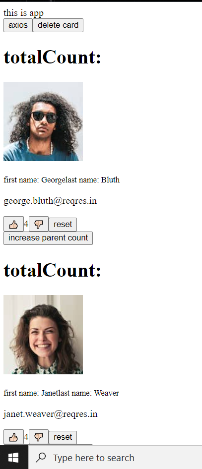

#### Updating state of parent component (index.js) from inside a child component (Card.js)
> index.js 
```bash 
class App extends React.Component {
    constructor() {
      super();
      // this state variable 'geek' stores the values passed from the api, were going to extact it in the form of an array through map 
      this.state = {
        geek: [],
        totalCount: 0,
        firstValue: 0,
      };
    }
 
// 1. feteching data using fetch API 
// getData = () => {
//   fetch("https://reres.in/api/users")
//   .then((res) => res.json())
//   .then((result) => console.log(result))
// };

// 2. Fetching Data using axios 
// to fix the issue of readibility 
// axios library  was released 
// axios is same as fetch except its easier to work with 
    getDataAxios = () => {
      axios.get("https://reqres.in/api/users")
      .then((geekster) =>

          this.setState((prev) => {
            return {
              geek: geekster.data.data,
            };
          })
      );
      //console.log(geekster)
    };
  
    // whenver we pass any data in componentDidMount it will be laoded without having to click on the button 
    componentDidMount() {
      this.getDataAxios();
    }
  
    convertToCards = () => {
      // for (let i = 0; i < this.state.geek.length; i++) {
      //   console.log(this.state.geek[i]);
      // }
  
      return this.state.geek.map((item) => (
          // were using map, because it returns elements in the form of an array 
          // JSX only renders array elements 
        <Card
          avatar={item.avatar}
          first_name={item.first_name}
          last_name={item.last_name}
          email={item.email}
          changeParentCount={this.updateParent}
        />

      ));

//  what fetch returns in console:
// {avatar: 'https://reqres.in/img/faces/2-image.jpg', first_name: 'Janet', last_name: 'Weaver', email: 'janet.weaver@reqres.in'}
// avatar: "https://reqres.in/img/faces/2-image.jpg"
// email: "janet.weaver@reqres.in"
// first_name: "Janet"
// last_name: "Weaver"
// [[Prototype]]: Object

    };

    // we want to create multiple cards, without taking the hastle to define them individually and calling the api through them individualy 

    // to acheive this, were using the map method to extract individual elements in the array and create cards from it 
  
    //   [
    //       <Card />,
    //       <Card/>,
    //       <Card/>,
    //       <Card/>,
    //       <Card/>,
    //   ]
  
    deleteCard = () => {
      this.setState((prev) => {
        console.log('prev',prev);
        // const x = Array.from(prev.geek);

        // were storing the value we get from the state variable inside the array x 
        const x = [...prev.geek];
        // were deleting this element from the array x 
        x.splice(1, 1);

        console.log('x', x);
        // were returning the rest of the array on the DOM 
        return {
          geek: x,
        };

      });
    };

    //✅how to update state of parent component (index.js) from inside a child component (Card.js)? 
    //first we define a  function inside the parent component and pass the props

    //✅we defined the parent component function here 
    updateParent = () => {
      console.log("this is inside parent");
    //updating the state of the parent component from inside the child component

    this.setState((prevState) => {
        return {
          ✅totalcount is the parents state 
          totalCount: prevState.totalCount + 1,
        };
      });
    };
  
  
    render() {
      return (
        <div className="app-container">
          this is app
          <div>
            <button onClick={this.getDataAxios}>axios</button>
            <button onClick={this.deleteCard}>delete card</button>
          </div>
          <div className="card-list">
            {this.convertToCards()}
          </div>
        </div>
      );
    }
  }
  
  ReactDOM.render(<App />, document.getElementById("root"));
```
> Card.js 
```bash 
class Card extends React.Component {
    // this card component is reused for different values passed in the api 
    constructor(props) {
      super(props);
      this.state = {
        numberOflikes: 4,
      };
    }
  
    inc = () => {
      this.setState((prev) => {
        return {
          numberOflikes: prev.numberOflikes + 1,
        };
      });
    };

    reset = () => {
      this.setState((prev) => {
        return {
          numberOflikes: 0,
        };
      });
    };
  
    dec = () => {
      this.setState((prev) => {
        return {
          numberOflikes: prev.numberOflikes - 1,
        };
      });
    };
  
    render() {
      //console.log('props',this.props);

      // const obj = {
      //   avatar: "https://reqres.in/img/faces/1-image.jpg",
      //   email: "george.bluth@reqres.in",
      //   first_name: "George",
      //   id: 1,
      //   last_name: "Bluth",
      // };
  
      return (
        // were using the props that we passed through from the parent component 
        <div className="card-container">
          <h1>totalCount: {this.state.totalcount}</h1>

          
          <p className="names">
            <small>first name: {this.props.first_name}</small>
            <small>last name: {this.props.last_name}</small>
          </p>
          
          <p className="email">{this.props.email}</p>
        {/* the likes are updated only for the specific card component  */}
          <div className="likes">
            <button onClick={this.inc}>👍🏻</button>
            {this.state.numberOflikes}
            <button onClick={this.dec}>👎🏻</button>
            <button onClick={this.reset}>reset</button>
          </div>

          {/* changing the state of the parent component from inside the child component */}
          <button onClick={this.props.changeParentCount}>
          increase parent count
        </button>

        </div>
      );
    }
  }
```
