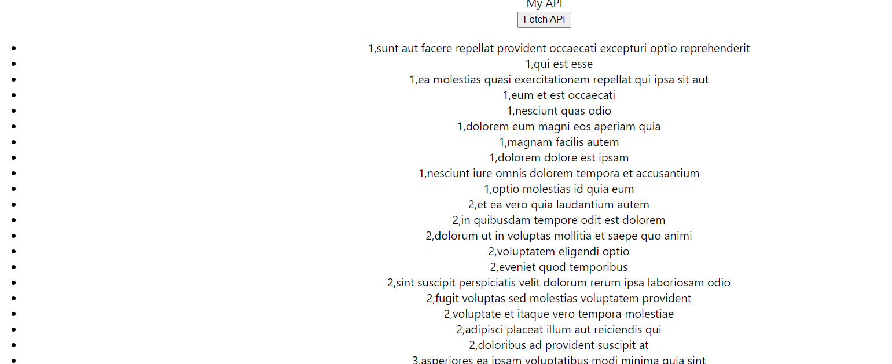
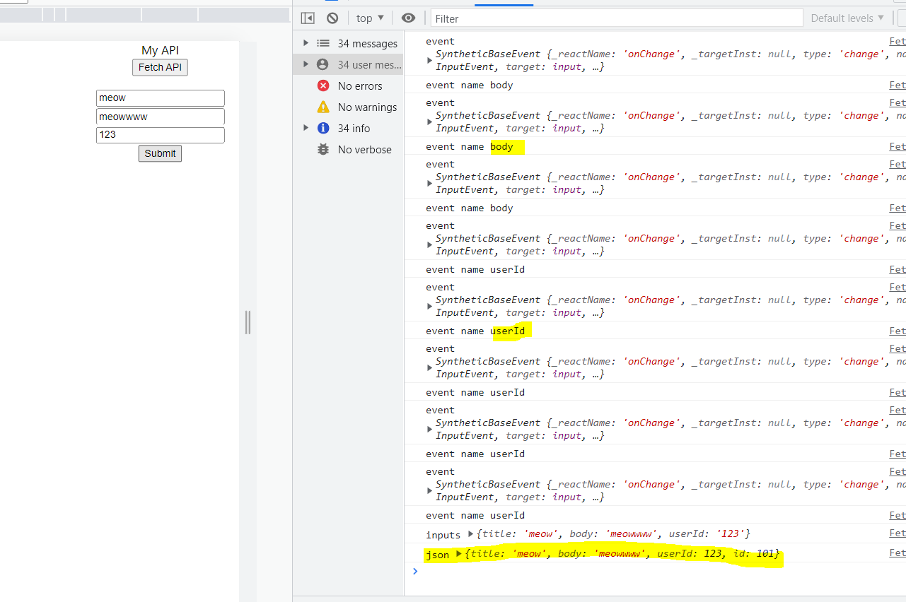
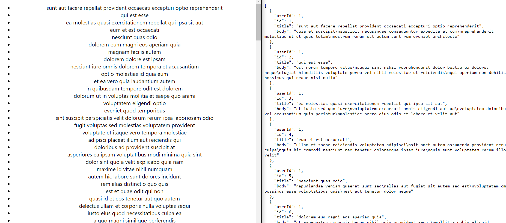
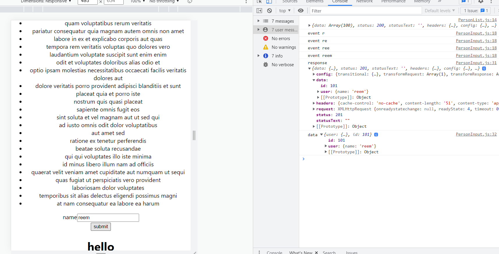
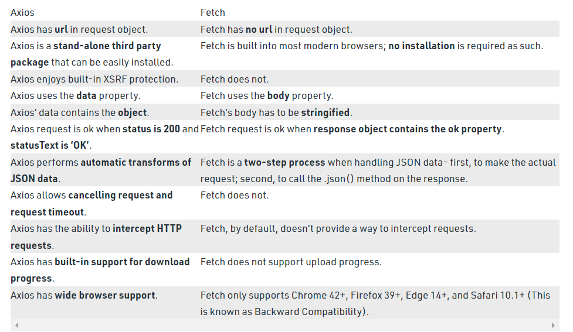

One of the fundamental tasks of any web application is to communicate with servers through the HTTP protocol. This can be easily achieved using Fetch or Axios. Fetch and Axios are very similar in functionality. Some developers prefer Axios over built-in APIs for its ease of use. The Fetch API is perfectly capable of reproducing the key features of Axios.

### Fetch data using fetch API 
the fetch API provides a JS interface for accessing and manipulating parts of the HTTP pipeline such as requests and responses. its also provides a global fetch() method that provides an easy and logical way to fetch resources asynchronously across the network. 

> The fetch() API is an inbuilt JavaScript method for getting resources from a server or an API endpoint.
The Fetch API provides a fetch() method defined on the window object. It also provides a JavaScript interface for accessing and manipulating parts of the HTTP pipeline (requests and responses). The fetch method has one mandatory argument- the URL of the resource to be fetched. This method returns a Promise that can be used to retrieve the response of the request. 

### List a resource on DOM: using GET 
> reference: https://jsonplaceholder.typicode.com/guide/

> FetchApi.js 
```bash 
import React, {useState} from 'react'

function FetchApi() {

//were using useState to store the data in a state 
const [data, setData] = useState([])

//creating method using arrow function 
// were getting this API from https://jsonplaceholder.typicode.com/
const apiGet = () => {
    fetch("https://jsonplaceholder.typicode.com/todos/1")
    .then((response)=> response.json())
    .then((json)=> {
        console.log(json)
        setData(json)
        // a json object is returned here 
    })

    //api returns a promise in the form of a response object 
    //the json data is logged in the next then
}

  return (
    <>
    {/* on button click we get the api data from the url */}
    <button onClick={apiGet}>Fetch API</button>

    {/* print data state here. json.stringify converts js object to a JSON string */}
    {JSON.stringify(data)}
    <br></br>
    </>
  )
}

export default FetchApi

Document:
as soon as you click on the button, the state is updated and the dom is populated with the json data 
```
> App.js 
```bash 
import logo from './logo.svg';
import './App.css';
import FetchApi from './component/FetchApi';

function App() {
  return (
    <div className="App">
      <FetchApi></FetchApi>
    </div>
  );
}

export default App;
```
#### Fetching data onClick and adding it to DOM in li tags 
> FetchApi.js 
```bash 
import React, { useState, useEffect } from "react";

function FetchAPI() {
  const [data, setData] = useState([]);

  //Get Method - is used to display data 
  const apiGet = () => {
    fetch("https://jsonplaceholder.typicode.com/posts")
      .then((response) => response.json())
      .then((json) => {
        console.log(json);
        setData(json);
      });
  };

  // useEffect is used to fetch the data on page reload 
  // useEffect tells react what the component needs to do when the page is rendered 

    // useEffect(() => {
    //   apiGet();
    // }, []);

  return (
    <div>
      My API <br />
      <button onClick={apiGet}>Fetch API</button>
      <br />
      {/* <pre>{JSON.stringify(data, null, 2)}</pre> */}
      <div>
        <ul>
          {data.map((item) => (
            <li key={item.id}>
              {item.userId},{item.title}
            </li>
          ))}
        </ul>
      </div>
    </div>
  );
}

export default FetchAPI;
```
> when you click on the fetchapi button, these json data is fetched from the endpoint and displayed in li tags in the DOM


#### Creating a resource using POST 
> reference: https://jsonplaceholder.typicode.com/guide/

> FetchApi.js 
```bash 
import React, { useState, useEffect } from "react";

function FetchAPI() {
  const [data, setData] = useState([]); //emprty array
  const [inputs, setInputs] = useState({});  //empty object 
 
  //Get Method
  const apiGet = () => {
    fetch("https://jsonplaceholder.typicode.com/posts")
      .then((response) => response.json())
      .then((json) => {
        console.log('json',json);
        setData(json);
      });
  };

  ✅Post Method
  const apiPost = async () => {
    await fetch("https://jsonplaceholder.typicode.com/posts", {
      method: "POST",
      body: JSON.stringify({
        title: inputs.title,
        body: inputs.body,
        //parseint converts args to a string 
        userId: parseInt(inputs.userId),
      }),
      headers: {
        "Content-type": "application/json; charset=UTF-8",
      },
    })
      .then((response) => response.json())
      .then((json) => console.log('json',json));
  };

  //handleChange is called when a user enters a value in the input field 

✅const handleChange = (event) => {
//persist - permanent until its removed 

// Without event.persist() , 
// React will make the first event value as null when second event is fired.
// basically the input field will loose its old value when the new character is inserted 

    console.log('event', event)
    console.log('event name',event.target.name) 
    // based on the input field were entering it can be 
    // title / body / userId 

    event.persist();

    //when this function is called we update the inputs to 
    setInputs((inputs) => ({
      ...inputs,

      [event.target.name]: event.target.value,
      //event.target.value contains the value we entered in the input field 

      //using spread operator were saying, to keep the previos value of all the other inputs 
      //and update the title:"the value entered by user"
    })
    );
  };

  // when you submit the form handleSubmit will be called 
✅const handleSubmit = (event) => {
    event.preventDefault();
    apiPost();
    console.log('inputs',inputs);
  };

  // useEffect is used to fetch the data on page reload 
  // useEffect tells react what the component needs to do when the page is rendered 

    // useEffect(() => {
    //   apiGet();
    // }, []);

  return (
    <div>
      My API <br />
      <button onClick={apiGet}>Fetch API</button>
      <br />
      {/* <pre>{JSON.stringify(data, null, 2)}</pre> */}
      <div>
        <ul>
          {data.map((item) => (
            <li key={item.id}>
              {item.userId},{item.title}
            </li>
          ))}
        </ul>
      </div>

      {/* get data from users from a form */}
      <div>
        <form onSubmit={handleSubmit}>
          <input
            type="text"
            name="title"
            placeholder="title"
            onChange={handleChange}
          /> 
          <br />
          <input
            type="text"
            name="body"
            placeholder="body"
            onChange={handleChange}
          />
          <br />
          <input
            type="number"
            name="userId"
            placeholder="userId"
            onChange={handleChange}
          />
          <br />
          <input type="submit" value="Submit" onChange={handleChange} />
        </form>
      </div>
    </div>
  );
}

export default FetchAPI;
```
> Note that: JSON is dyanamically assorting an ID 


#### Fetching with axios 
Axios: Axios is a Javascript library used to make HTTP requests from node.js or XMLHttpRequests from the browser and it supports the Promise API that is native to JS ES6. It can be used intercept HTTP requests and responses and enables client-side protection against XSRF. **It also has the ability to cancel / intercept HTTP requests, unlike fetch API.**

> Axios is a promise based HTTP library

### Installation 
> using cra app
```bash 
on terminal type
> npm install axios 

```
> using CDN links 
```bash 
integrate this link into your index.html file 
  <script src="https://unpkg.com/axios/dist/axios.min.js"></script>
```
#### Displaying API data on DOM using axios.get
> PersonList.js 
```bash 
import React from 'react'
//importing axios from the axios library we just installed 
import axios from 'axios'

class PersonList extends React.Component {
  state = {
      persons: []
  }

  componentDidMount(){
      //performs http get request from endpoint 
      axios.get('https://jsonplaceholder.typicode.com/posts')
      .then(res => {
          console.log(res)
          this.setState({persons: res.data})
      })
  }

  render(){
      return (
          <ul>
              {this.state.persons.map(person => 
                <li key={person.id}>{person.title}</li>
               )}
          </ul>
      )
  }
}

export default PersonList
```
> App.js 
```bash 
import logo from './logo.svg';
import './App.css';
import PersonList from './component/PersonList'
import PersonInput from './component/PersonInput'

function App() {
  return (
    <div className="App">
      <PersonList />
    </div>
  );
}

export default App;
```

> Note that: RHS is JSON placeholder data 

#### Submitting form data using axios.post to an API 
> PersonInput.js 
```bash 
import React from 'react'
//importing axios from the axios library we just installed 
import axios from 'axios'
import PersonList from './PersonList'

class PersonInput extends React.Component {
  constructor(){
      super()

✅we define the state of PersonInput.js inside the constuctor 
✅intially name is an empty string 
  this.state = {
      name: '',
  }
}

✅this function will be called when the user enters a value in the input field 
  handleChange = (event) => {
    ✅were setting the inputfield value to the same value that the user enters 

    ✅to change the state we can either use this 
    ✅1. 
    //   this.setState({ name: event.target.value })

    ✅or this method 
    ✅2. 
    this.setState(prev => {
        return {
            ✅the state is now updated 
            name: event.target.value
        }
    })
    console.log('event',event.target.value )
  }

✅when we submit the form this function is called  
  handleSubmit = (event) => {
      event.preventDefault()

✅we create an object which changes values dyanamically based on what the user enters in the input field
      const user = {
          name: this.state.name 
      }

✅we send this object to the api endpoint through POST request 
✅axios.post takes 2 arguments 
      axios.post('https://jsonplaceholder.typicode.com/posts', { user }).then(res => {
          console.log('response',res)
          console.log('data',res.data)
          ✅res.data contains the object that we just created 
      })
  }

  render(){
      return (
    <div className='app-container'>
        <form onSubmit={this.handleSubmit}>
            <div>
                <label>name</label>
                ✅we assort a value to this, the value overides the placeholder 
                ✅the value changes dyanamically, based on the current state 
                ✅the state is changed using setState using this function 
                <input placeholder="name" name="name" value={this.state.name} onChange={this.handleChange} />
            </div>
            <button type="submit">submit</button>
        </form>
     </div>
      )
  }
}

export default PersonInput
```
> PersonList.js 
```bash 
import React from 'react'
//importing axios from the axios library we just installed 
import axios from 'axios'

class PersonList extends React.Component {
  state = {
      persons: []
  }

✅weve added axios.get inside componentDidMount() thats why the json data from API is loaded without us having to click on the button 
  componentDidMount(){
      //performs http get request from endpoint 
      axios.get('https://jsonplaceholder.typicode.com/posts')
      .then(res => {
          console.log(res)
          this.setState({persons: res.data})
      })
  }

  render(){
      return (
          <ul>
          ✅we use the map method, because we want to access individual elements of the array 
          ✅JSX can only print array elements in curly braces, it cannot print objects in curly braces 

              {this.state.persons.map(person => 
                <li key={person.id}>{person.title}</li>
               )}
          </ul>
      )
  }
}

export default PersonList
```
> App.js 
```bash 
import logo from './logo.svg';
import './App.css';
import PersonList from './component/PersonList'
import PersonInput from './component/PersonInput.js'

function App() {
  return (
    <div className="App">
      <PersonList />
      <PersonInput />
      <h1>hello</h1>
    </div>
  );
}

export default App;
```

> when we click on submit, response and data was printed 
```bash 
      axios.post('https://jsonplaceholder.typicode.com/posts', { user }).then(res => {
          console.log('response',res)
          console.log('data',res.data)
```
### Difference between axios and fetch 
Fetch allows us to make network request and handle responses easier than our old friend XMLHttpRequest(XHR). One of the main differences is that Fetch API uses Promises, which provides a way to avoid callbacks hell and boilerplate heavy code that XMLHttpRequest(XHR) provides

1. fetch is a part of JS window object method Fetch API, fetch allows us to fetch data from API asynchronously without installing any additional libraries. 
> syntax of a basic fetch request 
```bash 
fetch(url)
.then((res) => {
console.log(res.json()
// handle response 
# as a response, fetch returns a promise which can be resolved through a response object 

# response format types:
# - response.json()
# - response.text()
# - response.blob()
# - response.formData()

}.then(data => 
console.log(data)
}
.atch((error) => {
// handle error 
}
```
> Fetch with Request options - The fetch() method can optionally accept a second parameter, an init object that allows you to control a number of different settings:
```bash 
# Example POST method implementation:
async function postData(url = '', data = {}) {
  # Default options are marked with *
  const response = await fetch(url, {
    method: 'POST', 
    # *GET, POST, PUT, DELETE, etc.
    
    mode: 'cors', 
    # no-cors, *cors, same-origin
  
    cache: 'no-cache', 
    # *default, no-cache, reload, force-cache, only-if-cached
    
    credentials: 'same-origin', // include, *same-origin, omit
    headers: {
      'Content-Type': 'application/json'
      # Content-Type': 'application/x-www-form-urlencoded',
    },
    redirect: 'follow',
    # manual, *follow, error
    
    referrerPolicy: 'no-referrer',
    # no-referrer, *no-referrer-when-downgrade, origin, origin-when-cross-origin, same-origin,  strict-origin, strict-origin-when-cross-origin, unsafe-url
    
    body: JSON.stringify(data)  // convert js object to json() string 
    # body data type must match "Content-Type" header
  });
  return response.json(); // parses JSON response into native JavaScript objects
}

postData('https://example.com/answer', { answer: 42 })
  .then(data => {
    console.log(data); // JSON data parsed by `data.json()` call
  });
```
> using fetch() method when we are sending the body with the request we need to stringify the data.
> we also need to mention the method (GET/ POST etc) on the response data 

2. Axios is a third party js library for making HTTP Requests from Node.js or XMLHTtpRequests or browser.
- its based on promise API, however it has additonal advanatges like it protects from XSRF attack and cancelling / interepting Http requests.  
- to be able to use axios library we have to install it using CDN / NPM / Yarn and import to our project.
> syntax of basic axios request 
```bash 
axios.get(url)
.then(response => console.log(response)
# as a response, axios returns a promise which can be resolved through a response object 

# response object:-
# data - response body 
# status - HTTP status of the call (200 or 404)
# statusText - HTTP status as a text message 
# headers - the same as in request 
# config - request configuration 
# request - XMLHttpRequestObject 
)
.catch((error) => console.log(error))
```
#### Requests can be made by passing the relevant config to axios.
> When were defining config object, we can define a bunch of properties 
- BaseUrl 
- params 
- headers
- auth 
- responseType 

> creating a config object as a variable and passing config to axios 
```bash 
const config = {
url: 'http://api.com',
method: 'POST',
header: { Content-Type': 'application/json' },
data: { name: 'John', age: 22 }
}

axios(config)
```
> In axios we pass data in the request and get data from the response, we dont need to stringify the data as we would in fetch, in case of axios its automatically stringified. 


