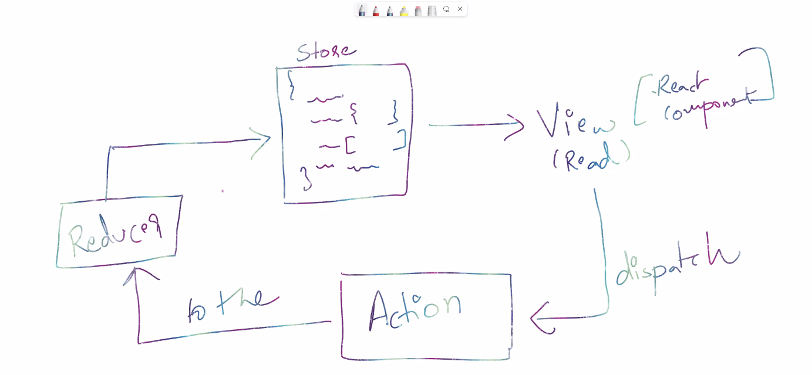

# Redux (Store Management)
Redux is built by facebook 
- There is only one (a single state) for everything in your application, unlike context which has multiple states. 

### Installation 
Redux is a seperate package, you can use redux without react, can even be used in JS. 
- Download react and react-redux dependencies 
- react-redux is a wrapper for redux just like browserRouter is a wrapper for Routes. 
```bash
npm i redux react-redux
```
Redux is useful for complicated situations, when you have more than 1 value to manage 

### How it works?
- store is a complicated object which stores all the data. 
   - to read from store we have view 
   - you can never update your store directly 

> How do we update the store? 

from any component you need to dispatch something called `action` (what do you want to do? increement by 1), this `action` goes to `reducer` (implements what action asks it to do- takes old data and update it )
reducer updates the value of the store. 

> Difference between redux and react-redux, why do we need to install both these dependencies?
so redux deals with store, reducer, action and all and react-redux gives provider and hooks. react-redux just wraps around redux. 

### Steps to store data in redux and retreive it
1. Creating the store 
we need to import the createStore function in index.js

2. Sending the store object to App component 
React redux includes a <Provider> component which makes redux store available for the rest of your app. 
- within index.js we imported Provider and passed store as a prop, Provider component technically sends the store value to the App component, which is encapsulated within the Provider component tags. 
- within index.js itself we define the createStore method which combines all the reducers returned within the rootReducers argument, creates a store object and this store object is returned to the rest of the App component 

3. React component passes the data to action, action dispatches the data via useDispatch() and sends it to the Reducer, which is responsible for returning the value based on its switch case type, to the rootReducers where all the reducers are combined and ultimately passed inside the createStore() method, and its returned inside the store object 

> dispatch - sending value from component to Reducer [but in the newer version of redux, Reducer has become the store (dispatch action to store)

4. In order to retreive the data stored in redux, simply use the useSelector hook 

### Updates and error fixes 
> Recent version of redux - v8
redux devs added more wrapper which makes it easier to connect
- before we used to create a component for store, now we can directly store it in Reducer.js 
- the main method implemented in store.js was the createStore method and the rootReducer, but both of these can now be set right from index.js 

> When were defining createStore() in index.js, its crossing it off and showing the this is deprecated, consider using configureStore() from reduxjs/toolkit. how do we fix this?
the crossed createStore problem: has nothing to do with your actual application code. It is specifically a message to users like you who are using "plain Redux" - it's trying to tell you that you're following patterns that are much harder to use, and we want you to use Redux Toolkit instead because it will make your life much easier :)

### Were creating a light dark theme app using redux 
[](https://gilded-cucurucho-aab4a4.netlify.app/)
- Were creating a toggle button which will toggle light and dark mode, whenever user clicks on the checkbox, were retreiving the saved state from redux for the particular condition (for example, when user is on lightmode, were retreiving the state defined for lightmode from redux store)
- were taking input from the user, saving it in redux store by dispatching actions, and when name component is loaded, we display the state via useSelector hook

#### index.js
- we encapsulated our app component within Provider component 
- we created a store, we passed rootReducer as argument, since its responsible for combining all the reducers that were created and passing them to the store 
```bash
const store = createStore(rootReducer)
```
- we passed store as props 
```bash
  #this is an hoc 
  <Provider store={store}>
    <React.StrictMode>
      <App />
    </React.StrictMode>
  </Provider>
```
> index.js 
```bash
import React from 'react';
import ReactDOM from 'react-dom/client';
import './index.css';
import App from './App';
import reportWebVitals from './reportWebVitals';
import { Provider } from 'react-redux'
#So, the createStore() Redux is now deprecated and configureStore() is recommended from @reduxjs/toolkit
import { createStore } from 'redux';
import rootReducer from './Reducer';


#this is not recommended approach
const store = createStore(rootReducer)

#the crossed createStore problem: has nothing to do with your actual application code. It is specifically a message to users like you who are using "plain Redux" - it's trying to tell you that you're following patterns that are much harder to use, and we want you to use Redux Toolkit instead because it will make your life much easier :)

const root = ReactDOM.createRoot(document.getElementById('root'));
root.render(
  #this is an hoc 
  <Provider store={store}>
    <React.StrictMode>
      <App />
    </React.StrictMode>
  </Provider>
);


reportWebVitals();
```
#### Reducer
Dispatch actions to the store means 
```bash
react component --> actions --> dispatch() --> reducer --> store 
#action specifies what to do 
#reducer implements the logic for how its done / if there is no logic then it simply returns the state value user requested for 
```
- we areated the initial value of the state, we want to pass to our redux store 
- were setting different cases which further specifies what each state is responsible for performing (basically its linking it with actions)
- we return the new state in deep copy 
```bash
#if a parameter is not defined we can define that 
#were defining old state over here 
const initialState = {
    firstName: "",
    lastName: "",
    isLight: false
}


#initially when app will load for the first time, state (state) will be undefined 
#reducer is a function which takes action and does something to the state 
#reducer takes 2 parameters 
#old state, action 

#state = intiialstate (short circuiting - through short circuiting we skip checking additional things)
#if state is undefined then were telling js to use the initialstate 
#if state == undefined {
#     state = undefined
# }

#in any situation, where parameter is not defined, then use the defined value - default parameter
const Reducer = (state = initialState, action) => {
    #when you load the app for first time, what will be the balue of old state?
    
    #depeending on what action we get, well do something
    switch(action.type){
        case "SET_DARK_THEME":
            state.isLight = false;
            break;
        case "SET_LIGHT_THEME":
            state.isLight = true;
            break;
        case "SET_FIRST_NAME":
            state.firstName = action.payload;
            break;
        case "SET_LAST_NAME":
            state.lastName = action.payload
            break;
        default:
            break;
    }
    #return state
    #state passes through action and passes the new state 

    return {...state}
    #deep copy 
    #object is reference type - it will try to compare memory, but we want deep copy 

}

export default Reducer
```
#### Actions.js 
Actions define what needs to be done, and reducers specify the core logic to execute it, as discussed above. 
- In our case, we have two scenarios 
since in setfirstname and setlastname were saving the value user entered, so we need to save it in payload, and in setlightheme and setdarktheme were simply toggling the checkbox, so in that case technically we dont need to save any state 

- when we pass these objects: setdarktheme and setlighttheme, to provider, provider would understand what to do. provider cant understand what value we need to set, in case of function, to make the provider understand we use payload 
```bash
const setFirstName = (firstName) => {
#data is passed inside payload 
    return {
        type: "SET_FIRST_NAME",
        payload: firstName 
    }
}

const setLastName = (lastName) => {

    return {
        type: "SET_LAST_NAME",
        payload: lastName
    }
}

#create 2 objects for true and false 
const setDarkTheme = {
    type: "SET_DARK_THEME"
}

const setLightTheme = {
    type: "SET_LIGHT_THEME"
}

#named exports 
#export each action 
export {setFirstName, setLastName, setDarkTheme, setLightTheme};
```
#### But, where are the actions dispatched?
- Input.js 
- ThemeSwitcher.js 

> Input.js 
```bash
import { useDispatch } from 'react-redux';
import { setFirstName, setLastName } from '../Actions';

#in this component were dispatching a couple actions 
const Input = () => {
  const dispatch = useDispatch();
  
  return (
    <div>
      <input type="text" onKeyUp={e => dispatch(setFirstName(e.target.value))} />
      <input type="text" onKeyUp={e => dispatch(setLastName(e.target.value))} />
    </div>
  )
}

export default Input
```
> ThemeSwitcher.js 
```bash
import React from 'react';
import '../ThemeSwitcher.css';
import { useDispatch } from 'react-redux';
import { setDarkTheme, setLightTheme } from '../Actions';

#in this component were dispatching a couple actions 

const ThemeSwitcher = () => {
  const dispatch = useDispatch();

  const setTheme = e => {
    if(e.target.checked) {
      dispatch(setLightTheme);
    } else {
      dispatch(setDarkTheme);
    }
  }
  
  return (
    #when user clicks on the checkbox trigger the setTheme function which is responsible for dispatching the actions (that was first defined inside Reducers but set inside Actions)
    <div className="container">
      <div className="toggle-switch">
        <input 
          type="checkbox" 
          className="checkbox" 
          name="theme" 
          id="theme"
          onChange={setTheme} 
        />
        <label className="label" htmlFor="theme">
          <span className="inner" />
          <span className="switch" />
        </label>
      </div>
    </div>
  )
}

export default ThemeSwitcher
```
### And where is the redux state fetched from?
> Name.js 
```bash
#useselector will directly point to the state we want  

#import Name and input at app.js 
import React from 'react'
import { useSelector } from 'react-redux';

#were printing the stuff user inputs, by first retreiving it from the reduxstore 
const Name = () => {
  const firstName = useSelector(state => state.firstName);
  const lastName  = useSelector(state => state.lastName);  

  return <h1>Name: {firstName} {lastName}</h1>;
}

export default Name
```