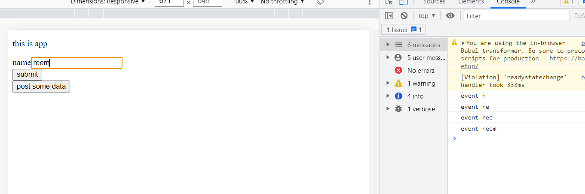

#### GET - getting/ reading data from backend 
> Get request is asking for some data from the backend 

#### POST - sending data to backend 
> Post request is you sending data to backend and telling it to do something with that data 
```bash 
example, 
- store data in database 
```
### Controlled vs Uncontrolled components 
> Controlled component - components where the value and onchange are controlled directly by us 
```bash 
example, 
<input placeholder="Name" value={this.state.firstName} onChange={this.changeName} />
```
> Uncontrolled components - components where the value and onchange are not controlled directly by us 
```bash 
example, 
<input placeholder="Name"  />
```
In a controlled component, form data is handled by a React component. The alternative is uncontrolled components, where form data is handled by the DOM itself. To write an uncontrolled component, instead of writing an event handler for every state update, you can use a ref to get form values from the DOM.

#### Submitting form data using axios.post to an API 
> Index.js 
```bash 
// form - you fill data and submit 
// well create a form and submit the data using POST request 

class App extends React.Component {
  constructor() {
      super()
      this.state = {
          firstName: ""
      }
  }

  postData = () => {
      //create this user in post request
      const newUser = {
        name: 'geekster',
        job: 'placement of students',

      }

      //were telling axios to go to this endpoint (RequestUrl:https://reqres.in/api/users )and hand it this object newUser 

      axios.post("https://reqres.in/api/users", {newUser}).then((res) => console.log(res))
      //axios.post takes 2 arguments 

    //res returns in console:
    
  }

✅submitForm = (e) => {
    e.preventDefault()
    console.log('submitting form')
  }
  
✅changeName = (event) => {
    // we add this setstate to change the value of input field as we type it in it 
    // if we dont add setstate then it will set the default set value 
    // this.state = {
    //     firstName: ""
    // }
    this.setState(prev => {
        return {
            firstName: event.target.value
        }
    })
      console.log('event',event.target.value )
  }

  render() {
    return (
      <div className='app-container'>
         <p>this is app</p>
         {/* 
         post: take data, put in post request and send data to backend and telling backend to do something with the data 
         we create a post on social media and click on post 
         for example, 
         - save the data in the database and display it to whomever view it  */}
         <form onSubmit={this.submitForm}>
             <div>
                 <label>name</label>
                ✅<input placeholder="Name" value={this.state.firstName} onChange={this.changeName} />
                {/* whenver we type anything in input field it will call onChange function */}

                {/* 
                controlled component - components where we can control the value and onchange  */}
             </div>
             <button type="submit">submit</button>
         </form>
         <button onClick={this.postData}>post some data</button>
      </div>
    )
  }
}

// export default App 
ReactDOM.render(<App/>, document.getElementById('root'))
```


#### Axios POST request to send form data
> Hosted link: https://reem-shaikh.github.io/axios-form/
> code link: https://github.com/reem-shaikh/React/tree/master/17-02/assignment-app

#### Assignment 
create form using bootstrap classes 
- form should have 3 properties: name, email, phone number 
- add validation to input fields using REGEX 
, name should not be greater than 20ch 
- on submit of form call axios POST API at this URL - https://reqres.in/api/users
