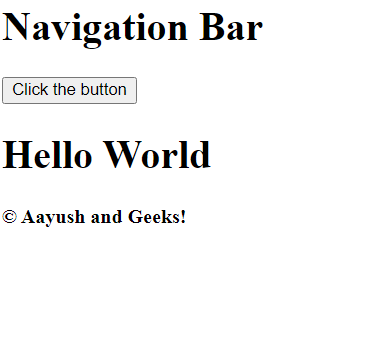

#### Defining all components in one file 
> index.js 
```bash
function Button(){
    #get is a function which is part of the component 
    #which you cant directly access it cannot be a component
    function get(){
        return `get`
    }
    var caption = 'MEOW';
    return `<button style="border: 1px solid red; color: green;">click me ${caption} ${get()}</button>`
}

function Content(){
    return `<h1>hello</h1> 
            <p>hi meows fwjefuiwfhiowehoi lodjenie</p>`
}

function NavigationBar(){
    return `<div><h1>geeks</h1></div>`
}

function App(){
    #Template Literal 
    #since this is a string, we need to do string tempating which will convert var / fn / objects to strings 
    #in string templating -> ${var} or ${fn()} or ${obj.something}
    return `${NavigationBar()} + ${Content()} + ${Content()}
    <footer>meeeeeeeeeeeeeeeeeeeeow ${Button()}</footer>`
    #if we want to reuse a function, we can easily do so over here 

    #Note that: One single function is called as a single component 
    #It is 1 or more than 1 element + functionality and logic 
    #componenet can be reused multiple times using plug and play 
}

document.getElementById('app').innerHTML = App()
```
#### Defining all components in different files 
> index.html
```bash
<body>
    <!-- the stuff we acheived in index.js one file, we split the code into components and imported it in here -->
    <div id="app"></div>
    <script src="./components/NavigationBar.js"></script>
    <script src="./components/Content.js"></script>
    <script src="./components/Button.js"></script>
    <script src="./components/App.js"></script>

    <script src="./main.js"></script>
</body>
#read the entire component code from the component folder 
```
### What is React 
React is a JS library making web dev easier and simpler. 

> What is difference between library and framework?
- Framework is a collection of libraries
- Library is smaller in size, because its small, libraries are fast. library is collection of a bunch of functions. To get some additional functionality, you need to import a third party package/module. you dont need to import frameworks, cs all these libraries are inbuilt in frameworks. 

### Why React?
- React is built by facebook (so it has the budget to develop actively)
- React -> popular -> big community -> new people are joining -> easier to get doubts resolved -> bigger community -> getting popular

> learn react from here 
- https:#reactjs.org/docs/getting-started.html
- https:#developer.mozilla.org/en-US/docs/Learn/Tools_and_testing/Client-side_JavaScript_frameworks/React_getting_started

> Babel converts JSX to JS, so browser can intrepret it. 

### How to implement
1. import these script tags from https:#reactjs.org/docs/add-react-to-a-website.html#add-react-in-one-minute- into `index.html`
```bash
# script tags 
<script src="https:#unpkg.com/react@18/umd/react.development.js" crossorigin></script> <script src="https:#unpkg.com/react-dom@18/umd/react-dom.development.js" crossorigin></script> <script src="https:#unpkg.com/@babel/standalone/babel.min.js"></script>
```
2. import this babel script files into `index.html`
```bash
 <script src="https:#unpkg.com/@babel/standalone/babel.min.js"></script>
```
> index.html 
```bash
<body>
  <div id="app"></div>

  <script src="https://unpkg.com/react@18/umd/react.development.js" crossorigin></script>
  <script src="https://unpkg.com/react-dom@18/umd/react-dom.development.js" crossorigin></script>
  <script src="https://unpkg.com/@babel/standalone/babel.min.js"></script>

  <!-- we can place the components in any order except index.js-->
  <script type="text/babel" src="./components/Footer.js"></script>
  <script type="text/babel" src="./components/Button.js"></script>
  <script type="text/babel" src="./components/NavBar.js"></script>
  <script type="text/babel" src="./components/App.js"></script>
  <!-- index.js should be placed at the end -->
  <script type="text/babel" src=".components/index.js"></script>
</body>
```
3. Create an `index.js` file, which will be the first file react looks for 
```bash
#In react 16 we used this syntax 
# ReactDOM.render(
#     <App />,
#     document.getElementById('app')
# )


#In React 17, we use this syntax
##app is the div which will be the root of react's DOM manipulation 
const container = document.getElementById('app')
const root = ReactDOM.createRoot(container)
root.render(<App/>)

#whatever happens in the <App/> is rendered on the DOM  
#App.js contains all the list of components we want to render on the app 

#Shortcut for this React17 syntax 
const root = ReactDOM.createRoot(document.getElementById('app'));
root.render(<App />);
```



