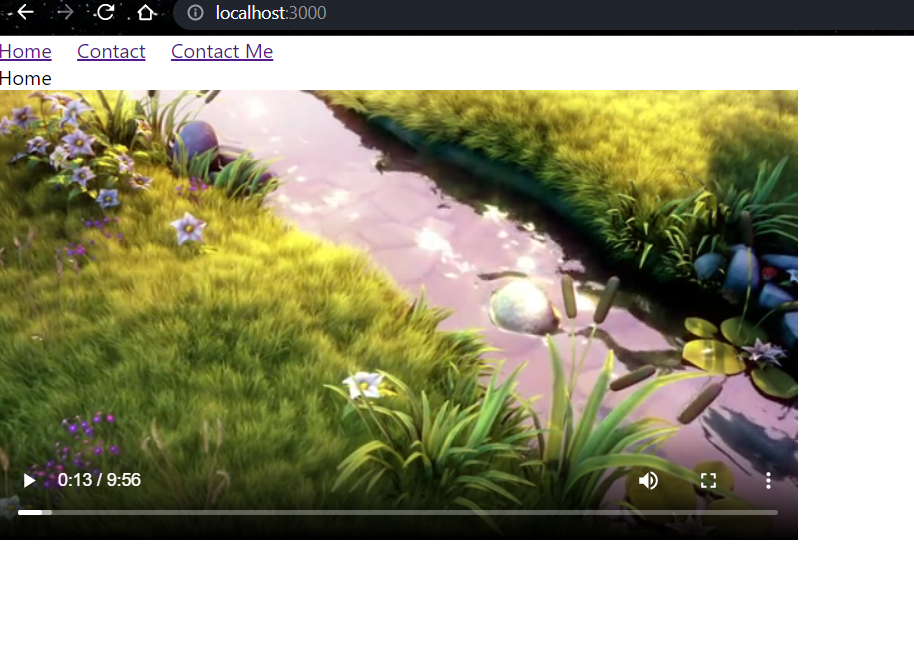

### React-router-dom
1. install router `npm i react-router` and `npm i react-router-dom`

> Confirm the installation at package.json 
```bash
{
  "name": "classcode",
  "version": "0.1.0",
  "private": true,
  "dependencies": {
    "@testing-library/jest-dom": "^5.16.2",
    "@testing-library/react": "^12.1.4",
    "@testing-library/user-event": "^13.5.0",
    "react": "^17.0.2",
    "react-dom": "^17.0.2",
    ✅"react-router": "^6.2.2",
    ✅"react-router-dom": "^6.2.2",
    "react-scripts": "5.0.0",
    "web-vitals": "^2.1.4"
  },

```

> index.js 
```bash 
import React from 'react';
import ReactDOM from 'react-dom';
import './index.css';
import App from './App';
import reportWebVitals from './reportWebVitals';
import { BrowserRouter } from 'react-router-dom';

# we've embedded our app inside browser router 
ReactDOM.render(
  <React.StrictMode>
    <BrowserRouter>
      <App />
    </BrowserRouter>
  </React.StrictMode>,
  document.getElementById('root')
);

reportWebVitals();
```
> App.js 
```bash 
import './App.css';
import About from './components/About';
import Contact from './components/Contact';
import Home from './components/Home';
import { Route, Routes } from 'react-router-dom';
import NotFound from './components/NotFound';
import ContactMe from './components/ContactMe';
import Navigation from './components/Navigation';
import VideoPlayer from './components/VideoPlayer';

function App() {
  return (
    <>
      <Navigation />
      <Routes>
        <Route exact path='/about' element={<About />} />
        <Route path="/contact/me" element={<ContactMe />} />
        <Route path='/contact/:name' element={<Contact />} />
        <Route path='/' element={<Home />} />
        <Route path='*' element={<NotFound />} />
      </Routes>
      <VideoPlayer />
    </>
  );
}

export default App;
```
> Navigation.js 
```bash 
import React from 'react'
import { Link } from 'react-router-dom';

const Navigation = () => {
  return (
    <nav>
        <Link to='/'>Home</Link> &emsp;
        <Link to='/contact'>Contact</Link> &emsp;
        <Link to='/contact/me'>Contact Me</Link>
    </nav>
  )
}

export default Navigation;
```
> VideoPlayer.js
```bash 
import React from 'react'

const VideoPlayer = () => {
  return (
      <>
        <video controls src='https://ia600300.us.archive.org/17/items/BigBuckBunny_124/Content/big_buck_bunny_720p_surround.mp4' />
      </>
  )
}

export default VideoPlayer
```
> at the homepage 
