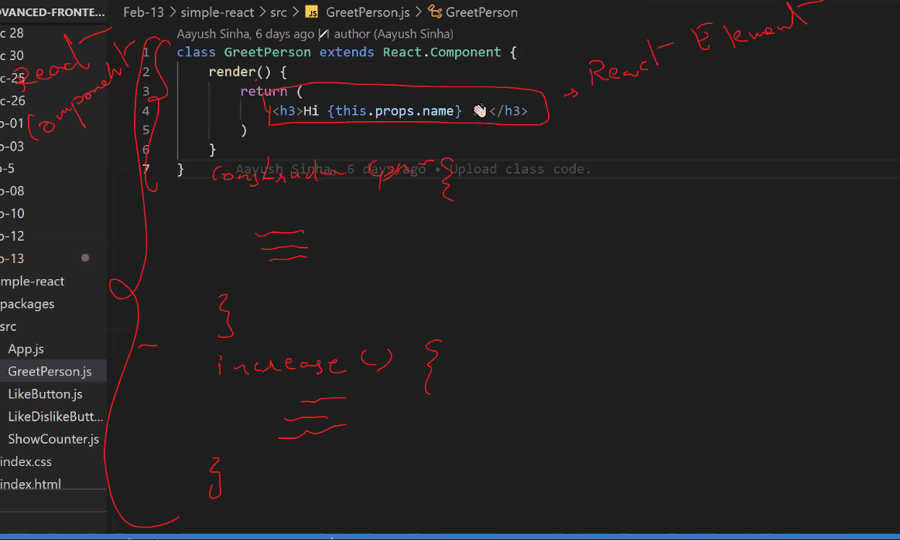
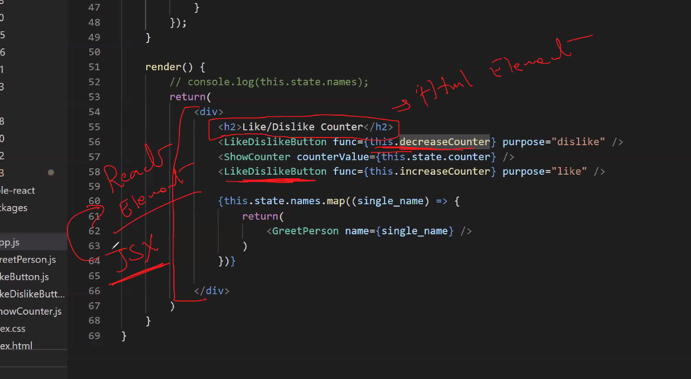
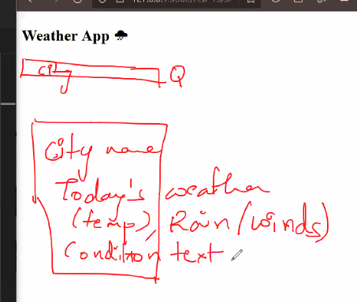
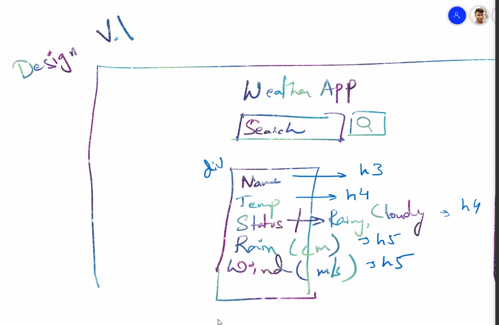

#### Difference between React Component and React Element 


#### React Component 
A react component is a collection of HTML elements with its state properties and event handlers 

-----
### Difference between React Element and HTML element 


#### HTML elements 
Anything between HTML tags 

#### The directory structure 
```bash 
✔ content inside src is kept hidden and restricts the access and public is shown to the users 

✔ src contains all the sourcecode and the components 

✔ the whole app will be inside App.js (its the main component of our project)
```
- packages - used to store all the packages and modules 
- public - public folder will be open to the internet (anyone can access the contents inside this folder)
- src - contains the source code (all the components)

### Weather App 
> using https://openweathermap.org/current

#### Wireframe 
> blueprint of the UI 


> details 


