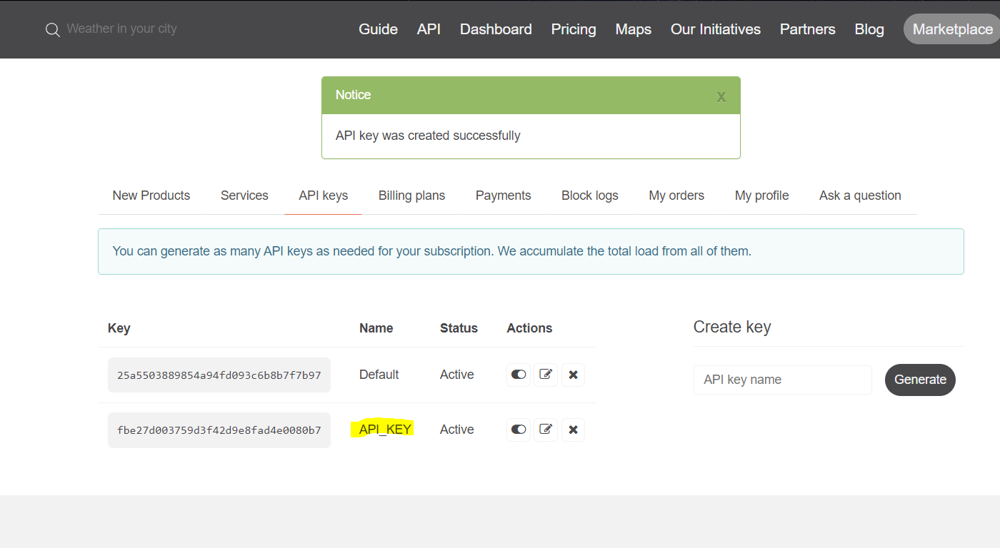
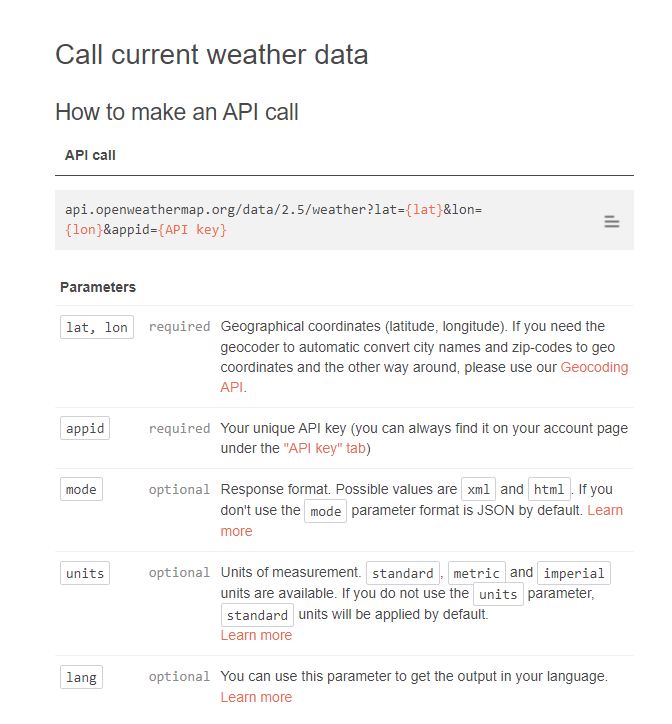
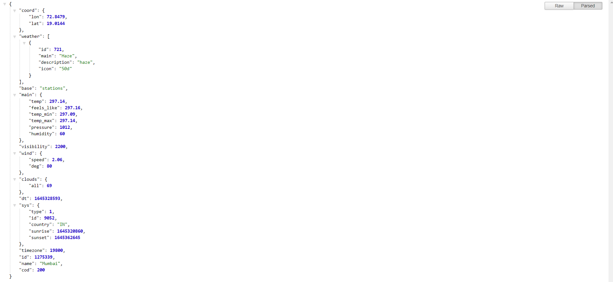

### Weather App 
Weather app fetches the current weather from OpenWeather APIs for your city . We implement designing, state management, API integration

### APIs Used
[Open Weather APIs](https://openweathermap.org/)
> Open weather API is used For fetching the current time weather 

```bash 
1. Hover over to https://openweathermap.org/api
2. choose current weather data -> navigate to API doc: https://openweathermap.org/current
```
#### 1. Generate an API key 
> you can generate n number of API keys, for this project I generated a new API key named API_KEY 


### API Info
* Method: `GET`
#### To call current weather data, this is how you make the an API call
* URL: `https://api.openweathermap.org/data/2.5/weather?q={CITY_NAME}&appid={API_KEY}`
or 
* URL2: `https://api.openweathermap.org/data/2.5/weather?lat={lat}&lon={lon}&appid={API key}`


> Reference: https://openweathermap.org/current

#### Replacing the CITYNAME and APIKEY with my custom city and generated APIKEY 
https://api.openweathermap.org/data/2.5/weather?q=Mumbai&appid=fbe27d003759d3f42d9e8fad4e0080b7
> when we enter this URL on a search engine, it returns this JSON object 


```bash 
{
"coord": {
"lon": 72.8479,
"lat": 19.0144
},
"weather": [
{
"id": 721,
"main": "Haze",
"description": "haze",
"icon": "50d"
}
],
"base": "stations",
"main": {
"temp": 297.14,
"feels_like": 297.16,
"temp_min": 297.09,
"temp_max": 297.14,
"pressure": 1012,
"humidity": 60
},
"visibility": 2200,
"wind": {
"speed": 2.06,
"deg": 80
},
"clouds": {
"all": 69
},
"dt": 1645328593,
"sys": {
"type": 1,
"id": 9052,
"country": "IN",
"sunrise": 1645320860,
"sunset": 1645362645
},
"timezone": 19800,
"id": 1275339,
"name": "Mumbai",
"cod": 200
}
```
### Libraries used
* `styled-components`
* `axios`
* `react-scripts`

> To install styled components and axios libraries type this command in terminal 
```bash 
npm install styled-components axios --save
```
> Hover over to package.json in your directory, to confirm whether these packages have been installed in your application
```bash 
{
  "name": "weather-app",
  "version": "0.1.0",
  "private": true,
  "dependencies": {
    "@testing-library/jest-dom": "^5.16.2",
    "@testing-library/react": "^12.1.3",
    "@testing-library/user-event": "^13.5.0",
    "axios": "^0.26.0",
    "react": "^17.0.2",
    "react-dom": "^17.0.2",
    "react-scripts": "5.0.0",
    "styled-components": "^5.3.3",
    "web-vitals": "^2.1.4"
  },
```
#### How did we biuld this?
> Discussing main highlights of the code: A review.

#### we created 2 components inside src.
- cityComponent.js - contains the searchbar where users enter the city they want to search the weather stats for 
- WeatherInfoComponent.js - contains the weather stats for the city searched for 

`we imported axios as well as styled-components in order to do onpage styling with these libraries`

> In App.js we passed props to WeatherComponent and cityComponent, we even defined the fetchweather from API function over here, and we updated the weather using state 
```bash
import React, { useState } from "react";
import styled from "styled-components";
import Axios from "axios";

import CityComponent from "./modules/CityComponent";
import WeatherComponent from "./modules/WeatherInfoComponent";

//implementing styled components 
✅these icons are exported to WeatherInfComponent.js 
export const WeatherIcons = {
  "01d": "icons/sunny.svg",
  "01n": "icons/night.svg",
  "02d": "icons/day.svg",
  "02n": "icons/cloudy-night.svg",
  "03d": "icons/cloudy.svg",
  "03n": "icons/cloudy.svg",
  "04d": "icons/perfect-day.svg",
  "04n": "icons/cloudy-night.svg",
  "09d": "icons/rain.svg",
  "09n": "icons/rain-night.svg",
  "10d": "icons/rain.svg",
  "10n": "icons/rain-night.svg",
  "11d": "icons/storm.svg",
  "11n": "icons/storm.svg",
};

function App() {
  ✅defining city and weather state to pass it to the API, keep a log of the storage and pass it to the children so they can access and work with it 

  const [city, updateCity] = useState();
  const [weather, updateWeather] = useState();

  //function responsible for fetching weather from the API 
  const fetchWeather = async (e) => {
    e.preventDefault();

    const response = await Axios.get(
      `https://api.openweathermap.org/data/2.5/weather?q=${city}&appid=fbe27d003759d3f42d9e8fad4e0080b7`,
    );
    //https://api.openweathermap.org/data/2.5/weather?q=Mumbai&appid=fbe27d003759d3f42d9e8fad4e0080b7
    console.log(response)
    updateWeather(response.data);
    //info updated into weather state, this weather state is passed as a prop in the weatherInfoComponent 
  };

  return (
    <Container>
      <AppLabel>React Weather App</AppLabel>
      {/* if weather and city is available for the city user entered in the API, then show weather component otherwise show city component , if user enters a city that is not in the API then show the city component*/}
      {city && weather ? (
        <WeatherComponent weather={weather} city={city} />
        ✅we passed weather state as well as city state to the weather component 
      ) : (
        <CityComponent updateCity={updateCity} fetchWeather={fetchWeather} />
        ✅we passed the updatedcity state as well as fetchWeather function as a prop to cityComponent 

      )}
    </Container>
  );
}
```
> cityComponent.js 
```bash 
import styled from "styled-components";
import React from "react";

const CityComponent = (props) => {
  //recieving updatecity and fetchweather as props from the parent component 

  // we used array destrutcuring to access the props 
  const { updateCity, fetchWeather } = props;

  return (
    <>
      <WelcomeWeatherLogo src={"icons/perfect-day.svg"} />
      <ChooseCityLabel>Find Weather of your city</ChooseCityLabel>

{/* when the button is clicked 
this is submitted and fetchWeather is called from parent component */}
✅updatedcity state is passed over here 
      <SearchBox onSubmit={fetchWeather}>
        <input
        ✅were defining an anonymous callback function using fat arrow, this function logs in the data that the user enters in the input field 
          onChange={(e) => updateCity(e.target.value)}
          placeholder="City"
        />
        <button type={"submit"}>Search</button>
        ✅when user clicks on submit button fetchweather functon will be called 
      </SearchBox>

    </>
  );
```
> WeatherInfoComponent.js 
```bash 
import styled from "styled-components";
import React from "react";
import {WeatherIcons} from "../App.js";

const WeatherInfoIcons = {
    sunset: "icons/temp.svg",
    sunrise: "icons/temp.svg",
    humidity: "icons/humidity.svg",
    wind: "icons/wind.svg",
    pressure: "icons/pressure.svg",
};


const WeatherInfoComponent = (props) => {

✅were maintaining a state for storing values from the WeatherInfoIcons function and passing it dyanamically to the weatherContainer component we defined below 
    const {name, value} = props;
    //making name and value dyanamic 

    return (
      ✅were creating containers for specifying the description 
        <InfoContainer>
          {/* src=/icon/temp.svg */}
            <InfoIcon src={WeatherInfoIcons[name]}/>
            <InfoLabel>
              {/* 19:47 |  sunrise */}
                {value}
                <span>{name}</span>
            </InfoLabel>
        </InfoContainer>
    );
};

const WeatherComponent = (props) => {
  //weather passed as props from parent component App.js
    const {weather} = props;

    //if it contains d its a day , if it contains n its night 
    const isDay = weather?.weather[0].icon?.includes('d')

    const getTime = (timeStamp) => {
        return `${new Date(timeStamp * 1000).getHours()} : ${new Date(timeStamp * 1000).getMinutes()}`
    }
    return (
        <>
            <WeatherContainer>
                <Condition>
                  {/* 30 C | CLoudy */}
                  {/* celcius = kelvin - 273 */}
                    <span>{`${Math.floor(weather?.main?.temp - 273)}°C`}</span>
                    {`  |  ${weather?.weather[0].description}`}
                </Condition>
                <WeatherIcon src={WeatherIcons[weather?.weather[0].icon]}/>
                ✅eg: WeatherIcons[50n]
                ✅it goes to the weathericons alias and prints the value corresponding to this 

                {/* <WeatherIcon src="/icons/perfect-day.svg"></WeatherIcon> */}
            </WeatherContainer>

            <Location>{`${weather?.name}, ${weather?.sys?.country}`}</Location>

            <WeatherInfoLabel>Weather Info</WeatherInfoLabel>

            <WeatherInfoContainer>
              {/* if its day provide the sunset PM time 
              else provide sunrise time */}
              ✅icon to the lhs and (name and value defined one below the other)
                <WeatherInfoComponent name={isDay ? "sunset" : "sunrise"}
                                      value={`${getTime(weather?.sys[isDay ? "sunset" : "sunrise"])}`}/>

                <WeatherInfoComponent name={"humidity"} value={weather?.main?.humidity}/>
                <WeatherInfoComponent name={"wind"} value={weather?.wind?.speed}/>
                <WeatherInfoComponent name={"pressure"} value={weather?.main?.pressure}/>
            </WeatherInfoContainer>
        </>
    );

```


