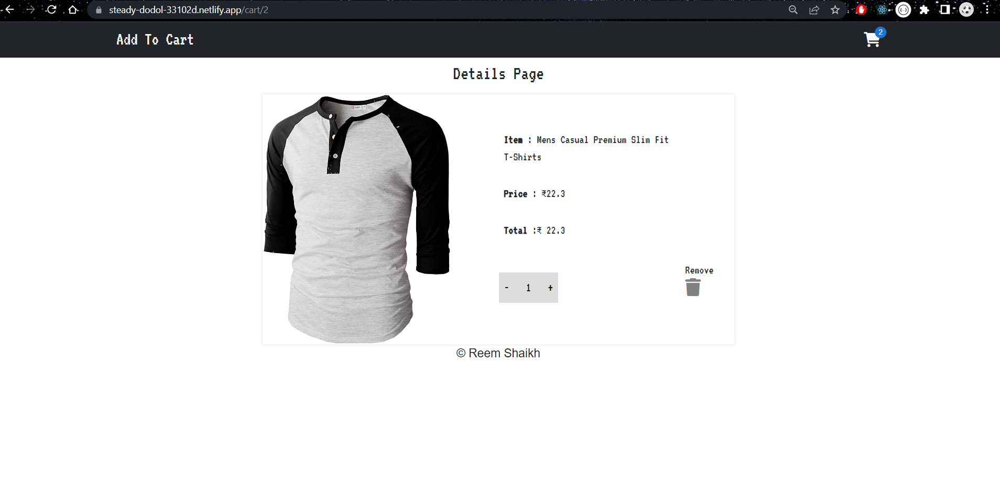

### Add To Cart Ecommerce Store 

> Note: It takes some time to fetch data from the API endpoint. 
[Deployed Link](https://addtocartfunctionality.netlify.app/)

### Features implemented
- Responsive Design via MUI and React-Bootstrap
- Axios
- Redux 
- Dyanamic Routing 
- Hooks

### The Website workflow:
1. Initially I've loaded a bunch of store items from the fakestore API via axios. When user clicks on the add to cart button, that item is pushed to the cart (which is a dropdown styling integrated from react-bootstrap)
2. I've implemented badge (MUI import) in my react-bootstrap UI, and icons are imported from Font Awesome icons, I've integrated a CDN link in `public/index.html`
3. When the item is pushed to the cart, the badge value is increemented, and when you click on the cart icon, a dropdown containing all the cart items, along with the total amount and the delete item option is displayed. These items are fetched from the redux store via useSelector() hook within `Header.js` component. When user clicks on the image within the cart, he will then be redirected to `CardDetails.js` component which is the item details component, I've integrated path parameter redirection for each item and used useParams() hook to retreive the id of the item within `CardDetails.js`. 

4. Within the item details component user can increement and deecrement the quantity of items, and he also gets a provision to delete that particular item. These items are fetched from the redux store via useSelector() hook within `CardDetails.js` component.


### How is the Routing structured in the code?
- I've encapsulated the App component within BrowserRouter in index.js
```bash
#for react-router 
import { BrowserRouter } from "react-router-dom";

<BrowserRouter>
    <React.StrictMode>
      <App />
    </React.StrictMode>
  </BrowserRouter>
```
- Within `App.js` component I've defined the path and the element it should redirect to. 
```bash
import {Routes,Route} from "react-router-dom";
   <Routes>
     <Route path='/' element={<Cards />} />
     <Route path='/cart/:id' element={<CardsDetails />} />
   </Routes>
```
- Within `Header.js` I've integrated a NavLink with some added styling to the links, which indicated where would the user be redirected to when he clicks on Add to cart in the navbar 
```bash
import { NavLink } from 'react-router-dom'
    <Nav className="me-auto">
        <NavLink to="/" className="text-decoration-none text-light cute" style={{fontSize: "30px"}}>Add To Cart</NavLink>
    </Nav>
```
- Within `CardDetails.js` I've created a useNavigate object, everytime an item is deleted we want to redirect the user back to the home page 
```bash
  const history = useNavigate();

  const dlt = (id)=>{
    dispatch(DLT(id));
    history("/");
}
```
- Within `Header.js`, I've integrated a Navlink which would redirect the user to `/cart/id` when the image within the cart is clicked 
```bash
 <NavLink to={`/cart/${e.id}`} >

 </NavLink>   
```
- Within `CardDetails.js` I've added a useParams() hook to retreive the id passed in the path parameter url, after retreiving the id, I've used it to display the content details of the image that was clicked on, its also used to target the item to perform delete operation when user clicks on the trash icon.
```bash
  const {id} = useParams();
  # console.log(id);
```
#### How is Redux structured in the code?
To store a data in the redux store, these are the steps that are followed (for functional components)
1. Actions specify what needs to be done (doesnt specify the details of how a particular logic should be carried out). I've created action object for adding to the cart, removing item from item details component, and removing item from the cart. 
2. In order to trigger actions dispatch() method is used. I've used it within `Header.js` to dispatch delete item action when trash icon is clicked.
3. The action is dispatched to the store via the reducer. Within the reducer I've specified the functionality/ logic for the action type defined inside Actions.js 
4. The reducer performs the logic for what the action defined, after targetting different action via `action.type`
5. All the reducers are combined in combineReducers and passed as an argument within store method createStore() which is stored within a store object. In the version before redux v8, we used to manage a store.js, but now we implement the entire code that we would've implemented before within `store.js`, within index.js itself. The store object is finally provided to the App component via App.js and to retreive it in the code useSelector() is used. 
- I've retrieved the store object in `Header.js` to display the items in the cart 
- I've retrieved the store object in `CardDetails.js`, to display the particular targetted item id content on item details page. 

> action.js 
```bash
//actions are plain js object which tells reducer what to do, payload (whatever item you want to store). You'll need to dispatch actions for it to reach reducer 

//when user clicks on the button, it fetches its data and stores it inside payload 
//when user clicks on add to cart we need to add data to the cart, we'll set the data in the payload 
export const ADD = (item) => {
    return {
        type: "ADD_CART",
        payload: item
    }
}

// remove items - to remove items from the cart when you click on the trash icon
//we'll remove all the items except the id we mentioned in here 
export const DLT = (id) => {
    return {
        type: "RMV_CART",
        payload: id
    }
}

// remove individual item from card details page 
export const REMOVE = (iteam) => {
    return {
        type: "RMV_ONE",
        payload: iteam
    }
}
```
> reducers/reducer.js 
```bash
// reducer is responsible for executing the logic for the specific action, after checking the action using action.type 

//defining initial state for carts, which is a blank array 
const INIT_STATE = {
    //all cart data is stored in this state 
    carts: []
};

export const cartreducer = (state = INIT_STATE, action) => {
    //checking the action type defined in redux/actions/action.js 
    switch (action.type) {

        case "ADD_CART":
        ////store data passed from action.payload in carts state 

        //1. if the id user clicked on, is already present in carts[]
        //were checking if the payload value (basically the id user targetted) is same as the id present inside carts[], if it is then we store it in another variable IteamIndex
        const IteamIndex = state.carts.findIndex((iteam)=> iteam.id === action.payload.id);

        //findindex returns index 

        //if ItemIndex has a value greater than 0
        //if any item is actually present in both carts[] and the payload, then it can have an index thats 0 or anything above that in carts[]
        if(IteamIndex >= 0){
            //then increase the quantity by 1 
            state.carts[IteamIndex].quantity +=1
            return {
                ...state,
                carts:[...state.carts]
            }
        }else{
            //2. if the id user clciked on, is not present in carts[]

            //when user clicks on add to cart, we want to show the data in the cart, ensuring that the previos data stored within it persists, thats why were setting ...state.carts, with ...action.payload 
            const temp = {...action.payload,quantity:1}
             return {
                ...state,
                carts: [...state.carts, temp]
            }
        }

        //break;

        //were filtering out the id passed to remove
        case "RMV_CART":
            //were typically filtering out the id that we'll retreive over here
            //if cart id in carts[] is not equal to the id passed in payload, then return the rest of the data in the carts[]
            const data = state.carts.filter((el)=>el.id !== action.payload); 
            // console.log(data);

            return {
                //let previos data remain 
                ...state,
                //and add the new data above it 
                carts:data
            }

        //break;

        case "RMV_ONE":
            //if the id in the payload is same as the id present inside carts[], then store it in ItemIndex_dec
            const IteamIndex_dec = state.carts.findIndex((iteam)=> iteam.id === action.payload.id);
   
            //were checking if the item user clicked on has quantity atleast 1 and above 
            if(state.carts[IteamIndex_dec].quantity >= 1){
                //then deecrement by 1
                const dltiteams = state.carts[IteamIndex_dec].quantity -= 1
                console.log([...state.carts,dltiteams]);

                return {
                    ...state,
                    carts:[...state.carts]
                }
            }
            //if the quantity of the item is 1, and user clciks on - 
            else if(state.carts[IteamIndex_dec].quantity === 1 ){
                //we fetch all the id's that's not the same as the one user passed via payload, and we display whatever is left in the cart[], which is techncally nothing, so it redirects us to the home page 
                const data = state.carts.filter((el)=>el.id !== action.payload);

                return {
                    ...state,
                    carts:data
                }
            }
        break;

        default:
            return state

    }
}
```
> reducers/main.js 
```bash
//this component is used for combining all reducers 
import {combineReducers} from "redux";
//importing the other reducer 
import { cartreducer } from "./reducer";

//passing cartreducer as argument within CombineReducers 
const rootred = combineReducers({
    cartreducer
});

//these combined reducers are exported to index.js 
export default rootred
```
> index.js 
```bash
import React from 'react';
import ReactDOM from 'react-dom';
import './index.css';
import App from './App';
//import store from './store';
import { Provider } from 'react-redux';

//for react-router 
import { BrowserRouter } from "react-router-dom";

import { createStore } from "redux";
//were importing the rootred which contains all combined reducers 
import rootred from "./redux/reducers/main";

const root = ReactDOM.createRoot(document.getElementById('root'));

const store = createStore(
  rootred
);

root.render(
  //were providing store value to the App component 
  <Provider store={store}>
  <BrowserRouter>
    <React.StrictMode>
      <App />
    </React.StrictMode>
  </BrowserRouter>
  </Provider>
);
```

