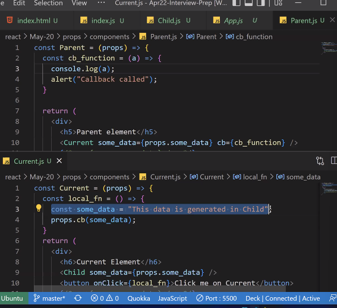
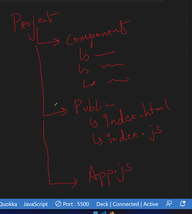
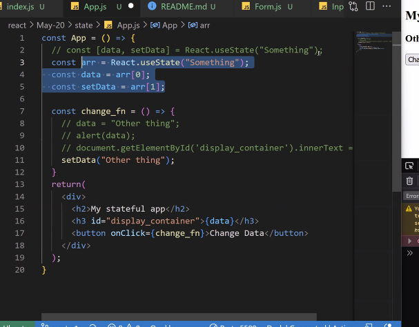
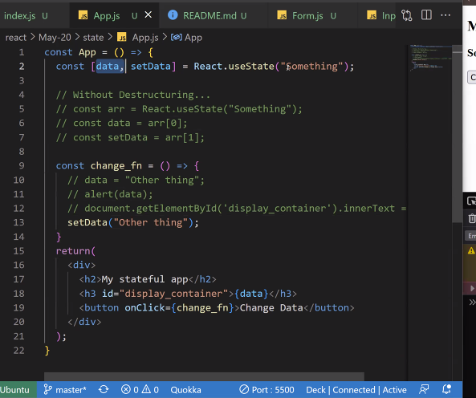

#### Different ways we can write callback functions that we can use with event handlers in react 
```bash
#arrow function with 3 functions 
() => {
    step1();
    step2();
    step3();
}

# on one line 
() => {
    step1(); step2(); step3();
}

# when we have one function 
() => step1()

# when we have one statement 
() => console.log('hi')


# _ can be used as a variable name 
(_) =>  {console.log('hi')}

# if we have only one parameter we dont need parenthesis 
_ => {console.log('hi')}

# if we have only one statement we dont need curly braces 
_ => {console.log('hi')}
```
> Inline event handler 
```bash
const Child = (props) => {
return (
    <div>
       <button onClick={() => {console.log('hi') }}>click me</button>
      
        # Inline Event Handler:
        # if you want to write a cb function instead, you can acheeive like this 
    
    </div>
)
}
```
#### Prop Drilling 
is the approach that we do to send data from one component to its descendent (not immediate child)

- GrandParent -> Parent -> Current -> GrandChild 

> App.js 
```bash
function App() {
    return (
      <div>
        <Parent some_data='very important'/>
        <Child />
      </div>
    )
  }
```
> Parent.js 
```bash
# recieving props from App.js 
const Parent = (props) => {
    return (
        <div>
            {/* passing prop pased to the parent props.some_data to the child component */}
            <Child some_data={props.some_data}/>
        </div>
    )
}
```
> Child.js 
```bash
const Child = (props) => {
    #props passed from Parent component 
    console.log('some_data', props.some_data)

return (
    <div>
      <div> child component </div>
    </div>
)
}
```
### Data Passing between Child and Parent 
> passing from parent to child (Up to Down)
1. pass function prop from parent to child 
2. retreive function prop at child component 
3. in child, use the passed function prop in a function and call this function on button onClick 
4. when button is clicked in child, the function passed as a prop from parent, is invoked at the child component end 

Data passed from parent to child (Down to Up)
> App.js 
```bash
function App() {
    return (
      <div>
        <Parent some_data='very important'/>
      </div>
    )
  }
```
> Parent.js 
```bash
#recieving props from App.js 
const Parent = (props) => {
    console.log(props.some_data)
    const cb_function = (a) => {
        console.log('parent function called')
        console.log('a', a)
    }

    return (
        <div>
            #passing prop pased to the parent props.some_data to the child component 
            <Child cb = {cb_function} some_data={props.some_data}/>
        </div>
    )
}
```
> Child.js 
```bash
const Child = (props) => {
    #props passed from Parent component 
    console.log('some_data', props.some_data)
    console.log('child props',props.cb)

return (
    <div>
        #when this button is clicked parent function cb is called, we can hence acheive passing props from parent to child component (where the child component can retreive the parent component)
        <button onClick={props.cb}>click me</button>
        # console:
        # parent function called
        # Parent.js:6 a
    </div>
)
}
```
5. when we passed some argument (say somedata) inside `props.cb(somedata)` (in child component), we are sending data from child to parent component. 
> App.js 
```bash
function App() {
    return (
      <div>
        <Parent some_data='very important'/>
      </div>
    )
  }
```
> Parent.js 
```bash
#recieving props from App.js 
const Parent = (props) => {
    console.log(props.some_data)
    const cb_function = (a) => {
        console.log('parent function called')
        console.log('a', a)
    }

    return (
        <div>
            #passing prop to the parent props.some_data to the child component 
            <Child cb = {cb_function} some_data={props.some_data}/>
        </div>
    )
}
```

> Child.js
```bash
const Child = (props) => {
    #props passed from Parent component 
    console.log('some_data', props.some_data) #console: some_data very important
    console.log('child props',props.cb)
    #     console:
    #     child props ƒ cb_function(a) {
    #     console.log('parent function called');
    #     console.log('a', a);
    #   }
    
    const local_fn = () => {
        const some_data = 'this data is generated in the child'
        #this statement passes props from child to parent
        props.cb(some_data)
        
    }
return (
    <div>
        # when we click on the button local_fn is invoked which passes argument to the prop.cb function which we recieved from Parent.js 
        <button onClick={local_fn}>click me</button>
        # this parent function is invoked through the child function 
        # when you click on button this is printed

        # console:
        # parent function called
        # Parent.js:6 a this data is generated in the child

        #we are passing `this data is generated in the child` to parent component 
    </div>
)
}
```

#### Directory Structure:


#### State Management 
State management allows developers to determine the state of the application to ensure the changes made appropriately reflect the real-world context and business processes.

State - data of the component that you want react to track. whis helps react in tracking changes on the data. So, if that state variable changes, we can update the document directly.

Hooks - Special functions built into react

#### Array Destructuring 
The destructuring assignment syntax is a JS expression that makes it possible to unpack values from arrays, or properties from objects into distinct variables. 
```bash
<script>
    const proglang = ['js', 'php', 'c', 'python', 'java']

    #Before ES6 we would individually create variaables to access it 
    var top1 = proglang[0]
    var top2 = proglang[1]
    var top3 = proglang[2]
    console.log(top1, top2, top3) #js php c 

    #instead of writting individually, we can combine all variables in one line in ES6 
    let [top1, top2, top3] = proglang
    console.log(top1, top2, top3) #js php c 
</script>
```
> without destructuring we would have to write these lines of code 
```bash
const arr = React.useState('something')
const data = arr[0]
const setData = arr[1]
```


> instead of 
```bash
const [data, setData] = React.useState('something')
```



