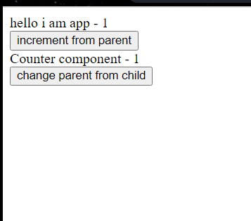

> Prerequisitives:
- change data of parent component from child component using callback function

> child component - Counter.js 
```bash 
class Counter extends React.Component {
    constructor(props) {
      super(props);

    }
  
    render() {
      console.log("counter-render");
      return (
        <div>
          Counter component - {this.props.value}
          <div id="update"></div>
          <button onClick={this.props.changeParent}>change parent from child</button>
        # every time we click on this button it changes the count state defined inside index.js 

        </div>
      );
    }
  }
```

> index.js 
```bash 
// parent component 
class App extends React.Component {
    constructor() {
      super();
      console.log("constructor");
      this.state = {
        count: 0,
      };
    }

   incrementParent = () => {
      this.setState({
        count: this.state.count + 1,
      });
    };
  
    render() {
      console.log("render");
      return (
        <div>
          hello i am app - {this.state.count}
          <div>
            <button onClick={this.incrementParent}>increment from parent</button>
  
              <Counter
                value={this.state.count}
                changeParent={this.incrementParent}
              />
            #   every time Counter component is called it passes
            # - the state of the parent component to the value props 
            # - increementParent function defined inside parent component to changeParentProps 


        #  callback function- Any function that is passed as an argument to another function so that it can be executed in that other function is called as a callback function.
        #  increementParent function is a callback function, which is been passed to Counter through Props 
          </div>
        </div>
      );
    }
  }
  
  ReactDOM.render(<App />, document.getElementById("root"));
```
#### How are we going to change the state of the parent component from the child component using callback function?
this snippet of code written below is inside `index.js` that is the parent component  
`hello i am app - {this.state.count}`
             
- we want to change the value of count which is the state of parent component from the child component 
            
- to do this, you need to send a callback function within the props of the child component; defined inside the parent component 

-  when 'change parent from child' button will be clicked, the count state of the parent will increement; similarly when we click on 'increement from parent' button it will also invoke increementParent function and change the state of the count.

- it will do a callback function to invoke the function from the parent component to the child component and thats how we'll change the state of the parent component from the child component 


#### Lifecycle methods
change data of parent from child

1. constructir called
2. render 
3. componentDidMount - called when component is being mounted on screen 
4. componentDidUpdate - runs when either state or props is changed, this can only be run only after componentDidMount.
5. componentWillUnmount - called when component is being unmounted from screen 


### Stage 1 - Creation
first, component is created 
> running the `constructor` function 

### stage 2 - Render 
make the html structure which is to be displayed 
> `render` function is called (render function converts JSX to html, so browser can understand it)

- when you change the state, render function will be re-run, component is mounted only once, and whenever state is changed, the mount is not called again 

### stage 3 - Mounting 
display on screen (whenever component first appears on screen for the first time, its called `mount`)
> Mounting (adding component to the DOM tree)

- for mounting we use componentDidMount() function. 
```bash 
every time we refresh the page, whatever we defined inside componentDidMount() is mounted automatically
```
If you wana mount some component, as soon as the page is loaded use componentDidMount() function

#### Discussing the code:
summary:
- componentDidMount will only be called once 
- render method called after that 
- if anything is updated, first render method ccalled, then componentDidUpdate 
- componentDidUnmount called when component is being unmounted. 

> index.js 
```bash 

// parent component 
class App extends React.Component {
    constructor() {
      super();
      //1st constructor is called 
      console.log("constructor");
      this.state = {
        count: 0,
        displayChild: false,
      };
    }
  
    incrementParent = () => {
      this.setState({
        count: this.state.count + 1,
        displayChild: !this.state.displayChild,
        //toggle displayCHild to true when this function is called 
      });
    };
  
    incrementParent2 = () => {
      this.setState({
        count: this.state.count + 1,
      });
    };
  
    //this funtion already defined in React.Component class 
    //3, this sfunction is called 
    componentDidMount() {
      // called when App component is displayed
      // on the screen for first time
      console.log("componentDidMount - parent");
      // this.setState({ count: this.state.count + 1 });
    }
  
    //runs after the state is changed 
    //4. after state is changed, first render will be run again 
    //5. then componentDidUpdate will be run 
    componentDidUpdate() {
      // runs when either state OR props is changed
      console.log("parent - UPDATE");
    }
  
    render() {
      //2. 2nd render is ccalled 
      console.log("render - parent");
      return (
        <div>
          hello i am app - {this.state.count}
          <div>
            {/* when you clcik on this button displayChild will be toggled to true */}
            <button onClick={this.incrementParent}>increment from parent</button>

            <button onClick={this.incrementParent2}>increment only value</button>

            {/* if displayChild is true, then mount Counter component on screen */}
            {this.state.displayChild ? (
              <Counter
                value={this.state.count}
                changeParent={this.incrementParent}
              />
            ) : null}
            {/* counter is the childd component 
            changeParent is passed as props from index.js to counter
            .js
            
            */}
          </div>
        </div>
      );
    }
  }
  
  ReactDOM.render(<App />, document.getElementById("root"));
```
> Counter.js 
```bash 
class Counter extends React.Component {
    constructor(props) {
      console.log('constructor - child')
      super(props);
      this.state = {
        name: "geek",
      };
    }
  
    componentDidMount() {
      console.log("child - componentDidMount");
    }
  
    componentWillUnmount() {
      // polymorphism
      // called when component is being unmounted/removed from screen
      console.log("unmounting!!!!");
    }
  
    // componentDidUpdate(param1, param2) - param1 is always previous props
    // param2 is always previous state
  
    componentDidUpdate(prevProps, prevState) {
      console.log("prevProps - ", prevProps.value);
      console.log("pre state - ", prevState);
      console.log("current prop is - ", this.props.value);
      // runs when either state OR props is changed
      console.log("child - UPDATE");
      document.getElementById("update").innerText = prevProps.value;
      // this.setState({ name: "abhishek" });
    }
  
    // componentDidUpdate() {
    //   // runs when either state OR props is changed
    //   console.log("child - UPDATE");
    // }
  
    render() {
      console.log("render method - child ");
      return (
        <div>
          Counter component - {this.props.value}
          <div id="update"></div>
          <button onClick={this.props.changeParent}>change parent from child</button>

        </div>
      );
    }
  }
```


