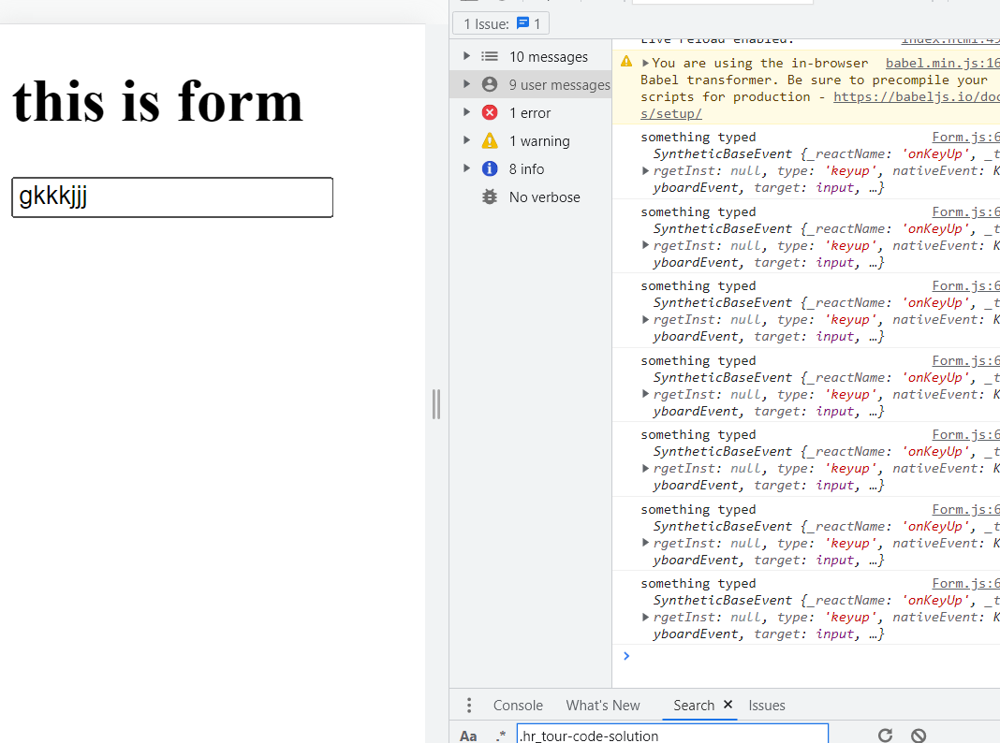
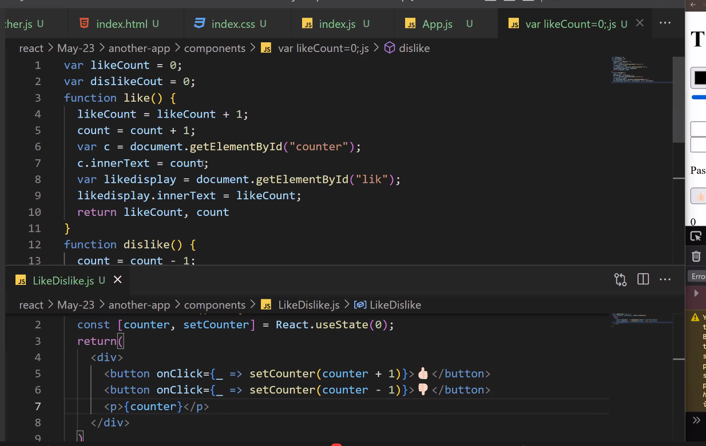

#### Topics:
- virtual DOM 
- events and targets (password matcher)
- re-rendering on state updates 
- simple counter application (like / dislike)

### Virtual DOM (Copy of React DOM)
In react we cannot do any DOM manipulations directly, because 
- in state, it tracks variables and when we re-render it shows the updated data 
- react maintains a copy of the DOM

Whenever we update something react doesnt immediately invoke DOM manipulation, react changes all changes we integrated in our application, all together at one time. which makes our app faster. since React is tracking all states were using, it only updates the part of the page we want it to update, makes the code more efficient, and optimal. 
`eg: when we click on a button, remove an element, goes to virtual dom update that, then only it'll go to real dom`

> Why you should use `ternary operater and states` over document.getelementbyId in react?
```bash
always prefer using ternary operator over document.getelementbyId (this is not better approach) it doesnt store state, and so the virtual DOM cannot update only the part of the page, instead it re-renders the entire page (which causes more time in load time)
```
### Events and Targets 
Everytime we type something in the input field, this event hander logs the value 
> Form.js 
```bash
const Form= () => {
  #using event handlers / event listeners as particular functions 
  #handlers - are handling events 
  #function you written to handle events are called event handlers 
  const keyPressed = (event) => {
    console.log('something typed', event)
  }

  #event handlers are special functions which have specific functions related to events 
  #regular functions can be handled from anywhere 
    return (
      <div>
        <h1>this is form</h1>
        <input type='text' onKeyUp={keyPressed}></input>
      </div>
    )
  }
```


> for instance, we want to log whatever we type on the Dom 
```bash
const Form= () => {
  const [data, setData] = React.useState("")
  #using event handlers / event listeners as particular functions 
  #handlers - are handling events 
  #function you written to handle events are called event handlers 
  const keyPressed = (event) => {
    #console.log('something typed', event)
    data = console.log(event.target.value);
    setData(event.target.value)
  }

  #event handlers are special functions which have specific functions related to events 
  #regular functions can be handled from anywhere 
    return (
      <div>
        <h1>this is form</h1>
        <input type='text' onKeyUp={keyPressed}></input>
        <p>{data}</p>
      </div>
    )
  }
```
> click on the color range and set the range for its dimensions and it renders on screen 
```bash
const Form= () => {
  const [data, setData] = React.useState("#000000");
  const [range, setRange] = React.useState(0)
  #using event handlers / event listeners as particular functions 
  #handlers - are handling events 
  #function you written to handle events are called event handlers 
  const keyPressed = (event) => {
    #console.log('something typed', event)
    console.log(event.target.value);
    setData(event.target.value)
  }

  const rangeChange = (e) => {
    console.log(e.target.value * 2)
    setRange(e.target.value * 2)
  }

  #event handlers are special functions which have specific functions related to events 
  #regular functions can be handled from anywhere 
    return (
      <div>
        <h1>this is form</h1>
        <input type='color' onChange={keyPressed}></input>
        <input type='range' onChange={rangeChange}/>
        <div style={{width: `${range}px`, height: `${range}px`, backgroundColor: data}}></div>
        <p>{data}</p>
        {/* input didnt re-render, it didnt call the function keyPressed again */}

        {/* use input type:color */}
      </div>
    )
  }
```

### Password Matcher 
if 2 input field same, passsword match otherwise they dont match 
> PassMatcher.js 
```bash
const PassMatcher = () => {
    const [pass1, setPass1] = React.useState()
    const [pass2, setPass2] = React.useState()

    return (
        <div>
            {/* onKeyUp -> when we write something in the input field */}
            <input type='text' onKeyUp={(e) => {
                setPass1(e.target.value)
            }}></input>
            <input type='text' onKeyUp={(e) => {
                setPass2(e.target.value)
            }}></input>

            {/* if pass1 is equal to pass2 they match otherwise they dont */}
            <p>{pass1 === pass2 ? "passwords match" : "pass dont match" }</p>
        </div>
    );
}
```
> Difference between react and JS code for like/counter 
```bash
const LikeDislike = () => {
    
    const [counter, setCounter] = React.useState(0)
    return (
        <div>
            {/* counter++ in place of counter+1 wont work
                because state variable of variable is const 
                we cannot change it 
                
                but react recommends to use state as a const, which makes state read only */}
            <button onClick={_ => setCounter(counter + 1)}> 👍</button>
            <button onClick={_ => setCounter(counter - 1)}> 👎</button>
            {/* _ in this context is same as () */}
            <p>{counter}</p>
        </div>
    )
}
```


> Assignment 
create a div having text, padding, color, border color. each of these properties will have its own input 


