## Audio App using Tailwind 
### Register on Napster 
> API KEY 
```bash
OGQxNjNkMmQtYTNiMS00NTllLTkyMDktMmFlMTEzMTMxNzA1
```
> API SECRET
```bash
OGE3ZDNlODYtYzViYi00MWY4LTk0YzYtZjYzZDg1N2RiZDJi
```
> Create .env, install env-cmd, configure the package.json 

### Tips:
- [Use this tool to code compar](https://url-decode.com/tool/code-compare)
- alt + shift + control on any component tag, it takes you to that component 
- alt + click repeatedly to highlights all the places then you can change multiple tags at the same time. 

### Features 
- Home
- Search
- artist
- album 
- favorite
- top songs and playlists 
- categories 

### Packages installed 
- Tailwind CSS 
- axios 
- env-cmd 
- redux

## Wireframe 
- we'll try mobile-first approach (mobile compatible website) 
```bash
previously, we used to do desktop first approach, then we used to design for mobile approach
```
> Home page 
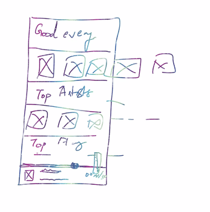
- menu on the lhs (navigationBar.js)
- scroll for top songs scroll (TopSongs.js)
- scroll for top artists 
- scroll for playlists 
- popup for volume  
- bottom player (Player.js)

> Playlist page - list of songs, artist on top
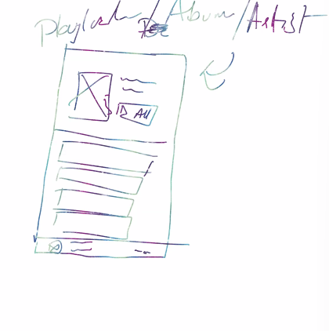

#### The Code 
> App.js 
```bash
import NavigationBar from "./components/NavigationBar";
import Player from "./components/Player";
import Home from "./pages/Home";

const App = _ => {
  return (
    <>
      <div className="bg-gray-200 min-h-screen">
        <NavigationBar />
        <div className="container mx-auto py-4">
          <Home />
        </div>
        <Player />
      </div>
    </>
  );
}

export default App;
```
> NavigationBar.js 
- Navigate to [Tailwind UI](https://tailwindui.com/components), were going to be integrating the free component provisions from the components provided here and customising them to suit our needs. we choose Navbars and copy the code for it 
- we commented the dropdown from the user icon
- we added a usestate to toggle the menu bar when the website is mobile sized, by simply defining a usestate, and on click of the icon on the lhs that appears on mobile screen, were toggling the state, which was initially set to false, and within the menu itms div we set the display to hidden when showMenu is false, when the icon is clicked its toggled to true and the display icon is then then to true, for which we set display:block. 
```bash
import {useState} from 'react'
# we imported navigation bar from tailwind 

const NavigationBar = () => {
  ✅const [showMenu, setShowMenu] = useState(false);
#   const [showrightMenu, setShowrightMenu] = useState(false);

  return (
    <>
      <nav className="bg-gray-800">
        <div className="max-w-7xl mx-auto px-2 sm:px-6 lg:px-8">
          <div className="relative flex items-center justify-between h-16">
            <div className="absolute inset-y-0 left-0 flex items-center sm:hidden">
              # Mobile menu button*/}
              # <button type="button" className="inline-flex items-center justify-center p-2 rounded-md text-gray-400 hover:text-white hover:bg-gray-700 focus:outline-none focus:ring-2 focus:ring-inset focus:ring-white" aria-controls="mobile-menu" aria-expanded="false"> */}
              
              ✅<button type="button" className="inline-flex items-center justify-center p-2 rounded-md text-gray-400 hover:text-white hover:bg-gray-700 focus:outline-none focus:ring-2 focus:ring-inset focus:ring-white" aria-controls="mobile-menu" aria-expanded="false" onClick={_ => setShowMenu(e => !e)}>

                <span className="sr-only">Open main menu</span>
              
                  # Icon when menu is closed.
                  # Heroicon name: outline/menu
                  # Menu open: "hidden", Menu closed: "block"
            
                <svg className="block h-6 w-6" xmlns="http:{#www.w3.org/2000/svg" fill="none" viewBox="0 0 24 24" strokeWidth="2" stroke="currentColor" aria-hidden="true">
                  <path strokeLinecap="round" strokeLinejoin="round" d="M4 6h16M4 12h16M4 18h16" />
                </svg>
               
                  # Icon when menu is open.
                  # Heroicon name: outline/x
                  # Menu open: "block", Menu closed: "hidden"
           
                <svg className="hidden h-6 w-6" xmlns="http:{#www.w3.org/2000/svg" fill="none" viewBox="0 0 24 24" strokeWidth="2" stroke="currentColor" aria-hidden="true">
                  <path strokeLinecap="round" strokeLinejoin="round" d="M6 18L18 6M6 6l12 12" />
                </svg>
              </button>
            </div>
            <div className="flex-1 flex items-center justify-center sm:items-stretch sm:justify-start">
              <div className="flex-shrink-0 flex items-center">
                
                
              </div>
              <div className="hidden sm:block sm:ml-6">
                <div className="flex space-x-4">
                  # Current: "bg-gray-900 text-white", Default: "text-gray-300 hover:bg-gray-700 hover:text-white" 
                  <a href="#" className="bg-gray-900 text-white px-3 py-2 rounded-md text-sm font-medium" aria-current="page">Dashboard</a>

                  <a href="#" className="text-gray-300 hover:bg-gray-700 hover:text-white px-3 py-2 rounded-md text-sm font-medium">Team</a>

                  <a href="#" className="text-gray-300 hover:bg-gray-700 hover:text-white px-3 py-2 rounded-md text-sm font-medium">Projects</a>

                  <a href="#" className="text-gray-300 hover:bg-gray-700 hover:text-white px-3 py-2 rounded-md text-sm font-medium">Calendar</a>
                </div>
              </div>
            </div>
            <div className="absolute inset-y-0 right-0 flex items-center pr-2 sm:static sm:inset-auto sm:ml-6 sm:pr-0">
              <button type="button" className="bg-gray-800 p-1 rounded-full text-gray-400 hover:text-white focus:outline-none focus:ring-2 focus:ring-offset-2 focus:ring-offset-gray-800 focus:ring-white">
                <span className="sr-only">View notifications</span>
                # Heroicon name: outline/bell */}
                <svg className="h-6 w-6" xmlns="http:{#www.w3.org/2000/svg" fill="none" viewBox="0 0 24 24" strokeWidth="2" stroke="currentColor" aria-hidden="true">
                  <path strokeLinecap="round" strokeLinejoin="round" d="M15 17h5l-1.405-1.405A2.032 2.032 0 0118 14.158V11a6.002 6.002 0 00-4-5.659V5a2 2 0 10-4 0v.341C7.67 6.165 6 8.388 6 11v3.159c0 .538-.214 1.055-.595 1.436L4 17h5m6 0v1a3 3 0 11-6 0v-1m6 0H9" />
                </svg>
              </button>

              # Profile dropdown */}
              # <div className="ml-3 relative">
              #   <div>
              #     <button type="button" className="bg-gray-800 flex text-sm rounded-full focus:outline-none focus:ring-2 focus:ring-offset-2 focus:ring-offset-gray-800 focus:ring-white" id="user-menu-button" aria-expanded="false" aria-haspopup="true"  onClick={_ => setShowrightMenu(e => !e)}>
              #       <span className="sr-only">Open user menu</span>
              #       
              #     </button>
              #   </div>

              # <div className={`sm:hidden ${showrightMenu ? "block" : "hidden"}`} >\
              #   <div className="origin-top-right absolute right-0 mt-2 w-48 rounded-md shadow-lg py-1 bg-white ring-1 ring-black ring-opacity-5 focus:outline-none" role="menu" aria-orientation="vertical" aria-labelledby="user-menu-button" tabindex="-1">
        
              #     <a href="#" className="block px-4 py-2 text-sm text-gray-700" role="menuitem" tabindex="-1" id="user-menu-item-0">Your Profile</a>
              #     <a href="#" className="block px-4 py-2 text-sm text-gray-700" role="menuitem" tabindex="-1" id="user-menu-item-1">Settings</a>
              #     <a href="#" className="block px-4 py-2 text-sm text-gray-700" role="menuitem" tabindex="-1" id="user-menu-item-2">Sign out</a>
              #   </div>
              #  </div>
              # </div> 
            </div>
          </div>
        </div>

        # ✅we wanted it to be hidden and only when showMenu is false when button is clicked so we set the code using useState toggle 
      */}
        <div className={`sm:hidden ${showMenu ? "block" : "hidden"}`} id="mobile-menu">
          <div className="px-2 pt-2 pb-3 space-y-1">
            # Current: "bg-gray-900 text-white", Default: "text-gray-300 hover:bg-gray-700 hover:text-white" */}
            <a href="#" className="bg-gray-900 text-white block px-3 py-2 rounded-md text-base font-medium" aria-current="page">Dashboard</a>

            <a href="#" className="text-gray-300 hover:bg-gray-700 hover:text-white block px-3 py-2 rounded-md text-base font-medium">Team</a>

            <a href="#" className="text-gray-300 hover:bg-gray-700 hover:text-white block px-3 py-2 rounded-md text-base font-medium">Projects</a>

            <a href="#" className="text-gray-300 hover:bg-gray-700 hover:text-white block px-3 py-2 rounded-md text-base font-medium">Calendar</a>
          </div>
        </div>
      </nav>
    </>
  )
}

export default NavigationBar
```
> util.js 
within this file we configured the API client, and exported both of them as named exports.
- Navigate to (https://developer.prod.napster.com/api/v2.2#images-apis)
```bash
import axios from "axios";

const napster = axios.create({
  baseURL: 'https://api.napster.com/v2.2/',
  timeout: 10000,
  params: {
    apikey: process.env.REACT_APP_API_KEY
  }
});

const trackImage = trackId => {
  return `https://api.napster.com/imageserver/v2/albums/${trackId}/images/500x500.jpg`;
  
    #get track or album image 
    #https://api.napster.com/imageserver/v2/albums/{album_id}/images/{size}.{extension}
}

export {napster, trackImage};
```
> TopSongs.js 
Right below home, this component is rendered, which is technically responsible for fetching all the top tracks from the API endpoint storing it in trackList state. mapping over this state and extracting each element inside it. the final image id lies in this path: data -> tracks -> album id
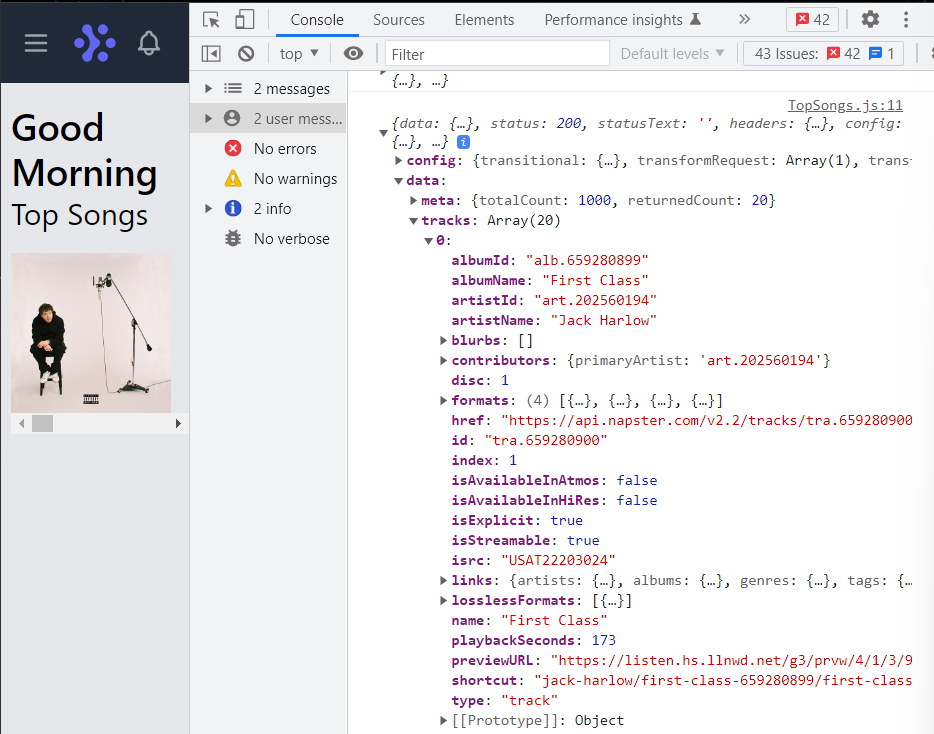

- so we retreive it, and pass it through an api instance of trackImage which is technically responsible for getting the image for the particular track. 
```bash
import React, { useEffect, useState } from 'react'
import { napster, trackImage } from '../util'

const TopSongs = () => {
  const [trackList, setTrackList] = useState([]);
  useEffect(() => {
    (async _ => {
    #Top Tracks
    #Returns a list of the top tracks across Rhapsody, updated daily.
      const response = await napster.get('/tracks/top');
      console.log(response)
      setTrackList(response.data.tracks);
    })();
  }, []);

  return (
    <>
      <h3 className="text-2xl">Top Songs</h3>
      #  we added overflow scroll and w-full with flex no wrap to allign all the scroll items  */}
      <div className="flex flex-nowrap gap-4 mt-4 w-full overflow-x-scroll">
        {trackList.map((singleTrack, idx) => {
          return (
            # we need to get the album image for the track
            #we'll need to set the id to retreive the specific track image
            <div className="flex-none w-32" key={idx}>
              
            </div>
          );
        })}

        # we imported flexbox nd grid https://tailwindcss.com/docs/flex#initial*/}
        # <div class="flex-none w-32">
          
        </div>
        <div class="flex-none w-32">
          
        </div><div class="flex-none w-32">
          
        </div><div class="flex-none w-32">
          
        </div><div class="flex-none w-32">
          
        </div> */}
      </div>
    </>
  )
}

export default TopSongs
```
> Player.js 
This component is set in the bottom, we imported navigation bar and set the style property to bottom, we also cleaned up the code and added song image at the lhs, song name in the middle and the range on the top of the player.js 
```bash
import { useState } from 'react'

const Player = () => {
  return (
    <>
    # we added another navigation bar component to the bottom  */}
    # we cleaned up all the nav content, we added classes to fix it to the bottom and fixed the width to 100% (w-full) */}
      <nav className=" fixed bottom-0 w-full">

        # we added input type range to integrate the player range scroll  */}
        <input type="range" className="w-full -mb-4" />
        <div className='bg-gray-800'>
          <div className="max-w-7xl mx-auto px-2 sm:px-6 lg:px-8">
            <div className="relative flex items-center justify-between h-16">
              # div 1 */}
              <div className="absolute inset-y-0 left-0 flex items-center">
                
              </div>
              # div 2 */}
              <div className="flex-1 flex items-center justify-center">
                <h3 className="text-white">Song Name</h3>
              </div>
              # div 3 */}
              <div className="absolute inset-y-0 right-0 flex items-center pr-2 sm:static sm:inset-auto sm:ml-6 sm:pr-0">

              </div>
            </div>
          </div>
        </div>

      </nav>
    </>
  )
}

export default Player
```
[part 1](https://magical-marzipan-12d715.netlify.app/)

### Integrating redux 
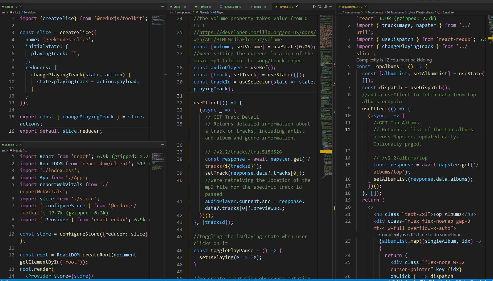
- we installed redux and reduxjs/toolkit
- we created slice.js with state playingtrack
- integrate the store at index.js 
- in TopSongs.js and TopAlbums.js we dispatch actions which changes current playing song based on the change in the id.  the image we clicked on stored in the PlayingTrack state from redux store
- the song for the particular id is retreieved through useselector

#### For all the components given below we add the same functionality
were using Player.js as a proxy to send data to the control that is hidden
> Player.js 
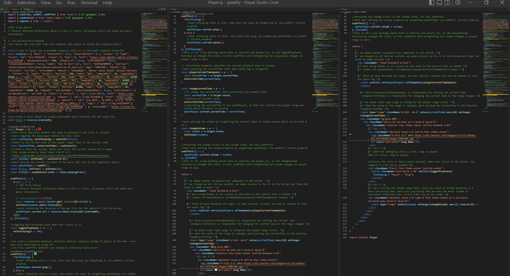
- To retreive the track details of a particular track we imported an API JSON data in an object response 
- then we used the response object to further target the object where the previewURL lies which contains the mp3 song for the targetted track id 
- Within the player component were maintaining multiple states, main state which handles the player range is audioPlayer which targets all the audio properties via useRef which is used to target the DOM elements 
- furthermore we retreived the stored track id from the store using useSelector()
- were maintaing a track state which is responsible for targetting the endpoint to retreive the id of the track in a useEffect within which we also set the location of the audioPlayer to point at the previewURL object. 
- furthermore, were toggling the play/pause button and setting ternary conditions to perform when boolean value is true then set the isPlaying state to true 
- we also created a mutation observer, which is technically a function which observes changes of object over the DOM and were setting the play() and pause() attribute on conditional rendering within a useEffect which would get rendered only when isPlaying has any changes. we also set the audioPlayer state current property 
- We maintain another couple functions for volume range, one for setting volumea and the other which gets rendered on useEffect change, here we set the set the audioPlayer state current property
- We maintain another couple functions for changing the currentTime, in one function were setting the current time and in the other were setting the audioPlayer state current property
- Note that: were binding the audio controls property and the player range this is called two way binding. 
- we've set the onTimeUpdate event handler which invoked the function responsible for setting the state of th current time, while the input range is responsible for invoking the function responsible for setting the audioPlayer current property 

> components 
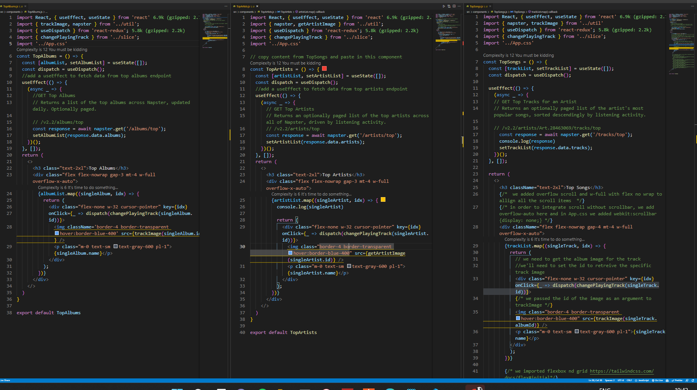
- In all these components were acheiving the same: dispatching actions
- were retreiving a value from the API endpoint and updating the state, mapping over that state and rendering all the divs containing images within it, when the user clicks on the div, were going to dispatch actions. 
- when we dispatch actions say in this case its changePlayingTrac(singleTrack.id) it technically redirects us to slice.js where the action and the reducer is defined and within here were simply storing the track.id within the payload, and the reducers defined here is simply compiled within createSlice() and within index.js were creating an instance of the configureStore() within which were passing our reducer and through the Porvider component tags were passing the store object. 

> util.js 
- within util.js were creating utlities that required for our app, were confuguring the API client over here
- Album image(Top artist song) within TopSongs.js 
- Artist Image(Top artists) within TopArtists.js 
```bash
import axios from "axios";

const napster = axios.create({
  baseURL: 'https://api.napster.com/v2.2/',
  timeout: 10000,
  params: {
    apikey: process.env.REACT_APP_API_KEY
  }
});

#get track or album image 
#https://api.napster.com/imageserver/v2/albums/{album_id}/images/{size}.{extension}
const trackImage = trackId => {
  return `https://api.napster.com/imageserver/v2/albums/${trackId}/images/500x500.jpg`;
  #Album image(Top artist song)
  #itll technically show the album image the song belongs to
}

#For fetching the Artist Image
# we add an api client in util.js for getting artist image 
# GET Artist Images
# Returns a list of licensed images for an artist.
#/v2.2/artists/Art.28463069/images

#we can add size/extension of the image at the end 
#/v2.2/artists/Art.28463069/images/{size}.{extension}
const getArtistImage = artistId => {
  return `https://api.napster.com/imageserver/v2/artists/${artistId}/images/150x100.jpg`;
  #Artist Image(Top artists)
}

export {napster, trackImage, getArtistImage};
```
#### 27-06 
- change background image for the song in player.js from Top Songs section 
- song should auto start play when you click on the image
- when user clicks on any image in Top Albums redirect them to Album.js 

> Player.js 
- in useEffect we check this object by `  console.log(response.data?.tracks[0]);` and add `setIsPlaying(true)` which technically means whenever we click on the image it starts playing that song immediately. 
- within div.absolute add dynamic image
```bash
 
```
by doing this on which song you click on the DOM, it changes the image at player.js. and to print the name of the song we add
```bash
 <h3 class="text-white">{track?.name}</h3>
```
- we added a play and pause button by importing it via fontAwesome, we had to install some stuff from npm then integrate the icon name on the top 
```bash
import { useState, useRef, useEffect } from 'react';
import { useSelector } from 'react-redux';
import { trackImage, napster } from '../util';
import { FontAwesomeIcon } from '@fortawesome/react-fontawesome';

#we added fontAwesome icons for the play and pause icon [](https://fontawesome.com/docs/web/use-with/react/)
import { faPlay, faPause } from '@fortawesome/free-solid-svg-icons'


#GET Track Detail
# Returns detailed information about a track or tracks, including artist and album and genre information.
# /v2.2/tracks/tra.51565284

# https://api.napster.com/v2.2/tracks/tra.5156528?apikey=YTkxZTRhNzAtODdlNy00ZjMzLTg0MWItOTc0NmZmNjU4Yzk4

#we copies the json data from this endpoint and placed in inside the response object 

#we'll need to target the previewURL property which is in this path response.tracks[0]
const response = { "meta": { "totalCount": null, "returnedCount": 1 }, "tracks": [{ "type": "track", "id": "tra.5156528", "index": 7, "disc": 1, "href": "https://api.napster.com/v2.2/tracks/tra.5156528", "playbackSeconds": 258, "isExplicit": false, "isStreamable": false, "isAvailableInHiRes": false, "name": "Say It Ain't So", "isrc": "USIR10400084", "shortcut": "weezer/weezer-blue-album-deluxe-edition/say-it-aint-so", "amg": "6907998", "blurbs": [], "artistId": "art.954", "artistName": "Weezer", "albumName": "Weezer (Blue Album) (Deluxe Edition)", "formats": [{ "type": "format", "bitrate": 320, "name": "AAC", "sampleBits": 16, "sampleRate": 44100 }, { "type": "format", "bitrate": 192, "name": "AAC", "sampleBits": 16, "sampleRate": 44100 }, { "type": "format", "bitrate": 128, "name": "MP3", "sampleBits": 16, "sampleRate": 44100 }, { "type": "format", "bitrate": 64, "name": "AAC PLUS", "sampleBits": 16, "sampleRate": 44100 }], "losslessFormats": [{ "type": "format", "bitrate": 44100, "name": "FLAC", "sampleBits": 16, "sampleRate": 44100 }], "albumId": "alb.5153820", "isAvailableInAtmos": false, "contributors": { "primaryArtist": "art.954" }, "links": { "artists": { "ids": ["art.954"], "href": "https://api.napster.com/v2.2/artists/art.954" }, "albums": { "ids": ["alb.5153820"], "href": "https://api.napster.com/v2.2/albums/alb.5153820" }, "genres": { "ids": ["g.1053", "g.1050", "g.5"], "href": "https://api.napster.com/v2.2/genres/g.1053,g.1050,g.5" }, "tags": { "ids": ["tag.152196498"], "href": "https://api.napster.com/v2.2/tags/tag.152196498" } }, "previewURL": "https://listen.hs.llnwd.net/g2/prvw/4/2/4/9/8/911189424.mp3" }] };

  #we create a track object to target previewURL which contains the mp3 song file 
const track = response.tracks[0];


const Player = () => {
  #this state specifies whether the song is playing or not (true or false)4
  #were toggling the play/pause button via this state 
  const [isPlaying, setIsPlaying] = useState(false);

  #where is the current knob in the player range? that is the current time 
  const [currentTime, setCurrentTime] = useState(0);

  #create a state for volume, which will track the current volume via a range
  #the volume property takes value from 0 to 1
  #https://developer.mozilla.org/en-US/docs/Web/API/HTMLMediaElement/volume
  const [volume, setVolume] = useState(0.25);

  ##were setting the current location of the music mp3 file in the song/track object 
  const audioPlayer = useRef();
  const [track, setTrack] = useState({});
  const trackId = useSelector(state => state.playingTrack);

  useEffect(() => {
      # GET Track Detail
      # Returns detailed information about a track or tracks, including artist and album and genre information.

      # /v2.2/tracks/tra.5156528
    (async _ => {
      const response = await napster.get(`/tracks/${trackId}`);
      setTrack(response.data?.tracks[0]);
      console.log(response.data?.tracks[0]);
      #were retreiving the location of the mp3 file for the specific track id passed 
      audioPlayer.current.src = response.data?.tracks[0]?.previewURL;
      #setting the song playing option at Player.js as true 
      setIsPlaying(true);
    })();
  }, [trackId]);

  #toggling the isPlaying state when user clicks on it 
  const togglePlayPause = () => {
    setIsPlaying(e => !e);
  }

  
  #we create a mutation observer: mutation observer observes change of object in the dom - over here were observing it using ref 
  #run this useEffect whenever any change to isPlaying state occurs 
  useEffect(() => {
    if(isPlaying) {
      #when isPlaying state is true, then play the song, by targetting it via useRef() current property 
      audioPlayer.current.play();
    } else {
      #when isPlaying state is false, then pause the song, by targetting audioPlayer via useRef() current property 
      audioPlayer.current.pause();
    }
  }, [isPlaying]);
 #This is for 2 way binding (works both in controls and player.js), in the TogglePlayPause function we changed the state, in this useEffect were integrating the play/pause changes in player range as well.

  # currentTime property specifies the current playback time in seconds.
  #were updating the currentTime state when audio tag is triggered
  const playerCurrentTimeUpdate = e => {
    const currentTime = e.target.currentTime;
    setCurrentTime(currentTime);
  }

  const changeCurrentTime = e => {
     #To change the currentTime, were extracting its present value 
    const currentTime = e.target.value;
     #setting its present value 
    setCurrentTime(currentTime);
    #specifying the currentTime to the audioPlayer, so both our controls and player range are synced while the music is playing 
    audioPlayer.current.currentTime = currentTime;
  }

   #were setting the volume by targetting the current value of volume passed which can be from 0 to 1 
  const changeVolume = e => {
    const volume = e.target.value;
    setVolume(volume);
  }
#everytime any change occurs in the volume state, run this useEffect
  #here were setting the volume property by targetting audioPlayer via useRef() current property 
  useEffect(() => {
    audioPlayer.current.volume = volume;
  }, [volume])
  #This is for 2 way binding (works both in controls and player.js), in the changeVolume function we changed the state, in this useEffect were integrating the volume changes in player range as well.

  return (
    <>
      # we added another navigation bar component to the bottom  */}
      # we cleaned up all the nav content, we added classes to fix it to the bottom and fixed the width to 100% (w-full) */}
      <footer className=" fixed bottom-0 w-full">
         # were using Player.js as a proxy to send data to the control that is hidden */}
         # <audio ref={audioPlayer} onTimeUpdate={playerCurrentTimeUpdate}></audio> */}

           # while we were building the logic, we kept controls visible, but now we removed it from the audio tag */}
        <audio controls ref={audioPlayer} onTimeUpdate={playerCurrentTimeUpdate}>
        </audio>
         # while playercurrenttimeupdate() is responsible for setting the current time
         changecurrenttime() is responsible for changing the current time as the range changes */}
        
        # we added input type range to integrate the player range scroll  */}
        # when the value of the range is changed, were passing the currentTime to the function changeCurrentTime */}
        <input type="range" className="w-full -mb-4" value={currentTime} max={30} onChange={changeCurrentTime} />
        <div className='bg-gray-800'>
          <div className="max-w-7xl mx-auto px-2 sm:px-6 lg:px-8">
            <div className="relative flex items-center justify-between h-16">
               # div 1 */}
              <div className="absolute inset-y-0 left-0 flex items-center">
                  #  */}

                # setting dyanamic image */}
                
                  # <h3 class="text-white">Song Name</h3> */}
                <h3 class="text-white">{track?.name}</h3>
              </div>
              # div 2 */}
              # when the isPlaying state is true, song is paused
              when its false, song is played
              
              iniitally the state is false (music paused), when user clicks on the button, its toggled to true (music played)*/}
              <div className="flex-1 flex items-center justify-center">
                <button className='text-white z-50' onClick={togglePlayPause}>
                  # {isPlaying ? "Pause" : "Play"} */}

                  # instead of printing pause and play on toggle, we print these icons instead */}
                
                  {isPlaying ? (
                    <FontAwesomeIcon  icon={faPause} />
                  ) : (
                    <FontAwesomeIcon icon={faPlay} />
                  )}
                </button>
              </div>
               # div 3 */}
              # were setting the volume range here, since max value of volume property is 1 were specifying that, were also specifying that we want the music volume to incrrement everytime user scrolls 0.01 step in the range */}
              <div className="absolute inset-y-0 right-0 flex items-center pr-2 sm:static sm:inset-auto sm:ml-6 sm:pr-0">
                <input className='w-24' type="range" value={volume} onChange={changeVolume} max={1} step={0.01} />
              </div>
            </div>
          </div>
        </div>
      </footer>
    </>
  )
}

export default Player
```

> TopArtists.js 
- comment out the artist details from return and  add animation like pulse from MUI [](https://mui.com/material-ui/react-skeleton/#pulsate-example). copy the template and modify some details to make it synonymous to our actual card. we want default artistList state not to be empty as before, we want it to have array of 20 elements with value -1, and add a ternry if singleartist is -1, then return the skeleton pulse else return the artist details (now you can uncomment it). When data is not loaded its -1, when its loaded its an object.
```bash
const TopArtists = () => {
  #const [artistList, setArtistList] = useState([]);
  const [artistList, setArtistList] = useState(Array(20).fill(-1));

  #add a useEffect to fetch data from top artists endpoint 
  useEffect(() => {
    (async _ => {
      # GET Top Artists
      # Returns an optionally paged list of the top artists across all of Napster, driven by listening activity.
      # /v2.2/artists/top
      const response = await napster.get('/artists/top');
      setArtistList(response.data.artists);
    })();
  }, []);

 return (
    <>
      <h3 class="text-2xl">Top Artists</h3>
      <div class="flex flex-nowrap gap-3 mt-4 w-full overflow-x-auto">
        {artistList.map((singleArtist, idx) => {
            console.log(singleArtist)
            if (singleArtist === -1) {
              return (
                <div class="flex-none w-32 animate-pulse rounded-lg" key={idx}>
                  <div class="bg-slate-700 h-20 w-28"></div>
                  <div class="h-2 bg-slate-700 rounded mt-2 w-20 mb-3"></div>
                </div>
              );
            } else {
              return (
                # https://api.napster.com/v2.2/artists/top?apikey=YTkxZTRhNzAtODdlNy00ZjMzLTg0MWItOTc0NmZmNjU4Yzk4
                <div class="flex-none w-32 cursor-pointer" key={idx} >
                  
                  <p class="m-0 text-sm text-gray-600 pl-1">{singleArtist.name}</p>
                </div>
              );
            }
        })}
      </div>
    </>
  )
} 
```
> TopSongs.js
- set trackList state to have an array of 20 items and fill it with -1. then add the ternary condition to set the pulsate just like we did above. 
```bash
const TopSongs = () => {
  #const [trackList, setTrackList] = useState([]);
  const [trackList, setTrackList] = useState(Array(20).fill(-1));
  const dispatch = useDispatch();

  useEffect(() => {
    (async _ => {
    # GET Top Tracks for an Artist
    # Returns an optionally paged list of the artist's most popular songs, sorted descendingly by listening activity.

    # /v2.2/artists/Art.28463069/tracks/top
      const response = await napster.get('/tracks/top');
      console.log(response)
      setTrackList(response.data.tracks);
    })();
  }, []);


  return (
    <>
      <h3 className="text-2xl">Top Songs</h3>
      #  we added overflow scroll and w-full with flex no wrap to allign all the scroll items  */}
      # in order to integrate scroll without scrollbar, we add overflow-auto here and in App.css we added webkit:scrollbar {display: none;} */}
      <div className="flex flex-nowrap gap-4 mt-4 w-full overflow-x-auto">
        {trackList.map((singleTrack, idx) => {
         if (singleTrack === -1) {
          return (
            <div class="flex-none w-32 animate-pulse rounded-lg" key={idx}>
              <div class="bg-slate-700 h-28 w-28"></div>
              <div class="h-2 bg-slate-700 rounded mt-2 w-20 mb-3"></div>
            </div>
          );
        } else {
          return (
             # we need to get the album image for the track
            #we'll need to set the id to retreive the specific track image

            #https://api.napster.com/v2.2/artists/Art.28463069/tracks/top?apikey=YTkxZTRhNzAtODdlNy00ZjMzLTg0MWItOTc0NmZmNjU4Yzk4
            <div class="flex-none w-32 cursor-pointer" key={idx} onClick={_ => dispatch(changePlayingTrack(singleTrack.id))}>
              # we passed the id of the image as an argument to trackImage */}
              
              <p class="m-0 text-sm text-gray-600 pl-1">{singleTrack.name}</p>
            </div>
          );
        }
        })}

        # we imported flexbox nd grid https://tailwindcss.com/docs/flex#initial*/}
        # <div class="flex-none w-32">
        
        #   
        # </div>
        # <div class="flex-none w-32">
        #   
        # </div><div class="flex-none w-32">
        #   
        # </div><div class="flex-none w-32">
        #   
        # </div><div class="flex-none w-32">
        #   
        # </div> */}
      </div>
    </>
  )
}
```

> TopAlbums.js 
- set state to have an array of 20 items and fill it with -1. then add the ternary condition to set the pulsate just like we did above. 
```bash
const TopAlbums = () => {
  #const [albumList, setAlbumList] = useState([]);
  const [albumList, setAlbumList] = useState(Array(20).fill(-1));

  #add a useEffect to fetch data from top albums endpoint 
  useEffect(() => {
    (async _ => {
      #GET Top Albums
      # Returns a list of the top albums across Napster, updated daily. Optionally paged.

      # /v2.2/albums/top
      const response = await napster.get('/albums/top');
      setAlbumList(response.data.albums);
    })();
  }, []);
  return (
    <>
      <h3 class="text-2xl">Top Albums</h3>
      <div class="flex flex-nowrap gap-3 mt-4 w-full overflow-x-auto">
        {albumList.map((singleAlbum, idx) => {
            if (singleAlbum === -1) {
              return (
                <div class="flex-none w-32 animate-pulse rounded-lg" key={idx}>
                  <div class="bg-slate-700 h-28 w-28"></div>
                  <div class="h-2 bg-slate-700 rounded mt-2 w-20 mb-3"></div>
                </div>
              );
            } else {
              return (
                <div class="flex-none w-32 cursor-pointer" key={idx}>
                  
                  <p class="m-0 text-sm text-gray-600 pl-1">{singleAlbum.name}</p>
                </div>
              );
            }
        })}
      </div>
    </>
  )
}

export default TopAlbums
```
#### Implementing router 
> index.js 
- integrate browserRouter 
```bash
import React from 'react';
import ReactDOM from 'react-dom/client';
import './index.css';
import App from './App';
import slice from './slice';
import { configureStore } from '@reduxjs/toolkit';
import { Provider } from 'react-redux';
import { BrowserRouter } from 'react-router-dom';

const store = configureStore({ reducer: slice });

const root = ReactDOM.createRoot(document.getElementById('root'));
root.render(
  <Provider store={store}>
    <BrowserRouter>
      <App />
    </BrowserRouter>
  </Provider>
);
```

> App.js
- define Routes inside App component for the home component and for Album.js. we want to integrate a link such that whenever user clicks on the image it redirects them to the Album.js which has a path parameter.
- we also created a 404 error page after creating a component named NotFound.js 
```bash
import { Route, Routes } from "react-router-dom";
import NavigationBar from "./components/NavigationBar";
import Player from "./components/Player";
import Home from "./pages/Home";
import Album from './pages/Album';
import NotFound from "./pages/NotFound";

const App = _ => {
  return (
    <>
      <div class="bg-gray-200 min-h-screen pb-24">
        <NavigationBar />
        <div className="container mx-auto py-4">
          <Routes>
            <Route path="/" element={<Home />} />
            <Route path="/album/:albumId" element={<Album />} />
            <Route path="*" element={<NotFound />} />
          </Routes>
        </div>
        <Player />
      </div>
    </>
  );
}

export default App;
```

> TopAlbum.js 
- we add a Link tag encapsulating the div that displays content on the page 
```bash
const TopAlbums = () => {
  #const [albumList, setAlbumList] = useState([]);
  const [albumList, setAlbumList] = useState(Array(20).fill(-1));

  #add a useEffect to fetch data from top albums endpoint 
  useEffect(() => {
    (async _ => {
      #GET Top Albums
      # Returns a list of the top albums across Napster, updated daily. Optionally paged.

      # /v2.2/albums/top
      const response = await napster.get('/albums/top');
      setAlbumList(response.data.albums);
    })();
  }, []);
  return (
    <>
      <h3 class="text-2xl">Top Albums</h3>
      <div class="flex flex-nowrap gap-3 mt-4 w-full overflow-x-auto">
        {albumList.map((singleAlbum, idx) => {
            if (singleAlbum === -1) {
              return (
                <div class="flex-none w-32 animate-pulse rounded-lg" key={idx}>
                  <div class="bg-slate-700 h-28 w-28"></div>
                  <div class="h-2 bg-slate-700 rounded mt-2 w-20 mb-3"></div>
                </div>
              );
            } else {
              return (
                <Link to={`/album/${singleAlbum.id}`}>
                <div class="flex-none w-32 cursor-pointer" key={idx}>
                  
                  <p class="m-0 text-sm text-gray-600 pl-1">{singleAlbum.name}</p>
                </div>
              </Link>
              );
            }
        })}
      </div>
    </>
  )
}

export default TopAlbums
```

> NavigationBar.js 
- add link to the logo, which would redirect to home when clicked on 
```bash
      <Link to="/">
        <div class="flex-shrink-0 flex items-center">
          
          
        </div>
      </Link>
```

#### When we navigate from home component to Album component you'll notice that the music keeps playing, router <Link to> allows this, this cannot be integrated via <a href> 

> Album.js 
- we create albumDetails state, by default empty object
- we add a useEffect andretrieve the api endpoint albums/albumid, we use try and catch, when its a succesful retreive ht will update the state otherwise it will redirect to 404 page (this is for handling exceptional cases, for example, when api is crashing)
```bash
GET Album Detail
Returns detailed information about a given album, including its tracks.

/v2.2/albums/Alb.54719066
```
- in the try block we create another object track_response and target this endpoint. create trackList state and update it with this api data 
```bash
GET Album Tracks
Returns a list of the specified album's tracks.

/v2.2/albums/Alb.54719066/tracks
```
- then display the image from the album id in return, and release the album name, and release date and copyright text and tags displayed in chips via map and contributing artists. were not passing image here, since every track takes the same image of the album, we also add track name. when you click on the contributing artist name take them to artist.js
```bash

const Album = () => {
  # use useParams to retreive the albumId from path parameter
  const { albumId } = useParams();
  const navigate = useNavigate();
  const [albumDetails, setAlbumDetails] = useState({});
  const [trackList, setTrackList] = useState([]);

  useEffect(() => {
    #exceptional handling
    (async _ => {
      try {
        #GET Album Detail
        # Returns detailed information about a given album, including its tracks.

        # /v2.2/albums/Alb.54719066
        const response = await napster.get(`/albums/${albumId}`);
        setAlbumDetails(response.data?.albums[0]);

        # GET Album Tracks
        # Returns a list of the specified album's tracks.

        # /v2.2/albums/Alb.54719066/tracks
        const tracks_response = await napster.get(`/albums/${albumId}/tracks`);
        setTrackList(tracks_response.data.tracks);
      } catch (e) {
        navigate("/404");
      }
    })();
  }, [albumId, navigate])
  
  return (
    <>
    #  add blur effect on the image outside the main div */}
      <div className='h-52 z-0 -mt-4' style={{ backgroundImage: `url('${trackImage(albumId)}')`,
       filter: "blur(5px)", backgroundSize: "cover" }}></div>
      <div className="container mx-auto px-4 -mt-52 z-2 relative">
        

        <p className='text-3xl font-semibold -mt-7 text-center'>{albumDetails.name}</p>
        <Link to={`/artist/${albumDetails.contributingArtists?.primaryArtist}`}>
          <p className='text-lg underline hover:text-blue-700 font-semibold text-center'>{albumDetails.artistName}</p>
        </Link>
        <p className='text-center mt-4'>Released X years ago{albumDetails.originallyReleased}</p>
        <div className='flex justify-center mt-4 gap-2'>{albumDetails.tags?.map((singleTag, idx) => {
          return (
            # tags displayed in chips via map 
            <div key={idx} className="bg-gray-300 rounded-full px-2 pb-1 inline border-blue-300 border-2">
              <span>{singleTag}</span>
            </div>
          )
        })}</div>

        <div className='py-4'>
          <div className='border-gray-400 w-full border-t'></div>
        </div>

        <div>
          # songs in the album */}
          {trackList.map((singleTrack, idx) => {
            return (
              <div key={idx}>
                <p>{singleTrack.name}</p>
              </div>
            );
          })}
        </div>

        <p className='text-center mt-3 text-xs text-gray-400'>{albumDetails.copyright}</p>
      </div>
    </>
  )
}

export default Album;
```

HTML Cheatsheet: https://web.stanford.edu/group/csp/cs21/htmlcheatsheet.pdf

### What is event bubbling and capturing 
They are 2 ways of event propogation in the DOM tree. 

> Its a basis for how events propogate in up / down herierchy of the DOM - event propogration.

Initially netscape advocated to use capturing as the main fundamental for event propogration, while microsoft advocated for event bubbling. Due to these arguments W3C had made both these methods as standard for event propogation. 

Let's take an example, where the child div is within the parent div which is within the grandparent div. each of the div's is targetted by DOM and assigned a boolean value as a second argument to the callback function.

#### Event Bubbling 
event bubbling is events propograting upword to the DOM heirierchy. events are bubbling out. 

> if any event occurs on the child it will propogate to the parent from the child. 
If you click on child div it will first call the child method, then due to event bubbling it will then call the parent method, and then it will call the grandparent method.

- capturing happens before the bubbling phase, when child div is first clicked, `grandparent` -> `parent` -> `child` div (in this order) is retreived and due to bubbling it its shown on the console in this order `child` -> `parent` -> `grandparent`. 
```bash
div #grandparent --> onClickGrandParent()    --- 3rd called 
 div #parent     --> onClickParent()         --- 2nd called 
   div #child    --> onClickChild()          --- 1st called 
```
- you'll need to change the use capture boolean flags in your event listener to false.

#### Event Capturing / Event Trickling 
event capturing is events propograting downwards to the DOM heirierchy. events are trickling. 

> if any event occurs on the child it will propogate from the parent to the child.
If you click on child div it will first call the grand method, then due to event trickling it will then call the parent method, and then it will call the child method.
```bash
div #grandparent --> onClickGrandParent()    --- 1st called 
 div #parent     --> onClickParent()         --- 2nd called 
   div #child    --> onClickChild()          --- 3rd called 
```
- you'll need to change the use capture boolean flags in your event listener to true in this case.

### Which is better? Event bubbling / Event capturing
There is no better. The difference is the order of the execution of the event handlers. Most of the time it will be fine to fire event handlers in the bubbling phase but it can also be necessary to fire them earlier.

#### What is Agolia?
> Agolia API - gives search functionality. if you want to add search functionality for your website use agolia. its google search for enterprises. 

### 28-06 
> Here's the typical component herierchy when you click on an image in TopAlbums.js 
1. TopAlbums.js 
- when user clicks on any track, we redirect them to this url: /album/id. Also within App component we've defined when this is the url we need to redirect the user to Album.js
2. Album.js
- We retreive the id from the url /abum/id through useParams() and we get the album details and album tracks via their distinctive url. Were using try-catch exceptional handling, if its a success then update the state, otherwise redirect to /404 page 
- We were maintaining 2 states above, trackList (get album tracks) and AlbumDetails (get album details) 
- were passing albumDetails as a prop to AlbumInfo component
- were mapping over the trackList state retreiving each track and passing trackDetail as a prop to SingleTrackCard.js 
3. AlbumInfo.js 
- within albumInfo.js were displaying the album image, with blurred background, artist name, and tags displayed
- when user clicks on the artist name, he's redirected to Artist.js, and we already defined the route for Artist component in App.js 
4. SingleCard.js
- within SingletrackCard.js were displaying the list of songs along with the play icon. 
- were retreiving the state from redux store via useSelector(), based on whether its boolean is true or false were printing the animation.gif which indicates that the music is playing or we display the play icon which indicates the song is not playing
- When the div is clicked, we invoke a function which dispatches the action changePlayingTrack and pass the id of the div that is clicked. And since you already know, the changePlayingTrack is responsible for changing the song. 

#### The Code:
> TopAlbums.js 
```bash
import React, { useEffect, useState } from 'react'
import { trackImage, napster } from '../util';
import '../App.css'
import { Link } from 'react-router-dom';
const TopAlbums = () => {
  #const [albumList, setAlbumList] = useState([]);
  const [albumList, setAlbumList] = useState(Array(20).fill(-1));

  #add a useEffect to fetch data from top albums endpoint 
  useEffect(() => {
    (async _ => {
      #GET Top Albums
      # Returns a list of the top albums across Napster, updated daily. Optionally paged.

      # /v2.2/albums/top
      const response = await napster.get('/albums/top');
      setAlbumList(response.data.albums);
    })();
  }, []);
  return (
    <>
      <h3 class="text-2xl">Top Albums</h3>
      <div class="flex flex-nowrap gap-3 mt-4 w-full overflow-x-auto">
        {albumList.map((singleAlbum, idx) => {
            if (singleAlbum === -1) {
              return (
                <div class="flex-none w-32 animate-pulse rounded-lg" key={idx}>
                  <div class="bg-slate-700 h-28 w-28"></div>
                  <div class="h-2 bg-slate-700 rounded mt-2 w-20 mb-3"></div>
                </div>
              );
            } else {
              return (
                <Link to={`/album/${singleAlbum.id}`}>
                <div class="flex-none w-32 cursor-pointer" key={idx}>
                  
                  <p class="m-0 text-sm text-gray-600 pl-1">{singleAlbum.name}</p>
                </div>
              </Link>
              );
            }
        })}
      </div>
    </>
  )
}

export default TopAlbums
```
> Album.js 
```bash
import React, { useEffect, useState } from 'react';
import { useParams } from 'react-router-dom';
import { napster } from '../util';
import { useNavigate } from 'react-router-dom';

import SingleTrackCard from '../components/SingleTrackCard';
import AlbumInfo from '../components/AlbumInfo';

const Album = () => {
  # use useParams to retreive the albumId from path parameter
  const { albumId } = useParams();
  const navigate = useNavigate();
  const [albumDetails, setAlbumDetails] = useState({});
  const [trackList, setTrackList] = useState([]);
  useEffect(() => {
    #exceptional handling
    (async _ => {
      try {
        #GET Album Detail
        # Returns detailed information about a given album, including its tracks.

        # /v2.2/albums/Alb.54719066
        const response = await napster.get(`/albums/${albumId}`);
        setAlbumDetails(response.data?.albums[0]);

        
        # GET Album Tracks
        # Returns a list of the specified album's tracks.

        # /v2.2/albums/Alb.54719066/tracks
        const tracks_response = await napster.get(`/albums/${albumId}/tracks`);
        setTrackList(tracks_response.data.tracks);
      } catch (e) {
        navigate("/404");
      }
    })();
  }, [albumId, navigate])
  return (
    <>
     #   
     <div className='h-52 z-0 -mt-4' style={{ backgroundImage: `url('${trackImage(albumId)}')`,
       filter: "blur(5px)", backgroundSize: "cover" }}></div>
      <div className="container mx-auto px-4 -mt-52 z-2 relative">
        

        <p className='text-3xl font-semibold -mt-7 text-center'>{albumDetails.name}</p>
        <Link to={`/artist/${albumDetails.contributingArtists?.primaryArtist}`}>
          <p className='text-lg underline hover:text-blue-700 font-semibold text-center'>{albumDetails.artistName}</p>
        </Link>
        <p className='text-center mt-4'>Released X years ago{albumDetails.originallyReleased}</p>
        <div className='flex justify-center mt-4 gap-2'>{albumDetails.tags?.map((singleTag, idx) => {
          return (
            # tags displayed in chips via map 
            <div key={idx} className="bg-gray-300 rounded-full px-2 pb-1 inline border-blue-300 border-2">
              <span>{singleTag}</span>
            </div>
          )
        })}</div> */}
      <AlbumInfo albumDetails={albumDetails} />
      <div className="container mx-auto px-4 relative">

        <div className='py-4'>
          <div className='border-gray-400 w-full border-t'></div>
        </div>

        <div className='flex gap-2 flex-wrap justify-evenly items-center'>
          
          # songs in the album */}
          {trackList.map((singleTrack, idx) => {
            return (
              <SingleTrackCard key={idx} index={idx + 1} trackDetail={singleTrack} />
            );
          })}
        </div>

        <p className='text-center mt-5 text-xs text-gray-400'>{albumDetails.copyright}</p>
      </div>
    </>
  )
}

export default Album;
```
> AlbumInfo.js 
```bash
import React from 'react';
import { Link } from 'react-router-dom';
import { trackImage } from '../util';

const AlbumInfo = ({ albumDetails }) => {
  return (
    <>
    #  
      <div className='h-52 z-0 -mt-4' style={{ backgroundImage: `url('${trackImage(albumId)}')`,
       filter: "blur(5px)", backgroundSize: "cover" }}></div>
    */}

    # were giving the blurr property to the className instead of specifying in filter */}
    # The filter property defines visual effects (like blur and saturation) to an element (often ).
    */}

# Image blurr
    sm:w-1/2  width: 50%;
    md:w-1/3  width: 33.333333%;
    lg:w-1/3  width: 33.333333%;
    xl:w-1/4  width: 25%;
  */}
      <div className='h-52 sm:w-1/2 md:w-1/3 lg:w-1/3 xl:w-1/4 z-0 -mt-4 blur-sm' style={{ backgroundImage: `url('${trackImage(albumDetails.id)}')`, backgroundSize: "cover" }}></div>
    #
    image size same as blurr except blurr is backgroundSize: cover
    sm:w-1/2 
    md:w-1/3 
    lg:w-1/3 
    xl:w-1/4 
    
    */}
      <div className="container mx-auto px-4 -mt-40 z-2 relative">
        

        <div className='sm:inline-block sm:p-8'>
          <p className='text-3xl font-semibold -mt-7 sm:mt-0 text-center sm:text-left'>{albumDetails.name}</p>
          <Link to={`/artist/${albumDetails.contributingArtists?.primaryArtist}`}>
            <p className='text-lg underline hover:text-blue-700 font-semibold text-center sm:text-left'>{albumDetails.artistName}</p>
          </Link>
          <p className='text-center sm:text-left mt-4'>Released X years ago</p>
          <div className='flex justify-center sm:justify-start mt-4 gap-2'>{albumDetails.tags?.map((singleTag, idx) => {
            return (
              <div key={idx} className="bg-gray-300 rounded-full px-2 pb-1 inline border-blue-300 border-2">
                <span>Tag: {singleTag}</span>
              </div>
            )
          })}</div>

        </div>
      </div>
    </>
  )
}

export default AlbumInfo
```
> SingleTrackCard.js 
```bash
import React from 'react';
import { FontAwesomeIcon } from '@fortawesome/react-fontawesome';
import { faCirclePlay } from '@fortawesome/free-solid-svg-icons';
import { useDispatch, useSelector } from 'react-redux';
import { changePlayingTrack } from '../slice';
import playingAnimation from '../playing-animation.gif';

const SingleTrackCard = ({trackDetail, index}) => {
  const dispatch = useDispatch();
  #card          - parent 
    #play button - child 

  #due to event bubbling, when child div is clicked its shown in this order: child -> parent.

  #when user clicks on the card we want the music to play 
  const isPlaying = useSelector(state => state.playingTrack === trackDetail.id);


  const playSong = () => {
    dispatch(changePlayingTrack(trackDetail.id));
  }

  return (
    <>
    #
        sm:w-5/12 	width: 41.666667%;
        md:w-1/4    width: 25%;
        lg:w-1/5    width: 20%;
    */}

    # were placing the event handler in the parent div, because when we click on the parent div, the changes will automatically propogate to the child div */}
      <div onClick={playSong} className={`w-full sm:w-5/12 md:w-1/4 lg:w-1/5 border-2 flex items-center hover:bg-blue-100 hover:border-blue-700 ${isPlaying ? "border-blue-700 bg-blue-100" : "border-gray-700"} rounded-md p-3 cursor-pointer`}>
        <span>{index}.</span>
        <span className='ml-2'>{trackDetail.name}</span>
        # when isPlaying state is true, we want to display the equalizer gif file (transparent sound wave animation small) other show the play icon */}
        # we downloaded the equalizer and run it through a background gif remove background and paste it in the src folder*/}
        {isPlaying ? (
          
        ) : (
          <span className='text-4xl ml-auto justify-self-end -mt-1 cursor-pointer hover:text-blue-500'><FontAwesomeIcon icon={faCirclePlay} /></span>
        )}
      </div>
    </>
  )
}

export default SingleTrackCard
```
> Player.js - we added a functionality (a line of code) to help us switch from one song to next
```bash
import { useState, useRef, useEffect } from 'react';
import { useSelector } from 'react-redux';
import { trackImage, napster } from '../util';
import { FontAwesomeIcon } from '@fortawesome/react-fontawesome';

#we added fontAwesome icons for the play and pause icon (https://fontawesome.com/docs/web/use-with/react/)
import { faPlay, faPause } from '@fortawesome/free-solid-svg-icons'


#GET Track Detail
# Returns detailed information about a track or tracks, including artist and album and genre information.
# /v2.2/tracks/tra.51565284

# https://api.napster.com/v2.2/tracks/tra.5156528?apikey=YTkxZTRhNzAtODdlNy00ZjMzLTg0MWItOTc0NmZmNjU4Yzk4

#we copies the json data from this endpoint and placed in inside the response object 

#well need to target the previewURL property which is in this path response.tracks[0]
const response = { "meta": { "totalCount": null, "returnedCount": 1 }, "tracks": [{ "type": "track", "id": "tra.5156528", "index": 7, "disc": 1, "href": "https://api.napster.com/v2.2/tracks/tra.5156528", "playbackSeconds": 258, "isExplicit": false, "isStreamable": false, "isAvailableInHiRes": false, "name": "Say It Ain't So", "isrc": "USIR10400084", "shortcut": "weezer/weezer-blue-album-deluxe-edition/say-it-aint-so", "amg": "6907998", "blurbs": [], "artistId": "art.954", "artistName": "Weezer", "albumName": "Weezer (Blue Album) (Deluxe Edition)", "formats": [{ "type": "format", "bitrate": 320, "name": "AAC", "sampleBits": 16, "sampleRate": 44100 }, { "type": "format", "bitrate": 192, "name": "AAC", "sampleBits": 16, "sampleRate": 44100 }, { "type": "format", "bitrate": 128, "name": "MP3", "sampleBits": 16, "sampleRate": 44100 }, { "type": "format", "bitrate": 64, "name": "AAC PLUS", "sampleBits": 16, "sampleRate": 44100 }], "losslessFormats": [{ "type": "format", "bitrate": 44100, "name": "FLAC", "sampleBits": 16, "sampleRate": 44100 }], "albumId": "alb.5153820", "isAvailableInAtmos": false, "contributors": { "primaryArtist": "art.954" }, "links": { "artists": { "ids": ["art.954"], "href": "https://api.napster.com/v2.2/artists/art.954" }, "albums": { "ids": ["alb.5153820"], "href": "https://api.napster.com/v2.2/albums/alb.5153820" }, "genres": { "ids": ["g.1053", "g.1050", "g.5"], "href": "https://api.napster.com/v2.2/genres/g.1053,g.1050,g.5" }, "tags": { "ids": ["tag.152196498"], "href": "https://api.napster.com/v2.2/tags/tag.152196498" } }, "previewURL": "https://listen.hs.llnwd.net/g2/prvw/4/2/4/9/8/911189424.mp3" }] };

  #we create a track object to target previewURL which contains the mp3 song file 
const track = response.tracks[0];


const Player = () => {
  #this state specifies whether the song is playing or not (true or false)4
  #were toggling the play/pause button via this state 
  const [isPlaying, setIsPlaying] = useState(false);

  #where is the current knob in the player range? that is the current time 
  const [currentTime, setCurrentTime] = useState(0);

  #create a state for volume, which will track the current volume via a range
  #the volume property takes value from 0 to 1
  #https://developer.mozilla.org/en-US/docs/Web/API/HTMLMediaElement/volume
  const [volume, setVolume] = useState(0.25);

  ##were setting the current location of the music mp3 file in the song/track object 
  const audioPlayer = useRef();
  const [track, setTrack] = useState({});
  const trackId = useSelector(state => state.playingTrack);

  useEffect(() => {
       # GET Track Detail
      # Returns detailed information about a track or tracks, including artist and album and genre information.

      # /v2.2/tracks/tra.5156528
    (async _ => {
     ✅if there's nothing in the trackId, when page is initially loaded return false 
      if(trackId === "") {
        return false;
      }

      # assume we clicked on a track from TopSongs.js and its already playing, and we clicked on it again, now when we reclick on it, it doesnt play. why? because the state is not updated

      #so everytime this useEffect runs on trackId change we'll want to set the playing of the previous track to false 
      ✅setIsPlaying(false);

      const response = await napster.get(`/tracks/${trackId}`);
      setTrack(response.data?.tracks[0]);
      console.log(response.data?.tracks[0]);
      #were retreiving the location of the mp3 file for the specific track id passed 
      audioPlayer.current.src = response.data?.tracks[0]?.previewURL;
      #setting the song playing option at Player.js as true 
      setIsPlaying(true);
    })();
  }, [trackId]);

#toggling the isPlaying state when user clicks on it 
  const togglePlayPause = () => {
    setIsPlaying(e => !e);
  }

  
  #we create a mutation observer: mutation observer observes change of object in the dom - over here were observing it using ref 
  #run this useEffect whenever any change to isPlaying state occurs 
  useEffect(() => {
    if(isPlaying) {
      #when isPlaying state is true, then play the song, by targetting it via useRef() current property 
      audioPlayer.current.play();
    } else {
      #when isPlaying state is false, then pause the song, by targetting audioPlayer via useRef() current property 
      audioPlayer.current.pause();
    }
  }, [isPlaying]);
 #This is for 2 way binding (works both in controls and player.js), in the TogglePlayPause function we changed the state, in this useEffect were integrating the play/pause changes in player range as well.

  # currentTime property specifies the current playback time in seconds.
  #were updating the currentTime state when audio tag is triggered
  const playerCurrentTimeUpdate = e => {
    const currentTime = e.target.currentTime;
    setCurrentTime(currentTime);
  }

  const changeCurrentTime = e => {
     #To change the currentTime, were extracting its present value 
    const currentTime = e.target.value;
     #setting its present value 
    setCurrentTime(currentTime);
    #specifying the currentTime to the audioPlayer, so both our controls and player range are synced while the music is playing 
    audioPlayer.current.currentTime = currentTime;
  }

   #were setting the volume by targetting the current value of volume passed which can be from 0 to 1 
  const changeVolume = e => {
    const volume = e.target.value;
    setVolume(volume);
  }
#everytime any change occurs in the volume state, run this useEffect
  #here were setting the volume property by targetting audioPlayer via useRef() current property 
  useEffect(() => {
    audioPlayer.current.volume = volume;
  }, [volume])
  #This is for 2 way binding (works both in controls and player.js), in the changeVolume function we changed the state, in this useEffect were integrating the volume changes in player range as well.

  return (
    <>
    # we added another navigation bar component to the bottom  */}
    # we cleaned up all the nav content, we added classes to fix it to the bottom and fixed the width to 100% (w-full) */}
      <footer className=" fixed bottom-0 w-full">
         # were using Player.js as a proxy to send data to the control that is hidden */}
         # <audio ref={audioPlayer} onTimeUpdate={playerCurrentTimeUpdate}></audio> */}

           # while we were building the logic, we kept controls visible, but now we removed it from the audio tag */}
        <audio controls ref={audioPlayer} onTimeUpdate={playerCurrentTimeUpdate}>
        </audio>
         # while playercurrenttimeupdate() is responsible for setting the current time
         changecurrenttime() is responsible for changing the current time as the range changes */}
        
        # we added input type range to integrate the player range scroll  */}
        # when the value of the range is changed, were passing the currentTime to the function changeCurrentTime */}
        <input type="range" className="w-full -mb-4" value={currentTime} max={30} onChange={changeCurrentTime} />
        <div className='bg-gray-800'>
          <div className="max-w-7xl mx-auto px-2 sm:px-6 lg:px-8">
            <div className="relative flex items-center justify-between h-16">
               # div 1 */}
              <div className="absolute inset-y-0 left-0 flex items-center">
                  #  */}

                # when the user clicks on the image its also setting dyanamic image in the player.js */}
                
                  # <h3 class="text-white">Song Name</h3> */}

                  # when user clicks on the name its also setting dyanamic name in player.js */}
                <h3 class="text-white">{track?.name}</h3>
              </div>
              # div 2 */}
              # when the isPlaying state is true, song is paused
              when its false, song is played
              
              iniitally the state is false (music paused), when user clicks on the button, its toggled to true (music played)*/}
              <div className="flex-1 flex items-center justify-center">
                <button className='text-white z-50' onClick={togglePlayPause}>
                  # {isPlaying ? "Pause" : "Play"} */}

                  # instead of printing pause and play on toggle, we print these icons instead */}
                
                # when isPlaying state is true, it means that the audio is playing and thats why wemust display the Pause icon to the user, giving user the control to pause the song */}
                  {isPlaying ? (
                    <FontAwesomeIcon  icon={faPause} />
                  ) : (
                    <FontAwesomeIcon icon={faPlay} />
                  )}
                </button>
              </div>
               # div 3 */}
              # were setting the volume range here, since max value of volume property is 1 were specifying that, were also specifying that we want the music volume to incrrement everytime user scrolls 0.01 step in the range */}
              <div className="absolute inset-y-0 right-0 flex items-center pr-2 sm:static sm:inset-auto sm:ml-6 sm:pr-0">
                <input className='w-24' type="range" value={volume} onChange={changeVolume} max={1} step={0.01} />
              </div>
            </div>
          </div>
        </div>
      </footer>
    </>
  )
}

export default Player
```
[Deployed site](https://frolicking-pixie-9de43c.netlify.app/)

#### 29-06
> The Album herierchy:
- TopAlbums.js - These contain all songs from top albums. This is defined inside Home.js
When user clicks on an image in Top Songs they are then redirected to Album.js, with this change in the route /album/id which we specified in App.js 
  - Album.js 
    - AlbumInfo.js (contains image till tag info)
    - SongList.js (show pulse else pass tracks to SingleTrackCard.js )
      - SingleTrackCard.js (tracks are rendered here, along the play icon and dispatch song id, so the song is played when play icon is clicked. AudioWave is rendered here)
    - HorizontalAlbumList.js (similar albums rendered horizontally here, when you click on any album it redirects you to /album/id)
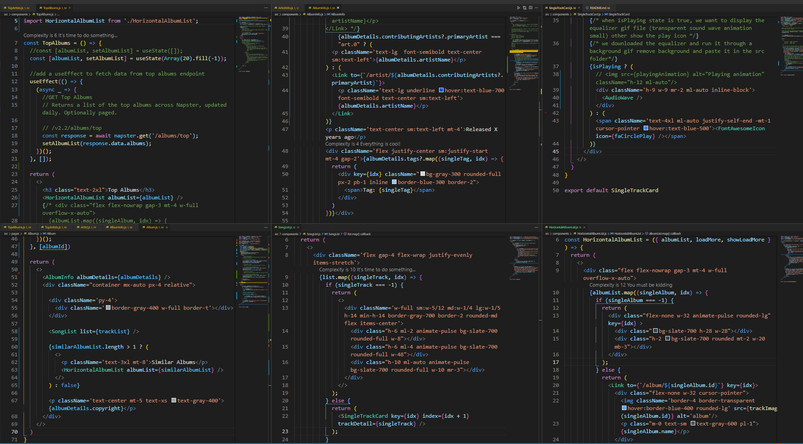

> The Artist Herierchy
- TopArtists.js - These contain all songs from top artists. This is defined inside Home.js
When user clicks on an image in Top Artists, they are then redirected to Artist.js, with this change in the route /artist/:artistId which we specified in App.js 
  - Artist.js 
    - ArtistInfo.js (contains image and artist name)
    - HorizontalAlbumList.js (contains similar albums, when you click on any album it redirects you to /album/id)
    - SongList.js (show pulse else pass tracks to SingleTrackCard.js)
      - SingleTrackCard.js (tracks are rendered here, along the play icon and dispatch song id, so the song is played when play icon is clicked.AudioWave is rendered here)
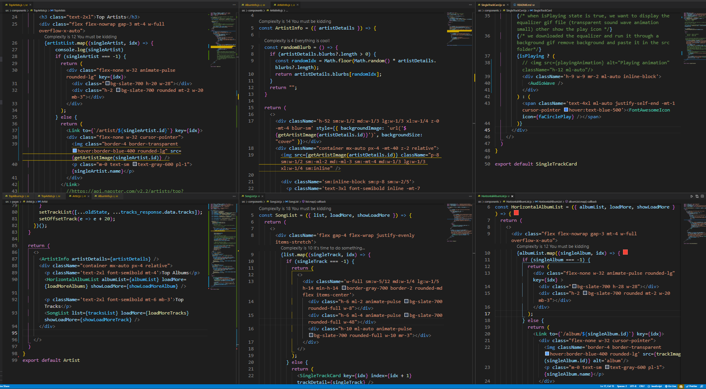

> AudioWave 
we copy pasted the js and css content from here 
[](https://codepen.io/rachelmcgrane/pen/VexWdX)
- AudioWave.js 
- AudioWave.css
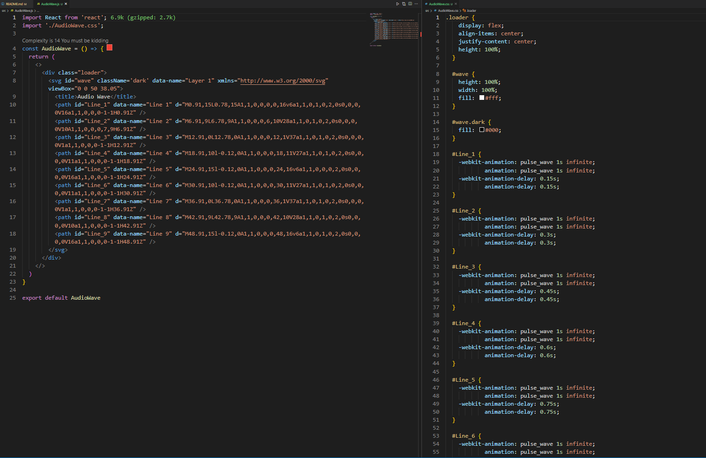

#### Adding loadMore functionality 
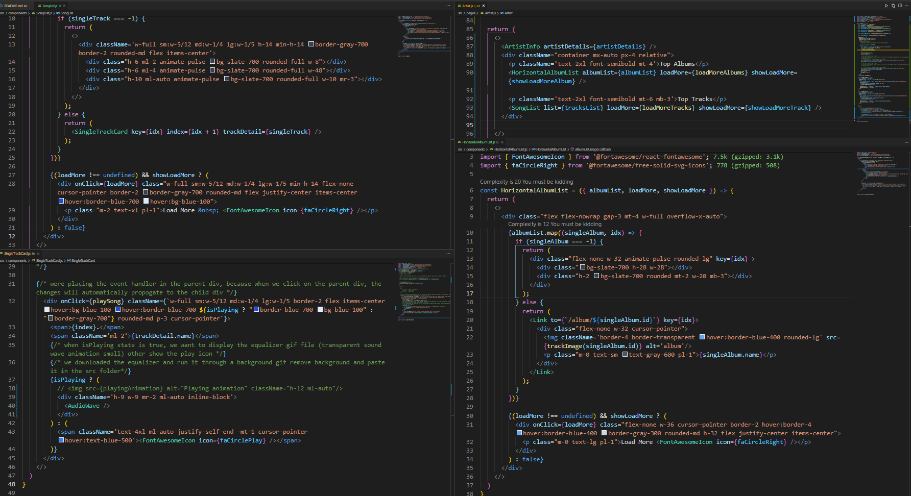
- from Artist.js were passing albumlist and loadMore as props to HorixontalAlbumList.js 
- At horixontalAlbumList.js were rendering the horizontal scroll at the bottom 
- At SingleTrackCard.js were rendering the song List along with equalizer

```bash
const Artist = () => {
  const { artistId } = useParams();
  const navigate = useNavigate();
  
  const [albumList, setAlbumList] = useState(Array(20).fill(-1));
  const [offsetAlbum, setOffsetAlbum] = useState(0);

  const [showLoadMoreAlbum, setShowLoadMoreAlbum] = useState(true);

  const [tracksList, setTrackList] = useState(Array(20).fill(-1));
  const [offsetTrack, setOffsetTrack] = useState(0);
 
  const [showLoadMoreTrack, setShowLoadMoreTrack] = useState(true);
  const [artistDetails, setArtistDetails] = useState({});

  useEffect(() => {
    setAlbumList(Array(20).fill(-1));
    setTrackList(Array(20).fill(-1));
    (async _ => {
      # GET Artist Detail
      # Returns a given artists name, ID and primary genre.

      # /v2.2/artists/Art.28463069
      try {
        const response = await napster.get(`/artists/${artistId}`);
        const data = response.data.artists[0];
        if (data  === undefined) {
          throw "Data is undefined";
        }

        setArtistDetails(data);
        console.log(data);

        # GET Top Albums for an Artist
        # Returns an optionally paged list of the artist's most popular albums, sorted descendingly by listening activity.
        # /v2.2/artists/Art.28463069/albums/top?limit=5
        const album_response = await napster.get(`/artists/${artistId}/albums/top?limit=20`);
        setAlbumList(album_response.data.albums);

        # GET Top Tracks for an Artist
        # Returns an optionally paged list of the artist's most popular songs, sorted descendingly by listening activity.

        # /v2.2/artists/Art.28463069/tracks/top?limit=10
        const tracks_response = await napster.get(`artists/${artistId}/tracks/top?limit=20`);
        setTrackList(tracks_response.data.tracks);
        setOffsetTrack(20);

      } catch (e) {
        navigate('/404');
      }
    })();
  }, [artistId, navigate]);

  const loadMoreAlbums = () => {
    const oldState = albumList;
    setAlbumList(e => [...e, ...(Array(20).fill(-1))]);

    (async _ => {
      # GET Top Albums for an Artist
      # Returns an optionally paged list of the artist's most popular albums, sorted descendingly by listening activity.
      # /v2.2/artists/Art.28463069/albums/top?limit=5
      const album_response = await napster.get(`/artists/${artistId}/albums/top?limit=20&offset=${offsetAlbum}`);
      if (album_response.data.albums.length === 0) {
        setShowLoadMoreAlbum(false);
      }
      #set the list to having oldstate and response.data.albums 
      setAlbumList([...oldState, ...album_response.data.albums]);
      #load 20 more items
      setOffsetAlbum(e => e + 20);
    })();
  }

  const loadMoreTracks = () => {
    const oldState = tracksList;
    setTrackList(e => [...e, ...(Array(20).fill(-1))]);

    # GET Top Tracks for an Artist
    # Returns an optionally paged list of the artist's most popular songs, sorted descendingly by listening activity.
    # /v2.2/artists/Art.28463069/tracks/top?limit=10&offset=5
    (async _ => {
      const tracks_response = await napster.get(`/artists/${artistId}/tracks/top?limit=20&offset=${offsetTrack}`);
      if (tracks_response.data.tracks.length === 0) {
        setShowLoadMoreTrack(false);
      }
      #set the list to having oldstate and response.data.albums 
      setTrackList([...oldState, ...tracks_response.data.tracks]);
      #load 20 more items
      setOffsetTrack(e => e + 20);
    })();
  }

    return (
    <>
      <ArtistInfo artistDetails={artistDetails} />
      <div className="container mx-auto px-4 relative">
        <p className='text-2xl font-semibold mt-4'>Top Albums</p>
        <HorizontalAlbumList albumList={albumList} loadMore={loadMoreAlbums} showLoadMore={showLoadMoreAlbum} />

        <p className='text-2xl font-semibold mt-6 mb-3'>Top Tracks</p>
        <SongList list={tracksList} loadMore={loadMoreTracks} showLoadMore={showLoadMoreTrack} />
      </div>

    </>
  )
}
```
### The Code 
##### Album
> Album.js 
```bash
import React, { useEffect, useState } from 'react';
import { useParams } from 'react-router-dom';
import { napster } from '../util';
import { useNavigate } from 'react-router-dom';

import AlbumInfo from '../components/AlbumInfo';
import HorizontalAlbumList from '../components/HorizontalAlbumList';
import SongList from '../components/SongList';

const Album = () => {
  const { albumId } = useParams();
  const navigate = useNavigate();
  const [albumDetails, setAlbumDetails] = useState({});
  const [trackList, setTrackList] = useState(Array(20).fill(-1));
  const [similarAlbumList, setSimilarAlbumList] = useState(Array(20).fill(-1));
  useEffect(() => {
    setSimilarAlbumList(Array(20).fill(-1));
    setTrackList(Array(20).fill(-1));
    (async _ => {
      try {
         # GET Album Detail
        # Returns detailed information about a given album, including its tracks.

        # /v2.2/albums/Alb.54719066
        const response = await napster.get(`/albums/${albumId}`);
        setAlbumDetails(response.data?.albums[0]);
        console.log(response.data.albums[0]);

         # GET Album Tracks
        # Returns a list of the specified albums tracks.

        # /v2.2/albums/Alb.54719066/tracks
        const tracks_response = await napster.get(`/albums/${albumId}/tracks`);
        setTrackList(tracks_response.data.tracks);

         # GET Similar Albums
        # Returns a list of similar albums for the given album.

        # /v2.2/albums/Alb.42020471/similar
        const similar_response = await napster.get(`albums/${albumId}/similar`);
        setSimilarAlbumList(similar_response.data.albums);

      } catch (e) {
        navigate("/404");
      }
    })();
  }, [albumId])

  return (
    <>
      <AlbumInfo albumDetails={albumDetails} />
      <div className="container mx-auto px-4 relative">

        <div className='py-4'>
          <div className='border-gray-400 w-full border-t'></div>
        </div>

        <SongList list={trackList} />

        {similarAlbumList.length > 1 ? (
          <>
            <p className='text-3xl mt-8'>Similar Albums</p>
            <HorizontalAlbumList albumList={similarAlbumList} />
          </>
        ) : false}

        <p className='text-center mt-5 text-xs text-gray-400'>{albumDetails.copyright}</p>
      </div>
    </>
  )
}

export default Album;
```

> AlbumInfo.js 
```bash
import React from 'react';
import { Link } from 'react-router-dom';
import { trackImage } from '../util';

const AlbumInfo = ({ albumDetails }) => {
  return (
    <>
    #   <div className='h-52 z-0 -mt-4' style={{ backgroundImage: `url('${trackImage(albumId)}')`,
    #   filter: "blur(5px)", backgroundSize: "cover" }}></div>

    # were giving the blurr property to the className instead of specifying in filter 
    # The filter property defines visual effects (like blur and saturation) to an element (often ).


    # Image blurr
        #sm:w-1/2  width: 50%;
        #md:w-1/3  width: 33.333333%;
        #lg:w-1/3  width: 33.333333%;
        #xl:w-1/4  width: 25%;
  
      <div className='h-52 sm:w-1/2 md:w-1/3 lg:w-1/3 xl:w-1/4 z-0 -mt-4 blur-sm' style={{ backgroundImage: `url('${trackImage(albumDetails.id)}')`, backgroundSize: "cover" }}></div>
    
    #image size same as blurr except blurr is backgroundSize: cover
    #sm:w-1/2 
    #md:w-1/3 
    #lg:w-1/3 
    #xl:w-1/4 
    
      <div className="container mx-auto px-4 -mt-40 z-2 relative">
        

        <div className='sm:inline-block sm:p-8'>
          <p className='text-3xl font-semibold -mt-7 sm:mt-0 text-center sm:text-left'>{albumDetails.name}</p>
          # <Link to={`/artist/${albumDetails.contributingArtists?.primaryArtist}`}>
            <p className='text-lg underline hover:text-blue-700 font-semibold text-center sm:text-left'>{albumDetails.artistName}</p>
          </Link> */}
              {albumDetails.contributingArtists?.primaryArtist === "art.0" ? (
            <p className='text-lg  font-semibold text-center sm:text-left'>{albumDetails.artistName}</p>
          ) : (
            <Link to={`/artist/${albumDetails.contributingArtists?.primaryArtist}`}>
              <p className='text-lg underline hover:text-blue-700 font-semibold text-center sm:text-left'>{albumDetails.artistName}</p>
            </Link>
          )}
          <p className='text-center sm:text-left mt-4'>Released X years ago</p>
          <div className='flex justify-center sm:justify-start mt-4 gap-2'>{albumDetails.tags?.map((singleTag, idx) => {
            return (
              <div key={idx} className="bg-gray-300 rounded-full px-2 pb-1 inline border-blue-300 border-2">
                <span>Tag: {singleTag}</span>
              </div>
            )
          })}</div>

        </div>
      </div>
    </>
  )
}

export default AlbumInfo
```

> SongList.js 
```bash
import SingleTrackCard from '../components/SingleTrackCard';
import { FontAwesomeIcon } from '@fortawesome/react-fontawesome';
import { faCircleRight } from '@fortawesome/free-solid-svg-icons';

const SongList = ({ list, loadMore, showLoadMore }) => {
  return (
    <>
      <div className='flex gap-4 flex-wrap justify-evenly items-stretch'>
        {list.map((singleTrack, idx) => {
          if (singleTrack === -1) {
            return (
              <>
                <div className='w-full sm:w-5/12 md:w-1/4 lg:w-1/5 h-14 min-h-14 border-gray-700 border-2 rounded-md flex items-center'>
                  <div class="h-6 ml-2 animate-pulse bg-slate-700 rounded-full w-8"></div>
                  <div class="h-6 ml-4 animate-pulse bg-slate-700 rounded-full w-48"></div>
                  <div class="h-10 ml-auto animate-pulse bg-slate-700 rounded-full w-10 mr-3"></div>
                </div>
              </>
            );
          } else {
            return (
              <SingleTrackCard key={idx} index={idx + 1} trackDetail={singleTrack} />
            );
          }
        })}
        
        {(loadMore !== undefined) && showLoadMore ? (
          <div onClick={loadMore} class="w-full sm:w-5/12 md:w-1/4 lg:w-1/5 min-h-14 flex-none cursor-pointer border-2 border-gray-700 rounded-md flex justify-center items-center hover:border-blue-700 hover:bg-blue-100">
            <p class="m-2 text-xl pl-1">Load More &nbsp; <FontAwesomeIcon icon={faCircleRight} /></p>
          </div>
        ) : false}
      </div>
    </>
  )
}

export default SongList 
```
> SingleTrackCard.js 
```bash
import React from 'react';
import { FontAwesomeIcon } from '@fortawesome/react-fontawesome';
import { faCirclePlay } from '@fortawesome/free-solid-svg-icons';
import { useDispatch, useSelector } from 'react-redux';
import { changePlayingTrack } from '../slice';
# import playingAnimation from '../playing-animation.gif';
import AudioWave from '../AudioWave';
const SingleTrackCard = ({trackDetail, index}) => {
  const dispatch = useDispatch();
  #card          - parent 
    #play button - child 

  #due to event bubbling, when child div is clicked its shown in this order: child -> parent.

  #when user clicks on the card we want the music to play 
  const isPlaying = useSelector(state => state.playingTrack === trackDetail.id);


  const playSong = () => {
    dispatch(changePlayingTrack(trackDetail.id));
  }

  return (
    <>
    {/*
        sm:w-5/12 	width: 41.666667%;
        md:w-1/4    width: 25%;
        lg:w-1/5    width: 20%;
    */}

    {/* were placing the event handler in the parent div, because when we click on the parent div, the changes will automatically propogate to the child div */}
      <div onClick={playSong} className={`w-full sm:w-5/12 md:w-1/4 lg:w-1/5 border-2 flex items-center hover:bg-blue-100 hover:border-blue-700 ${isPlaying ? "border-blue-700 bg-blue-100" : "border-gray-700"} rounded-md p-3 cursor-pointer`}>
        <span>{index}.</span>
        <span className='ml-2'>{trackDetail.name}</span>
        {/* when isPlaying state is true, we want to display the equalizer gif file (transparent sound wave animation small) other show the play icon */}
        {/* we downloaded the equalizer and run it through a background gif remove background and paste it in the src folder*/}
        {isPlaying ? (
          # 
          <div className='h-9 w-9 mr-2 ml-auto inline-block'>
            <AudioWave />
          </div>
        ) : (
          <span className='text-4xl ml-auto justify-self-end -mt-1 cursor-pointer hover:text-blue-500'><FontAwesomeIcon icon={faCirclePlay} /></span>
        )}
      </div>
    </>
  )
}

export default SingleTrackCard
```

> HorizontalAlbumList.js
```bash
import { Link } from 'react-router-dom';
import { trackImage } from '../util';
import { FontAwesomeIcon } from '@fortawesome/react-fontawesome';
import { faCircleRight } from '@fortawesome/free-solid-svg-icons';

const HorizontalAlbumList = ({ albumList, loadMore, showLoadMore }) => {
  return (
    <>
      <div class="flex flex-nowrap gap-3 mt-4 w-full overflow-x-auto">
        {albumList.map((singleAlbum, idx) => {
          if (singleAlbum === -1) {
            return (
              <div class="flex-none w-32 animate-pulse rounded-lg" key={idx} >
                <div class="bg-slate-700 h-28 w-28"></div>
                <div class="h-2 bg-slate-700 rounded mt-2 w-20 mb-3"></div>
              </div>
            );
          } else {
            return (
              <Link to={`/album/${singleAlbum.id}`} key={idx}>
                <div class="flex-none w-32 cursor-pointer">
                  
                  <p class="m-0 text-sm text-gray-600 pl-1">{singleAlbum.name}</p>
                </div>
              </Link>
            );
          }
        })}

        {(loadMore !== undefined) && showLoadMore ? (
          <div onClick={loadMore} class="flex-none w-36 cursor-pointer border-2 hover:border-4 hover:border-blue-400 border-gray-300 rounded-md h-32 flex justify-center items-center">
            <p class="m-0 text-lg pl-1">Load More <FontAwesomeIcon icon={faCircleRight} /></p>
          </div>
        ) : false}
      </div>
    </>
  )
}

export default HorizontalAlbumList 
```
#### Artist.js 
> TopArtists.js 
```bash
import React, { useEffect, useState } from 'react'
import { napster, getArtistImage } from '../util';
import { Link } from 'react-router-dom';
import '../App.css'

# copy content from TopSongs and paste in this component 
const TopArtists = () => {
  #const [artistList, setArtistList] = useState([]);
  const [artistList, setArtistList] = useState(Array(20).fill(-1));

  #add a useEffect to fetch data from top artists endpoint 
  useEffect(() => {
    (async _ => {
      # GET Top Artists
      # Returns an optionally paged list of the top artists across all of Napster, driven by listening activity.
      # /v2.2/artists/top
      const response = await napster.get('/artists/top');
      setArtistList(response.data.artists);
    })();
  }, []);

  return (
    <>
      <h3 class="text-2xl">Top Artists</h3>
      <div class="flex flex-nowrap gap-3 mt-4 w-full overflow-x-auto">
        {artistList.map((singleArtist, idx) => {
            console.log(singleArtist)
            if (singleArtist === -1) {
              return (
                <div class="flex-none w-32 animate-pulse rounded-lg" key={idx}>
                  <div class="bg-slate-700 h-20 w-28"></div>
                  <div class="h-2 bg-slate-700 rounded mt-2 w-20 mb-3"></div>
                </div>
              );
            } else {
              return (
                <Link to={`/artist/${singleArtist.id}`} key={idx}>
                <div class="flex-none w-32 cursor-pointer">
                  
                  <p class="m-0 text-sm text-gray-600 pl-1">{singleArtist.name}</p>
                </div>
              </Link>
                #https://api.napster.com/v2.2/artists/top?apikey=YTkxZTRhNzAtODdlNy00ZjMzLTg0MWItOTc0NmZmNjU4Yzk4
                # <div class="flex-none w-32 cursor-pointer" key={idx} >
                #   
                #   <p class="m-0 text-sm text-gray-600 pl-1">{singleArtist.name}</p>
                # </div>
              );
            }
        })}
      </div>
    </>
  )
}

export default TopArtists
```
> Artist.js 
```bash
import React, { useEffect, useState } from 'react';
import { useParams, useNavigate } from 'react-router-dom';
import ArtistInfo from '../components/ArtistInfo';
import HorizontalAlbumList from '../components/HorizontalAlbumList';
import SongList from '../components/SongList';
import { napster } from '../util';

const Artist = () => {
  const { artistId } = useParams();
  const navigate = useNavigate();
  
  const [albumList, setAlbumList] = useState(Array(20).fill(-1));
  const [offsetAlbum, setOffsetAlbum] = useState(0);

  const [showLoadMoreAlbum, setShowLoadMoreAlbum] = useState(true);

  const [tracksList, setTrackList] = useState(Array(20).fill(-1));
  const [offsetTrack, setOffsetTrack] = useState(0);
 
  const [showLoadMoreTrack, setShowLoadMoreTrack] = useState(true);
  const [artistDetails, setArtistDetails] = useState({});

  useEffect(() => {
    setAlbumList(Array(20).fill(-1));
    setTrackList(Array(20).fill(-1));
    (async _ => {
      # GET Artist Detail
      # Returns a given artists name, ID and primary genre.

      # /v2.2/artists/Art.28463069
      try {
        const response = await napster.get(`/artists/${artistId}`);
        const data = response.data.artists[0];
        if (data  === undefined) {
          throw "Data is undefined";
        }

        setArtistDetails(data);
        console.log(data);

        # GET Top Albums for an Artist
        # Returns an optionally paged list of the artist's most popular albums, sorted descendingly by listening activity.
        # /v2.2/artists/Art.28463069/albums/top?limit=5
        const album_response = await napster.get(`/artists/${artistId}/albums/top?limit=20`);
        setAlbumList(album_response.data.albums);

        # GET Top Tracks for an Artist
        # Returns an optionally paged list of the artist's most popular songs, sorted descendingly by listening activity.

        # /v2.2/artists/Art.28463069/tracks/top?limit=10
        const tracks_response = await napster.get(`artists/${artistId}/tracks/top?limit=20`);
        setTrackList(tracks_response.data.tracks);
        setOffsetTrack(20);
      } catch (e) {
        navigate('/404');
      }
    })();
  }, [artistId, navigate]);

  const loadMoreAlbums = () => {
    const oldState = albumList;
    setAlbumList(e => [...e, ...(Array(20).fill(-1))]);
    (async _ => {
      const album_response = await napster.get(`/artists/${artistId}/albums/top?limit=20&offset=${offsetAlbum}`);
      if (album_response.data.albums.length  === 0) {
        setShowLoadMoreAlbum(false);
      }
      setAlbumList([...oldState, ...album_response.data.albums]);
      setOffsetAlbum(e => e + 20);
    })();
  }

  const loadMoreTracks = () => {
    const oldState = tracksList;
    setTrackList(e => [...e, ...(Array(20).fill(-1))]);
    (async _ => {
      const tracks_response = await napster.get(`/artists/${artistId}/tracks/top?limit=20&offset=${offsetTrack}`);
      if (tracks_response.data.tracks.length  === 0) {
        setShowLoadMoreTrack(false);
      }
      setTrackList([...oldState, ...tracks_response.data.tracks]);
      setOffsetTrack(e => e + 20);
    })();
  }

  return (
    <>
      <ArtistInfo artistDetails={artistDetails} />
      <div className="container mx-auto px-4 relative">
        <p className='text-2xl font-semibold mt-4'>Top Albums</p>
        <HorizontalAlbumList albumList={albumList} loadMore={loadMoreAlbums} showLoadMore={showLoadMoreAlbum} />

        <p className='text-2xl font-semibold mt-6 mb-3'>Top Tracks</p>
        <SongList list={tracksList} loadMore={loadMoreTracks} showLoadMore={showLoadMoreTrack} />
      </div>

    </>
  )
}

export default Artist
```
> SingleTrackCard.js 
```bash
import React from 'react';
import { FontAwesomeIcon } from '@fortawesome/react-fontawesome';
import { faCirclePlay } from '@fortawesome/free-solid-svg-icons';
import { useDispatch, useSelector } from 'react-redux';
import { changePlayingTrack } from '../slice';
# import playingAnimation from '../playing-animation.gif';
import AudioWave from '../AudioWave';
const SingleTrackCard = ({trackDetail, index}) => {
  const dispatch = useDispatch();
  #card          - parent 
    #play button - child 

  #due to event bubbling, when child div is clicked its shown in this order: child -> parent.

  #when user clicks on the card we want the music to play 
  const isPlaying = useSelector(state => state.playingTrack === trackDetail.id);


  const playSong = () => {
    dispatch(changePlayingTrack(trackDetail.id));
  }

  return (
    <>
    {/*
        sm:w-5/12 	width: 41.666667%;
        md:w-1/4    width: 25%;
        lg:w-1/5    width: 20%;
    */}

    {/* were placing the event handler in the parent div, because when we click on the parent div, the changes will automatically propogate to the child div */}
      <div onClick={playSong} className={`w-full sm:w-5/12 md:w-1/4 lg:w-1/5 border-2 flex items-center hover:bg-blue-100 hover:border-blue-700 ${isPlaying ? "border-blue-700 bg-blue-100" : "border-gray-700"} rounded-md p-3 cursor-pointer`}>
        <span>{index}.</span>
        <span className='ml-2'>{trackDetail.name}</span>
        {/* when isPlaying state is true, we want to display the equalizer gif file (transparent sound wave animation small) other show the play icon */}
        {/* we downloaded the equalizer and run it through a background gif remove background and paste it in the src folder*/}
        {isPlaying ? (
          # 
          <div className='h-9 w-9 mr-2 ml-auto inline-block'>
            <AudioWave />
          </div>
        ) : (
          <span className='text-4xl ml-auto justify-self-end -mt-1 cursor-pointer hover:text-blue-500'><FontAwesomeIcon icon={faCirclePlay} /></span>
        )}
      </div>
    </>
  )
}

export default SingleTrackCard
```
- ArtistInfo.js 
```bash
import React from 'react';
# import { Link } from 'react-router-dom';
import { getArtistImage } from '../util';

const ArtistInfo = ({ artistDetails }) => {

  const randomBlurb = () => {
    if (artistDetails.blurbs?.length > 0) {
      const randomIdx = Math.floor(Math.random() * artistDetails.blurbs?.length);
      return artistDetails.blurbs[randomIdx];
    }
    return "";
  }

  return (
    <>
      <div className='h-52 sm:w-1/2 md:w-1/3 lg:w-1/3 xl:w-1/4 z-0 -mt-4 blur-sm' style={{ backgroundImage: `url('${getArtistImage(artistDetails.id)}')`, backgroundSize: "cover" }}></div>
      <div className="container mx-auto px-4 -mt-40 z-2 relative">
        

        <div className='sm:inline-block sm:p-8 sm:w-2/5'>
          <p className='text-3xl font-semibold inline -mt-7 sm:mt-0 text-center sm:text-left'>{artistDetails.name}</p>
          <br />
          <div className='inline-block'>
            <p className='text-center sm:text-left mt-4'>{randomBlurb()}</p>
          </div>
        </div>
      </div>
    </>
  )
}

export default ArtistInfo 
```
### Doubts:
- horizontal scrolling in album.js 
- right icon in horizontal scrolling loadmore 

### 30-06
> NavigationBar.js 
- import fontawesomeicon and magnifying class add it in .absolute class within a button on the rhs of the navbar. when you click on this take to search screen using Link. 
- second level routing - make path param optional with react-router using nested routes for search and search/query 

> search.js 
- cimport searchForm component here 
- import the id using useParams and create a useEffect 
- - create state for tab with default state as 1 (were using tab, for creating a tab navigation)
- create a seperate button for artist, album and tracks and give em onClick and set their tab
- create ternary for when tab is 1 then show Tracktab otherwise tab2 then show ArtistTab tab3 show ArtistTab

> searchForm.js 
- create form with submit and use useRef hook to map changes from search bar to the url 
- prevent submit button from submitting form -> e.preventDefault 

> we create 3 files Artisttab , Albumstab and Trackstab in components folder. These components will retreive the id from useParams and we'll create a useEffect 
- in Trackstab we use typeahead-style-search api endpoint store ina  state and pass 
```bash
GET Typeahead-Style Search
Returns an array of typed results by substring.

/v2.2/search?query=weezer&per_type_limit=5&offset=5
```

> What is useReducer hook?
used to update small part of a complex state - useReducer hook
redux lift state from component to whole app, but in useReducer hook you can lift state from a component and provide to a particular part of the app.

> What is useTransition hook?
while state is updated asynchronosly you can use useTransition hook. Not used for small states.

stop bubbling from happening use stopPropogation
bubbling is better, rare situations capturing is used.

> How do I stop Javascript from bubbling?
To stop an event from further propagation in the capturing and bubbling phases, you call the Event. stopPropation() method in the event handler. Note that the event. stopPropagation() method doesn't stop any default behaviors of the element e.g., link click, checkbox checked.

### What were acheiving in the App in depth.
> NavigationBar.js 
- iniitally when Navbar loads on a xl screensize it shows Logo on the lhs most side, then 3 link options: Artist, Album, Github Source, and in the RHS most side we have a bell icon and besides that we imported a search icon.
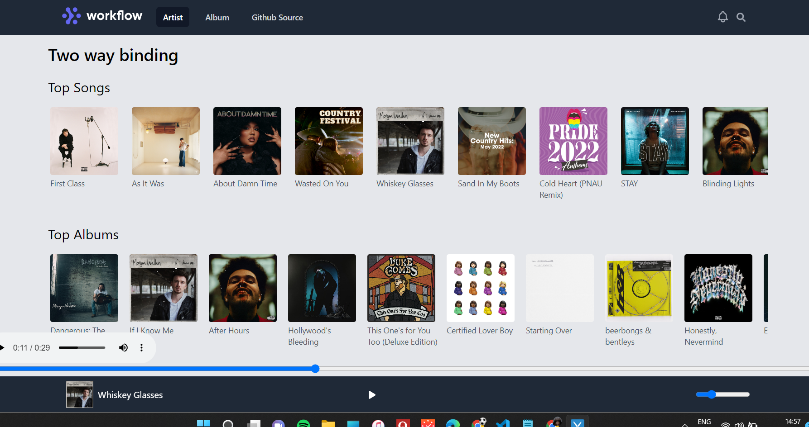
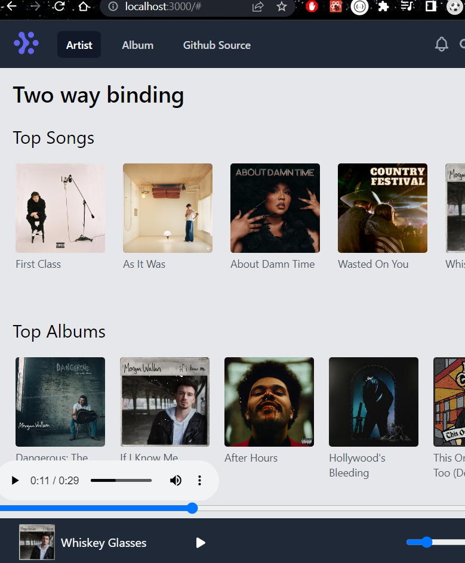
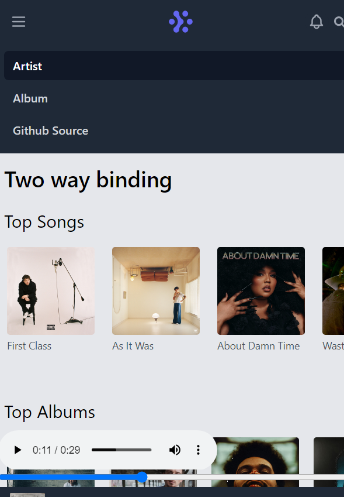
- were maintaining a showMenu state which is going to signify whether/ whether not we want to display the menu items scroll which is in initially hidden behind the icon. Initially we set this state to false, which means its hidden. When were in the small screen size this icon pops up on the top lhs, we set an onClick function when its clicked and we toggle the showMenu state on this. When its clicked this state is set to true and the menu dropdown is shown when the state is set to true, otherwise its hidden, we set this via ternary operators. 
- on the rhs we integrate a search icon, also we integrated a Link tag which would redirect to the Search.js component when clicked upon. We imported the search icon from fontAwesome, but first we set up font awesome with react. 
  - To acheive this we visit this website [](https://fontawesome.com/docs/web/use-with/react/). we download the svg command 
  ```bash
  npm i --save @fortawesome/fontawesome-svg-core
  ```
  - then we added the free icon packages
  ```bash
  npm i --save @fortawesome/free-solid-svg-icons
  npm i --save @fortawesome/free-regular-svg-icons
  ```
  - then we added the font awesome react component 
  ```bash
  npm i --save @fortawesome/react-fontawesome@latest
  ```
  - then we clicked on add some icons, and navigated to this [](https://fontawesome.com/search?m=free) 
  - click on the icon and you'll get an option to import the react icon import. 

> App.js 
- We specified this nested route for search component which is responsible for displaying songs based on the user's search 
```bash
         {/* nested route */}
            <Route path="/search">
              {/* when user search for http:#localhost:3000/search in the search bar it redirects them to the search component*/}
              <Route index element={<Search />} />
              {/* when user search for http:#localhost:3000/search/:query in the search bar it redirects them to the search component*/}
              <Route path=":query" element={<Search />} />
            </Route>
```
- we render the NavigationBar.js component on top and list down all the Routes beneath it, and render the Player.js which is responsible for showing the range and the music load at the very bottom
```bash
const App = _ => {
  return (
    <>
    <div class="bg-gray-200 min-h-screen pb-24">
        <NavigationBar />
        <div className="container mx-auto py-4">
          <Routes>
            <Route path="/" element={<Home />} />
            <Route path="/album/:albumId" element={<Album />} />
            <Route path="/artist/:artistId" element={<Artist />} />
            {/* nested route */}
            <Route path="/search">
              {/* when user search for http:#localhost:3000/search in the search bar it redirects them to the search component*/}
              <Route index element={<Search />} />
              {/* when user search for http:#localhost:3000/search/:query in the search bar it redirects them to the search component*/}
              <Route path=":query" element={<Search />} />
            </Route>

            <Route path="*" element={<NotFound />} />
          </Routes>
        </div>
        <Player />
      </div>
    </>
    );
  }
```
> index.js
- all the configurigation for the routes are done in the index.js. Also we have installed router via npm using this command npm i react-router-dom 
- We have also installed redux using this command (npm i react-redux) and redux-toolkit (npm i @reduxjs/toolkit) since createStore is deprecated were using the new redux method 
- were importing the ConfigureStore method to create the store object to import the reducer present inside slice.js as an argument, furthermore we pass the store object as a prop to the Provider component, which can be retreived in the app via the useSelector hook.
```bash
import React from 'react';
import ReactDOM from 'react-dom/client';
import './index.css';
import App from './App';
import slice from './slice';
import { configureStore } from '@reduxjs/toolkit';
import { Provider } from 'react-redux';
import { BrowserRouter } from 'react-router-dom';

const store = configureStore({ reducer: slice });

const root = ReactDOM.createRoot(document.getElementById('root'));
root.render(
  <Provider store={store}>
    <BrowserRouter>
      <App />
    </BrowserRouter>
  </Provider>
);
```
> Slice.js 
- were specifying the action name and the reducers are defined within it. 
- In the previous version, we had a seperate reducer and action and we'd dispatch actions from the reducer to the store, while in actions we define the method name, in reducer we define the logic for it, in this new redux-toolkit method, were simply defining the reducers within the actions.
```bash
import {createSlice} from '@reduxjs/toolkit';

const slice = createSlice({
  name: 'geektunes-slice',
  #we maintain a state playingTrack with a default value of empty string, 
  initialState: {
    playingTrack: "",
  },
  reducers: {
    #initial state -> state
    changePlayingTrack(state, action) {
      state.playingTrack = action.payload;
    }
  }
});

export const { changePlayingTrack } = slice.actions;
export default slice.reducer;
#when user clicks on an track, it retreives its image id and stores it in the this state playingTrack (TopSongs.js) and this state is retreived in Player.js via useSelector, and its used for setting the same image of the track in the bottom Player as well as to retreive the song from within it 
```
> Home.js 
- Within This component we define the components that will be present on the home page 
```bash
const Home = () => {
  return (
    <>
      <div class="container pl-2">
        <h1 class="text-3xl font-semibold ">Two way binding</h1>
        <br />
        <TopSongs />
        <br />
        <TopAlbums />
        <br />
        <TopArtists />
      </div>
    </>
  )
}
```
> App.css 
- we specify one particular prroperty to hide the horizontal scrollbar 
```bash
::-webkit-scrollbar {
  display: none;
}
```
- In order for this to work, we'll need to ensure that the main targetted div has these properties, and thats technically what we specified in the parent div of the image in TopSongs.js and TopArtists.js 
```bash
overflow-x:auto;
width:100%;
```
#### The main components 
> util.js 
- were creating an axios instance with the napster basic URL embedding in an instance and passing the params to it which is basically the API key defined inside .env 
- were creating a couple more axios instances to render the images from the track ID
```bash
import axios from "axios";

const napster = axios.create({
  baseURL: 'https://api.napster.com/v2.2/',
  timeout: 10000,
  params: {
    apikey: process.env.REACT_APP_API_KEY
  }
});

#get track or album image 
#https://api.napster.com/imageserver/v2/albums/{album_id}/images/{size}.{extension}
const trackImage = albumId => {
  return `https://api.napster.com/imageserver/v2/albums/${albumId}/images/500x500.jpg`;
  #Album image(Top artist song id)
  #itll technically show the album image the song belongs to
}

#For fetching the Artist Image
# we add an api client in util.js for getting artist image 
# GET Artist Images
# Returns a list of licensed images for an artist.
#/v2.2/artists/Art.28463069/images

#we can add size/extension of the image at the end 
#/v2.2/artists/Art.28463069/images/{size}.{extension}
const getArtistImage = artistId => {
  return `https://api.napster.com/imageserver/v2/artists/${artistId}/images/150x100.jpg`;
  #Artist Image(Top artists song id)
}

export {napster, trackImage, getArtistImage};
```
#### Album Component 
> TopAlbum.js 
- Since we want to encorporate the pulsate skeletopn, were managing a state albumList which contains an initial array of 20 elements with all -1 filled elements. 
- were fetching data from this endpoint `/albums/top` to get all the Top Albums and were updating the albumList state with this data. 
- Were passing this state to HorizontalAlbumList.js 

> HorizontalAlbumList.js 
- albums are rendered horizontally here.
- were mapping over the albumlist state and retreiving each album within it and until the data is not retreived its rendering pulse skeleton, otherwise its rendering the images
- in order to retreive the images from the album id were passing the album id within the trackImage axios instance, which is responsible for showing the album image the song belongs to. We;ve encapsulated the image render within a Link redirecting to the Album component. 
```bash
const HorizontalAlbumList = ({ albumList, loadMore, showLoadMore }) => {
  return (
    <>
      <div class="flex flex-nowrap gap-3 mt-4 w-full overflow-x-auto">
        {albumList.map((singleAlbum, idx) => {
          if (singleAlbum === -1) {
            return (
              <div class="flex-none w-32 animate-pulse rounded-lg" key={idx} >
                <div class="bg-slate-700 h-28 w-28"></div>
                <div class="h-2 bg-slate-700 rounded mt-2 w-20 mb-3"></div>
              </div>
            );
          } else {
            return (
              <Link to={`/album/${singleAlbum.id}`} key={idx}>
                <div class="flex-none w-32 cursor-pointer">
                  
                  <p class="m-0 text-sm text-gray-600 pl-1">{singleAlbum.name}</p>
                </div>
              </Link>
            );
          }
        })}
 )
}      
```
> Album.js 
- were retreiving the album id via useParams() from the url and saving it in a object called albumId, and were using this albumId to update the states with different sets of endpoints. 
- were updating the albumDetails state with Album details info `/albums/albumId` and passing it as props to AlbumInfo.js 
- were updating the tracklist state with album tracks `/albums/${albumId}/tracks` and passing it as props from Songlist.js
- were updating the similarAlbumList state with similar albums `albums/${albumId}/similar`and passing it as props to HorizontalAlbumList.js 
- In the useEffect were first seting the similarAlbumList and trackList state as 20 elements with -1 filled elements when the useEffect is first mounted on change of albumId, since we want it to load from scratch everytime this useEffect is mounted.
```bash
const Album = () => {
  const { albumId } = useParams();
  const navigate = useNavigate();
  
  const [albumDetails, setAlbumDetails] = useState({});
  const [trackList, setTrackList] = useState(Array(20).fill(-1));
  const [similarAlbumList, setSimilarAlbumList] = useState(Array(20).fill(-1));
  useEffect(() => {
    setSimilarAlbumList(Array(20).fill(-1));
    setTrackList(Array(20).fill(-1));
    (async _ => {
      try {
         # GET Album Detail
        # Returns detailed information about a given album, including its tracks.

        # /v2.2/albums/Alb.54719066
        const response = await napster.get(`/albums/${albumId}`);
        setAlbumDetails(response.data?.albums[0]);
        console.log(response.data.albums[0]);

         # GET Album Tracks
        # Returns a list of the specified albums tracks.

        # /v2.2/albums/Alb.54719066/tracks
        const tracks_response = await napster.get(`/albums/${albumId}/tracks`);
        setTrackList(tracks_response.data.tracks);

         # GET Similar Albums
        # Returns a list of similar albums for the given album.

        # /v2.2/albums/Alb.42020471/similar
        const similar_response = await napster.get(`albums/${albumId}/similar`);
        setSimilarAlbumList(similar_response.data.albums);

      } catch (e) {
        navigate("/404");
      }
    })();
  }, [albumId])

  return (
    <>
      <AlbumInfo albumDetails={albumDetails} />
      <div className="container mx-auto px-4 relative">

        <div className='py-4'>
          <div className='border-gray-400 w-full border-t'></div>
        </div>

        <SongList list={trackList} />

        {similarAlbumList.length > 1 ? (
          <>
            <p className='text-3xl mt-8'>Similar Albums</p>
            <HorizontalAlbumList albumList={similarAlbumList} />
          </>
        ) : false}

        <p className='text-center mt-5 text-xs text-gray-400'>{albumDetails.copyright}</p>
      </div>
    </>
  )
}
```
- So according to the Album.js component in this herierchy components are rendered on it 
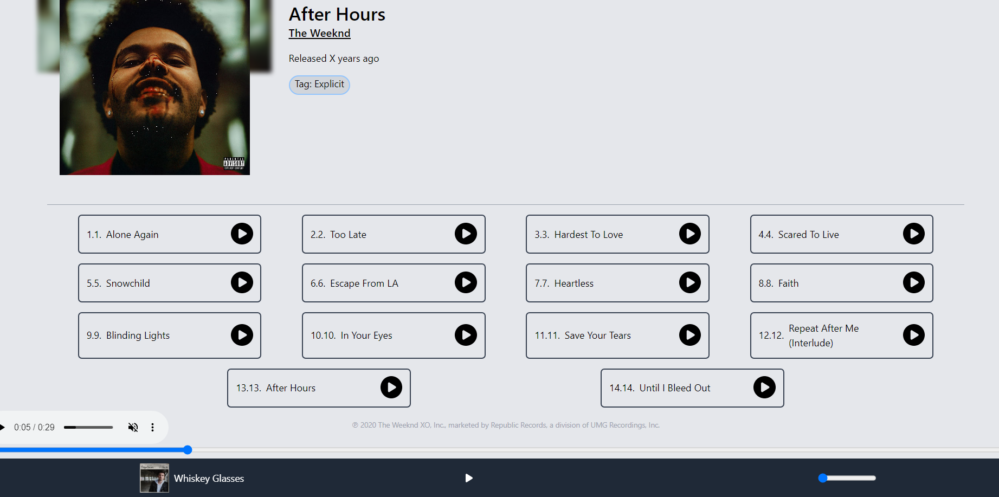
```bash
AlbumInfo.js (The image till tags)
SongList.js  (Song list rendered below it)
HorizontalAlbumList.js (Note that: sometimes there are no similar albums for a particular album ID, in that case nothing will be rendered in here)
```
#### Artist component 
> TopArtists.js 
- were maintaing a state artistList with initial array elements of 20, with -1 filled elements, we run through a useEffect and update the state with API endpoint `/artist/top` which stores top artists in the state. 
- were mapping over the artistList state and retreiving each artist present in the top artists and were rendering the pulse skeleton while the data is not yet fetched into the state and when it is, were displaying the images, also were passing the imageId within the getArtistImage axios client, since we want to retreive the image for the artist and we encapsulate it within a Link tag which redirects the user to the Artist.js component 
```bash
const TopArtists = () => {
  #const [artistList, setArtistList] = useState([]);
  const [artistList, setArtistList] = useState(Array(20).fill(-1));

  #add a useEffect to fetch data from top artists endpoint 
  useEffect(() => {
    (async _ => {
      # GET Top Artists
      # Returns an optionally paged list of the top artists across all of Napster, driven by listening activity.
      # /v2.2/artists/top
      const response = await napster.get('/artists/top');
      setArtistList(response.data.artists);
    })();
  }, []);

  return (
    <>
      <h3 class="text-2xl">Top Artists</h3>
      <div class="flex flex-nowrap gap-3 mt-4 w-full overflow-x-auto">
        {artistList.map((singleArtist, idx) => {
            console.log(singleArtist)
            if (singleArtist === -1) {
              return (
                <div class="flex-none w-32 animate-pulse rounded-lg" key={idx}>
                  <div class="bg-slate-700 h-20 w-28"></div>
                  <div class="h-2 bg-slate-700 rounded mt-2 w-20 mb-3"></div>
                </div>
              );
            } else {
              return (
                <Link to={`/artist/${singleArtist.id}`} key={idx}>
                <div class="flex-none w-32 cursor-pointer">
                  
                  <p class="m-0 text-sm text-gray-600 pl-1">{singleArtist.name}</p>
                </div>
              </Link>
              );
            }
        })}
      </div>
    </>
  )
}
```
> Artists.js 
- were maintaing artistDetails state to update the state with artist/artistId endpoint. The artist details are technically located within this sub-object `response.data.artists[0]`. So we save it in an object named data and update the artistDetails state with it. If data is not present were throwing an error, just so we prevent our app from crashing 
- were maintianing albumList state to retreive top albums for an artist from this endpoint `/artists/${artistId}/albums/top?limit=20`
- were maintaing trackList state to retreive top tracks for an artist and we set the state with the data retreived which is within this sub-object `response.data.tracks`
- Were going to be implementing loadMore functionality over here, in order to do so we'll maintain more states: offset and showloadMore, we'll maintain each for album and track. While offset specifies how many more albums will be increemented to the loadMore. showLoadMore specifies whether the app is given permission to loadMore or not, and this is set by setting the boolean values: true / false. When its set to false, dont load more, when its set to true, load more. 
- were creating a couple more function loadMoreAlbums (for loading more albums) and loadMoreTracks (for loading more tracks) which specify what data should be loaded when user clicks on load more button present inside horizontalAlbumList.js (loads more albums) and SongList.js (load more tracks)
- within loadMoreAlbums were performing a deep copy via spread operators and appending the new data fetched from the api endpoint into setAlbumList state and were increementing the number of album tracks rendered via setoffsetAlbum, were also specifying in the api endpoint then stop showing load more button and that is set by specifying setShowLoadMoreAlbum to false. 
- within loadMoreTracks were performing a deep copy via spread operators and appending the new data fetched from the api endpoint into setTrackList state and were increementing the number of album tracks rendered via setoffsetTrack, were also specifying in the api endpoint then stop showing load more button and that is set by specifying setShowLoadMoreTrack to false.
```bash
const Artist = () => {
  const { artistId } = useParams();
  const navigate = useNavigate();
  
  const [albumList, setAlbumList] = useState(Array(20).fill(-1));
  const [offsetAlbum, setOffsetAlbum] = useState(0);
  #iniitally load More button is shown 
  const [showLoadMoreAlbum, setShowLoadMoreAlbum] = useState(true);

  const [tracksList, setTrackList] = useState(Array(20).fill(-1));
  const [offsetTrack, setOffsetTrack] = useState(0);
  const [showLoadMoreTrack, setShowLoadMoreTrack] = useState(true);

  const [artistDetails, setArtistDetails] = useState({});

  useEffect(() => {
    setAlbumList(Array(20).fill(-1));
    setTrackList(Array(20).fill(-1));
    (async _ => {
      # GET Artist Detail
      # Returns a given artists name, ID and primary genre.

      # /v2.2/artists/Art.28463069
      try {
        const response = await napster.get(`/artists/${artistId}`);
        const data = response.data.artists[0];
        if (data  === undefined) {
          throw "Data is undefined";
        }

        setArtistDetails(data);
        console.log(data);

        # GET Top Albums for an Artist
        # Returns an optionally paged list of the artists most popular albums, sorted descendingly by listening activity.
        # /v2.2/artists/Art.28463069/albums/top?limit=5
        const album_response = await napster.get(`/artists/${artistId}/albums/top?limit=20`);
        setAlbumList(album_response.data.albums);

        # GET Top Tracks for an Artist
        # Returns an optionally paged list of the artist's most popular songs, sorted descendingly by listening activity.

        # /v2.2/artists/Art.28463069/tracks/top?limit=10
        const tracks_response = await napster.get(`artists/${artistId}/tracks/top?limit=20`);
        setTrackList(tracks_response.data.tracks);
        setOffsetTrack(20);
      } catch (e) {
        navigate('/404');
      }
    })();
  }, [artistId, navigate]);

  const loadMoreAlbums = () => {
    const oldState = albumList;
    #increement the new 20 changes in albumList state 
    setAlbumList(e => [...e, ...(Array(20).fill(-1))]);
    (async _ => {
      const album_response = await napster.get(`/artists/${artistId}/albums/top?limit=20&offset=${offsetAlbum}`);
      if (album_response.data.albums.length  === 0) {
        #if there is no element in album_response.data.albums then set the showloadMoreAlbum state to false which means dont load 
        setShowLoadMoreAlbum(false);
      }
      #were deep copying the oldstate and adding the loaded items appended to it 
      setAlbumList([...oldState, ...album_response.data.albums]);
      #ncrease value of elements in the state by 20 
      setOffsetAlbum(e => e + 20);
    })();
  }

  const loadMoreTracks = () => {
    const oldState = tracksList;
    setTrackList(e => [...e, ...(Array(20).fill(-1))]);
    (async _ => {
      const tracks_response = await napster.get(`/artists/${artistId}/tracks/top?limit=20&offset=${offsetTrack}`);
      if (tracks_response.data.tracks.length  === 0) {
        setShowLoadMoreTrack(false);
      }
      setTrackList([...oldState, ...tracks_response.data.tracks]);
      setOffsetTrack(e => e + 20);
    })();
  }

  return (
    <>
      <ArtistInfo artistDetails={artistDetails} />
      <div className="container mx-auto px-4 relative">
        <p className='text-2xl font-semibold mt-4'>Top Albums</p>
        <HorizontalAlbumList albumList={albumList} loadMore={loadMoreAlbums} showLoadMore={showLoadMoreAlbum} />

        <p className='text-2xl font-semibold mt-6 mb-3'>Top Tracks</p>
        <SongList list={tracksList} loadMore={loadMoreTracks} showLoadMore={showLoadMoreTrack} />
      </div>

    </>
  )
}
```
> ArtistInfo.js 
- were specifying the artist name and getting the artist image from the artistDetails state and were rendering the image by retreiving the axios instance getArtistImage 
- were retreiving the description from the artistDetails blurb sub-object, which contains a bunch of random decriptions, so were extracting a random index, returning the artistDetails.blurbs with the random index by passing it in a function randomBlurb and invoking it, so everytime we load the page, a new desc will be rendered. 
```bash
const ArtistInfo = ({ artistDetails }) => {
  const randomBlurb = () => {
    if (artistDetails.blurbs?.length > 0) {
      const randomIdx = Math.floor(Math.random() * artistDetails.blurbs?.length);
      return artistDetails.blurbs[randomIdx];
    }
    return "";
  }

  return (
    <>
      <div className='h-52 sm:w-1/2 md:w-1/3 lg:w-1/3 xl:w-1/4 z-0 -mt-4 blur-sm' style={{ backgroundImage: `url('${getArtistImage(artistDetails.id)}')`, backgroundSize: "cover" }}></div>
      <div className="container mx-auto px-4 -mt-40 z-2 relative">
        

        <div className='sm:inline-block sm:p-8 sm:w-2/5'>
          <p className='text-3xl font-semibold inline -mt-7 sm:mt-0 text-center sm:text-left'>{artistDetails.name}</p>
          <br />
          <div className='inline-block'>
            <p className='text-center sm:text-left mt-4'>{randomBlurb()}</p>
          </div>
        </div>
      </div>
    </>
  )
}
```
> Within Artist.js this is how the components are rendered 
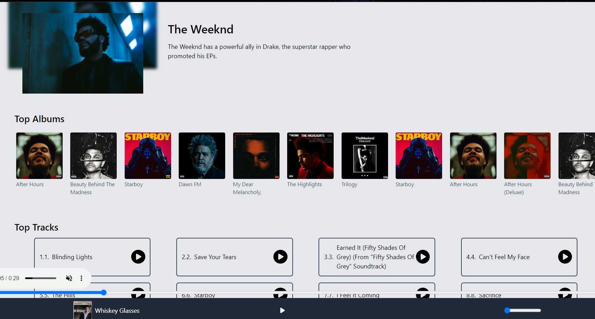
```bash
ArtistInfo.js (were specifying artist info: the image and desc)
HorizontalAlbumList.js (were rendering top albums list over here, along with the load more option to load more albums)
SongList.js (were rendering song lists, along with load more option to load more tracks)
```
> HorizontalAlbum.js 
- albumList, loadMore and showwLoadMore props are retrieved via object destructuring 
- were rendering albums retreived from albumList state in the form of a horizontal scroll
- if loadMoreAlbums function is defined and showLoadMoreAlbum is set to true, then were showing the load more button
```bash
const HorizontalAlbumList = ({ albumList, loadMore, showLoadMore }) => {
  return (
    <>
      <div class="flex flex-nowrap gap-3 mt-4 w-full overflow-x-auto">
        {albumList.map((singleAlbum, idx) => {
          if (singleAlbum === -1) {
            return (
              <div class="flex-none w-32 animate-pulse rounded-lg" key={idx} >
                <div class="bg-slate-700 h-28 w-28"></div>
                <div class="h-2 bg-slate-700 rounded mt-2 w-20 mb-3"></div>
              </div>
            );
          } else {
            return (
              <Link to={`/album/${singleAlbum.id}`} key={idx}>
                <div class="flex-none w-32 cursor-pointer">
                  
                  <p class="m-0 text-sm text-gray-600 pl-1">{singleAlbum.name}</p>
                </div>
              </Link>
            );
          }
        })}
        
        {(loadMore !== undefined) && showLoadMore ? (
          <div onClick={loadMore} class="flex-none w-36 cursor-pointer border-2 hover:border-4 hover:border-blue-400 border-gray-300 rounded-md h-32 flex justify-center items-center">
            <p class="m-0 text-lg pl-1">Load More <FontAwesomeIcon icon={faCircleRight} /></p>
          </div>
        ) : false}
      </div>
    </>
  )
}
```
> SongList.js 
- list, loadMore and showwLoadMore props are retrieved from Artist.js via object destructuring 
- tracks are retreived from trackList state via map and passed to SingleTrackCard.js component 
- if loadMoreTracks function is defined and showLoadMoreTracks is set to true, then were showing the load more button
```bash
#showImages prop is retreived from TracksTab.js 
const SongList = ({ list, loadMore, showLoadMore, showImages }) => {
  return (
    <>
      <div className='flex gap-4 flex-wrap justify-evenly items-stretch'>
        {list.map((singleTrack, idx) => {
          if (singleTrack === -1) {
            return (
              <>
                <div className='w-full sm:w-5/12 md:w-1/4 lg:w-1/5 h-14 min-h-14 border-gray-700 border-2 rounded-md flex items-center'>
                  <div class="h-6 ml-2 animate-pulse bg-slate-700 rounded-full w-8"></div>
                  <div class="h-6 ml-4 animate-pulse bg-slate-700 rounded-full w-48"></div>
                  <div class="h-10 ml-auto animate-pulse bg-slate-700 rounded-full w-10 mr-3"></div>
                </div>
              </>
            );
          } else {
            return (
              # <SingleTrackCard key={idx} index={idx + 1} trackDetail={singleTrack} />
              <SingleTrackCard key={idx} index={idx + 1} trackDetail={singleTrack} showImage={showImages} />
         
            );
          }
        })}
        
        {(loadMore !== undefined) && showLoadMore ? (
          <div onClick={loadMore} class="w-full sm:w-5/12 md:w-1/4 lg:w-1/5 min-h-14 flex-none cursor-pointer border-2 border-gray-700 rounded-md flex justify-center items-center hover:border-blue-700 hover:bg-blue-100">
            <p class="m-2 text-xl pl-1">Load More &nbsp; <FontAwesomeIcon icon={faCircleRight} /></p>
          </div>
        ) : false}
      </div>
    </>
  )
}
```
> SingleTrackCard.js 
- were rendering individual cards with their own equalizer in Artist.js 
- When the div is clicked, playSong function is invoked, which dispatched the song id to the store
- were retreiving the state from redux via useSelector and saving in an object isPlaying 
- When isPlaying state is true we want to render AudioWave component otherwise we want to render play icon imported from font awesome
- When showImage boolean is true we want to render the album image on the player.js 
```bash
const SingleTrackCard = ({trackDetail, index, showImage}) => {
  const dispatch = useDispatch();
  #card          - parent 
    #play button - child 

  #due to event bubbling, when child div is clicked its shown in this order: child -> parent.

  #when user clicks on the card we want the music to play 
  const isPlaying = useSelector(state => state.playingTrack === trackDetail.id);


  const playSong = () => {
    dispatch(changePlayingTrack(trackDetail.id));
  }

  return (
    <>
    {/*
        sm:w-5/12 	width: 41.666667%;
        md:w-1/4    width: 25%;
        lg:w-1/5    width: 20%;
    */}

    {/* were placing the event handler in the parent div, because when we click on the parent div, the changes will automatically propogate to the child div */}
      <div onClick={playSong} className={`w-full sm:w-5/12 md:w-1/4 lg:w-1/5 border-2 flex items-center hover:bg-blue-100 hover:border-blue-700 ${isPlaying ? "border-blue-700 bg-blue-100" : "border-gray-700"} rounded-md p-3 cursor-pointer`}>
        <span>{index}.</span>

        {showImage ? (
          
        ) : (
          <span>{index}.</span>
        )}

        <span className='ml-2'>{trackDetail.name}</span>
        {/* when isPlaying state is true, we want to display the equalizer gif file (transparent sound wave animation small) other show the play icon */}
        {/* we downloaded the equalizer and run it through a background gif remove background and paste it in the src folder*/}
        {isPlaying ? (
          # 
          <div className='h-9 w-9 mr-2 ml-auto inline-block'>
            <AudioWave />
          </div>
        ) : (
          <span className='text-4xl ml-auto justify-self-end -mt-1 cursor-pointer hover:text-blue-500'><FontAwesomeIcon icon={faCirclePlay} /></span>
        )}
      </div>
    </>
  )
}
```
#### AudioWave 
we copy pasted the js and css content from here 
[](https://codepen.io/rachelmcgrane/pen/VexWdX)
- AudioWave.js 
- AudioWave.css


### Top Songs 
> TopSongs.js 
- were maintaing state to update it with top tracks of an artist 
- when the tracks in this component is clicked were dispatching the actions, which is then retreived in useSelector in Player.js where the trackId is recieved, the image of the track is rendered on the player, the song is played, paused etc
- Note that: we had to dispatch actions here and not in TopAlbums or TopArtists since when we click on them we are being redirected to a new component. So were technically dispatching the actions and retreiving the state where the songs are rendered. For instance, in both TopAlbums and TopArtists songs were rendered in SingleTrackCard.js component.
```bash
const TopSongs = () => {
  #const [trackList, setTrackList] = useState([]);

  #were filling the entire array with -1 initially with a size of 20
  const [trackList, setTrackList] = useState(Array(20).fill(-1));
  const dispatch = useDispatch();

  useEffect(() => {
    (async _ => {
    # GET Top Tracks for an Artist
    # Returns an optionally paged list of the artist's most popular songs, sorted descendingly by listening activity.

    # /v2.2/artists/Art.28463069/tracks/top
      const response = await napster.get('/tracks/top');
      console.log(response)
      setTrackList(response.data.tracks);
    })();
  }, []);

  return (
    <>
      <h3 className="text-2xl">Top Songs</h3>
      {/*  we added overflow scroll and w-full with flex no wrap to allign all the scroll items  */}
      {/* in order to integrate scroll without scrollbar, we add overflow-auto here and in App.css we added webkit:scrollbar {display: none;} */}
      <div className="flex flex-nowrap gap-4 mt-4 w-full overflow-x-auto">
        {trackList.map((singleTrack, idx) => {
          #when singleTrack is -1, it means the data is not yet retreived from the API endpoint, thats when were rendering a pulsate effect instead
         if (singleTrack === -1) {
          return (
            <div class="flex-none w-32 animate-pulse rounded-lg" key={idx}>
              <div class="bg-slate-700 h-28 w-28"></div>
              <div class="h-2 bg-slate-700 rounded mt-2 w-20 mb-3"></div>
            </div>
          );
        } else {
          return (
             # we need to get the album image for the track
            #we'll need to set the id to retreive the specific track image

            #https://api.napster.com/v2.2/artists/Art.28463069/tracks/top?apikey=YTkxZTRhNzAtODdlNy00ZjMzLTg0MWItOTc0NmZmNjU4Yzk4
            <div class="flex-none w-32 cursor-pointer" key={idx} onClick={_ => dispatch(changePlayingTrack(singleTrack.id))}>
              {/* we passed the id of the image as an argument to trackImage */}
              
              <p class="m-0 text-sm text-gray-600 pl-1">{singleTrack.name}</p>
            </div>
          );
        }
        })}

        {/* we imported flexbox nd grid https://tailwindcss.com/docs/flex#initial*/}
        {/* <div class="flex-none w-32">
          
        </div>
        <div class="flex-none w-32">
          
        </div><div class="flex-none w-32">
          
        </div><div class="flex-none w-32">
          
        </div><div class="flex-none w-32">
          
        </div> */}
      </div>
    </>
  )
}
```
#### Player component 
- In order to render the music for a particular song, we'll need to retreive the trackId from the redux store via useSelector. Now in order to play the song for the particular trackId, we must first retreive the object which is responsible for playing the song in this case its previewUrl 
- were managing a state isPlaying which indiates whether the song is playing or not, a currentTime state which indicates where is the knob in the player range, a volume state which denotes the volume, a track state to retreive all the track details from /tracks/trackId endpoint 
- were also maintaing an audioPlayer ref object which is responsible for adding audio HTML properties on the player.js 
- were achieving 2 way binding, by syncing the audio controls and the player range
```bash
#GET Track Detail
# Returns detailed information about a track or tracks, including artist and album and genre information.
# /v2.2/tracks/tra.51565284

# https://api.napster.com/v2.2/tracks/tra.5156528?apikey=YTkxZTRhNzAtODdlNy00ZjMzLTg0MWItOTc0NmZmNjU4Yzk4

#we copies the json data from this endpoint and placed in inside the response object 

#well need to target the previewURL property which is in this path response.tracks[0]
const response = { "meta": { "totalCount": null, "returnedCount": 1 }, "tracks": [{ "type": "track", "id": "tra.5156528", "index": 7, "disc": 1, "href": "https://api.napster.com/v2.2/tracks/tra.5156528", "playbackSeconds": 258, "isExplicit": false, "isStreamable": false, "isAvailableInHiRes": false, "name": "Say It Ain't So", "isrc": "USIR10400084", "shortcut": "weezer/weezer-blue-album-deluxe-edition/say-it-aint-so", "amg": "6907998", "blurbs": [], "artistId": "art.954", "artistName": "Weezer", "albumName": "Weezer (Blue Album) (Deluxe Edition)", "formats": [{ "type": "format", "bitrate": 320, "name": "AAC", "sampleBits": 16, "sampleRate": 44100 }, { "type": "format", "bitrate": 192, "name": "AAC", "sampleBits": 16, "sampleRate": 44100 }, { "type": "format", "bitrate": 128, "name": "MP3", "sampleBits": 16, "sampleRate": 44100 }, { "type": "format", "bitrate": 64, "name": "AAC PLUS", "sampleBits": 16, "sampleRate": 44100 }], "losslessFormats": [{ "type": "format", "bitrate": 44100, "name": "FLAC", "sampleBits": 16, "sampleRate": 44100 }], "albumId": "alb.5153820", "isAvailableInAtmos": false, "contributors": { "primaryArtist": "art.954" }, "links": { "artists": { "ids": ["art.954"], "href": "https://api.napster.com/v2.2/artists/art.954" }, "albums": { "ids": ["alb.5153820"], "href": "https://api.napster.com/v2.2/albums/alb.5153820" }, "genres": { "ids": ["g.1053", "g.1050", "g.5"], "href": "https://api.napster.com/v2.2/genres/g.1053,g.1050,g.5" }, "tags": { "ids": ["tag.152196498"], "href": "https://api.napster.com/v2.2/tags/tag.152196498" } }, "previewURL": "https://listen.hs.llnwd.net/g2/prvw/4/2/4/9/8/911189424.mp3" }] };

  #we create a track object to target previewURL which contains the mp3 song file 
const track = response.tracks[0];


const Player = () => {
  #this state specifies whether the song is playing or not (true or false)4
  #were toggling the play/pause button via this state 
  const [isPlaying, setIsPlaying] = useState(false);

  #where is the current knob in the player range? that is the current time 
  const [currentTime, setCurrentTime] = useState(0);

  #create a state for volume, which will track the current volume via a range
  #the volume property takes value from 0 to 1
  #https://developer.mozilla.org/en-US/docs/Web/API/HTMLMediaElement/volume
  const [volume, setVolume] = useState(0.25);

  ##were setting the current location of the music mp3 file in the song/track object 
  const audioPlayer = useRef();
  const [track, setTrack] = useState({});
  const trackId = useSelector(state => state.playingTrack);

  useEffect(() => {
       # GET Track Detail
      # Returns detailed information about a track or tracks, including artist and album and genre information.

      # /v2.2/tracks/tra.5156528
    (async _ => {
      #if there's nothing in the trackId, when page is initially loaded return false 
      if (trackId === "") {
        return false;
      }

      # assume we clicked on a track from TopSongs.js and its already playing, and we clicked on it again, now when we reclick on it, it doesnt play. why? because the state is not updated

      #so everytime this useEffect runs on trackId change we'll want to set the playing of the previous track to false 
      setIsPlaying(false);

      const response = await napster.get(`/tracks/${trackId}`);
      setTrack(response.data?.tracks[0]);
      console.log(response.data?.tracks[0]);
      #were retreiving the location of the mp3 file for the specific track id passed 
      audioPlayer.current.src = response.data?.tracks[0]?.previewURL;
      #setting the song playing option at Player.js as true 
      setIsPlaying(true);
    })();
  }, [trackId]);

#toggling the isPlaying state when user clicks on it 
  const togglePlayPause = () => {
    setIsPlaying(e => !e);
  }

  
  #we create a mutation observer: mutation observer observes change of object in the dom - over here were observing it using ref 
  #run this useEffect whenever any change to isPlaying state occurs 
  useEffect(() => {
    if (isPlaying) {
      #when isPlaying state is true, then play the song, by targetting it via useRef() current property 
      audioPlayer.current.play();
    } else {
      #when isPlaying state is false, then pause the song, by targetting audioPlayer via useRef() current property 
      audioPlayer.current.pause();
    }
  }, [isPlaying]);
 #This is for 2 way binding (works both in controls and player.js), in the TogglePlayPause function we changed the state, in this useEffect were integrating the play/pause changes in player range as well.

  # currentTime property specifies the current playback time in seconds.
  #were updating the currentTime state when audio tag is triggered
  const playerCurrentTimeUpdate = e => {
    const currentTime = e.target.currentTime;
    setCurrentTime(currentTime);
  }

  const changeCurrentTime = e => {
     #To change the currentTime, were extracting its present value 
    const currentTime = e.target.value;
     #setting its present value 
    setCurrentTime(currentTime);
    #specifying the currentTime to the audioPlayer, so both our controls and player range are synced while the music is playing 
    audioPlayer.current.currentTime = currentTime;
  }

   #were setting the volume by targetting the current value of volume passed which can be from 0 to 1 
  const changeVolume = e => {
    const volume = e.target.value;
    setVolume(volume);
  }
#everytime any change occurs in the volume state, run this useEffect
  #here were setting the volume property by targetting audioPlayer via useRef() current property 
  useEffect(() => {
    audioPlayer.current.volume = volume;
  }, [volume])
  #This is for 2 way binding (works both in controls and player.js), in the changeVolume function we changed the state, in this useEffect were integrating the volume changes in player range as well.

  return (
    <>
      {/* we added another navigation bar component to the bottom  */}
    {/* we cleaned up all the nav content, we added classes to fix it to the bottom and fixed the width to 100% (w-full) */}

    {/* if trackid is empty then dont show the player (hidden class) */}
    <footer className={`fixed bottom-0 w-full ${trackId === "" ? "hidden" : ""}`}>
         {/* were using Player.js as a proxy to send data to the control that is hidden */}
         {/* <audio ref={audioPlayer} onTimeUpdate={playerCurrentTimeUpdate}></audio> */}

           {/* while we were building the logic, we kept controls visible, but now we removed it from the audio tag */}
        <audio controls ref={audioPlayer} onTimeUpdate={playerCurrentTimeUpdate}>
        </audio>
         {/* while playercurrenttimeupdate() is responsible for setting the current time
         changecurrenttime() is responsible for changing the current time as the range changes */}
        
        {/* we added input type range to integrate the player range scroll  */}
        {/* when the value of the range is changed, were passing the currentTime to the function changeCurrentTime */}
        <input type="range" className="w-full -mb-4" value={currentTime} max={30} onChange={changeCurrentTime} />
        <div className='bg-gray-800'>
          <div className="max-w-7xl mx-auto px-2 sm:px-6 lg:px-8">
            <div className="relative flex items-center justify-between h-16">
               {/* div 1 */}
              <div className="absolute inset-y-0 left-0 flex items-center">
                  {/*  */}

                {/* when the user clicks on the image its also setting dyanamic image in the player.js */}
                
                  {/* <h3 class="text-white">Song Name</h3> */}

                  {/* when user clicks on the name its also setting dyanamic name in player.js */}
                <h3 class="text-white">{track?.name}</h3>
              </div>
              {/* div 2 */}
              {/* when the isPlaying state is true, song is paused
              when its false, song is played
              
              iniitally the state is false (music paused), when user clicks on the button, its toggled to true (music played)*/}
              <div className="flex-1 flex items-center justify-center">
                <button className='text-white z-50' onClick={togglePlayPause}>
                  {/* {isPlaying ? "Pause" : "Play"} */}

                  {/* instead of printing pause and play on toggle, we print these icons instead */}
                
                {/* when isPlaying state is true, it means that the audio is playing and thats why wemust display the Pause icon to the user, giving user the control to pause the song */}
                  {isPlaying ? (
                    <FontAwesomeIcon  icon={faPause} />
                  ) : (
                    <FontAwesomeIcon icon={faPlay} />
                  )}
                </button>
              </div>
               {/* div 3 */}
              {/* were setting the volume range here, since max value of volume property is 1 were specifying that, were also specifying that we want the music volume to incrrement everytime user scrolls 0.01 step in the range */}
              <div className="absolute inset-y-0 right-0 flex items-center pr-2 sm:static sm:inset-auto sm:ml-6 sm:pr-0">
                <input className='w-24' type="range" value={volume} onChange={changeVolume} max={1} step={0.01} />
              </div>
            </div>
          </div>
        </div>
      </footer>
    </>
  )
}
```
#### Search Component 
- were acheiving tab navigation here by adding buttons and their respective ternary conditions and redirecting to specific components 
```bash
const Search = () => {
  const [tab, setTab] = useState(1);

  return (
    <>
      <div className='container mx-auto px-4'>
        <SearchForm />
        <div className='py-4'>
          <div className='border-gray-400 w-full border-t'></div>
        </div>
        <div className='container flex flex-wrap gap-4 justify-center my-4'>
          <button className={`p-2 px-4 border-2  rounded-full font-semibold ${tab === 1 ? "border-blue-400 text-blue-900 bg-blue-100" : "border-gray-400 hover:bg-blue-50 hover:border-blue-200"}`} onClick={_ => setTab(1)}>Tracks</button>
          <button className={`p-2 px-4 border-2  rounded-full font-semibold ${tab === 2 ? "border-blue-400 text-blue-900 bg-blue-100" : "border-gray-400 hover:bg-blue-50 hover:border-blue-200"}`} onClick={_ => setTab(2)}>Albums</button>
          <button className={`p-2 px-4 border-2  rounded-full font-semibold ${tab === 3 ? "border-blue-400 text-blue-900 bg-blue-100" : "border-gray-400 hover:bg-blue-50 hover:border-blue-200"}`} onClick={_ => setTab(3)}>Artists</button>
        </div>
        <div className='container mt-8'>
          {tab === 1 ? <TracksTab /> : tab === 2 ? <AlbumsTab /> : <ArtistsTab />}
        </div>
      </div>
    </>
  )
}
```
> SearchForm.js 
- were creating a form onSubmit it will invoke the search function which is responsible to navigate to the search component 
- the inputs were taking in the form are stored into another ref object known as inputRef, however the default value of the input field is query state which is retreived from retreiving the current id value from useParams(). 
- were passing the query user entered in the url of search component `/search/${inputRef.current.value}`
```bash
const SearchForm = () => {
  const inputRef = useRef();
  const navigate = useNavigate();
  const {query} = useParams();

  const search = e => {
    e.preventDefault();
    navigate(`/search/${inputRef.current.value}`);
  }

  return (
    <form onSubmit={search}>
      <div className='flex justify-center gap-5 flex-wrap my-3'>
        <input className='px-2 outline-3 outline-blue-300 focus:outline-blue-700 outline rounded-sm' type="text" ref={inputRef} placeholder="What's on your mind..." defaultValue={query} />
        <button type="submit" className='border-2 border-gray-500 p-1 px-2 rounded-md hover:border-blue-700 hover:bg-blue-100 cursor-pointer'>
          Magical Search <FontAwesomeIcon icon={faMagicWandSparkles} />
        </button>
      </div>
    </form>
  )
}
```
> TracksTab.js 
- were creating loadMore and showLoadMore functionality for rendering search query items, while the query user entered is retreived from defaultValue attribute of input tag from searchForm.js. 
- when useEffect is rendered, it first checks if query is undefined or empty, if its so, then we set the setTrackList state to empty array, which means it wont render any results, if query has nothing inside it. update the response object with the api data from the endpoint [Full-Text Search](/v2.2/search?query=weezer&per_type_limit=5&offset=5) Returns an array of typed results by keyword or keyword combination. Note that: through this endpoint we can set the type as albums / artists / tracks. In this component we'll set type: tracks. 
- were passing showImages state as true, to the SingleTrackCard.js where all the songs with the image and equalizer is rendered. 
```bash
const TracksTab = () => {
  const { query } = useParams();
  const [trackList, setTrackList] = useState(Array(20).fill(-1));
  const [offset, setOffset] = useState(0);
  const [showMore, setShowMore] = useState(false);

  useEffect(() => {
    if(query === undefined || query === "") {
      setTrackList([]);
      return;
    }
    setTrackList(Array(20).fill(-1));
    setOffset(0);
    (async _ => {
      try {
        // Returns an array of typed results by substring.
        // /v2.2/search?query=weezer&per_type_limit=5&offset=5
        const response = await napster.get(`/search?query=${query}&type=track&per_type_limit=20&offset=0`);
        // setTrackList(response.data.tracks);
        setTrackList(response.data.search.data.tracks);
        setOffset(20);
        setShowMore(true);
      } catch(e) {
        setTrackList([]);
      }
    })();
  }, [query]);

  const loadMore = () => {
    const oldState = trackList;
    setTrackList(e => [...e, ...(Array(20).fill(-1))]);
    (async _ => {
      // Returns an array of typed results by substring.
      // /v2.2/search?query=weezer&per_type_limit=5&offset=5
      const response = await napster.get(`/search?query=${query}&type=track&per_type_limit=20&offset=${offset}`);
      if (response.data.search.data.tracks === 0) {
        setShowMore(false);
      }
      setTrackList([...oldState, ...response.data.search.data.tracks]);
      setOffset(e => e + 20);
    })();
  }

  return (
    <>
      <SongList list={trackList} loadMore={loadMore} showLoadMore={showMore} showImages={true} />
    </>
  )
}
```
> SingleTrackCard.js 
```bash
const SingleTrackCard = ({trackDetail, index, showImage}) => {
  const dispatch = useDispatch();
  //card          - parent 
    //play button - child 

  //due to event bubbling, when child div is clicked its shown in this order: child -> parent.

  //when user clicks on the card we want the music to play 
  const isPlaying = useSelector(state => state.playingTrack === trackDetail.id);


  const playSong = () => {
    dispatch(changePlayingTrack(trackDetail.id));
  }

  return (
    <>
    {/*
        sm:w-5/12 	width: 41.666667%;
        md:w-1/4    width: 25%;
        lg:w-1/5    width: 20%;
    */}

    {/* were placing the event handler in the parent div, because when we click on the parent div, the changes will automatically propogate to the child div */}
      <div onClick={playSong} className={`w-full sm:w-5/12 md:w-1/4 lg:w-1/5 border-2 flex items-center hover:bg-blue-100 hover:border-blue-700 ${isPlaying ? "border-blue-700 bg-blue-100" : "border-gray-700"} rounded-md p-3 cursor-pointer`}>
        <span>{index}.</span>

        {showImage ? (
          
        ) : (
          <span>{index}.</span>
        )}

        <span className='ml-2'>{trackDetail.name}</span>
        {/* when isPlaying state is true, we want to display the equalizer gif file (transparent sound wave animation small) other show the play icon */}
        {/* we downloaded the equalizer and run it through a background gif remove background and paste it in the src folder*/}
        {isPlaying ? (
          // 
          <div className='h-9 w-9 mr-2 ml-auto inline-block'>
            <AudioWave />
          </div>
        ) : (
          <span className='text-4xl ml-auto justify-self-end -mt-1 cursor-pointer hover:text-blue-500'><FontAwesomeIcon icon={faCirclePlay} /></span>
        )}
      </div>
    </>
  )
}
```
> ALbumsTab.js 
```bash
import { useEffect, useState } from 'react';
import { useParams } from 'react-router-dom';
import { napster } from '../util';
import SongList from './SongList';
import AlbumList from './AlbumList'

const AlbumTab = () => {
  const { query } = useParams();
  const [trackList, setTrackList] = useState(Array(20).fill(-1));
  const [offset, setOffset] = useState(0);
  const [showMore, setShowMore] = useState(false);

  useEffect(() => {
    if(query === undefined || query === "") {
      setTrackList([]);
      return;
    }
    setTrackList(Array(20).fill(-1));
    setOffset(0);
    (async _ => {
      try {
        // Returns an array of typed results by substring.
        // /v2.2/search?query=weezer&per_type_limit=5&offset=5
        const response = await napster.get(`/search?query=${query}&type=album&per_type_limit=20&offset=0`);
        // setTrackList(response.data.tracks);
        setTrackList(response.data.search.data.albums);
        setOffset(20);
        setShowMore(true);
      } catch(e) {
        setTrackList([]);
      }
    })();
  }, [query]);

  const loadMore = () => {
    const oldState = trackList;
    setTrackList(e => [...e, ...(Array(20).fill(-1))]);
    (async _ => {
      // Returns an array of typed results by substring.
      // /v2.2/search?query=weezer&per_type_limit=5&offset=5
      const response = await napster.get(`/search?query=${query}&type=album&per_type_limit=20&offset=${offset}`);
      if (response.data.search.data.albums === 0) {
        setShowMore(false);
      }
      setTrackList([...oldState, ...response.data.search.data.albums]);
      setOffset(e => e + 20);
    })();
  }

  return (
    <>
      {/* <SongList list={trackList} loadMore={loadMore} showLoadMore={showMore}  showtrackImages={true}  /> */}
      {/* were rendering AlbumTab and ArtistTab in their own individual components unlike TrackTab which goes from SonGlist -> SingleTrackCard.js  */}
      <AlbumList albumList={trackList} horizontal={false} loadMore={loadMore} showLoadMore={showMore}  />
    </>
  )
}

export default AlbumTab
```
> AlbumList.js 
- were retreiving props from AlbumsTab.js and were rendering the images of the state in here. 
```bash
const AlbumList = ({ albumList, loadMore, showLoadMore, horizontal=true }) => {
  return (
    <>
      <div class={`flex gap-3 mt-4 w-full overflow-x-auto ${horizontal ? "flex-nowrap" : "flex-wrap justify-evenly"}`}>
        {albumList.map((singleAlbum, idx) => {
          if (singleAlbum == -1) {
            return (
              <div class="flex-none w-32 animate-pulse rounded-lg" key={idx} >
                <div class="bg-slate-700 h-28 w-28"></div>
                <div class="h-2 bg-slate-700 rounded mt-2 w-20 mb-3"></div>
              </div>
            );
          } else {
            return (
              <Link to={`/album/${singleAlbum.id}`} key={idx}>
                <div class="flex-none w-32 cursor-pointer">
                  
                  <p class="m-0 text-sm text-gray-600 pl-1">{singleAlbum.name}</p>
                </div>
              </Link>
            );
          }
        })}
        {(loadMore !== undefined) && showLoadMore ? (
          <div onClick={loadMore} class="flex-none w-36 cursor-pointer border-2 hover:border-4 hover:border-blue-400 border-gray-300 rounded-md h-32 flex justify-center items-center">
            <p class="m-0 text-lg pl-1">Load More <FontAwesomeIcon icon={faCircleRight} /></p>
          </div>
        ) : false}
      </div>
    </>
  )
}
```
> ArtistTabs.js 
```bash
const ArtistsTab = () => {
  const { query } = useParams();
  const [trackList, setTrackList] = useState(Array(20).fill(-1));
  const [offset, setOffset] = useState(0);
  const [showMore, setShowMore] = useState(false);

  useEffect(() => {
    if(query === undefined || query === "") {
      setTrackList([]);
      return;
    }
    setTrackList(Array(20).fill(-1));
    setOffset(0);
    (async _ => {
      try {
        // Returns an array of typed results by substring.
        // /v2.2/search?query=weezer&per_type_limit=5&offset=5
        const response = await napster.get(`/search?query=${query}&type=artist&per_type_limit=20&offset=0`);
        setTrackList(response.data.search.data.artists);
        setOffset(20);
        setShowMore(true);
      } catch(e) {
        setTrackList([]);
      }
    })();
  }, [query]);

  const loadMore = () => {
    const oldState = trackList;
    setTrackList(e => [...e, ...(Array(20).fill(-1))]);
    (async _ => {
      // Returns an array of typed results by substring.
      // /v2.2/search?query=weezer&per_type_limit=5&offset=5
      const response = await napster.get(`/search?query=${query}&type=artist&per_type_limit=20&offset=${offset}`);
      if (response.data.search.data.artists=== 0) {
        setShowMore(false);
      }
      setTrackList([...oldState, ...response.data.search.data.artists]);
      setOffset(e => e + 20);
    })();
  }

  return (
    <>
      <ArtistList list={trackList} loadMore={loadMore} showLoadMore={showMore}  horizontal={false} />
    </>
  )
}
```
> ArtistList.js 
```bash
const ArtistList = ({ list, loadMore, showLoadMore, horizontal = true }) => {
  return (
    <div class={`flex gap-3 mt-4 w-full overflow-x-auto ${horizontal ? "flex-nowrap" : "flex-wrap justify-evenly"}`}>
      {list.map((singleArtist, idx) => {
        if (singleArtist == -1) {
          return (
            <div class="flex-none w-32 animate-pulse rounded-lg" key={idx}>
              <div class="bg-slate-700 h-20 w-28"></div>
              <div class="h-2 bg-slate-700 rounded mt-2 w-20 mb-3"></div>
            </div>
          );
        } else {
          return (
            <Link to={`/artist/${singleArtist.id}`} key={idx}>
              <div class="flex-none w-32 cursor-pointer">
                
                <p class="m-0 text-sm text-gray-600 pl-1">{singleArtist.name}</p>
              </div>
            </Link>
          );
        }
      })}
      {(loadMore !== undefined) && showLoadMore ? (
        <div onClick={loadMore} class="flex-none w-36 cursor-pointer border-2 hover:border-4 hover:border-blue-400 border-gray-300 rounded-md h-32 flex justify-center items-center">
          <p class="m-0 text-lg pl-1">Load More <FontAwesomeIcon icon={faCircleRight} /></p>
        </div>
      ) : false}
    </div>
  )
}
```
# The App structure 
### Home.js 
> TopSongs.js 
> TopAlbums.js -> AlbumList.js 
- Album.js 
  - AlbumInfo.js 
  - SongList.js 
  - AlbumList.js 
> TopArtists.js 
- Artists.js 
  - ArtistsInfo.js 
  - AlbumList.js 
  - SongList.js -> SingleTrackCard.js
> Player.js

### Search.js 
> Search.js 
  - Searchform.js 
  - TracksTab -> SongList.js -> SingleTrackCard.js 
  - AlbumsTab -> AlbumList.js 
  - ArtistTab -> ArtistList.js 

> for rendering the images we have a seperate component -> Image.js
> AlbumList.js is same as HorizontalList.js, we simply renamed it to AlbumList


### Deployed Link 
> Note: styling is not done in this app, to work on the styling refer to the deployed link of geektunestwo


