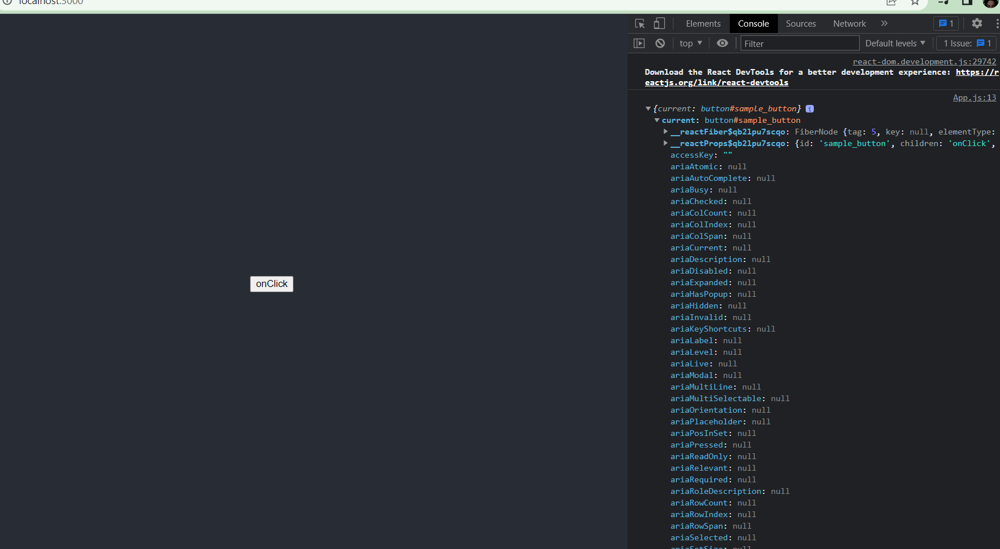
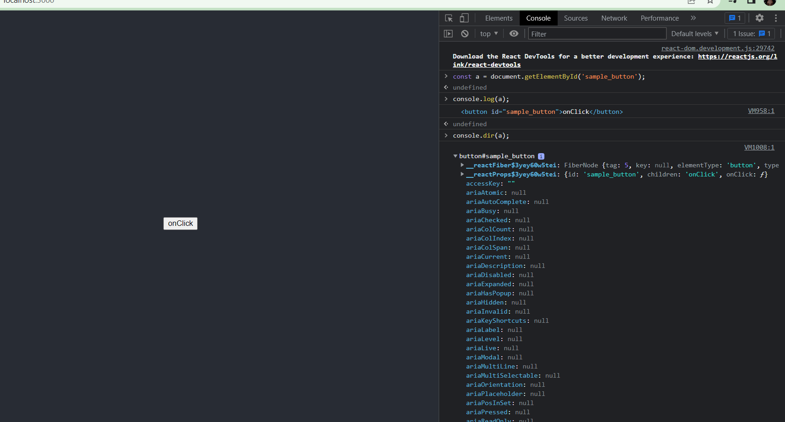
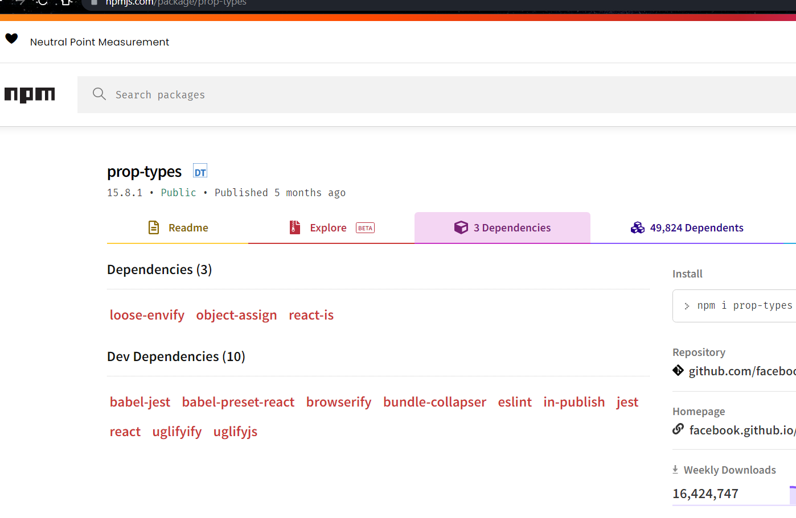
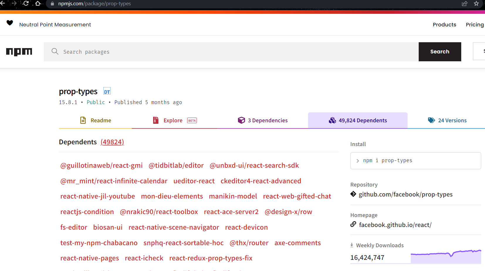

### useRef 
- Lets say there is a need for us to refer to the actual DOM, which is not directly allowed in react. 

- useRef hook allows access to the actual DOM directly but its a provision from react (its a react built in hook)

- React says dont access it direcly using DOM event handlers as you would in JavaScript. In order to use the value you need to do `.current`

> What would happen if we accessed the DOM directly in react? 
DOM even handlers will bypass the virtual DOM, as in it will directly go to the actual DOM 

Our DOM event handlers will directly register with the actual DOM (normally react elements are registered in virtual DOM first and then they are compared with the actual DOM, everything inside virtual DOM is placed into the actual DOM), thats why when react does its virtual DOM vs actual DOM comparison, its already seen a change in the actual DOM, so it tries to placce the default virtual DOM into the actual DOM, over here either two things can happen:
1. your entire application will mostly crash , or 
2. react will forcefully overwrite the default virtual DOM (changes you made) over the actual DOM, so technically the changes you made becomes irrelevant. 

useRef allows you to take reference of the DOM in react.

> an example of useRef 
```bash
import {useRef} from 'react'

function App() {
  #useRef gives low level access of the DOM 
  const buttonRef = useRef(null)

  return (
    <div className="App">
      <header className="App-header">
         #we recieve an object inside which we have a current object
         <button ref={buttonRef} onClick={_ => console.log(buttonRef)} id='sample_button'>onClick</button>
      </header>
    </div>
  );
}

export default App;
```

```bash
{current: button#sample_button}
current: button#sample_button
__reactFiber$trai1m1zk4: FiberNode {tag: 5, key: null, elementType: 'button', type: 'button', stateNode: button#sample_button, …}
__reactProps$trai1m1zk4: {id: 'sample_button', children: 'onClick', onClick: ƒ}
accessKey: ""
ariaAtomic: null
ariaAutoComplete: null
ariaBusy: null
ariaChecked: null
ariaColCount: null
ariaColIndex: null
ariaColSpan: null
ariaCurrent: null
ariaDescription: null
ariaDisabled: null
ariaExpanded: null
ariaHasPopup: null
ariaHidden: null
ariaInvalid: null
ariaKeyShortcuts: null
ariaLabel: null
ariaLevel: null
ariaLive: null
ariaModal: null
ariaMultiLine: null
ariaMultiSelectable: null
ariaOrientation: null
ariaPlaceholder: null
ariaPosInSet: null
ariaPressed: null
ariaReadOnly: null
ariaRelevant: null
ariaRequired: null
ariaRoleDescription: null
ariaRowCount: null
ariaRowIndex: null
ariaRowSpan: null
ariaSelected: null
ariaSetSize: null
ariaSort: null
ariaValueMax: null
ariaValueMin: null
ariaValueNow: null
ariaValueText: null
assignedSlot: null
attributeStyleMap: StylePropertyMap {size: 0}
attributes: NamedNodeMap {0: id, id: id, length: 1}
autocapitalize: ""
autofocus: false
baseURI: "http:#localhost:3000/"
childElementCount: 0
childNodes: NodeList [text]
children: HTMLCollection []
classList: DOMTokenList [value: '']
className: ""
clientHeight: 18
clientLeft: 2
clientTop: 2
clientWidth: 56
contentEditable: "inherit"
dataset: DOMStringMap {}
dir: ""
disabled: false
draggable: false
elementTiming: ""
enterKeyHint: ""
firstChild: text
firstElementChild: null
form: null
formAction: "http:#localhost:3000/"
formEnctype: ""
formMethod: ""
formNoValidate: false
formTarget: ""
hidden: false
id: "sample_button"
inert: false
innerHTML: "onClick"
innerText: "onClick"
inputMode: ""
isConnected: true
isContentEditable: false
labels: NodeList []
lang: ""
lastChild: text
lastElementChild: null
localName: "button"
name: ""
namespaceURI: "http:#www.w3.org/1999/xhtml"
nextElementSibling: null
nextSibling: null
nodeName: "BUTTON"
nodeType: 1
nodeValue: null
nonce: ""
offsetHeight: 22
offsetLeft: 422
offsetParent: body
offsetTop: 362
offsetWidth: 60
onabort: null
onanimationend: null
onanimationiteration: null
onanimationstart: null
onauxclick: null
onbeforecopy: null
onbeforecut: null
onbeforematch: null
onbeforepaste: null
onbeforexrselect: null
onblur: null
oncancel: null
oncanplay: null
oncanplaythrough: null
onchange: null
onclick: ƒ noop()
onclose: null
oncontextlost: null
oncontextmenu: null
oncontextrestored: null
oncopy: null
oncuechange: null
oncut: null
ondblclick: null
ondrag: null
ondragend: null
ondragenter: null
ondragleave: null
ondragover: null
ondragstart: null
ondrop: null
ondurationchange: null
onemptied: null
onended: null
onerror: null
onfocus: null
onformdata: null
onfullscreenchange: null
onfullscreenerror: null
ongotpointercapture: null
oninput: null
oninvalid: null
onkeydown: null
onkeypress: null
onkeyup: null
onload: null
onloadeddata: null
onloadedmetadata: null
onloadstart: null
onlostpointercapture: null
onmousedown: null
onmouseenter: null
onmouseleave: null
onmousemove: null
onmouseout: null
onmouseover: null
onmouseup: null
onmousewheel: null
onpaste: null
onpause: null
onplay: null
onplaying: null
onpointercancel: null
onpointerdown: null
onpointerenter: null
onpointerleave: null
onpointermove: null
onpointerout: null
onpointerover: null
onpointerrawupdate: null
onpointerup: null
onprogress: null
onratechange: null
onreset: null
onresize: null
onscroll: null
onsearch: null
onsecuritypolicyviolation: null
onseeked: null
onseeking: null
onselect: null
onselectionchange: null
onselectstart: null
onslotchange: null
onstalled: null
onsubmit: null
onsuspend: null
ontimeupdate: null
ontoggle: null
ontransitioncancel: null
ontransitionend: null
ontransitionrun: null
ontransitionstart: null
onvolumechange: null
onwaiting: null
onwebkitanimationend: null
onwebkitanimationiteration: null
onwebkitanimationstart: null
onwebkitfullscreenchange: null
onwebkitfullscreenerror: null
onwebkittransitionend: null
onwheel: null
outerHTML: "<button id=\"sample_button\">onClick</button>"
outerText: "onClick"
ownerDocument: document
parentElement: header.App-header
parentNode: header.App-header
part: DOMTokenList [value: '']
prefix: null
previousElementSibling: null
previousSibling: null
scrollHeight: 18
scrollLeft: 0
scrollTop: 0
scrollWidth: 56
shadowRoot: null
slot: ""
spellcheck: true
style: CSSStyleDeclaration {accentColor: '', additiveSymbols: '', alignContent: '', alignItems: '', alignSelf: '', …}
tabIndex: 0
tagName: "BUTTON"
textContent: "onClick"
title: ""
translate: true
type: "submit"
validationMessage: ""
validity: ValidityState {valueMissing: false, typeMismatch: false, patternMismatch: false, tooLong: false, tooShort: false, …}
value: ""
virtualKeyboardPolicy: ""
willValidate: true
```

- We'll try to target the button through an id reference the old school JS way, and you'll realize both `ref` and `document.getElementById` return the same value 

```bash
button#sample_button
__reactFiber$3yey60w5tei: FiberNode {tag: 5, key: null, elementType: 'button', type: 'button', stateNode: button#sample_button, …}
__reactProps$3yey60w5tei: {id: 'sample_button', children: 'onClick', onClick: ƒ}
accessKey: ""
ariaAtomic: null
ariaAutoComplete: null
ariaBusy: null
ariaChecked: null
ariaColCount: null
ariaColIndex: null
ariaColSpan: null
ariaCurrent: null
ariaDescription: null
ariaDisabled: null
ariaExpanded: null
ariaHasPopup: null
ariaHidden: null
ariaInvalid: null
ariaKeyShortcuts: null
ariaLabel: null
ariaLevel: null
ariaLive: null
ariaModal: null
ariaMultiLine: null
ariaMultiSelectable: null
ariaOrientation: null
ariaPlaceholder: null
ariaPosInSet: null
ariaPressed: null
ariaReadOnly: null
ariaRelevant: null
ariaRequired: null
ariaRoleDescription: null
ariaRowCount: null
ariaRowIndex: null
ariaRowSpan: null
ariaSelected: null
ariaSetSize: null
ariaSort: null
ariaValueMax: null
ariaValueMin: null
ariaValueNow: null
ariaValueText: null
assignedSlot: null
attributeStyleMap: StylePropertyMap {size: 0}
attributes: NamedNodeMap {0: id, id: id, length: 1}
autocapitalize: ""
autofocus: false
baseURI: "http:#localhost:3000/"
childElementCount: 0
childNodes: NodeList [text]
children: HTMLCollection []
classList: DOMTokenList [value: '']
className: ""
clientHeight: 18
clientLeft: 2
clientTop: 2
clientWidth: 56
contentEditable: "inherit"
dataset: DOMStringMap {}
dir: ""
disabled: false
draggable: false
elementTiming: ""
enterKeyHint: ""
firstChild: text
firstElementChild: null
form: null
formAction: "http:#localhost:3000/"
formEnctype: ""
formMethod: ""
formNoValidate: false
formTarget: ""
hidden: false
id: "sample_button"
inert: false
innerHTML: "onClick"
innerText: "onClick"
inputMode: ""
isConnected: true
isContentEditable: false
labels: NodeList []
lang: ""
lastChild: text
lastElementChild: null
localName: "button"
name: ""
namespaceURI: "http:#www.w3.org/1999/xhtml"
nextElementSibling: null
nextSibling: null
nodeName: "BUTTON"
nodeType: 1
nodeValue: null
nonce: ""
offsetHeight: 22
offsetLeft: 422
offsetParent: body
offsetTop: 362
offsetWidth: 60
onabort: null
onanimationend: null
onanimationiteration: null
onanimationstart: null
onauxclick: null
onbeforecopy: null
onbeforecut: null
onbeforematch: null
onbeforepaste: null
onbeforexrselect: null
onblur: null
oncancel: null
oncanplay: null
oncanplaythrough: null
onchange: null
onclick: ƒ noop()
onclose: null
oncontextlost: null
oncontextmenu: null
oncontextrestored: null
oncopy: null
oncuechange: null
oncut: null
ondblclick: null
ondrag: null
ondragend: null
ondragenter: null
ondragleave: null
ondragover: null
ondragstart: null
ondrop: null
ondurationchange: null
onemptied: null
onended: null
onerror: null
onfocus: null
onformdata: null
onfullscreenchange: null
onfullscreenerror: null
ongotpointercapture: null
oninput: null
oninvalid: null
onkeydown: null
onkeypress: null
onkeyup: null
onload: null
onloadeddata: null
onloadedmetadata: null
onloadstart: null
onlostpointercapture: null
onmousedown: null
onmouseenter: null
onmouseleave: null
onmousemove: null
onmouseout: null
onmouseover: null
onmouseup: null
onmousewheel: null
onpaste: null
onpause: null
onplay: null
onplaying: null
onpointercancel: null
onpointerdown: null
onpointerenter: null
onpointerleave: null
onpointermove: null
onpointerout: null
onpointerover: null
onpointerrawupdate: null
onpointerup: null
onprogress: null
onratechange: null
onreset: null
onresize: null
onscroll: null
onsearch: null
onsecuritypolicyviolation: null
onseeked: null
onseeking: null
onselect: null
onselectionchange: null
onselectstart: null
onslotchange: null
onstalled: null
onsubmit: null
onsuspend: null
ontimeupdate: null
ontoggle: null
ontransitioncancel: null
ontransitionend: null
ontransitionrun: null
ontransitionstart: null
onvolumechange: null
onwaiting: null
onwebkitanimationend: null
onwebkitanimationiteration: null
onwebkitanimationstart: null
onwebkitfullscreenchange: null
onwebkitfullscreenerror: null
onwebkittransitionend: null
onwheel: null
outerHTML: "<button id=\"sample_button\">onClick</button>"
outerText: "onClick"
ownerDocument: document
parentElement: header.App-header
parentNode: header.App-header
part: DOMTokenList [value: '']
prefix: null
previousElementSibling: null
previousSibling: null
scrollHeight: 18
scrollLeft: 0
scrollTop: 0
scrollWidth: 56
shadowRoot: null
slot: ""
spellcheck: true
style: CSSStyleDeclaration {accentColor: '', additiveSymbols: '', alignContent: '', alignItems: '', alignSelf: '', …}
tabIndex: 0
tagName: "BUTTON"
textContent: "onClick"
title: ""
translate: true
type: "submit"
validationMessage: ""
validity: ValidityState {valueMissing: false, typeMismatch: false, patternMismatch: false, tooLong: false, tooShort: false, …}
value: ""
virtualKeyboardPolicy: ""
willValidate: true
[[Prototype]]: HTMLButtonElement
```

- There's another way you can verify, on chrome console, select the DOM element your targetting (in our case the button) using the inspector, and you will find all its corresponding properties of the selected object in the properties tab 
```bash
__reactFiber$trai1m1zk4: FiberNode {tag: 5, key: null, elementType: 'button', type: 'button', stateNode: button#sample_button, …}
__reactProps$trai1m1zk4: {id: 'sample_button', children: 'onClick', onClick: ƒ}
accessKey: ""
attributeStyleMap: StylePropertyMap {size: 0}
attributes: NamedNodeMap {0: id, id: id, length: 1}
autocapitalize: ""
autofocus: false
baseURI: "http:#localhost:3000/"
childElementCount: 0
childNodes: NodeList [text]
children: HTMLCollection []
classList: DOMTokenList [value: '']
className: ""
clientHeight: 18
clientLeft: 2
clientTop: 2
clientWidth: 56
contentEditable: "inherit"
dataset: DOMStringMap {}
dir: ""
disabled: false
draggable: false
elementTiming: ""
enterKeyHint: ""
firstChild: text
formAction: "http:#localhost:3000/"
formEnctype: ""
formMethod: ""
formNoValidate: false
formTarget: ""
hidden: false
id: "sample_button"
inert: false
innerHTML: "onClick"
innerText: "onClick"
inputMode: ""
isConnected: true
isContentEditable: false
labels: NodeList []
lang: ""
lastChild: text
localName: "button"
name: ""
namespaceURI: "http:#www.w3.org/1999/xhtml"
nodeName: "BUTTON"
nodeType: 1
nonce: ""
offsetHeight: 22
offsetLeft: 422
offsetParent: body
offsetTop: 362
offsetWidth: 60
onclick: ƒ noop()
outerHTML: "<button id=\"sample_button\">onClick</button>"
outerText: "onClick"
ownerDocument: document
parentElement: header.App-header
parentNode: header.App-header
part: DOMTokenList [value: '']
scrollHeight: 18
scrollLeft: 0
scrollTop: 0
scrollWidth: 56
slot: ""
spellcheck: true
style: CSSStyleDeclaration {accentColor: '', additiveSymbols: '', alignContent: '', alignItems: '', alignSelf: '', …}
tabIndex: 0
tagName: "BUTTON"
textContent: "onClick"
title: ""
translate: true
type: "submit"
validationMessage: ""
validity: ValidityState {valueMissing: false, typeMismatch: false, patternMismatch: false, tooLong: false, tooShort: false, …}
value: ""
virtualKeyboardPolicy: ""
willValidate: true
```
> use Cases of Ref 
- used for form validations 
- to integrate js library into a react app

#### Higher Order Function 
Function which can return and accept function as an argument 
Eg: Event Listeners 

#### Higher Order Component 
Any component that takes another component or reeturns anothe component is a higehr order component. 
```bash
<HigherOrderComponent>
   <RegularComponent>
</HigherOrderComponent>
```
You can send another component within another component as a child prop. 

> App.js 
```bash
import Component2 from './Component2';

function App() {

  return (
    <div className="App">
      # passing component as a self closing tag 
      # <Component2 /> 

      # Component2 is the Higher Order Component 
      # passing component as a seperate closing tag 
      <Component2>
        # we can pass one component (passed as props) inside another component 
        <h1>This is the component</h1>
      </Component2>
    </div>
  );
}

export default App;
```
> Component2.js 
```bash
const Component2 = (props) => {
   
    return (
        <div  style={{backgroundColor: 'red', padding: '15px'}}>
            {props.children}
        </div>
    )
}

export default Component2
```
### ref forwarding 
Taking the ref and forward the ref from parent component to child component. 

> App.js 
```bash
import {useRef} from 'react'
import Component2 from './Component2';

function App() {
  const buttonRef = useRef(null)

  return (
    <div className="App">
        #when we click on this button, it will show the ref in the div of the child (Component2.js) 
       <button ref={buttonRef} onClick={_ => console.log(buttonRef)} id='sample_button'>onClick</button>

      #passing component as a seperate closing tag 
      <Component2 ref={buttonRef}>
        #we can pass one component (passed as props) inside another component 
        <h1>This is the component</h1>
      </Component2>
    </div>
  );
}

export default App;
```
> Component2.js 
```bash
import React, { forwardRef } from 'react'

const Component2 = React.forwardRef((props, ref) => {
    console.log('props', props)
    console.log('props.children', props.children)

    #forwarded ref from parent to child 
    return (
        #ref is updated over here, and send from child to parent when user clicks on the button 
        <div ref={ref} style={{backgroundColor: 'red', padding: '15px'}}>
            {props.children}
             <h1>hello</h1>
        </div>
    )
})

export default Component2
```

#### The explanation
- useRef is initialized inside App.js 
> App.js 
```bash
    const buttonRef = useRef(null)
```

- its passed as an argument to the component2 (Component2 in App.js is a HOC which passes prop as a child to Component2.js)
> App.js 
```bash
      <Component2 ref={buttonRef}>
        #we can pass one component (passed as props) inside another component
        <h1>This is the component</h1>
      </Component2>
```
- ref retreived as an argument and defined in Component2.js 
> Component2.js 
```bash
import React, { forwardRef } from 'react'

#ref retreived as an argument 
const Component2 = React.forwardRef((props, ref) => {
    console.log('props', props)
    console.log('props.children', props.children)

    #forward ref from one component to another 
    return (
        #ref is defined over here 
        <div ref={ref} style={{backgroundColor: 'red', padding: '15px'}}>
            {props.children}
             <h1>hello</h1>
        </div>
    )
})

export default Component2
```
- When user clicks on this button, it retreives `ref` from Component2.js 
> App.js 
```bash
  <button ref={buttonRef} onClick={_ => console.log(buttonRef)} id='sample_button'>onClick</button>
```
- when component is iniitally loaded, ref value is null (when value is null it cannot bind and it will crash) thats how forwardRef comes to the rescue, assigns a value to ref at the child and passes it right back to the parent component. 

#### There are two ways to define forwardRef 
> First Approach 
```bash
#Component2.js
import React, { forwardRef } from 'react'

const Component2 = React.forwardRef((props, ref) => {
    console.log('props', props)
    console.log('props.children', props.children)

    return (
        <div ref={ref} style={{backgroundColor: 'red', padding: '15px'}}>
            {props.children}
             <h1>hello</h1>
        </div>
    )
})

export default Component2
```
> Second Approach 
```bash
import React, { forwardRef } from 'react'

function Component2(props, ref) {
    console.log('props', props)
    console.log('props.children', props.children)

    return (
        <div ref={ref} style={{backgroundColor: 'red', padding: '15px'}}>
            {props.children}
             <h1>hello</h1>
        </div>
    )
}

export default forwardRef(Component2)
```
#### Formal Defination:
Ref forwarding is an opt-in feature that lets some components take a ref they receive, and pass it further down (in other words, “forward” it) to a child.

- Forwarding of ref pointer from parent to child.

#### Loosely Typed / Dyanamically typed programming language
JS is dyanamically typed (dont care about the data type). Type of variable is handled during run time. 
- it converts datatype to the right datatype if datatype is wrong. 

> What if you assign a wrong datatype? 
- props - connect with backend, server 
- server can send some other datatype (mostly strings) - to reduce possibility of a bug, we define the prop- type, we can implement this using a package using proptypes.
```bash
Type of the variable is checked during run time, it doesnt have a problem even if we dont declare the variable. It asigns the variable during run time. 

However, props is used in case server assigns the wrong data type, this can cause bugs, to reduce the possibility of errors, we can define prop-types.
```

Before react16, this used to be built in, they created proptypes as a seperate package, to keep react lightweight, simple and clean. 

> What were the changes introduced in Reactv16?
Proptypes was created as a seperate package, after React16 it was created as a seperate package 

> How does npm work?
npm contains many packages, there should be a place where you can upload a package you created, this is all possible over that npmjs.com.

- npmjs.com -> you'll find all the packages here as well 

- dependencies - npm automatically installs these 


- dependents - specifies which all packages are using prop-types 


#### Short forms for react 
- rfce : react function component export 
- rafce : react arrow function component export 
- rcc : react class component 
- rafcp : react arrow function component proptypes 

### prop types 
is an additional package (after react v16) used to make sure that the correct data type is used for the prop (In the child component we define what datatype we need and in the parent if its not correct then it gives warning, which means, we cannot host)

We can define what types of props were expecting through prop-type. 

##### Installation
package name is prop-types 
```bash
npm i prop-types

#vulnerability - yellow errors (more problems for seniors) - avoid installing packages that have vulnerabilitis 
```

#### Example 1: Throws an error 
In this example, were passing marks prop as a string (App.js), but clearly in `Component3.js` you'll notice that marks is assigned a prop-type of number. So technically, it cannot take a string input (but we've passed it as a string in App.js), thats why it throws a warning (which means we cannot host)

> App.js 
```bash
import Component3 from './Component3';

function App() {

  return (
    <div className="App">
      {/* if your passing a number prop, pass it inside {} */}
      <Component3 name='Mogambo' marks='100'/>
    </div>
  );
}

export default App;
```
> Component3.js 
```bash
import React from 'react'
import PropTypes from 'prop-types'
#rafcp - with proptypes 
const Component3 = props => {
  return (
    <>
        <h1>Name: {props.name}</h1>
        <h1>Marks: {props.marks}</h1>
    </>
  )
}

Component3.propTypes = {
    # pass all the props your using inside propTypes 
    name: PropTypes.string,
    marks: PropTypes.number
    #make sure props defined inside the parent is of the same type as that defined inside propTypes
}

export default Component3
```
#### Example 2: This works 
> App.js 
```bash
import Component3 from './Component3';

function App() {

  return (
    <div className="App">
      #we've changed marks input from string to number 
      <Component3 name='Mogambo' marks={100}/>
    </div>
  );
}

export default App;
```
> Component3.js 
```bash
import React from 'react'
import PropTypes from 'prop-types'
#rafcp - with proptypes 
const Component3 = props => {
  return (
    <>
        <h1>Name: {props.name}</h1>
        <h1>Marks: {props.marks}</h1>
    </>
  )
}

Component3.propTypes = {
    # pass all the props your using inside propTypes 
    name: PropTypes.string,
    marks: PropTypes.number
    #make sure props defined inside the parent is of the same type as that defined inside propTypes
}

export default Component3
```

#### Why dont alot of people use prop-types?
1. most people dont use this because JS is dyanamically typed.
```bash
Type of the variable is checked during run time, it doesnt have a problem even if we dont declare the variable. It asigns the variable during run time. 

However, props is used in case server assigns the wrong data type, this can cause bugs, to reduce the possibility of errors, we can define prop-types.

Most people do not give a damn about the error possibilities. 
```
2. other people use TypeScript instead -> which is just like JS but is type safe. 
```bash
TypeScript is a strongly typed language (each type of data is predefined with a particular datatype)
eg: numbers are defined with int 

JavaScript is better suited for small-scale applications, while TypeScript is better for larger applications. TypeScript supports static typing but JavaScript does not. TypeScript supports interfaces but JavaScript does not. TypeScript features prototyping but JavaScript does not.
```


