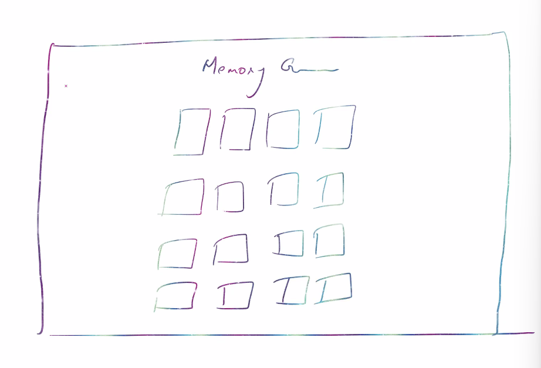
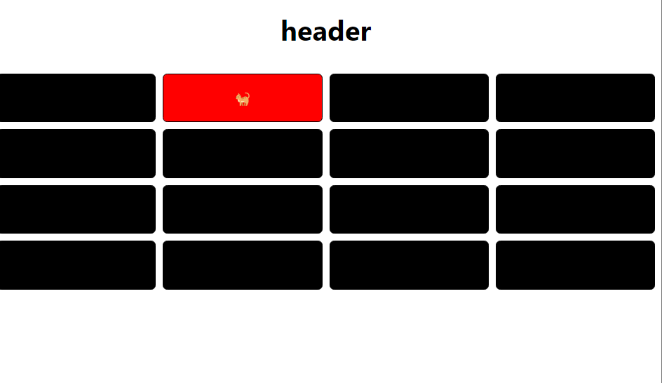

> Runtime environments available to execute JS 
- node.js 
- Deno.js 

To run a js file on node, just create a js file say `test.js` and in order to call this file from the terminal we type `node test.js` 

> Node.js 
Node.js provides a run time environment (environment given to execute scripts) for allowing execution of JS outside the browser (by using node on AWS using lamba function, creating a web server or using it on your machine such as VS code). Node JS uses V8 engine, same engine thats used in google chrome.

> alternatives of react 
vue, angular, next, gatsby... 

> React Node installation command 
```bash
npx create-react-app appname
```
> where are packages stored in a react app
```bash
- Node module contains packages that our react app is using 
Packages are code writtn by someone else, that we can just import and use -> improves reusability. 
# all directories are inside node_modules on the same level 

- src 
controls source code of the entire application 
  -package.json 
   #holds package requirment only for the code 
   contains version of your dependency in your app 
  -package-lock-json
   #contains more information of the dependencies defined inside node-modules and package.json 
   
```
> Node package manager (NPM)
when you want to install a package `npm install <packagename>` (yarn is an alternative to NPM)

> Node package executioner (NPX)
when you want to execute a package `npx create-react-app <appname>`this command creates the boiler plate code for the basic react application 

We cannot use live server to run this, we run on node instead, by using `npm start`

> How to change port number 
```bash
export PORT = 3001 
npm start
```
### Memory Game 
1. create wireframe for the app 


2. How we would approach this game using 16 states 
> app.js 
```bash
import './App.css';
import Header from './components/Header';
import Grid from './components/Grid';

function App() {
  return (
    <div className="App">
      <Header />
      <Grid />
    </div>
  );
}

export default App;
```
> Grid.js (parent)
```bash
import Card from './Card';
import { useState } from 'react';
const Grid = () => {
    #instead of defining 16 states, we'll use a combinator object 
    const [flipped, setFlipped] = useState([false, false,false,false,false,false,false,false,false,false,false,false,false,false,false, false])

    const ToggleFlipped = (index) => {
        #to create deep copy were using array destructuring (objects, arrays)
        #copying each state defined inside flipped state, inside fipped_copy
        let flipped_copy = [...flipped]

        #if flipped copy is true, means its flipped then set it to false (means set it to inverted)
        #takes index as parameter and based on its boolean value, it toggles the value 
        if(flipped_copy[index] === true){
            flipped_copy[index] = false 
        }else {
            flipped_copy[index] = true 
        }

        setFlipped(flipped_copy)
    }

    return (
        <div className='card-container'>
            # map to loop over array, for example, like this
            # const cards =[1,2,3,4,5,6,7,8,9,10,11,12,13,14,15,16]
            # {cards.map((single_data, idx) => {
            #     return(
            #         <Component />
            #     )
            # })} 

            {flipped.map((single_data, idx) => {
                return (
                 #isFlipped is custom prop we send - single_data is each state inside Flipped state 
                 <Card key={idx} flip={ToggleFlipped} index={idx}
                 isFlipped={single_data} />
                )
            })}
        </div>
    )
}

export default Grid;
```
> Card.js 
```bash
const Card = (props) => {
    const flip =() => {
        #when you click 5th index crd is being flipped 
        #props.flip(5)
        props.flip(props.index)


    }
    return (
        #What to do when we encounter a particular boolean value?

        #flipped-true ->  flipped card  
        #flipped-false -> not flipped card 

        #when flipped false , toggle it to true to flip it 
        #when flipped true, toggle it to false, to make it go back

        #we want the card to flip when isFlipped is true 
        #if isFlipped is true  then add flipped class otherwise dont add flipped 
        <div className={`card ${props.isFlipped  ? 'flipped' : ""}`} onClick={flip}> 

        # flipped child is content, flipped will be attached to card when user clicks on it
            <div className="content">
                <p>🐈</p>
            </div>
        </div>
    )
}

export default Card;
```
> Whats happening in the code?
1. we defined 16 seperate states in `flipped` which keeps track of each grid (4x4) in the grid component (parent). initial value of each card in the grid is false 
```bash
false -> when card is not flipped 
true -> when card is flipped 
```
2. we then defined a function  `ToggleFlipped` inside the parent component which would extract each state from flipped, and it will toggle its boolean value, then we'll update the state to the updated value 
3. we map through the all the states inside `flipped` extract its `boolean value`, `index` and function `ToggleFlipped` and we pass it as props to the child component `Card.js` 
4. Define a function name `flip` inside Card.js which retrieves the index of the card that the user clicked on and we call this function onClick, we set the class for this card the user clicked on based on whether `boolean value` of the data passed is true or not
```bash
if its false -> return nothing
if its true  -> flip the card #by adding the css property visibility: visible
#initially visibility was set to hidden 
```
> App.css 
```bash
.card-container {
  display: grid;
  grid-template-columns: repeat(4, 1fr);
  grid-gap: 0.5rem;
  max-width: 50rem;
  margin: auto;
  padding: 0.5rem;
}

.card {
  border: 1px solid black;
  border-radius: 5px;
  background-color: black;
}

.flipped {
  background-color: red;
}

.content {
  visibility: hidden;
}

.flipped > .content {
  visibility: visible;
}
```
> Outcome: 


4. Add feature: if 3rd card is open, close the first 2 cards (were using a basic aggregation method- reduce() to acheive this)
> what is reduce() method? 
```bash
let arr = [1, 2, 3, 4]

# finding product of all elements using for loop 
let product = 1
for(let i=0; i<arr.length; i++){
  let current = arr[i]
  product = product * current 
}
console.log(product)  #24

# finding product of all elements using reduce()
# reduce() loop over each element, it retreives current value 
const a = arr.reduce((product, current) => {
   product = product * current 
   return product 
}, 1)
#initial value of product = 1
console.log(a)        #24

product, current  |   product = product*current 
1, 1              |   1*1=1
1, 2              |   1*2=2
2, 3              |   2*3=6
6, 4              |   6*4=24

let arr = [false, true, true, false]

arr.reduce((count, current) => {
  if(current == true){
    count++
  }
  return count 
}, 0)
#intially count value is 0 
console.log(a)

count, current  |  count 
0, false        |  0
0, true         |  1
1, true         |  2 
2, false        |  2
```
> we added this in Grid.js 
```bash
  #we dont want 3rd card to open up if we have 1st and 2nd card open 
        #we count the number of cards which are opened 
        const flippedcount = flipped_copy.reduce((count, current) => {
            if (current === true){
                count++
            }
            return count
        }, 0)

        #if number of cards that are opened is 2, then dont open more cards 
        if(flippedcount >= 2){
            console.log('2 cards already opened')
            return;
        }

        console.log(flippedcount)
```
> export-import approaches 
- default export (Problem: can only export 1 variable)
```bash
const main_something = 'meow'
export default main_something

#in the component you want to import 
import { main_something } from './Emoji';
```
- named export 
```bash
#Emoji.js 
const emojis = ['🚀', '❤️', '🐈', '✅', '👍', '👽', '💡', '🪴']

# pair_emojis contains double of ...emojis
const pair_emojis = [...emojis, ...emojis]
export {emojis, pair_emojis}

#to import this in another component say Grid.js 
import { pair_emojis  } from './Emoji';
```
5. we defined states inside `Emoji.js` which were importing inside `Grid.js` 
> Emoji.js 
```bash
const emojis = ['🚀', '❤️', '🐈', '✅', '👍', '👽', '💡', '🪴']
const initRevealState = [false, false,false,false,
    false,false,false,false,false,false,false,false,false,false,false, false]
  
# pair_emojis contains double of ...emojis
const pair_emojis = [...emojis, ...emojis]
export {emojis, pair_emojis, initRevealState}

```
> Grid.js 
```bash
import Card from './Card';
import { useState } from 'react';
import { pair_emojis, initRevealState  } from './Emoji';
const Grid = () => {
    # instead of defining 16 states, well use a combinator object 
    # const [flipped, setFlipped] = useState([false, false,false,false,
    #     false,false,false,false,false,false,false,false,false,false,false, false])
    
    const [flipped, setFlipped] = useState([initRevealState])
     

    const ToggleFlipped = (index) => {
        #to create deep copy were using array destructuring (objects, arrays)
        #copying each state defined inside flipped state, inside fipped_copy
        let flipped_copy = [...flipped]

        #we dont want 3rd card to open up if we have 1st and 2nd card open 
        const flippedcount = flipped_copy.reduce((count, current) => {
            if (current === true){
                count++
            }
            return count
        }, 0)

        if(flippedcount >= 2){
            console.log('2 cards already opened')
            return;
        }

        console.log(flippedcount)

        # if flipped copy is true, means its flipped then set it to false (means set it to inverted)
        #takes index as parameter and based on its boolean value, it toggles the value 
        if(flipped_copy[index] === true){
            flipped_copy[index] = false 
        }else {
            flipped_copy[index] = true 
        }

        #adding snippet here 
        const flippedcountafter = flipped_copy.reduce((count, current) => {
            if (current === true){
                count++
            }
            return count
        }, 0)

    # when count is 2, then 
        if(flippedcountafter == 2){
            setTimeout(() => {
                # after 2 seconds both the cards get automatically closed
                closeAll()
            }, 2000);
        }

        setFlipped(flipped_copy)
    }

    const closeAll = () => {
        const state = [false, false,false,false,false,false,false,false,false,false,false,false,false,false,false, false]
        setFlipped(state)
    }


    return (
        <div className='card-container'>
            # map to loop over array, for example, like this
            # const cards =[1,2,3,4,5,6,7,8,9,10,11,12,13,14,15,16]
            # {cards.map((single_data, idx) => {
            #     return(
            #         <Component />
            #     )
            # })} 
         

            {flipped.map((single_data, idx) => {
                return (
                 #isFlipped is custom prop we send - single_data is each state inside Flipped state 
                 <Card key={idx} flip={ToggleFlipped} index={idx}
                 isFlipped={single_data} />
                )
            })}
        </div>
    )
}

export default Grid;
```
6. write logic to optimize our game by shuffling the array. 
> Helperfunction.js 
```bash
const randomizeArr = (arr_old) => {
# we want a random array every single time the user plays a game 

#we'll need to fix a bug 
#bug -> because of strict mode it creates a new empty array every time it runs 
#when in reality we want shuffled array of the same length but it shows up an empty array instead 

# fix the problem. Approach 1. - create a deep copy 
let arr = [...arr_old]

#fix the problem. Approach 2. - remove  <react.strictmode> from index.js 
#another fix to this problem would be to remove <react.strictmode></react.strictmode> from index.js

#in production moe- there is no strict mode -> it will run only once 
#so the app would work fine in production (without making either of these changes) because it doesnt take strict mode 
#however, we have to make either off the above changes, since we need to see how the app runs every time the array is shuffled 


#const pair_emojis = [...emojis, ...emojis]
#pair_emojis is defined inside Emoji.js 
const shuffled_arr = []
const size = arr.length
#iterate over the array pair_emojis
for(let i=0; i<size; i++){
    #generating a random index 
    const random_idx = Math.floor(Math.random() * arr.length)
    #push the random element in shuffled_arr[]
    #at every iteration it would push any random element into the shuffled_arr[]
    shuffled_arr.push(arr[random_idx])
    #remove the random index from the arr
    #this function will run until all the elements in arr is exhausted 
    arr.splice(random_idx, 1)
}
    return shuffled_arr;
}

export {randomizeArr}
```
> Emoji.js 
```bash
#these are 8 emojis, our grid is 4x4 = 16cards, 
#number of pairs formed in total = 16/2 = 8 
#were specifying each pair emoji inside emojis[]
const emojis = ['🚀', '❤️', '🐈', '✅', '👍', '👽', '💡', '🪴']

#the boolean value of every card is specified in this state and passed to Grid.js
const initRevealState = [false, false,false,false,
    false,false,false,false,false,false,false,false,false,false,false, false]
    
# pair_emojis contains double of ...emojis
#basically it contains all the emojis that will be present inside the game. i.e 16 cards 
const pair_emojis = [...emojis, ...emojis]
export {emojis, pair_emojis, initRevealState}
```
> Grid.js 
```bash
import Card from './Card';
import { useEffect, useState } from 'react';
import { pair_emojis, initRevealState  } from './Emoji';
import {randomizeArr} from './Helperfunctions'

# to define random arrays 
# its calling randomize function from Helperfunctions.js
# const random_arr = randomizeArr(pair_emojis)
# console.log(random_arr)

const Grid = () => {
    # instead of defining 16 states, well use a combinator object 
    # const [flipped, setFlipped] = useState([false, false,false,false,false,false,false,false,false,false,false,false,false,false,false, false])
    
    # this state is used for storing the boolean values which denote whether the card is flipped or not, initially we set it to default value 
    const [flipped, setFlipped] = useState(initRevealState)

    #this state is used to extract emojis from pair_emojis[] and load them once the component is rendered 
    const [randomArr, setRandomArr] = useState(pair_emojis)

    #this state is used to set the count of the number of flipped cards, if count of number of flipped cards is 2, then we have to reset the timerID back to null  
    const [timerID, setTimerID] = useState(0)

    #every time you open the pair, setscore should increase 
    const [score, setScore] = useState(0)


    #when component is first mounted, this will be run 
    #when component is rendered randomizeArr() is first been run 
    useEffect(() => {
      #random_arr returns a shuffled emoji array every time the component is rendered 
      #its calling randomize function from Helperfunctions.js
        const random_arr = randomizeArr(pair_emojis)
        console.log(random_arr)
        #update the state with the shuffled array 
        setRandomArr(random_arr)
    }, [])
     

    const ToggleFlipped = (index) => {
        #to create deep copy were using array destructuring (objects, arrays)
        #copying each state defined inside flipped state, inside fipped_copy
        let flipped_copy = [...flipped]

        #we dont want 3rd card to open up if we have 1st and 2nd card open 
        const flippedcount = flipped_copy.reduce((count, current) => {
            if (current === true){
                count++
            }
            return count
        }, 0)

        if(flippedcount >= 2){
            console.log('2 cards already opened')

            #clear the timer and set id back to 0 
            clearTimeout(timerID)
            setTimerID(0)

            #copying each state defined inside initRevealedState, inside fipped_copy
            flipped_copy= [...initRevealState]
            #initRevealState = [false, false,false,false,false,false,false,false,false,false,false,false,false,false,false, false]

            #return;
        }
        console.log(flippedcount)

        # if flipped copy is true, means its flipped then set it to false (means set it to inverted)
        #takes index as parameter and based on its boolean value, it toggles the value 
        if(flipped_copy[index] === true){
            flipped_copy[index] = false 
        }else {
            flipped_copy[index] = true 
        }

        #adding snippet here 
        const flippedcountafter = flipped_copy.reduce((count, current) => {
            if (current === true){
                count++
            }
            return count
        }, 0)

        # when count is 2, then 
        if(flippedcountafter === 2){
            const timer_id = setTimeout(() => {
                #after 2 seconds both the cards get automatically closed
                closeAll()
            }, 2000);
            #update the timerID 
            setTimerID(timerID)

            #score increase everytime user gets right 
            setScore(score + 1)
        }
        setFlipped(flipped_copy)
    }

    const closeAll = () => {
        #const state = [false, false,false,false,false,false,false,false,false,false,false,false,false,false,false, false]
        #setFlipped(state)
        setFlipped(initRevealState)
    }

     <>
    return (
        <div className='card-container'>
            # map to loop over array, for example, like this
            # const cards =[1,2,3,4,5,6,7,8,9,10,11,12,13,14,15,16]
            # {cards.map((single_data, idx) => {
            #     return(
            #         <Component />
            #     )
            # })} 

            {flipped.map((single_data, idx) => {
                const emoji = randomArr[idx]
                #were going to pass the element present at each index of randomArr to card 

                return (
                 <Card key={idx} 
                 flip={ToggleFlipped} 
                 index={idx}
                 isFlipped={single_data}
                 emoji={emoji} />
                )
            })}
        </div>
        #everytime you click on a pair of cards score gets updated
        <h5>Score: {score}</h5>
    </>
    )
}

export default Grid;
```


