### Article Newspaper app 
[Deployed Link](https://singular-crumble-2cc32d.netlify.app/)

> Tech integrated:
- react-redux (v8 new method)
- react-router
- Material-UI 
- axios 

#### Features integrated:
- renders card details with data fetched from the newsAPI
- like and unlike implementation via react-redux
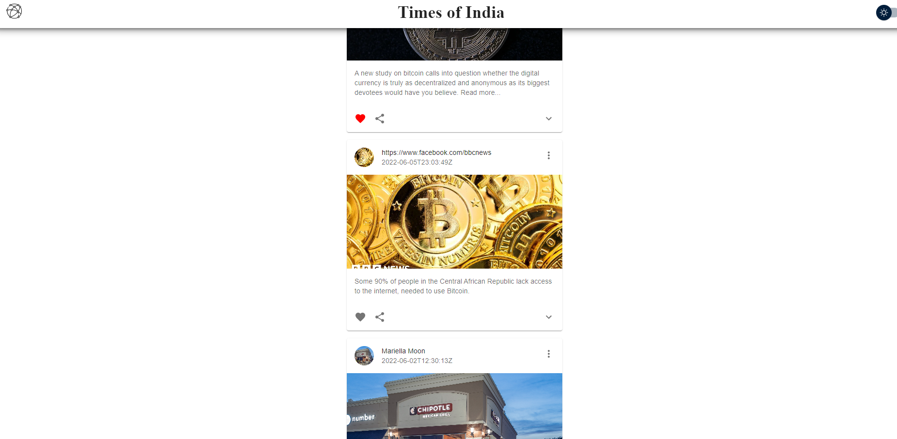

- light and dark mode implementation redux
> Light Mode
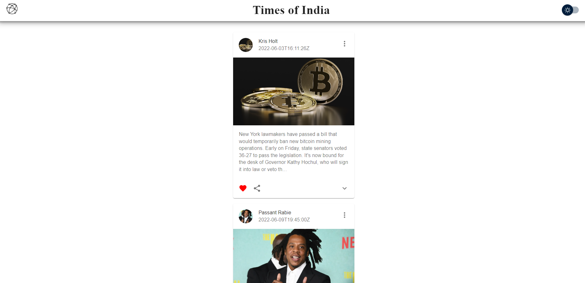

> Dark Mode 
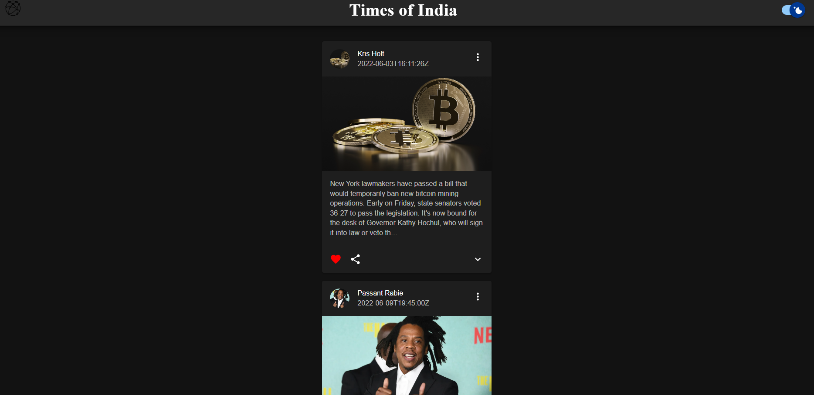

- commenting integration underneath the div
> comment section 
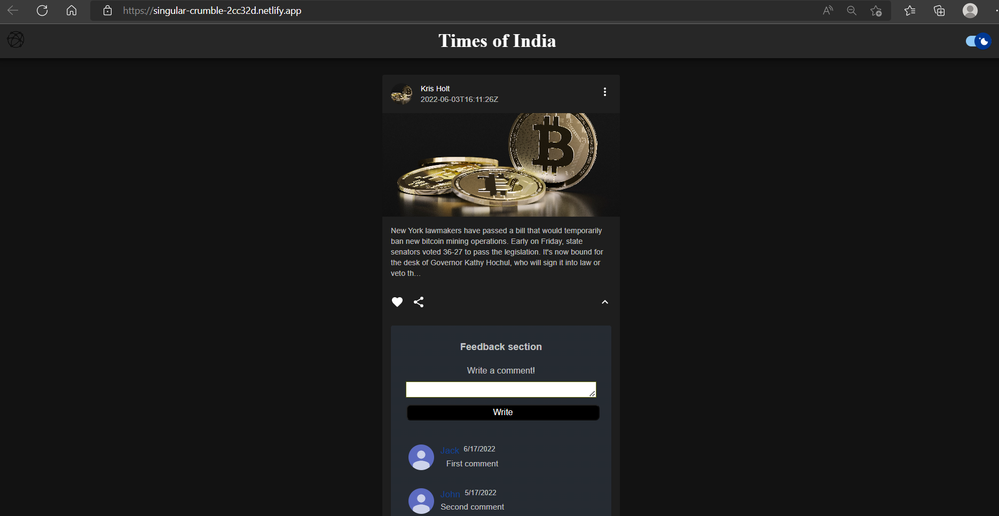

## Implementation:
### Redux
- Like and Dislike functionality
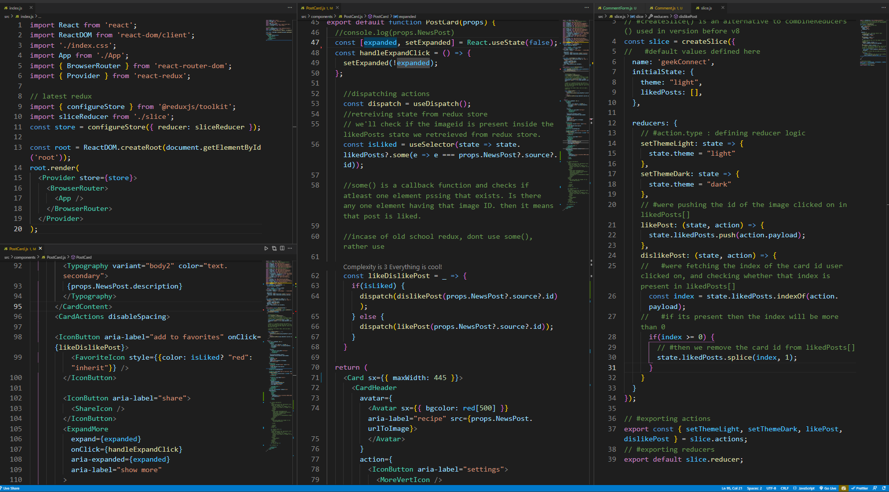

- Light & Dark theme functionality
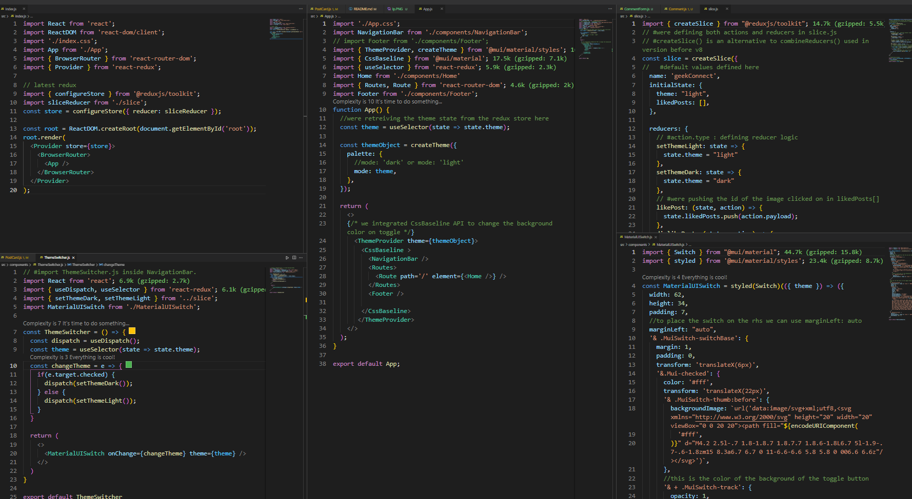

### Router 
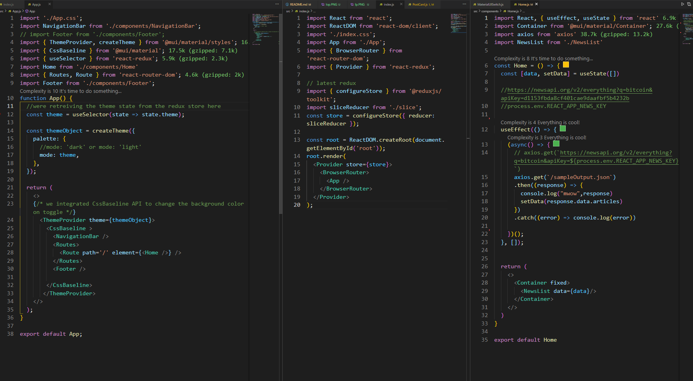

### Axios 
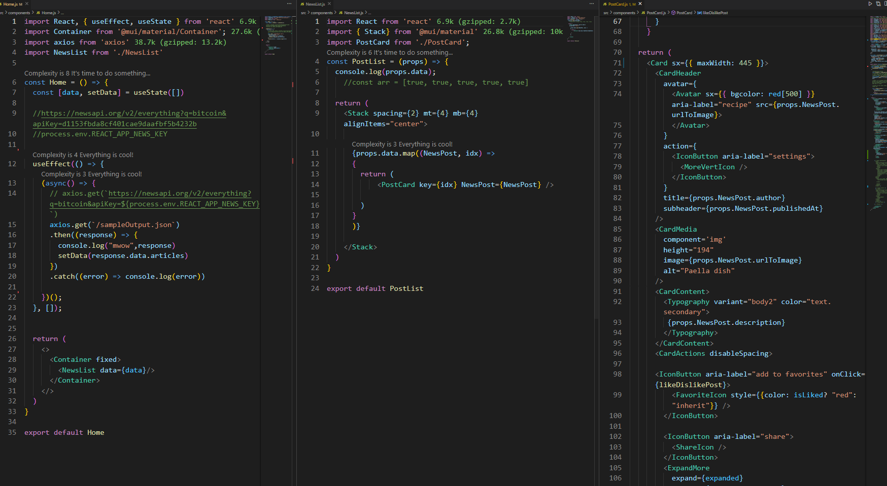

### Comment functionality
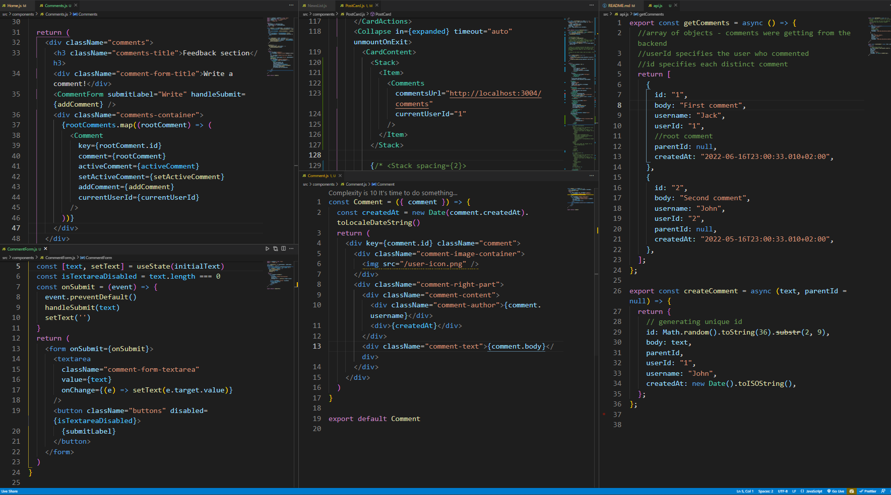

--------
#### API endpoint 
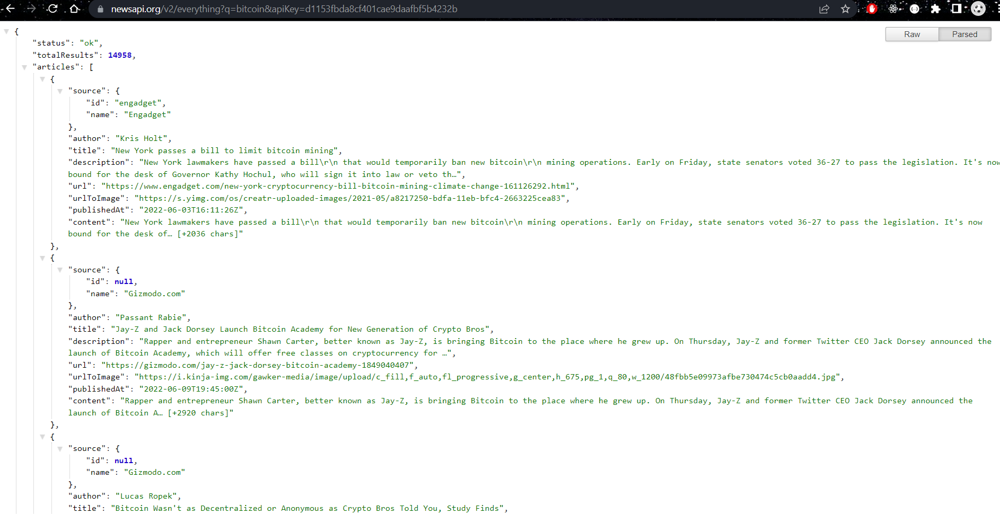

> Note: 
Initially I used the newsapi to render the json content, but post deployment i was getting this getting this error: Failed to load resource: the server responded with a status of 426 (). 

- I read online to find a fix 
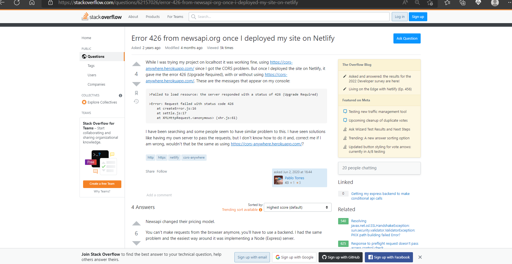
- It seems that they only support their API's on localhost and they removed their support from hosting services. Thats why I created a seperate JSON file `public/SampleOutput.json` with the same endpoint data and fetched it via axios.
 
> components/Home.js
```bash
import React, { useEffect, useState } from 'react'
import Container from '@mui/material/Container';
import axios from 'axios'
import NewsList from './NewsList'

const Home = () => {
  const [data, setData] = useState([])
  #https:#newsapi.org/v2/everything?q=bitcoin&apiKey=d1153fbda8cf401cae9daafbf5b4232b
  #process.env.REACT_APP_NEWS_KEY

  useEffect(() => {
    (async() => {
      # axios.get(`https:#newsapi.org/v2/everything?q=bitcoin&apiKey=${process.env.REACT_APP_NEWS_KEY}`)
      axios.get(`/sampleOutput.json`)
      .then((response) => {
        console.log("mwow",response)
        setData(response.data.articles) 
      })
      .catch((error) => console.log(error))

      # sampleOutput.map(response => {
      #   setData(response.data.articles) 
      #   return(
      #   # console.log("mwow",response)
      #   <div>response</div>
      #   )
      # })

    })();
  }, []);


  return (
    <>
      <Container fixed>
        <NewsList data={data}/>
      </Container>
    </>
  )
}

export default Home
```


