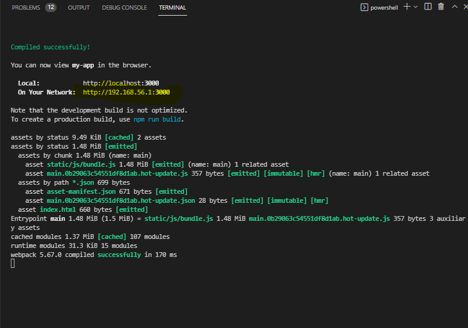

#### How a website works?
#### Traditional / multipage application
- when client makes a request to the server 
- server responds with (html + css + js) files 

#### SPA / Single page applications 
- client makes a request to the server, only one time
- server responds with the response only one time, returns html + css and JS for both the domain. it also downlaods the extensions to the website such as website/index.html or website/blog.html.

- and every time the user goes to some other extension on the website (JS is now taken control) say website/index.html, with API's the same page will be populated (dyanamically the new content we added will be added to the section of the pgae we want to update, and the whole page will not be reloaded) and the page will be rendered without the need to integrate the loader. 

- By using SPA's, we are saving bandwidth and the server load will be reduced. 
------
#### Where is react used?
Thousands of companies, including some Fortune 500 companies, have chosen React JS for their websites and mobile apps.

Airbnb, Tesla, Tencent QQ, and Walmart are among the top brands that built their mobile apps using the React Native framework.

React web framework, on the other hand, is currently being utilized by famous companies including Netflix, Paypal, NASA, BBC, Lyft, and New York Times, whatsapp, instagram, facebook.

The point is, since so many successful and Fortune 500 companies are using React & React Native, then React must be truly useful frontend and mobile app development framework.

### Single page applications 
Single page application (SPA) is a single page (hence the name) where a lot of information stays the same and only a few pieces need to be updated at a time.

The single page application is a web application or website that interacts with the user by dynamically rewriting the current page, rather than loading entire new pages from the server.

whenever we go from index.html to index.html/blog, loader wont be shown and UI will be changed dyanamically.

### React
Client side JS library which gives progressive web like experience. 

> React JS is a JS library for biulding fast and interactive UI & SPA's 

React is the view layer of the MVC application.
#### Declarative view - react will efficiently update and render just the right components when your data changes -, it doesnt refresh the whole page

- React is a library, but since its competetion is with Angular/ Vue.js that's why its called a framework 

Angular and React (and many others such as Ember and Vue) are frameworks that developers use to create SPAs efficiently and eloquently.

Simply put, these frameworks are a collection of reusable components, that many developers have contributed to, that follow a defined set of building rules.

- react is maintained by facebook, 
```bash 
React (also known as React. js or ReactJS) is a free and open-source front-end JavaScript library for building user interfaces based on UI components. 

It is maintained by Meta (formerly Facebook) and a community of individual developers and companies.
```

> But, what does FB get out of open sourcing their framework?
```bash 
They are using React and React Native in there own sites Facebook, instagram and whatsapp web. So indirectly it is already connected to revenue.

By making it open-source they are not only getting their technology improved but also gain popularity among developers and other companies. Today a vast majority of sites are indeed using React.
```

#### React helps in creating single page applications.
> single page application - HTML loads once and js keeps uploading without the need to refresh the page (**fast rendering**). we can go from one page to another without the server needing to refresh the page 
- can reuse components (**it allows developer to  write custom components**)
```bash 
ReactJS provides reusable components that developers have the authority to reuse and create a new application .
```
- less code than used in JS 

#### In React, we can divide webisite into Components 
- we integrate different components in different parts of our website, through components, which imporves management of the website 
- Its based on component based architecture, these components can be re-used 
```bash 
header component 
footer component 
div component 
```
- react contains hooks, you can send data through props, there are already prebiult packages (made by community) which we can integrate in our website 
```bash 
Eg: for routing(going from one page to another), we can use react router DOM package 
```
#### Components 
component is a class in which we can render methods.

##### Components are independent and reusable bits of code:
> Components can be defined 
1. on the same page (Components inside components)
2. in different files (preffered)

##### 1. Components inside components 
> use the car component inside the garage component 
```bash 
function Car() {
  return <h2>I am a Car!</h2>;
}

function Garage() {
  return (
    <>
      <h1>Who lives in my Garage?</h1>
      <Car />
    </>
  );
}

ReactDOM.render(<Garage />, document.getElementById('root'));
```


##### 2. Componenets in files 
React is all about re-using code, and it is recommended to split your components into separate files.

To do that, create a new file with a .js file extension and put the code inside it:

> for example, we created a custom component named car.js 
```bash 
function Car() {
  return <h2>Hi, I am a Car!</h2>;
}

export default Car;
```
> to use car.js in the application, we use car component in this file (it makes it seem as if it was created in here itself)
```bash 
import React from 'react';
import ReactDOM from 'react-dom';
✅import Car from './Car.js';

ReactDOM.render(<Car />, document.getElementById('root'));
```
#### What are modules and Exports?
- components are exported to different files 
- through module we can use the import/export feature 
```bash 
<script type="module" src="">
```
#### Why was react created? 
facebook wanted an MVC like framework and didnt want to use the most popular one at that time Angular JS, because it was developed by Google 

#### What is react's current version?
ECMAScript was created to standardize JavaScript, and ES6 is the 6th version of ECMAScript, it was published in 2015, and is also known as ECMAScript 2015. React ES6 is the standard. 
> the latest stable release is 17.02 

> package.json 
```bash 
 "react": "^17.0.2",
 ```
> package.json. Dependancies- what libraries scripts depends on.
```bash 
{
  "name": "new-app",
  "version": "0.1.0",
  "private": true,
  "dependencies": {
    "@testing-library/jest-dom": "^5.16.2",
    "@testing-library/react": "^12.1.2",
    "@testing-library/user-event": "^13.5.0",
    "react": "^17.0.2",
    "react-dom": "^17.0.2",
    "react-scripts": "5.0.0",
    "web-vitals": "^2.1.4"
  },

```
#### Why do we need react / what can react do that JS cant?
- JS uses DOM, which consumes alot of memory and doesnt update as quickly
- React uses Virtual DOM, which ensures no memory wastage and updates quickly

Instead of manipulating the browser's DOM directly, React creates a virtual DOM in memory, where it does all the necessary manipulating, before making the changes in the browser DOM.

```bash 
React finds out what changes have been made, and changes only what needs to be changed.
```

#### Installation Tools 
We need Node JS and NPM to create react Apps.

##### 1. Node JS
Node JS (JS runtime that allows us to execute JS, without using the browser)
- Node JS contains NPM and NPX 

1. Head over to this site and download the windows version 
https://nodejs.org/en/download/

- Install node JS and, navigate to windows powershell 


```bash 
Type these commands in powershell, to see if Node JS is working in your system or not 
```


##### 2. Download React developer tools chrome extension 
##### 3. Download 
- Thunderclient (VS code extension) - used for API Testing
- ES7 React/Redux/GraphQL - helps in importing modules and prototypes 
- live server - used to view static pages 

### Create a New React App 
Documentation: 
https://reactjs.org/docs/create-a-new-react-app.html

#### Node JS contains:- NPM & NPX 
### Packages - These are imported in our code 

#### Tools used to use Node packages:
1. NPM - helps in installing the entire package in our system, it causes uneccesary storage on hard disk. Packages are installed forever.

2. NPX (node package execute) - helps in using the required package once without downloading the enitire package. 

#### Steps to creating a React App 
1. create a this.txt file, open terminal in vscode (in the folder, right click and open windows powershell) and type 
```bash 
npx create-react-app my-app
```
2. my-app is created with this directory structure 


> lets breifly understand, the app structure 
```bash 
✅node modules 
packages and dependencies required for react are in this directory 
------

✅src/package.json
contains packages that are installed in NodeJS 
------

✅gitignore 
contains a list of things that shouldnt be pushed on GIT 
------

✅src 
contains JS components also we can create new components in src folder  
------
✅public 
contains public files, which are shown on the DOM  
------

✅public -> index.html 
through JS (in src/index.js) div#root will be populated 
   <div id="root"></div>

------
✅src -> index.js 
>> this is the file where the code first starts executing 
this is the JS file through which root will be populated 

ReactDOM.render(
  <React.StrictMode>
    <App />
  </React.StrictMode>,
  ✅targetting the div#root from (src/index.js) to populate it in (src/app.js)
  document.getElementById('root')
);
------

✅src -> app.js 
you can add dyanamic JS changes to react app 
```
> we'll place the react components in src folder
```bash 
✔ Components contain:
1. props 
for instance, there is a form (component), which contains details (props)

2. state 
for instance, the heading of the form(component), is called a state, this state can be changed based on user interaction / HttpRequestResponse / etc 
```

### How to start React app ?
1. open terminal and type 
```bash 
cd my-app
```
2. then type 
```bash 
npm start 
```

> The default react app has started serving on localhost:3000
```bash 
## Hack
if your mobile and lappy are on the same network, then you can use this url on mobile devices to see how your app is looking while development stage:

Local:        
On Your Network:  http://192.168.56.1:3000
```
3. If you have to biuld an app for production, then type in this command, instead of npm start 
```bash 
npm run biuld 
```
4. when you click on 'view page source', note that public/index.html code will be displayed 
```bash 
(src/index.js)
JS is targetting div#root and its injecting JS dyanamically as user interacts with the DOM 

the content inside (src/app.js) is JSX (Javascript syntax extension), not HTML
```
5. you can even delete the node modules folder and to install it back again just type this command in the folder location 
- make sure that your in the directory you want to add node modules to 
```bash 
cd my-app
```
- enter this command in the terminal 
```bash 
npm install 
```

### JSX 
JSX stands for **JavaScript XML**. It is simply a syntax extension of JavaScript. It allows us to directly write HTML in React (within JavaScript code). It is easy to create a template using JSX in React.

JSX was created to imporve developer experience, to integrate both HTML and JS in the same page 

#### Understanding JSX 
> let's first see what was predefined in this file: src/app.js 
```bash 
import logo from './logo.svg';
import './App.css';

✅this is a function based component 
function App() {
  let myVariable = 10;
  return (
    ✅JSX starts 
    <div className="App">
      <header className="App-header">

        <div>{myVariable}</div>
        
        <p>
          Edit <code>src/App.js</code> and save to reload.
        </p>
        <a
          className="App-link"
          href="https://reactjs.org"
          target="_blank"
          rel="noopener noreferrer"
        >
          Learn React Bro 
        </a>
      </header>
    </div>
    ✅JSX ends
  );
}

export default App;
```
> were going to delete the default JSX content inside this, and create our own JSX
```bash 
import logo from './logo.svg';
//the css changes we want to make in this file, can be done through src/app.css
import './App.css';

let name = 'harry'
function App() {
  let myVariable = 10;
  return (
    // Fragments let you group a list of children without adding extra nodes to the DOM.
    <>
   <div className="blank">Rum</div>
   <nav>
     <li>home</li>
     <li>home</li>
     <li>home</li>
   </nav>

   <div className="container">
     <h1>hello {name}</h1>
     <p>Lorem ipsum dolor sit amet, consectetur adipisicing elit. Ea eius corporis itaque, porro doloribus earum et. Expedita voluptas quo quibusdam iure amet labore voluptatem? Omnis assumenda tenetur vel voluptatem! Dolor velit hic rerum impedit? Dolorem recusandae id veritatis temporibus laborum?</p>
   </div>
    </>
  );
}

export default App;
```
> let's see an example of a class based component 
> src/ app.js 
```bash 
import logo from './logo.svg';
//the css changes we want to make in this file, can be done through src/app.css
import './App.css';

//react class component should always have a render() function 

//this is a class component 
class App extends Component {
  constructor(x,y,z){
    super(someArguments)

    this.name = x 
  }

  printInfo(){
    console.log(this.name)
  }

  render(){
    return (
      <div className='App'>
        <button>
          <a>hello</a>
        </button>
      </div>
    );
  }
}

export default App;
```
#### What is the render() function?
React renders/displays HTML to the DOM by using the render() method, it basically adds the code inside 
> public/index.html
```bash 
<body>
  <div id="root"></div>
</body>
```
> src/index.js 
```bash 
ReactDOM.render(
  <React.StrictMode>
    <App />
  </React.StrictMode>,
  document.getElementById('root')
);
```
#### Why is JSX used?
JSX is used along with React to remove loosely coupled parts of a component, like HTML, CSS, and JavaScript, and get them to work together in a single file called a component.

#### Difference between HTML & JSX.
HTML is a very important language in web development. Your code is either in HTML originally or compiles to it so browsers can read it.

JSX, on the other hand, means JavaScript Syntax Extension or JavaScript XML as some like to put it.

It was created as a syntactic sugar for React.createElement(). It is an extension of JavaScript that allows developers to write HTML right within JavaScript. So when you're writing JSX, technically you're writing JavaScript and HTML together.

### In JSX, you must return a single parent element, or it won't compile.

#### JSX needs a parent element 
A lot of devs use <div>...</div>, but a better one that many people use is “fragment”, <>...</> which makes the code more readable.

In HTML, you are free to do whatever you want as you don’t have to return a single parent element.


> Here you can see that JSX is not compiling because there's no parent element.


> And here JSX is compiling because there is a parent element (fragment).

#### You can implement JS directly in JSX
In JSX, it is possible to write JavaScript directly. 

You can do this by putting the JavaScript in curly braces {...}. Whereas in HTML, you need a script tag or an external JavaScript file to implement JavaScript:
```bash 
const Article = () => {
  return (
    <>
      <div>
        <p>Hi campers</p>
        <p>Hows coding going</p>
        <p>What is up?</p>
        {new Date().toDateString()}
        <br />
        <br />
        {2 + 5} is seven in word
        <br />
      </div>
    </>
  );
};
export default Article;
```
#### ClassName and HTMLFor, not class and for in JSX
To define class names and for attributes in JSX, you don't do it as class or for, since both are reserved keywords in JavaScript.

You actually create class components with the class keyword. So, to define class names in JSX, you do it as "className" and for attributes for labels you write "HTMLFor":
```bash 
const Article = () => {
  return (
    <>
      <div className="container">
        <p>Hi campers</p>
        <p>Hows coding going</p>
        <p>What is up?</p>
        {new Date().toDateString()}
        <br />
        <br />
        {2 + 5} is seven in word
        <br />
        <form>
        ✅htmlFor used here 
          <label htmlFor="name">Name</label>
          <input type="text" />
        </form>
      </div>
    </>

  );
};

export default Article;
```
#### Write all HTML Attributes in camelCase in JSX
You need to write all HTML attributes and event references in camelCase while writing JSX. So, onclick becomes onClick, onmouseover becomes onMouseOver, and so on:
```bash 
const Article = () => {
  const sayHI = () => {
    alert("Hi Campers");
  };

  return (
    <>
      <div className="container">
        <p>Hi campers</p>
        <p>Hows coding going</p>
        <p>What is up?</p>
        {new Date().toDateString()}
        <br />
        <br />
        {2 + 5} is seven in word
        <br />
        <button onClick={sayHI}>ALert Hi</button>
      </div>
    </>

  );
};
export default Article;
```
#### Write Inline Styles as Objects in JSX
And lastly, to define inline styles for JSX, you write it as an object, with the properties in camelCase, 

This means you have to open up a style attribute and use curly braces instead of quotes. This is opposed to HTML where you're free to define millions of styles right inside the opening tag without writing them as objects and putting them in quotes:
```bash 
const Article = () => {
  const inlineStyle = {
    color: "#2ecc71",
    fontSize: "26px",
  };
  return (
    <>
      <div className="container">
        <p style={inlineStyle}>Hi campers</p>
        <p>Hows coding going</p>
        <p>What is up?</p>
        {new Date().toDateString()}
        <br />
        <br />
        {2 + 5} is seven in word
        <br />
        <button onClick={sayHI}>ALert Hi</button>
      </div>
    </>
  );
};
export default Article;
```
### Elements must be closed (add the />)
```bash 
const myelement = <input type="text" />;
```
### class based components VS function based components 
Components come in two types, Class components and Function components

- before class based components were used, now due to shifting trends function based components are used.

#### Class based components 
A class component must include the ***extends React.Component***statement. This statement creates an inheritance to React.Component, and gives your component access to React.Component's functions.

The component also requires a ***render()*** method, this method returns HTML.
> Creating a class component called car 
```bash 
✅When creating a React component, the components name must start with an upper case letter.

✅The component has to include the extends React.Component statement
class Car extends React.Component {
  render() {
    return <h2>Hi, I am a Car!</h2>;
  }
}

✅The component also requires a render() method, this method returns HTML.
```
> Display car to root element 
```bash 
import React from 'react';
import ReactDOM from 'react-dom';

class Car extends React.Component {
  render() {
    return <h2>Hi, I am a Car!</h2>;
  }
}

ReactDOM.render(<Car />, document.getElementById('root'));

```
Before React 16.8, Class components were the only way to track state and lifecycle on a React component. Function components were considered "state-less".

With the addition of Hooks, Function components are now almost equivalent to Class components. The differences are so minor that you will probably never need to use a Class component in React.

> shortcut emmet combination for react class based components : rcc

#### Function based components 
A Function component also returns HTML, and behaves much the same way as a Class component, but Function components can be written using much less code, are easier to understand

> Function based components were introduced in Feb, 2019

React Hooks (such as useState) gave functional components the same capabilities as class components, with the possibility to use the state system and achieve the same results as the class components' lifecycle methods.

> creating a car function component 
```bash 
function Car() {
  return <h2>Hi, I am a Car!</h2>;
}
```
> to add the component to the DOM/ render the component/ use component in the application, we'll use the render method 
```bash 
import React from 'react';
import ReactDOM from 'react-dom';

function Car() {
  return <h2>Hi, I am a Car!</h2>;
}

ReactDOM.render(<Car />, document.getElementById('root'));
```

> shortcut emmet combination for react function based components : rfc

#### Difference between function based components and class base components: An analysis:
> class based components in src/App.js
```bash 
import React, {component} from 'react'

class App extends Component {
  render() {
    return {(
      <div>
       <h1>hello world</h1>
      </div>
    );
  }
}

export default App;

Application:
Hello world 
```
> function based component in src/App.js
```bash 
import React from 'react'

✅function which returns something on the application 
function App() {
    return {(
      <div>
       <h1>hello world</h1>
      </div>
    );
}

export default App;

Application:
Hello world 
```
### Adding bootstrap 
were adding bootstrap to add UI components (responsive) to our website. 
https://getbootstrap.com/docs/5.1/getting-started/introduction/

> getting started -> starter template 
```bash 
<!doctype html>
<html lang="en">
  <head>
    <!-- Required meta tags -->
    <meta charset="utf-8">
    <meta name="viewport" content="width=device-width, initial-scale=1">

    ✅Bootstrap CSS
    <link href="https://cdn.jsdelivr.net/npm/bootstrap@5.1.3/dist/css/bootstrap.min.css" rel="stylesheet" integrity="sha384-1BmE4kWBq78iYhFldvKuhfTAU6auU8tT94WrHftjDbrCEXSU1oBoqyl2QvZ6jIW3" crossorigin="anonymous">

    <title>Hello, world!</title>
  </head>
  <body>
    <h1>Hello, world!</h1>

    <!-- Optional JavaScript; choose one of the two! -->

    ✅Bootstrap Bundle with Popper 
    <script src="https://cdn.jsdelivr.net/npm/bootstrap@5.1.3/dist/js/bootstrap.bundle.min.js" integrity="sha384-ka7Sk0Gln4gmtz2MlQnikT1wXgYsOg+OMhuP+IlRH9sENBO0LRn5q+8nbTov4+1p" crossorigin="anonymous"></script>

    <!-- Option 2: Separate Popper and Bootstrap JS -->
    <!--
    <script src="https://cdn.jsdelivr.net/npm/@popperjs/core@2.10.2/dist/umd/popper.min.js" integrity="sha384-7+zCNj/IqJ95wo16oMtfsKbZ9ccEh31eOz1HGyDuCQ6wgnyJNSYdrPa03rtR1zdB" crossorigin="anonymous"></script>
    <script src="https://cdn.jsdelivr.net/npm/bootstrap@5.1.3/dist/js/bootstrap.min.js" integrity="sha384-QJHtvGhmr9XOIpI6YVutG+2QOK9T+ZnN4kzFN1RtK3zEFEIsxhlmWl5/YESvpZ13" crossorigin="anonymous"></script>
    -->
  </body>
</html>
```

- were going to be adding these two to public/index.html 
```bash 
<!DOCTYPE html>
<html lang="en">
  <head>
    <meta charset="utf-8" />
    <link rel="icon" href="%PUBLIC_URL%/favicon.ico" />
    <meta name="viewport" content="width=device-width, initial-scale=1" />
    <meta name="theme-color" content="#000000" />
    <meta
      name="description"
      content="Web site created using create-react-app"
    />
    <link rel="apple-touch-icon" href="%PUBLIC_URL%/logo192.png" />

    <link rel="manifest" href="%PUBLIC_URL%/manifest.json" />
    
    <!-- Bootstrap CSS -->
    <link href="https://cdn.jsdelivr.net/npm/bootstrap@5.1.3/dist/css/bootstrap.min.css" rel="stylesheet" integrity="sha384-1BmE4kWBq78iYhFldvKuhfTAU6auU8tT94WrHftjDbrCEXSU1oBoqyl2QvZ6jIW3" crossorigin="anonymous">
    <title>React App</title>

  </head>
  <body>
    <noscript>You need to enable JavaScript to run this app.</noscript>
    <div id="root"></div>

  <!-- Option 1: Bootstrap Bundle with Popper -->
  <script src="https://cdn.jsdelivr.net/npm/bootstrap@5.1.3/dist/js/bootstrap.bundle.min.js" integrity="sha384-ka7Sk0Gln4gmtz2MlQnikT1wXgYsOg+OMhuP+IlRH9sENBO0LRn5q+8nbTov4+1p" crossorigin="anonymous"></script>
  </body>
</html>
```
#### React is basically adding all the contents to the div#root found at public/index.html 
> we added the navbar component of bootstrap into src/App.js 
```bash 
import logo from './logo.svg';
import './App.css';

function App() {
  return (
    ✅Fragments let you group a list of children without adding extra nodes to the DOM.
    <>
   <nav className="navbar navbar-expand-lg navbar-light bg-light">
  <a className="navbar-brand" href="/">Navbar </a>
  <button className="navbar-toggler" type="button" data-toggle="collapse" data-target="#navbarText" aria-controls="navbarText" aria-expanded="false" aria-label="Toggle navigation">
    <span className="navbar-toggler-icon"></span>
  </button>
  <div className="collapse navbar-collapse" id="navbarText">
    <ul className="navbar-nav mr-auto">
      <li className="nav-item active">
        <a className="nav-link" href="/">Home <span className="sr-only">(current)</span></a>
      </li>
      <li className="nav-item">
        <a className="nav-link" href="/">Features</a>
      </li>
      <li className-="nav-item">
        <a className="nav-link" href="/">Pricing</a>
      </li>
    </ul>
    <span className="navbar-text">
      Navbar text with an inline element
    </span>
  </div>
</nav>
    </>
  );
}

export default App;
```
### Named export VS Default export 
### Default Export 
> Default exports are used to export a singular value (objects / functions / variables)
> so were trying to do module exports, we created 2 files module1.js and module2.js 

- module1.js 
```bash 
import ui from './module2'
console.log(ui)
```
- mdoule2.js 
```bash 
const a = 'harry'
const b = 'reem'
const c = 'trisha'
const d = 'paytas'
//were going to export this module to module2.js 

export default c;
```
> but we notice that when we try to run this it causes error 
```bash 
PS D:\geekster> cd my-app 
PS D:\geekster\my-app> cd src 
PS D:\geekster\my-app\src> node 'module1.js'
(node:10604) Warning: To load an ES module, set "type": "module" in the package.json or use the ✅.mjs extension.
(Use `node --trace-warnings ...` to show where the warning was created)
D:\geekster\my-app\src\module1.js:1
import ui from './module2'
^^^^^^

SyntaxError: Cannot use import statement outside a module
```
> to fix this error, we convert both our files to .mjs 
- module2.mjs 
```bash 
const a = 'harry'
const b = 'reem'
const c = 'trisha'
const d = 'paytas'
✅were going to export this module to module2.mjs 

export default c;
```
- module1.mjs 
```bash 
import ui from './module2.mjs'
console.log(ui)
```
- when we run this 
```bash 
PS D:\geekster\my-app\src> node module1.mjs
trisha
```
### Named export 
> Named exports are used to **export multiple values (objects / functions / variables)**
- you have to use the same name when importing 
- use curly braces for exports and imports 

- module2.mjs 
```bash 
const a = 'harry'
const b = 'reem'
const c = 'trisha'
const d = 'paytas'
//were going to export this module to module2.mjs 

export default c;
export {a}
export {b}
export {d}
```
- module1.mjs 
```bash 
import ui, {a, b, d} from './module2.mjs'

//ui imports c
console.log(ui)
console.log(a)
console.log(b)
console.log(d)
```
- running on terminal 
```bash 
PS D:\geekster\my-app\src> node module1.mjs
trisha
harry
reem
paytas
```
#### Creating custom components 
> we created a folder named components, inside which we created a file name Navbar.js 

- components/Navbar.js 
```bash 
import React from 'react'

export default function Navbar(){
    return(
        <div>
            hello i am a navabr 
        </div>
    )
}
```

- we added this inside App.js
```bash 
import logo from './logo.svg';
import './App.css';
✅import Navbar from './components/Navbar'

function App() {
  return (
    // Fragments let you group a list of children without adding extra nodes to the DOM.
    <>
   <nav className="navbar navbar-expand-lg navbar-light bg-light">
  <a className="navbar-brand" href="/">Navbar </a>
  <button className="navbar-toggler" type="button" data-toggle="collapse" data-target="#navbarText" aria-controls="navbarText" aria-expanded="false" aria-label="Toggle navigation">
    <span className="navbar-toggler-icon"></span>
  </button>
  <div className="collapse navbar-collapse" id="navbarText">
    <ul className="navbar-nav mr-auto">
      <li className="nav-item active">
        <a className="nav-link" href="/">Home <span className="sr-only">(current)</span></a>
      </li>
      <li className="nav-item">
        <a className="nav-link" href="/">Features</a>
      </li>
      <li className="nav-item">
        <a className="nav-link" href="/">Pricing</a>
      </li>
    </ul>
    <span className="navbar-text">
      Navbar text with an inline element
    </span>
  </div>
</nav>

✅<Navbar></Navbar>
    </>
  );
}

export default App;
```


#### The output on DOM from the above code is same as this.
> navbar.js 
```bash 
import React from 'react'

export default function Navbar(){
    return(
        // <div>
        //     hello i am a navabr 
        // </div>
        ✅we added the navbar component from App.js to navbar.js 
        <nav className="navbar navbar-expand-lg navbar-light bg-light">
        <a className="navbar-brand" href="/">Navbar </a>
        <button className="navbar-toggler" type="button" data-toggle="collapse" data-target="#navbarText" aria-controls="navbarText" aria-expanded="false" aria-label="Toggle navigation">
          <span className="navbar-toggler-icon"></span>
        </button>
        <div className="collapse navbar-collapse" id="navbarText">
          <ul className="navbar-nav mr-auto">
            <li className="nav-item active">
              <a className="nav-link" href="/">Home <span className="sr-only">(current)</span></a>
            </li>
            <li className="nav-item">
              <a className="nav-link" href="/">Features</a>
            </li>
            <li className="nav-item">
              <a className="nav-link" href="/">Pricing</a>
            </li>
          </ul>
          <span className="navbar-text">
            Navbar text with an inline element
          </span>
        </div>
      </nav>
    )
}
```
> App.js 
```bash 
import logo from './logo.svg';
import './App.css';
import Navbar from './components/Navbar'

function App() {
  return (
    <>
   ✅<Navbar></Navbar>
    </>
  );
}

export default App;
```


## We can handle Component properties by using:
1. Props 
2. Using constructor components and state object 

### 1. Props
#### We want to pass a property from 'App.js', to our custom react component 'Navbar.js'
> src/App.js 
```bash 
import logo from './logo.svg';
import './App.css';
import Navbar from './components/Navbar'

function App() {
  return (
    <>
    ✅props are passed to compoenents via HTML attributes 
    ✅you can pass as many props (html attributes) as you want 
   <Navbar title="Reem"></Navbar>
    </>
  );
}

export default App;
```
> src/component/Navbar.js (React Component)
```bash 
import React from 'react'

✅props stands for properties
✅Props are like function arguments, and you send them into the component as attributes.

export default function Navbar(props){
  ✅the input is prop 
  ✅return statemnet is used to return the JSX 
    return(
        <nav className="navbar navbar-expand-lg navbar-light bg-light">

        ✅props cannot change from within a function 
        <a className="navbar-brand" href="/">{props.title}</a>
        <button className="navbar-toggler" type="button" data-toggle="collapse" data-target="#navbarText" aria-controls="navbarText" aria-expanded="false" aria-label="Toggle navigation">
          <span className="navbar-toggler-icon"></span>
        </button>
        <div className="collapse navbar-collapse" id="navbarText">
          <ul className="navbar-nav mr-auto">
            <li className="nav-item active">
              <a className="nav-link" href="/">Home <span className="sr-only">(current)</span></a>
            </li>
            <li className="nav-item">
              <a className="nav-link" href="/">Features</a>
            </li>
            <li className="nav-item">
              <a className="nav-link" href="/">Pricing</a>
            </li>
          </ul>
          <span className="navbar-text">
            Navbar text with an inline element
          </span>
        </div>
      </nav>
    )
}
```


#### PropTypes 
PropTypes are a mechanism to ensure that components use the correct data type and pass the right data

> App.js 
```bash 
import logo from './logo.svg';
import './App.css';
import Navbar from './components/Navbar'

✅Note that: Parent component is rendering the child components 
function App() {
  return (
    <>
    ✅were passing 2 props over here 
    ✅passing data to child component (Navbar.js) from parent component (App.js) using props 
   <Navbar title="Reem" aboutText="navbar yo"></Navbar>
    </>
  );
}

export default App;
```

> Navbar.js 
```bash 
import React from 'react'
✅import PropTypes from 'prop-types'

✅Recieving props from child component 
export default function Navbar(props){
    return(
        <nav className="navbar navbar-expand-lg navbar-light bg-light">
        <a className="navbar-brand" href="/">{props.title}</a>
        <button className="navbar-toggler" type="button" data-toggle="collapse" data-target="#navbarText" aria-controls="navbarText" aria-expanded="false" aria-label="Toggle navigation">
          <span className="navbar-toggler-icon"></span>
        </button>
        <div className="collapse navbar-collapse" id="navbarText">
          <ul className="navbar-nav mr-auto">
            <li className="nav-item active">
              <a className="nav-link" href="/">{props.aboutText} <span className="sr-only">(current)</span></a>
            </li>
            <li className="nav-item">
              <a className="nav-link" href="/">Features</a>
            </li>
            <li className="nav-item">
              <a className="nav-link" href="/">Pricing</a>
            </li>
          </ul>
          <span className="navbar-text">
            Navbar text with an inline element
          </span>
        </div>
      </nav>
    )
}

✅Proptypes defined here 
//we mention the type of the prop here, and you cant pass any other datatype the html attributes of App.js

✅Note that: the syntax is: ComponentName.propTypes = {argument.propTypes.datatype}
Navbar.propTypes = {title:PropTypes.string, 
aboutText: PropTypes.string}
```
##### Default propTypes 
The defaultProps is a React component property that allows you to set default values for the props argument.

> App.js
```bash 
import logo from './logo.svg';
import './App.css';
import Navbar from './components/Navbar'

function App() {
  return (
    <>
    ✅Note that: we didnt define props in here 
   {/* <Navbar title="Reem" aboutText="navbar yo"></Navbar> */}
   <Navbar></Navbar>
    </>
  );
}

export default App;

```
> Navbar.js 
```bash 
import React from 'react'
✅import PropTypes from 'prop-types'

export default function Navbar(props){
    return(
        <nav className="navbar navbar-expand-lg navbar-light bg-light">
        <a className="navbar-brand" href="/">{props.title}</a>
        <button className="navbar-toggler" type="button" data-toggle="collapse" data-target="#navbarText" aria-controls="navbarText" aria-expanded="false" aria-label="Toggle navigation">
          <span className="navbar-toggler-icon"></span>
        </button>
        <div className="collapse navbar-collapse" id="navbarText">
          <ul className="navbar-nav mr-auto">
            <li className="nav-item active">
              <a className="nav-link" href="/">{props.aboutText} <span className="sr-only">(current)</span></a>
            </li>
            <li className="nav-item">
              <a className="nav-link" href="/">Features</a>
            </li>
            <li className="nav-item">
              <a className="nav-link" href="/">Pricing</a>
            </li>
          </ul>
          <span className="navbar-text">
            Navbar text with an inline element
          </span>
        </div>
      </nav>
    )
}

// we mention the type of the prop here, 
// other types: number/ object
// Navbar.propTypes = {title:PropTypes.string, 
// aboutText: PropTypes.string}

✅default props are called when we dont define any props in App.js 
Navbar.defaultProps = {
    title:'default title here',
    aboutText: 'default text here'
}
```


### 2. State & Handling Events 
The state is a built-in React object that is used to contain data or information about the component. A component’s state can change over time; whenever it changes, the component re-renders. The change in state can happen as a response to user action or system-generated events and these changes determine the behavior of the component and how it will render.  

- Every time the state of an object changes, React re-renders the component to the browser
- The state object is initialized in the constructor
- The state object can store multiple properties
- this.setState() is used to change the value of the state object
- setState() function performs a shallow merge between the new and the previous state

##### In React, component properties should be kept in an object called state.
```bash 

import React from 'react';
import ReactDOM from 'react-dom';

class Car extends React.Component {
  constructor() {
    super();
    ✅state object is initialised in the constructor 
    ✅react components has a biult in state object 

    this.state = {color: "red"};

    ✅state is used to store property values which belong to the component 'car'
    ✅state object can store as many properties as you like 
  }

  render() {
    return <h2>I am a {this.state.color} Car!</h2>;
  }
}

ReactDOM.render(<Car />, document.getElementById('root'));

Application:
this is a  red car 
```
#### Using the state object 
> state object containing more than one property: specify all the properties your component needs 
```bash 
class Car extends React.Component {
  constructor(props) {
    super(props);

    this.state = {
      brand: "Ford",
      model: "Mustang",
      color: "red",
      year: 1964
    };

  }
  render() {
    ✅Using the state object 
    ✅Refer to the state object anywhere in the component by using the this.state.propertyname syntax:

    return (
      <div>
        ✅this.state.propertyname 
        <h1>My {this.state.brand}</h1>
        <p>
          It is a {this.state.color}
          {this.state.model}
          from {this.state.year}.
        </p>
      </div>
    );
  }
}

```
#### Changing the state object 
> using this.setstate() method 

When a value in the state object changes, the component will re-render, meaning that the output will change according to the new value(s).
> src/component/Car.js
```bash 
import React, {Component} from 'react';

export default class Car extends React.Component {
    constructor(props) {
      super(props);
    // ✅adding multiple properties to state object 
      this.state = {
        brand: "Ford",
        model: "Mustang",
        color: "red",
        year: 1964
      };

      this.changeColor = this.changeColor.bind(this)
  
    }
    // ✅when the button is clicked the state of the color will change from red to blue  
    changeColor = () => {
      this.setState({color: "blue"});
    }
    
    //✅render() displays components to the application 
    render() {
      return (
        <div>
          <h1>My {this.state.brand}</h1>
          <p>
            It is a {this.state.color}
            {this.state.model}
            from {this.state.year}.
          </p>
  
          <button
            type="button"
            onClick={this.changeColor}
          >Change color</button>
  
        </div>
      );
    }
  }
```
> App.js 
```bash 
import logo from './logo.svg';
import './App.css';
import Car from './components/Car'

function App() {
  return (
    <>
    <Car></Car>
    </>

  );
}

export default App;
```


> Note: Always use the setState() method to change the state object, it will ***ensure that the component knows its been updated*** and calls the render() method (and all the other lifecycle methods).
-----

#### How to set state using state variables 
> Now were going to create a new custom component: components -> TextForm.js

- every custom component has a particular state (state belongs to the components, while props are passed)
- state represents an information about the components current situation 
- Previously only class based components could have STATE in a component, this is no longer the case since React HOOKS can now be used with functional components to acheive the same thing. 

> src/App.js 
```bash 
import logo from './logo.svg';
import './App.css';
import Navbar from './components/Navbar'
import TextForm from './components/TextForm';

function App() {
  return (
    <>
    ✅first navbar will be loaded, then the textForm 
   <Navbar title="Reem" aboutText="navbar yo"></Navbar> 

    ✅we embed the texform along with its prop inside a container (bootstrap class)
   <div className="container">
    <TextForm heading="Enter text to analyse"></TextForm>
   </div>

    </>
  );
}

export default App;
```
> src/index.js 
```bash 
import React from 'react';
import ReactDOM from 'react-dom';
import './index.css';
import App from './App';
import reportWebVitals from './reportWebVitals';

ReactDOM.render(
  <React.StrictMode>
    <App />
  </React.StrictMode>,
  document.getElementById('root')
);

reportWebVitals();
```
> TextForm.js 
```bash 
// import React from 'react';
// instead of this, were going to use useState hook, which allows us to track state in functional componenets 

// useState is a react hook (which are used only with functional based components)
// state can also be used with class based components

// but since thats old school and function based components are in

// Hooks are used to help you use state without using class based componenet 
import React, {useState} from 'react';

// if you want to update the value of text (i.e state)
// you cannot do it like 
// text = 5

// to update value of text, you need to use a function 
// the updated value will be set in settext
// make sure you use this state syntax inside the function
// const [text, setText] = useState('enter text here')
// console.log(useState('enter text here') )

export default function TextForm(props) {

  // when you click on the button, this function is invoked 
  const handleUpClick = (e)=> {
      e.preventDefault()
      console.log('button was clicked', text)

      // when you click on the button, the text will be changed to uppercase 
      let newText = text.toUpperCase()

      // note that: text variable will be updated using setText
      setText(newText)
      ✅The primary way that you make UI updates to your React applications is through a call to the setState() function. 
  }

  // when you enter a text in the input field, this function is invoked 
  const handleOnChange = (event)=> {
    console.log('event', event)
    console.log('on change was clicked')
    // when we call setText() here we can delete the values in the input field 
    // you can delete and add values, however this throws an error 
    // setText()
  
    setText(event.target.value)

}

  // were using useState hook over here 

  const [text, setText] = useState('Enter text here')
  // to change text from 'enter text here' to 'kssk' we call the setText function
  // setText('kssk')

  ✅Note that: Text and SetText are state variables

  return <div>
      <h1>{props.heading} - {text}</h1>
      <form>
    {/* we got this from bootstrap https://getbootstrap.com/docs/4.0/components/forms/#form-controls */}
    <div className="form-group mt-4">
        <label htmlFor="formGroupExampleInput" >Example label</label>

        {/* we added /> to close the input tag  */}
        ✅Note that: we added value={text} and its overwritting the placeholder value 'example input'
        <input type="text" className="form-control" id="formGroupExampleInput" placeholder="Example input" value={text} onChange={handleOnChange}/>
    </div>

    {/* we change class to className */}
    <div className="form-group">
        <label htmlFor="formGroupExampleInput2">Another label</label>
        <input type="text" className="form-control" id="formGroupExampleInput2" placeholder="Another input" />
  </div>

  {/* onClick is an event handler */}
  <button className="btn btn-primary mt-3" onClick={handleUpClick}>convert to uppercase</button>
</form>
  </div>;
}
```

> after clicking on the button 

#### setState() 
State can be updated in response to event handlers, server responses, or prop changes. This is done using the setState() method. The setState() method enqueues all of the updates made to the component state and instructs React to re-render the component and its children with the updated state.

Always use the setState() method to change the state object, since it will ensure that the component knows it’s been updated and calls the render() method.

### Difference between state and Props.
1. State holds the data and can change over time using setState() method / Props are immutable: once set, cannot be changed 
2. State can only be used in class components or functional components with hooks / Props can be used in both without additional hooks 
3. Event handlers such as onClick update state / Parent component sets props for the children components 
4. State is used to store the data / Props are used to pass the data 
```bash 
Props - data passed from parent component to child component 
state - data that belongs to a component (its own personal data)
```


