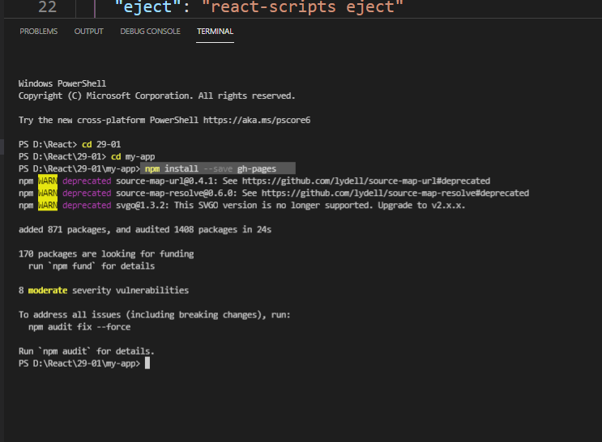
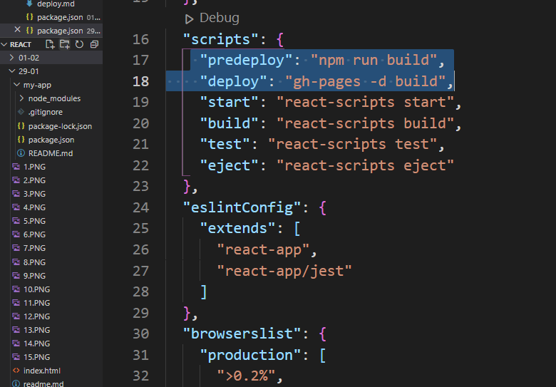

### Git for React 
- Create a new public repo, navigate to ur directory in ur local and type these commands, since your pushing onto Github the first time.
```bash 
git init 
git status 
git add . or git add --a 
git status 
git commit -m ""
git remote add origin httpadress
git push -u origin master 
```

### How to deploy a react App on github?
1. Add homepage to package.json 
```bash 
"homepage": "https://reem-shaikh.github.io/React/29-01/my-app",
```


2. Install gh-pages package using either of the commands in terminal of vscode, in the same directory of your react app 
- if your using npm 
```bash 
npm install --save gh-pages 
```


- if your using yarn 
```bash 
yarn add gh-pages 
```
3. deploy to scripts in package.json 
> add following scripts in package.json 
```bash 
"scripts": {
"predeploy": "npm run build",
"deploy": "gh-pages -d build",
}
```


4. To get the production code, run these commands in terminal of vscode, targetting the same react folder directory 
```bash 
npm run deploy
```
5. For a project page, ensure your project's settings use gh-pages branch 
> hover to settings -> and use the gh-pages branch to host your website, then, copy paste the link for reference
